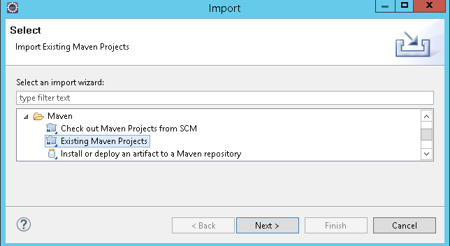
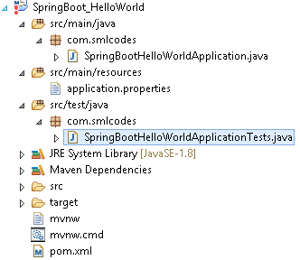
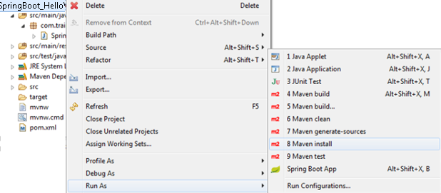
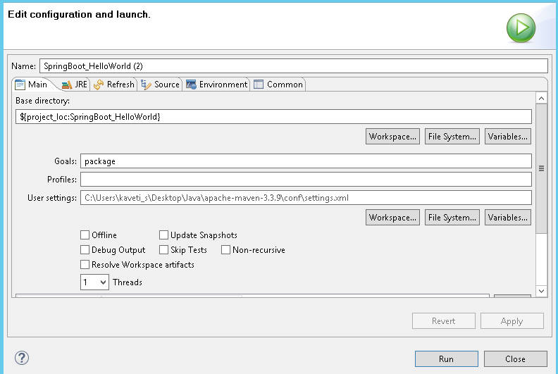
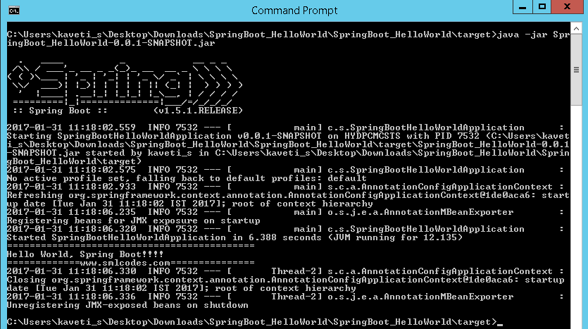

SpringBoot- Spring Initializr Example
===========================================

we are using Spring
Initializer([https://start.spring.io](https://start.spring.io/)) to create a
template for spring boot application

**1. Go to** [https://start.spring.io](https://start.spring.io/) **, Choose
Dependencies & Generate Project. Here we are not selecting any dependencies
because it is just a Hello world program**


**2. Open Eclipse, import→ Maven →Existing Maven Projects → Select Project
→Finish**



**3. The Project structure will be as follows if we open eclipse Package
explorer**



**4. If we open the pom.xml it contains only basic dependencies like
spring-boot-starter which allows start spring boot application**
```xml
<project>
	<modelVersion>4.0.0</modelVersion>
	<groupId>com.smlcodes</groupId>
	<artifactId>SpringBootDemo</artifactId>
	<version>0.0.1-SNAPSHOT</version>
	<parent>
		<groupId>org.springframework.boot</groupId>
		<artifactId>spring-boot-starter-parent</artifactId>
		<version>1.5.6.RELEASE</version>
	</parent>

	<dependencies>
		<dependency>
			<groupId>org.springframework.boot</groupId>
			<artifactId>spring-boot-starter-web</artifactId>
		</dependency>
	</dependencies>

	<properties>
		<java.version>1.8</java.version>
	</properties>
</project>
```


**5. Select Project, Right click Run as→ maven install to download and install
the dependencies.**



**6.Spring boot generates the default java class which contains main() method.
The main method calls the run method of SpringApplication.**
SpringApplication.run(SpringBootHelloWorldApplication.class, args); **This run
method bootstraps the application starting spring which will run the embedded
Tomcat Server. Let’s add some helloworld message to print**
```java
package com.smlcodes;
import org.springframework.boot.SpringApplication;
import org.springframework.boot.autoconfigure.SpringBootApplication;

@SpringBootApplication
public class SpringBootHelloWorldApplication {
	public static void main(String[] args) {
		SpringApplication.run(SpringBootHelloWorldApplication.class, args);
		System.out.println("============================================");
		System.out.println("Hello World, Spring Boot!!!!");
		System.out.println("=============www.smlcodes.com===============");		
	}
}
```


**7. Select the Java file and right click RunAs → Java Application**
```dos
\\ / ___'_ __ _ _(_)_ __  __ _ \ \ \ \
( ( )\___ | '_ | '_| | '_ \/ _` | \ \ \ \
 \\/  ___)| |_)| | | | | || (_| |  ) ) ) )
  '  |____| .__|_| |_|_| |_\__, | / / / /
 =========|_|==============|___/=/_/_/_/
 :: Spring Boot ::        (v1.5.1.RELEASE)
2017-01-31 11:05:32.745  INFO 29596 --- [           main] s.c.a.AnnotationConfigApplicationContext : Refreshing org.springframework.context.annotation.AnnotationConfigApplicationContext@646007f4: startup date [Tue Jan 31 11:05:32 IST 2017]; root of context hierarchy
2017-01-31 11:05:43.108  INFO 29596 --- [           main] o.s.j.e.a.AnnotationMBeanExporter        : Registering beans for JMX exposure on startup
2017-01-31 11:05:43.200  INFO 29596 --- [           main] c.s.SpringBootHelloWorldApplication      : Started SpringBootHelloWorldApplication in 12.855 seconds (JVM running for 16.094)
============================================
Hello World, Spring Boot!!!!
=============www.smlcodes.com===============
```

8.We can also run this application from the command line using the **jar file
that is generated**. To get the jar file, select **pom.xml** right click** RunAs
→ Maven Build (2nd one), goals=package, Apply & Run**


```dos
[INFO] Building SpringBoot_HelloWorld 0.0.1-SNAPSHOT
[INFO] ----------------------------------------------------------------------
C:\Users\kaveti_s\Desktop\Downloads\SpringBoot_HelloWorld\SpringBoot_HelloWorld\target\SpringBoot_HelloWorld-0.0.1-SNAPSHOT.jar
[INFO] --- spring-boot-maven-plugin:1.5.1.RELEASE:repackage (default) @ SpringBoot_HelloWorld 
[INFO] -------------------------------------------------------------------
[INFO] BUILD SUCCESS
[INFO] -------------------------------------------------------------------
```

9.Open command line and go to the folder where your project is located. Next,
move to the target folder and then type **java -jar <<filename>>.jar**.

**java -jar SpringBoot_HelloWorld-0.0.1-SNAPSHOT.jar**




### How it works internally

1. we place the all the required **Spring boot starters in pom.xml** which are
requires for implementing Spring Boot application. on loading project, the **all
required starter dependencies are added automatically to the project**

2. By running Spring Boot main class, at **@SpringBootApplication** line it
will do the **Auto configuration** things, it will automatically add all
required annotations to Java Class ByteCode.

3. On Executing main() method **SpringApplication.run()** used to bootstrap and
launches Spring Boot application.


<br>

### 1.Spring Boot Starters

**Spring boot Starters** are the one-stop-shop for all the Spring and related
technology that we need **. For example**, if you want to get started using
**Spring and JPA for database access**, just include
the **spring-boot-starter-data-jpa** dependency in your project, and you are
good to go.

All **official** starters follow a similar naming
pattern; **spring-boot-starter-\*,** where `*` is a particular type of
application. The following are the some of the application starters are provided
by Spring Boot under the **org.springframework.boot** group

| **Name**                         | **Description**                                                                                                                                                                                                                                  |
|----------------------------------|--------------------------------------------------------------------------------------------------------------------------------------------------------------------------------------------------------------------------------------------------|
| spring-boot-starter-web-services | Starter for using Spring Web Services                                                                                                                                                                                                            |
| spring-boot-starter-web          | Starter for building web, including RESTful, applications using Spring MVC. Uses Tomcat as the default embedded container                                                                                                                        |
| spring-boot-starter-test         | Starter for testing Spring Boot applications with libraries including JUnit, Hamcrest and Mockito                                                                                                                                                |
| spring-boot-starter-jdbc         | Starter for using JDBC with the Tomcat JDBC connection pool                                                                                                                                                                                      |
| spring-boot-starter-jersey       | Starter for building RESTful web applications using JAX-RS and Jersey. An alternative to [spring-boot-starter-web](http://docs.spring.io/autorepo/docs/spring-boot/current/reference/html/using-boot-build-systems.html#spring-boot-starter-web) |
| spring-boot-starter-aop          | Aspect-oriented programming with Spring AOP and AspectJ                                                                                                                                                                                          |
| spring-boot-starter-security     | Starter for using Spring Security                                                                                                                                                                                                                |
| spring-boot-starter-data-jpa     | Starter for using Spring Data JPA with Hibernate                                                                                                                                                                                                 |
| spring-boot-starter              | Core starter, including auto-configuration support, logging,YML                                                                                                                                                                                  |

In above Example we used spring-boot-starter & spring-boot-starter-test Starters
which are configure in pom.xml
```xml
<dependencies>
		<dependency>
			<groupId>org.springframework.boot</groupId>
			<artifactId>spring-boot-starter</artifactId>
		</dependency>
		<dependency>
			<groupId>org.springframework.boot</groupId>
			<artifactId>spring-boot-starter-test</artifactId>
			<scope>test</scope>
		</dependency>
</dependencies>
```

<br>

### 2.@SpringBootApplication Annotation

This annotation marks the class as a spring bean, configures the application by
adding all the jars based on the dependencies and also scans the other packages
for spring beans.

Spring Boot developers always have their main class annotated with
*@Configuration, @EnableAutoConfiguration and @ComponentScan.*

1.  **@Configuration**  – Specifies this class as a spring bean

2.  **@EnableAutoConfiguration**  –

    -   This tells how you want to configure Spring, based on the jar
        dependencies that you have added. & also Enable / Disable auto
        configuration.

    -   Spring Boot auto-configuration attempts to automatically configure your
        Spring application based on the jar dependencies that you have added.

    -   For example, if HSQLDB is on your classpath, and you have not manually
        configured any database connection beans, then Spring Boot
        auto-configures an in-memory database

    -   We can disble AutoConfiguration specific files by
        @EnableAutoConfiguration(exclude={DataSourceAutoConfiguration.class})

3.  **@ComponentScan** – is to scan other packages for spring beans.

4.  **@Import** - used to import additional configuration classes

5.  **@ImportResource -**annotation to load XML configuration files
```java
import org.springframework.boot.SpringApplication;
import org.springframework.boot.autoconfigure.EnableAutoConfiguration;
import org.springframework.context.annotation.ComponentScan;
import org.springframework.context.annotation.Configuration;

@Configuration
@EnableAutoConfiguration
@ComponentScan
public class Application {
    public static void main(String[] args) {
        SpringApplication.run(Application.class, args);
    }
}
```

Since these annotations are so frequently used together Spring Boot provides a
convenient **@SpringBootApplication** as an alternative. The
@SpringBootApplication annotation **is equivalent to using @Configuration,
@EnableAutoConfiguration and @ComponentScan** with their default attributes.
```java
@SpringBootApplication = @Configuration + @ComponentScan +@EnableAutoConfiration.
```


The original @SpringBootApplication annotation class is defined as below
```java
package org.springframework.boot.autoconfigure; @Target(ElementType.TYPE)
@Retention(RetentionPolicy.RUNTIME)
@Documented
@Inherited
@Configuration
@EnableAutoConfiguration
@ComponentScan
public @interface SpringBootApplication {
	Class<?>[] exclude() default {};

	String[] excludeName()default{};

	@AliasFor(annotation = ComponentScan.class, attribute = "basePackages")
	String[] scanBasePackages() default {};

	@AliasFor(annotation = ComponentScan.class, attribute = "basePackageClasses")
	Class<?>[] scanBasePackageClasses()default{};
}
```

<br>

### 3.SpringApplication Class

SpringApplication class is used to bootstrap and launch a Spring application
from a Java main method. By default, class will perform the following steps to
bootstrap your application:

-   Create an appropriate ApplicationContext instance (depending on your
    classpath)

-   Register a CommandLinePropertySource to expose command line arguments as
    Spring properties

-   Refresh the application context, loading all singleton beans

-   Trigger any CommandLineRunner beans

In most circumstances the static [run(Object,
String[])](http://docs.spring.io/spring-boot/docs/current/api/org/springframework/boot/SpringApplication.html#run-java.lang.Object-java.lang.String...-) method
can be called directly from your main method to bootstrap your application:
```java
public static void main(String[] args) {
    SpringApplication.run(MySpringConfiguration.class, args);
}
```

<br>


### 4. Embaded Servlet containers 

The following embedded servlet containers are supported out of the box.By
default we will get Tomcat

| **Name**         | **Servlet Version** | **Java Version** |
|------------------|---------------------|------------------|
| **Tomcat 8**     | 3.1                 | Java 7+          |
| **Tomcat 7**     | 3.0                 | Java 6+          |
| **Jetty 9.3**    | 3.1                 | Java 8+          |
| **Jetty 9.2**    | 3.1                 | Java 7+          |
| **Jetty 8**      | 3.0                 | Java 6+          |
| **Undertow 1.3** | 3.1                 | Java 7+          |


<br>

### 5.Spring Boot Profiles (@Profile Annotation)

Spring Profiles provide a way to segregate parts of your application
configuration and make it only available in certain environments.
Any **@Component or @Configuration can** be marked with **@Profile** to limit
when it is loaded
```java
@Configuration
@Profile("production")
public class ProductionConfiguration {

    // ...

}
```

In the normal Spring way, you can use
a **spring.profiles.active** Environment property to specify which profiles are
active. You can specify the property in any of the usual ways, for example you
could include it in
your **application.properties**:**spring.profiles.active=dev,hsqldb** or specify
on the command line using the **switch --spring.profiles.active=dev,hsqldb.**


<br>


### 6. Spring Boot Actuator

Spring Boot provides actuator to monitor and manage our application. Actuator is
a tool which has HTTP endpoints. **when application is pushed to production, you
can choose to manage and monitor your application using HTTP endpoints.**

To get production-ready features, we should use spring-boot-actuator module. We
can enable this feature by adding it to the **pom.xml** file.
```xml
<dependencies>  
    <dependency>  
        <groupId>org.springframework.boot</groupId>  
        <artifactId>spring-boot-starter-actuator</artifactId>  
    </dependency>  
</dependencies>
```