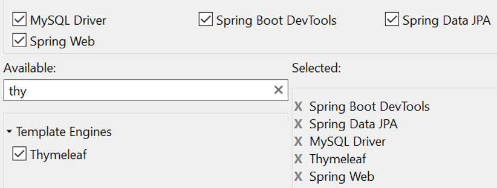
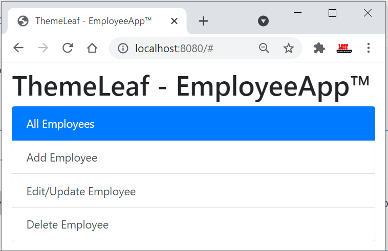
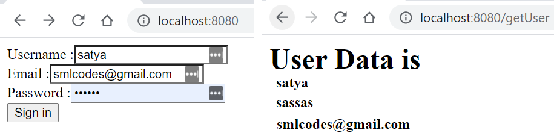
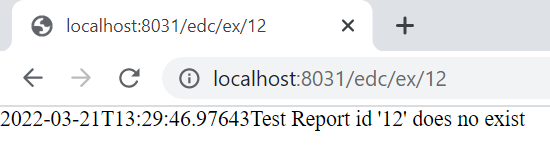

SpringBoot –MVC 
==================
# 4. Spring Boot –MVC

In old Spring MVC lets you create special `@Controller` or `@RestController`
beans to handle incoming HTTP requests. Methods in your controller are mapped to
HTTP using `@RequestMapping` annotations.

# Spring MVC Summary

### Spring MVC

```java
@Controller	

@RequestMapping("student")

@RequestMapping(value = "/add" method=RequestMethod.GET)

@RequestMapping(value = "/add" method=RequestMethod.POST)  
----------------------------------------------------------------------------


/student/fetch/100/satya
@RequestMapping(value="/fetch/{sno}/{name}")
public String getInfo(@PathVariable("sno") String sno, (@PathVariable("sno") String n ) { 
}

/student/fetch? sno=100&name=satya
@RequestMapping(value="/fetch")
public String getBoth(@RequestParam("id") String id, @RequestParam("name") String n) {
}

//Form Data
@RequestMapping(value = "/addEmployee", method = RequestMethod.POST)
    public String submit( @ModelAttribute("employee") Employee employee ) {
}
```


### WebServices
```java
@Path("/student")
/student/add


@Path("/add")
@GET
	@Path("/usa")
	@Produces("text/html")

@POST
	@Path("/usa")
	@Produces("text/html")
	
	
@Path("{rollno}/{name}/{address}")
@Produces("text/html")
public Response get(@PathParam("rollno") String rollno,@PathParam("name") String name,
					@PathParam("address") String address) {	}

students?rollno=1218&name=SATYA KAVETI&address=VIJAYAWADA
@GET
@Produces("text/html")
public Response get (@QueryParam("rollno") String rollno,@QueryParam("name") String name,
					@QueryParam("address") String address) {	}
//DefaultValue
@GET
@Produces("text/html")
public Response getResultByPassingValue(@DefaultValue("1000") @QueryParam("rollno") String rollno,	@DefaultValue("XXXX") @QueryParam("name") String name,
			@DefaultValue("XXXX") @QueryParam("address") String address) {

customers;custNo=100;custName=Satya
@GET
@Produces("text/html")
public Response getResultByPassingValue(
			@MatrixParam("rollno") String rollno,
			@MatrixParam("name") String name,
			@MatrixParam("address") String address) {}

//Form
@POST
@Path("/registerStudent")
@Produces("text/html")
public Response getResultByPassingValue(
		@FormParam("rollno") String rollno,
		@FormParam("name") String name,
		@FormParam("address") String address) {}

// HeaderParam
@GET
	@Path("/headerparam")
	public Response getHeader(
		@HeaderParam("user-agent") String userAgent,
		@HeaderParam("Accept") String accept,
                @HeaderParam("Accept-Encoding") String encoding,
                @HeaderParam("Accept-Language") String lang) {
//Context
@Path("Context ")
	public Response getHttpheaders(@Context HttpHeaders headers){        
		String output = "<h1>@@Context Example - HTTP headers</h1>";
		 output =  output+"<br>ALL headers -- "+ headers.getRequestHeaders().toString();        
		 output =  output+"<br>All Cookies -- "+ headers.getCookies().values();
		 return Response.status(200).entity(output).build();
```


### Spring 4

Spring4–Introduced GetMapping/PostMapping/XXXMapping in place of
`RequestMethod.POST/RequestMethod.GET` **etc.**

Sprin3 **-@RequestMapping(value="/user/create", method=RequestMethod.POST)**

```java
Spring4 -
@GetMapping("/students/{sno}")
	public ResponseEntity getStudent(@PathVariable("sno") int sno) {
}

@PostMapping(value = "/students")
	public ResponseEntity createStudent(@RequestBody Student student) {
}

@DeleteMapping("/students/{sno}")
	public ResponseEntity deleteStudent(@PathVariable int sno) {
}

public ResponseEntity<Student> createUser(@RequestBody User user, UriComponentsBuilder ub){
}
```

SpringMVC example `@RestController` to serve JSON data

```java
@RestController
@RequestMapping(value="/users")
public class SmlCodesRestController {

    @RequestMapping(value="/{user}", method=RequestMethod.GET)
    public User getUser(@PathVariable Long user) {
        // ...
    }

    @RequestMapping(value="/{user}/customers", method=RequestMethod.GET)
    List<Customer> getUserCustomers(@PathVariable Long user) {
        // ...
    }

    @RequestMapping(value="/{user}", method=RequestMethod.DELETE)
    public User deleteUser(@PathVariable Long user) {
        // ...
    }
}
```

# Spring Boot MVC Example – Using TheamLeaf

**Thymeleaf Quick Tutorial**

**Thymeleaf** is a modern server-side Java template engine for both web and
standalone environments.

We can use Thymeleaf directly in **.html** files. By just placing below line to
activate Thymeleaf in our HTML.

`<html lang="en" xmlns:th="http://www.thymeleaf.org">  `

If you want to use Thymleaf elements in our program, we have use
**th:\<element\>** Tag in our HTML Tags

```java
<table>
  <thead>
    <tr>
      <th th:text="#{msgs.headers.name}">Name</th>
      <th th:text="#{msgs.headers.price}">Price</th>
    </tr>
  </thead>
  <tbody>
    <tr th:each="prod: ${allProducts}">
      <td th:text="${prod.name}">Oranges</td>
      <td th:text="${#numbers.formatDecimal(prod.price, 1, 2)}">0.99</td>
    </tr>
  </tbody>
</table>
```

We need add **spring-boot-starter-thymeleaf** dependency in our application's
pom.xml file to use Thymeleaf in our Application

```java
<dependency>  
<groupId>org.springframework.boot</groupId>  
<artifactId>spring-boot-starter-thymeleaf</artifactId>  
</dependency>  
```

Example – Employee CURD operations

Create Project:
[Ref](https://github.com/RameshMF/springboot-thymeleaf-crud-pagination-sorting-webapp)
:



Build with maven & Open Eclipse. If we see the Folder Structre

-   **All static content like CSS, JS files will** be placed unter
    **→**`resources\static\`

-   **all the result pages** must be placed under**→**`resources\templates\`

This type of floder structure we will use in TheamLeaf based UI.

#### Static Content

By default, Spring Boot serves static content from a directory called `/static`.
You can also customize the static resource locations by using the
`spring.web.resources.static-locations` property in **applications.proerties**
file.

#### Template Content (Template Engines)

Spring MVC supports a variety of templating technologies, including **Thymeleaf,
FreeMarker, and JSPs**. If you use one of these templating engines with the
default configuration, your templates are picked up automatically from
`src/main/resources/templates`

1\. application.properties (DB Properties)

```
spring.datasource.url=jdbc:mysql://localhost:3306/webapp?useSSL=false
spring.datasource.username=root
spring.datasource.password=root
spring.jpa.properties.hibernate.dialect = org.hibernate.dialect.MySQL5InnoDBDialect
spring.jpa.hibernate.ddl-auto = update
```

2\. Employee.java entity class to map with Employee Table

```java
package springboot;

@Entity
@Table(name = "employee")
public class Employee {

	@Id
	@GeneratedValue(strategy = GenerationType.IDENTITY)
	private Long id;

	@Column
	private String name;

	@Column
	private String address;

	@Column
	private Double salary;
	
	//Setters & Getters 
}
```

3\. EmployeeRepository.java – for performing CURD Operations on DB

```java
package springboot.repository;
@Repository
public interface EmployeeRepository extends JpaRepository<Employee, Long> {
}
```

4\. EmployeeService.java – Service Layer

```java
public interface EmployeeService {
	List<Employee> getAllEmployees();

	void saveEmployee(Employee employee);

	Employee getEmployeeById(long id);

	void deleteEmployeeById(long id);
}
```

EmployeeServiceImpl.java – Service Layer Implenetation

```java
@Service
public class EmployeeServiceImpl implements EmployeeService {

	@Autowired
	EmployeeRepository repository;

	@Override
	public List<Employee> getAllEmployees() {
		return repository.findAll();
	}

	@Override
	public void saveEmployee(Employee employee) {
		Employee e = repository.save(employee);
		System.out.println(" Employee Data Saved : " + e);
	}

	@Override
	public Employee getEmployeeById(long id) {
		Employee e = repository.getById(id);
		System.out.println("Employee getEmployeeById : " + e);
		return e;
	}

	@Override
	public void deleteEmployeeById(long id) {
		Employee e = repository.getById(id);
		repository.delete(e);
		System.out.println("Employee Deleted : ");
	}
}
```

So far Good. Now come to actual Thymeleaf changes.

Model Interface

Java-5-specific interface that defines a holder for **model attributes**.
Primarily designed for adding attributes to the model. Allows for accessing the
overall model as a **java.util.Map**.

Display Homepage

1.Create *index.html* thymeleaf template under **"resources/templates"** folder
and add below code.

```java
<html lang="en" xmlns:th="http://www.thymeleaf.org">
<head> 
<link rel="stylesheet" href=https://stackpath.bootstrapcdn.com/bootstrap/4.1.3/css/bootstrap.min.css>
</head>

<body>
 <div class="container my-2">
 <h1>ThemeLeaf - EmployeeApp&trade;</h1> 
<div class="list-group">
  <a href="#" class="list-group-item list-group-item-action">All Employees</a>
  <a href="#" class="list-group-item list-group-item-action">Add Employee</a>
</div>
</div>
</body>
</html>
```

2\. Create a **EmployeeController** class, and add method to display homepage

```java
@Controller
public class EmployeeController {
	@Autowired
	private EmployeeService employeeService;

	@GetMapping("/")
	public String viewHomePage(Model model) {
		System.out.println("Calling Home Page....");
		return "index";
	}
}
```

Now Run mian class & open Browser



To make our application more stylish, add **CSS** and **JS** files in
**src/main/resources/static** folder.

You can see Complete code [**Example
here**](https://gitlab.com/satyacodes/books-sync-github_new/-/tree/main/Codes/SpringBoot-Thymeleaf)
**(**[**Code
Ref**](https://github.com/RameshMF/springboot-thymeleaf-crud-pagination-sorting-webapp)**.)**

<https://gitlab.com/satyacodes/books-sync-github_new/-/tree/main/Codes/SpringBoot-Thymeleaf>

If you got this Error: Whitelabel Error page (type=Not Found, status=404)

Move your SpringBoot main class from sub package to Root package, example from
**spring.app** package to **spring** package

```java
@Controller
public class EmployeeController {

	@Autowired
	private EmployeeService employeeService;

	@GetMapping("/")
	public String viewHomePage(Model model) {
		System.out.println("Calling Home Page....");
		return "index";
	}

	// display list of employees
	@GetMapping("/all")
	public String listEmployees(Model model) {
		model.addAttribute("listEmployees", employeeService.getAllEmployees());
		return "listEmployees";
	}

	// display list of employees
	@GetMapping("/addEmployee")
	public String addEmployee(Model model) {
		// create model attribute to bind form data
		Employee employee = new Employee();
		model.addAttribute("employee", employee);
//An error happened during template parsing (template: "class path resource [templates/add.html]")
		return "addEmployee";
	}

	@PostMapping("/saveEmployee")
	public String saveEmployee(@ModelAttribute("employee") Employee employee) {
		// save employee to database
		employeeService.saveEmployee(employee);
		return "redirect:/all";
	}

	@GetMapping("/showEditForm/{id}")
	public String showEditForm(@PathVariable(value = "id") long id, Model model) {

		// get employee from the service
		Employee employee = employeeService.getEmployeeById(id);
		employee.setId(id);
		// set employee as a model attribute to pre-populate the form
		model.addAttribute("employee", employee);
		return "editEmployeeForm";
	}

	@GetMapping("/viewEmployee/{id}")
	public String viewEmployee(@PathVariable(value = "id") long id, Model model) {

		// get employee from the service
		Employee employee = employeeService.getEmployeeById(id);

		// set employee as a model attribute to pre-populate the form
		model.addAttribute("employee", employee);
		System.out.println("viewEmployee : " + employee);
		return "viewEmployee";
	}

	@GetMapping("/deleteEmployee/{id}")
	public String deleteEmployee(@PathVariable(value = "id") long id) {
		// call delete employee method
		this.employeeService.deleteEmployeeById(id);
		return "redirect:/all";
	}

}

<!-- index.html -->
  <a href="all" class="list-group-item list-group-item-action active"> All Employees</a>
  <a href="addEmployee" class="list-group-item list-group-item-action">Add Employee</a>
<!-- addEmployee -->
<form action="#" th:action="@{/saveEmployee}" th:object="${employee}" method="POST">
	<input type="text" th:field="*{name}" placeholder="Employee Name" class="form-control mb-4 col-4">
	<input type="text" th:field="*{address}" placeholder="Employee Adress" class="form-control mb-4 col-4">
	<input type="text" th:field="*{salary}" placeholder="Employee Salary" class="form-control mb-4 col-4">
	<button type="submit" class="btn btn-info">Save</button>	 
</form>

<!-- editEmployee -->
<form action="#" th:action="@{/saveEmployee}" th:object="${employee}"	method="POST">
	<input type="text" th:field="*{id}" class="form-control mb-4 col-4">
	<input type="text" th:field="*{name}" placeholder="Employee Name" class="form-control mb-4 col-4">
	<input type="text" th:field="*{address}" placeholder="Employee Adress" class="form-control mb-4 col-4">
	<input type="text" th:field="*{salary}" placeholder="Employee Salary" class="form-control mb-4 col-4">
	<button type="submit" class="btn btn-info">Save</button> 
</form>

<!-- viewEmployee -->
ID : <span th:text="${employee.id}">
NAME : <span th:text="${employee.name}"></span>
ADDRESS : <span th:text="${employee.address}">
SALARY : <span th:text="${employee.salary}">
<a th:href="@{/all}"> Back to Employee List</a>


<!-- listEmployees -->
<table border="1" class="table table-striped table-responsive-md">
	<thead>
<tr>
	<th># Emp. ID</th> 
	<th>Name </th> 
	<th>Address </th> 
	<th>Salary </th> 
	<th>Actions </th> 
</tr>
	</thead>
	<tbody>
<tr th:each="employee : ${listEmployees}">
	<td th:text="${employee.id}"></td>
	<td th:text="${employee.name}"></td>
	<td th:text="${employee.address}"></td>
	<td th:text="${employee.salary}"></td>
	<td>
	<a th:href="@{/viewEmployee/{id}(id=${employee.id})}" class="btn btn-primary">View <span>&nbsp;</span>
    	<a th:href="@{/showEditForm/{id}(id=${employee.id})}" class="btn btn-warning”> EDIT</a> <span>&nbsp;</span>
    	<a th:href="@{/deleteEmployee/{id}(id=${employee.id})}"  class="btn btn-danger">Delete</a>
    </td>
</tr>
	</tbody>
</table>
```

# SpringBoot – MVC using Standard JSP Pages

Add this extra dependency in pom.xml to work with jsp pages

```java
	<!-- JSTL -->
        <dependency>
            <groupId>javax.servlet</groupId>
            <artifactId>jstl</artifactId>
        </dependency>        
        <!-- Tomcat Embed -->
        <dependency>
            <groupId>org.springframework.boot</groupId>
            <artifactId>spring-boot-starter-tomcat</artifactId>           
        </dependency>        
      	<dependency>
            <groupId>org.apache.tomcat.embed</groupId>
            <artifactId>tomcat-embed-jasper</artifactId>      
    	</dependency>        
        <!-- Optional, test for static content, bootstrap CSS-->
        <dependency>
            <groupId>org.webjars</groupId>
            <artifactId>bootstrap</artifactId>
            <version>3.3.7</version>
        </dependency>
```

#### CSS, JS, assets related files

In old Spring, to use static files, we need configure those folders paths in
**SpringConfig.xml** file

```java
	<!-- OLD Spring - These for Static images, css calls in jsp pages -->
	<mvc:annotation-driven />
	<mvc:resources mapping="/assets/*" location="/assets/" />
	<mvc:resources mapping="/js/*" location="/js/" />
	<mvc:resources mapping="/css/*" location="/css/" />
```

But in Spring Boot, no need to declare the resource mapping like above. The
resource mapping will handle automatically. We need to place CSS or Javascript,
in **/src/main/resources/static/** folder.

#### JSP Files

JSP view files would be created inside
**src/main/resources/META-INF/resources/WEB-INF/jsp/.** If you want use css, js
files which are placed in static folder, just link into JSP view via

\<link href="/css/main.css" rel="stylesheet"\>

To resolve **JSP** file’s location, you can have two approaches.

1.  Using **application.properties**

2.  Using **Java configuration**

**1.Using application.properties (Recommnded)**

To Tell Spring, where JSP files located - we need to place those details in
**application.properties**

```java
spring.mvc.view.prefix: /WEB-INF/jsp/ 
spring.mvc.view.suffix: .jsp
```

**2. Using Java configuration**

Configure InternalResourceViewResolver to serve JSP pages using
**WebMvcConfigurerAdapter**

```java
package springboot.controller;
@Configuration
@EnableWebMvc
@ComponentScan
public class MVCConfiguration extends WebMvcConfigurerAdapter {
	   @Override
	    public void configureViewResolvers(ViewResolverRegistry registry) {
	        InternalResourceViewResolver resolver = new InternalResourceViewResolver();
	        resolver.setPrefix("/WEB-INF/view/");
	        resolver.setSuffix(".jsp");
	        resolver.setViewClass(JstlView.class);
	        registry.viewResolver(resolver);
	    }
}
```

#### Spring Boot Application Initializer

So far we used .jar file to run our SpringBoot application. But for Web
Applications recommended way is .war file Deployment. To Achive the .war file
related stuff in SpringBoot we need to use **SpringBootServletInitializer**

Our SpringBoot main class need to **extend** **SpringBootServletInitializer** &
override **configure()** method to produce .war file. This makes use of Spring
Framework’s Servlet 3.0 support and allows you to configure your application
when it’s launched by the servlet container.

```java
@SpringBootApplication
public class SpringBootAppApplication extends SpringBootServletInitializer {

@Override
    protected SpringApplicationBuilder configure(SpringApplicationBuilder application) {
        		return application.sources(SpringBootAppApplication.class);
    	}	
	public static void main(String[] args) {
		SpringApplication.run(SpringBootAppApplication.class, args);
		System.out.println(" Hello, Again");
	}
}
```

[**So
finally,**](https://howtodoinjava.com/spring-boot/spring-boot-jsp-view-example/)

-   **Controller** classes created inside **src/main/java**

-   **JSP pages** created inside **src/main/webapp/WEB-INF/view**

-   **CSS and JS** files created inside **src/main/resources/static**

-   **application.properties** created inside **src/main/resources**

-   **Application.java** is a launch file for Spring Boot created inside
    **src/main/java**

**Ref :**
<https://mmafrar.medium.com/implementing-spring-boot-mvc-crud-operations-with-jpa-and-jsp-4dfa1882b4a3>

**pom.xml**

```java
<dependencies>
		<dependency>
			<groupId>org.springframework.boot</groupId>
			<artifactId>spring-boot-starter-jersey</artifactId>
		</dependency>
		<dependency>
			<groupId>org.springframework.boot</groupId>
			<artifactId>spring-boot-starter-web</artifactId>
		</dependency>
		<dependency>
			<groupId>org.springframework.boot</groupId>
			<artifactId>spring-boot-starter-web-services</artifactId>
		</dependency>
		<dependency>
			<groupId>org.springframework.boot</groupId>
			<artifactId>spring-boot-starter-test</artifactId>
			<scope>test</scope>
		</dependency>
		<dependency>
			<groupId>org.springframework.boot</groupId>
			<artifactId>spring-boot-starter-thymeleaf</artifactId>
		</dependency>
        	<dependency>
            <groupId>javax.servlet</groupId>
            <artifactId>jstl</artifactId>
        </dependency>
        <dependency>
            <groupId>org.springframework.boot</groupId>
            <artifactId>spring-boot-starter-tomcat</artifactId>           
        </dependency>     
      	<dependency>
       	    <groupId>org.apache.tomcat.embed</groupId>
             <artifactId>tomcat-embed-jasper</artifactId>      
    	</dependency>
        <dependency>
            <groupId>org.webjars</groupId>
            <artifactId>bootstrap</artifactId>
            <version>3.3.7</version>
        </dependency>
</dependencies>
```

**JSP’s - src\\main\\webapp\\WEB-INF\\views**

```java
//index.jsp
<%@ taglib prefix="spring" uri="http://www.springframework.org/tags"%>
<form action="getUser" method="post">
	Username	:<input type="text" name="username"  > <br>
	Email 		:<input type="email" name="email" > <br> 
	Password	:<input type="password" name="password"> <br>
	<button type="submit">Sign in</button>
</form>
```

```java
//user.jsp
<%@ taglib prefix="spring" uri="http://www.springframework.org/tags"%>
<h1>User Data is</h1>
<h4>${user.username}</h4>
<h4>${user.password}</h4>
<h4>${user.email}</h4>
```

Add entries in **application.properties**

```java
# for SpringMVC - JSP related Config
spring.mvc.view.prefix:/WEB-INF/views/
spring.mvc.view.suffix:.jsp

#For detailed logging during development
logging.level.org.springframework=TRACE
logging.level.com=TRACE
```

HomeController.java

```java
package springboot.controller;

@Controller
public class HomeController {

	@RequestMapping("/")
	public ModelAndView homePage() {
		ModelAndView view = new ModelAndView();
		view.setViewName("index");
		return view;
	}

	@RequestMapping("/getUser")
	public ModelAndView getUser(@ModelAttribute UserBo user) {
		ModelAndView view = new ModelAndView();
		view.addObject("user", user);
		view.setViewName("user");
		return view;
	}

}
```

**UserBo.java** to store input data

```java
public class UserBo {
	private int id;
	private String username;
	private String email;
	private String password;
//Setters & Getters
}
```

SpringBootAppApplication.java

```java
@SpringBootApplication
public class SpringBootAppApplication extends SpringBootServletInitializer {

	@Override
   	 protected SpringApplicationBuilder configure(SpringApplicationBuilder application) {
       		 return application.sources(SpringBootAppApplication.class);
   	 }
	
	public static void main(String[] args) {
		SpringApplication.run(SpringBootAppApplication.class, args);
	}
}
```



# Spring Boot –RESTful Web Service Example

To work with webservices, in SpringBoot we have to use two annotations

-   **@RestController:** tells Spring Boot to consider this class as REST
    controller

-   **@RequestMapping:** used to register paths inside it to respond to the HTTP
    requests.

**@RestController** is a stereotype annotation. It adds **@Controller** and
**@ResponseBody** annotations to the class.

@RestController = @Controller + @ResponseBody

Note - The @RestController and @RequestMapping annotations are Spring MVC
annotations. They are not specific to Spring Boot.

app.controller.SpringBootRestController.java

```java
package app.controller;
@RestController
public class SpringBootRestController {
	@RequestMapping("/")
	public String welcome() {
		return "Spring Boot Home Page";
	}
	@RequestMapping("/hello")
	public String myData() {
		return "Smalcodes : Hello Spring Boot";
	}
}
```

app.SpringBootApp.java

```java
package app;

@SpringBootApplication
public class SpringBootApp {
	public static void main(String[] args) {
		 SpringApplication.run(SpringBootApp.class, args);
	}
}
```

Create pom.xml same as first example.

**Test the Application**

Right click on project \> Run as \>Java Application \>**select SpringBootApp**


-   In above Spring Boot main application class in **app** package and
    controller class **in app.controller***.*

-   While starting our application, SpringBootApp class will scan all the
    components under **app** package. we have created our controller class in
    **app.controller** which is inside **app** package.so our controller was
    registered by spring boot.

-   If you create the controller class outside of the main package, lets say
    **com.smlcodes.controller***,* If you run the application it gives 404
    error.To resolve this, we have to add **@ComponentScan** annotation in our
    Spring Boot main class, as below

```java
@SpringBootApplication
@ComponentScan(basePackages="smlcodes.controller")
public class SpringBootApp {
	public static void main(String[] args) {
		 SpringApplication.run(SpringBootApp.class, args);
	}
}
```

# Spring Boot - Rest API exception handling (@ControllerAdvice)

In below Code, you can observe multiple Try/Catch blocks to handle exceptions.

```java
@RestController
public class TutorialController {
  @Autowired
  TutorialRepository tutorialRepository;
  @GetMapping("/tutorials")
  public ResponseEntity<List<Tutorial>> getAllTutorials(@RequestParam(required = false) String title) {
    try {
      ...
      return new ResponseEntity<>(tutorials, HttpStatus.OK);
    } catch (Exception e) {
      return new ResponseEntity<>(null, HttpStatus.INTERNAL_SERVER_ERROR);
    }
  }
  
  @GetMapping("/tutorials/{id}")
  public ResponseEntity<Tutorial> getTutorialById(@PathVariable("id") long id) {
    Optional<Tutorial> tutorialData = tutorialRepository.findById(id);
    if (tutorialData.isPresent()) {
      return new ResponseEntity<>(tutorialData.get(), HttpStatus.OK);
    } else {
      return new ResponseEntity<>(HttpStatus.NOT_FOUND);
    }
  }
  
  @PutMapping("/tutorials/{id}")
  public ResponseEntity<Tutorial> updateTutorial(@PathVariable("id") long id, @RequestBody Tutorial tutorial) {
    Optional<Tutorial> tutorialData = tutorialRepository.findById(id);
    if (tutorialData.isPresent()) {
      ...
      return new ResponseEntity<>(tutorialRepository.save(_tutorial), HttpStatus.OK);
    } else {
      return new ResponseEntity<>(HttpStatus.NOT_FOUND);
    }
  }
  ...
  @DeleteMapping("/tutorials/{id}")
  public ResponseEntity<HttpStatus> deleteTutorial(@PathVariable("id") long id) {
    try {
      tutorialRepository.deleteById(id);
      return new ResponseEntity<>(HttpStatus.NO_CONTENT);
    } catch (Exception e) {
      return new ResponseEntity<>(HttpStatus.INTERNAL_SERVER_ERROR);
    }
  }
  @DeleteMapping("/tutorials")
  public ResponseEntity<HttpStatus> deleteAllTutorials() {
    // try and catch
  }
  @GetMapping("/tutorials/published")
  public ResponseEntity<List<Tutorial>> findByPublished() {
    // try and catch
  }
}
```

You can see that we use try/catch many times for similar exception
(**INTERNAL_SERVER_ERROR**), and there are also many cases that return
**NOT_FOUND**.

To avoid handling same excetions multiple times in a Single controller, we can
use the concept called Global Exception handling using **@ControllerAdvice** and
**@ExceptionHandler**

```java
@GetMapping("/testReport/{id}")
public ResponseEntity<TestReport> getReportByID(@PathVariable int id){		
	TestReport data = repository.getById(id);
	try {	
		return ResponseEntity.ok()
 					.contentType(MediaType.APPLICATION_JSON)
 					.body(data);
	} catch (Exception e) {
		return new ResponseEntity<>(null, HttpStatus.NOT_FOUND);
	}
}
```

If we access above api call with invalid id like 12, you will get following
response.

```java
{ "timestamp": "2020-11-28T13:24:02.239+00:00",
  "status": 500,
  "error": "Internal Server Error",
  "message": "",
  "path": "/ testReport/12"}
```

We can see that besides a well-formed error response, the payload is not giving
us any useful information. Even the message field is empty, which we might want
to contain something like “**Report with id 12 not found”.**

We can handle this type of Global Exception Handling with below Annotations

-   [**@ControllerAdvice**](https://reflectoring.io/#controlleradvice) : is used
    with **class** level for global error/exception handling

-   [**@ExceptionHandler**](https://reflectoring.io/#exceptionhandler) : is used
    with **methods** (not with class)**.**

-   [**@ResponseStatus**](https://reflectoring.io/#responsestatus) : is used
    annotate used defined exception classes.

We can configure multiple exceptions in this class so that in our application if
that exception will occur, this class will get invoked and we will have a proper
error message.

### Steps to for Global Exception Handling

1.Create Custom Exception class for **INTERNAL_SERVER_ERROR & NOT_FOUND**
exceptions & annotate our Exception class with **@ResponseStatus** and pass
value to HTTP.Exception property.

```java
@ResponseStatus(HttpStatus.NOT_FOUND)
public class RecordNotFoundException extends RuntimeException {
	String message; 

	public RecordNotFoundException(String message) {
		super(message);
		this.message = message;
	}
}
```

```java
@ResponseStatus(HttpStatus.INTERNAL_SERVER_ERROR)
public class InternalServerException extends RuntimeException {	 
	String message;
	public InternalServerException(String message) {
		super(message);
		this.message = message;
	}
}
```

2.Now Create class which do Global Exception handling by

-   annotating class with **@ControllerAdvice**

-   annotating methods with
    **@ExceptionHandler**(RecordNotFoundException.**class**)

```java
@ControllerAdvice
public class GlobalExceptionHandlerForAllExceptions extends ResponseEntityExceptionHandler {

	@ExceptionHandler(RecordNotFoundException.class)
	public ResponseEntity<Object> handleRecordNotFoundException(RecordNotFoundException ex, WebRequest request) {
		Map<String, Object> body = new LinkedHashMap<>();
		body.put("timestamp", LocalDateTime.now());
		body.put("message", ex.getLocalizedMessage());
		return new ResponseEntity<>(body, HttpStatus.NOT_FOUND);
	}

	@ExceptionHandler(InternalServerException.class)
	public ResponseEntity<Object> handleNodataFoundException(InternalServerException ex, WebRequest request) {
		Map<String, Object> body = new LinkedHashMap<>();
		body.put("timestamp", LocalDateTime.now());
		body.put("message", "Server Has Issue while Processing this Request");
		return new ResponseEntity<>(body, HttpStatus.INTERNAL_SERVER_ERROR);
	}
}
```

3.Update Controller class method Response to throw UserDefined exception.

```java
@GetMapping(path =  "/ex/{id}", produces = MediaType.APPLICATION_JSON_VALUE)
public TestReport getReportByID(@PathVariable int id) {
	return repository.findById(id)
		.orElseThrow(
       () -> new RecordNotFoundException("Test Report id '" + id + "' does no exist"));
}
```

4.When ever Controller Class Throws exception, it will Automcatically forward
exception handling to ControllerAdive class & Calls the method which is
annotated with **@ExceptionHandler** with thrown exception class ex :
InternalServerException.**class**)



<https://reflectoring.io/spring-boot-exception-handling/>

<https://zetcode.com/springboot/controlleradvice/>
