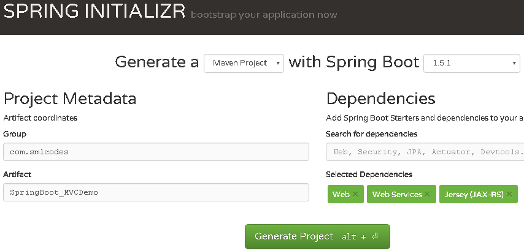
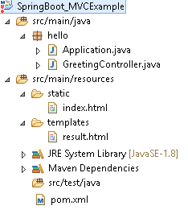
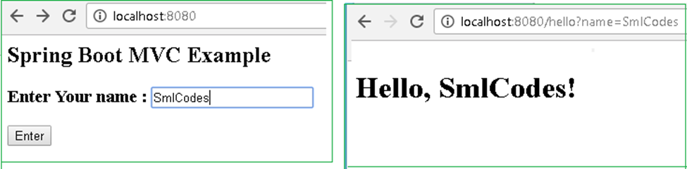

SpringBoot –MVC 
==================

In old Spring MVC lets you create special **@Controller** or
**@RestController** beans to handle incoming HTTP requests. Methods in your
controller are mapped to HTTP using **@RequestMapping** annotations.

SpringMVC example **@RestController** to serve JSON data
```java
@RestController
@RequestMapping(value="/users")
public class SmlCodesRestController {

    @RequestMapping(value="/{user}", method=RequestMethod.GET)
    public User getUser(@PathVariable Long user) {
        // ...
    }

    @RequestMapping(value="/{user}/customers", method=RequestMethod.GET)
    List<Customer> getUserCustomers(@PathVariable Long user) {
        // ...
    }

    @RequestMapping(value="/{user}", method=RequestMethod.DELETE)
    public User deleteUser(@PathVariable Long user) {
        // ...
    }

}
```

<br>


Spring Boot MVC Example
-----------------------



Extract, import to eclipse as Existing Maven project, & **Run as→ maven
install**

If we see the Folder Structre

-   **all index, welcome files must** be placed unter **→resources\\static\\**

-   **all the result pages** must be placed under**→resources\\templates\\**



**1.Choose the SpringBoot Stater Dependencies and place in pom.xml & build the
project.**
```xml
<?xml version="1.0" encoding="UTF-8"?>
<project xmlns="http://maven.apache.org/POM/4.0.0" xmlns:xsi="http://www.w3.org/2001/XMLSchema-instance"
    xsi:schemaLocation="http://maven.apache.org/POM/4.0.0 http://maven.apache.org/xsd/maven-4.0.0.xsd">
    <modelVersion>4.0.0</modelVersion>

    <groupId>SpringBoot_MVCExample</groupId>
    <artifactId>gs-serving-web-content</artifactId>
    <version>SpringBoot_MVCExample</version>

    <parent>
        <groupId>org.springframework.boot</groupId>
        <artifactId>spring-boot-starter-parent</artifactId>
        <version>1.5.1.RELEASE</version>
    </parent>

    <dependencies>
        <dependency>
            <groupId>org.springframework.boot</groupId>
            <artifactId>spring-boot-starter-test</artifactId>
            <scope>test</scope>
        </dependency>
    </dependencies>

    <properties>
        <java.version>1.8</java.version>
    </properties>


    <build>
        <plugins>
            <plugin>
                <groupId>org.springframework.boot</groupId>
                <artifactId>spring-boot-maven-plugin</artifactId>
            </plugin>
        </plugins>
    </build>

</project>
```


2.Create index.html to provide user input
```html
///SpringBoot_MVCExample/src/main/resources/static/index.html
<h2>Spring Boot MVC Example</h2>
<form method="get" action="/hello">
	<h3>Enter Your name : <input type="text" name="name"></h3>
	<button type="submit">Enter</button>
</form>
```


3.Create Controller to hadle request given by user (/hello)
```java
package hello;
import org.springframework.stereotype.Controller;
import org.springframework.ui.Model;
import org.springframework.web.bind.annotation.RequestMapping;
import org.springframework.web.bind.annotation.RequestParam;

@Controller
public class GreetingController {

    @RequestMapping("/hello")
    public String greeting(@RequestParam(value="name", required=false, defaultValue="World") String name, Model model) {
        model.addAttribute("name", name);
        return "result";
    }
}
```
Here Model is a interface which conatins some usefull method to return result data to result page
	
4.Create result.html template to display the Results given by Controller
```html
<!DOCTYPE HTML>
<html xmlns:th="http://www.thymeleaf.org">
<body>
    <h1><p th:text="'Hello, ' + ${name} + '!'" /></h1>
</body>
</html>
```

5.Create Application.java to Start & Run Spring Boot Application
```java
package hello;
import org.springframework.boot.SpringApplication;
import org.springframework.boot.autoconfigure.SpringBootApplication;

@SpringBootApplication
public class Application {
	public static void main(String[] args) {
 SpringApplication.run(Application.class, args);
	}
}
```

6.Strat the Application by Run as→ Java Application (Application.java)
```dos
.   ____          _            __ _ _
 \\ / ___'_ __ _ _(_)_ __  __ _ \ \ \ \
( ( )\___ | '_ | '_| | '_ \/ _` | \ \ \ \
 \\/  ___)| |_)| | | | | || (_| |  ) ) ) )
  '  |____| .__|_| |_|_| |_\__, | / / / /
 =========|_|==============|___/=/_/_/_/
 :: Spring Boot ::        (v1.5.1.RELEASE)
2017-02-02TomcatEmbeddedServletContainer : Tomcat started on port(s): 8080
```


**7.Open browser, access localhost:8080 the Output should be as below**




### Explanation

1.On Running Applicatio.java, Spring Boot Engine Starts and reads the all files
in the projects and autowires the data and auto configures the Controller
details

2.on submitting the form, Spring Boot Searchers for controller classes which are
annotated with **@Controller**

3.compairs **(“/hello")** path with **controller @RequestMapping("/hello"),**
if matches execute the business logic method and it returns the resultpage
name(“**result"**)

4.SpringBoot Engine Searches the appropriate resultpage template having
“**result"** as page name & displays the **result.html** page to the user

### 1.Model Interface

Model interface designed for adding attributes to the model. Allows for
accessing the overall model as **a java.util.Map.**

| **Method Summary**                                                                                                                                                                             |                                                                                                                                                                                                                                                                                                                                                                                                                                                             |
|------------------------------------------------------------------------------------------------------------------------------------------------------------------------------------------------|-------------------------------------------------------------------------------------------------------------------------------------------------------------------------------------------------------------------------------------------------------------------------------------------------------------------------------------------------------------------------------------------------------------------------------------------------------------|
| ** **[Model](http://docs.spring.io/spring-framework/docs/2.5.x/api/org/springframework/ui/Model.html)                                                                                          | [addAllAttributes](http://docs.spring.io/spring-framework/docs/2.5.x/api/org/springframework/ui/Model.html#addAllAttributes(java.util.Collection))([Collection](http://java.sun.com/javase/6/docs/api/java/util/Collection.html?is-external=true)<?> attributeValues)                                                                                                                                                                                     |
|                                                                                                                                                                                                |           Copy all attributes in the supplied Collection into this Map,                                                                                                                                                                                                                                                                                                                                                                                     |
| ** **[Model](http://docs.spring.io/spring-framework/docs/2.5.x/api/org/springframework/ui/Model.html)                                                                                          | [addAllAttributes](http://docs.spring.io/spring-framework/docs/2.5.x/api/org/springframework/ui/Model.html#addAllAttributes(java.util.Map))([Map](http://java.sun.com/javase/6/docs/api/java/util/Map.html?is-external=true)<[String](http://java.sun.com/javase/6/docs/api/java/lang/String.html?is-external=true),?> attributes)                                                                                                                        |
|                                                                                                                                                                                                |           Copy all attributes in the supplied Map into this Map.                                                                                                                                                                                                                                                                                                                                                                                            |
| ** **[Model](http://docs.spring.io/spring-framework/docs/2.5.x/api/org/springframework/ui/Model.html)                                                                                          | [addAttribute](http://docs.spring.io/spring-framework/docs/2.5.x/api/org/springframework/ui/Model.html#addAttribute(java.lang.Object))([Object](http://java.sun.com/javase/6/docs/api/java/lang/Object.html?is-external=true) attributeValue)                                                                                                                                                                                                               |
|                                                                                                                                                                                                |           Add the supplied attribute to this Map using a [generated name](http://docs.spring.io/spring-framework/docs/2.5.x/api/org/springframework/core/Conventions.html#getVariableName(java.lang.Object)).                                                                                                                                                                                                                                               |
| ** **[Model](http://docs.spring.io/spring-framework/docs/2.5.x/api/org/springframework/ui/Model.html)                                                                                          | [addAttribute](http://docs.spring.io/spring-framework/docs/2.5.x/api/org/springframework/ui/Model.html#addAttribute(java.lang.String, java.lang.Object))([String](http://java.sun.com/javase/6/docs/api/java/lang/String.html?is-external=true) attributeName, [Object](http://java.sun.com/javase/6/docs/api/java/lang/Object.html?is-external=true) attributeValue)                                                                                       |
|                                                                                                                                                                                                |           Add the supplied attribute under the supplied name.                                                                                                                                                                                                                                                                                                                                                                                               |
| ** **[Map](http://java.sun.com/javase/6/docs/api/java/util/Map.html?is-external=true)**<String,**[Object](http://java.sun.com/javase/6/docs/api/java/lang/Object.html?is-external=true)**>** | [asMap](http://docs.spring.io/spring-framework/docs/2.5.x/api/org/springframework/ui/Model.html#asMap())() -       Return the current set of model attributes as a Map.                                                                                                                                                                                                                                                                                     |
| ** boolean**                                                                                                                                                                                   | [containsAttribute](http://docs.spring.io/spring-framework/docs/2.5.x/api/org/springframework/ui/Model.html#containsAttribute(java.lang.String))([String](http://java.sun.com/javase/6/docs/api/java/lang/String.html?is-external=true) attributeName)                                                                                                                                                                                                      |
|                                                                                                                                                                                                |           Does this model contain an attribute of the given name?                                                                                                                                                                                                                                                                                                                                                                                           |
| **Model**                                                                                                                                                                                      | **mergeAttributes(Map<String,?> attributes)**                                                                                                                                                                                                                                                                                                                                                                                                             |

### 2.Static Content

By default, Spring Boot will serve static content from a directory called
**/static** (**or /public or /resources or /META-INF/resources**)

You can also customize the static resource locations using
**spring.resources.static-locations** (replacing the default values with a list
of directory locations).

If you do this the **default welcome page detection** will switch to your custom
locations, so if there is an **index.html** in any of your locations on startup,
it **will be the home page of the application.**
