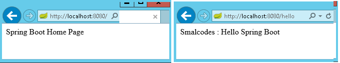

SpringBoot –RESTful Example
=========================================

To work with webservices in SpringBoot we have to use two annotations

-   **@RestController**: tells Spring Boot to consider this class as
    REST controller

-   @**RequestMapping**: used to register paths inside it to respond to the
    HTTP requests.

The `@RestController` is a stereotype annotation. It adds `@Controller` and
`@ResponseBody` annotations to the class.
```java
@RestController = @Controller + @ResponseBody
```


Note - The @RestController and @RequestMapping annotations are Spring MVC
annotations. They are not specific to Spring Boot.

<br>

```java
//app.controller.SpringBootRestController.java
package app.controller;
@RestController
public class SpringBootRestController {

	@RequestMapping("/")
	public String welcome() {
		return "Spring Boot Home Page";
	}

	@RequestMapping("/hello")
	public String myData() {
		return "Smalcodes : Hello Spring Boot";
	}
}
```

```java
//app.SpringBootApp.java
@SpringBootApplication
public class SpringBootApp {
	public static void main(String[] args) {
		 SpringApplication.run(SpringBootApp.class, args);
	}
}
```

Create pom.xml same as fisrt example.

**Test the Application**

Right click on project > Run as >Java Application >**select SpringBootApp**



-   In above Spring Boot main application class in *app* package and controller
    class **in app.controller***.* While starting our application, SpringBootApp
    class will scan all the components under that package.  As we have created
    our controller class in **app.controller** which is inside app package, our
    controller was registered by spring boot.

-   If you create the controller class outside of the main package, lets
    say com.smlcodes*.controller, *If you run the application it gives 404
    error.To resolve this,  we have to add *@ComponentScan* annotation in our
    Spring Boot main class, as below

```java
@SpringBootApplication
@ComponentScan(basePackages="smlcodes.controller")
public class SpringBootApp {
	public static void main(String[] args) {
		 SpringApplication.run(SpringBootApp.class, args);
	}
}
```

