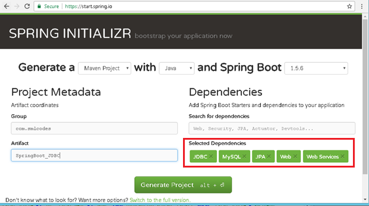
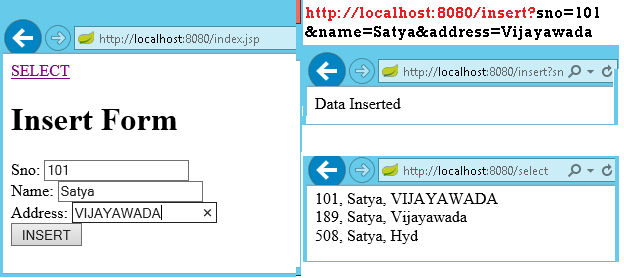

SpringBoot –Database 
=======================

## Spring Boot –JDBC Example
-------------------------

Spring Boot provides starter and libraries for connecting to our application
with JDBC. Spring JDBC dependencies can be resolved by using
either spring-boot-starter-jdbc or spring-boot-starter-data-jpa spring boot
starters.

### 1.Create project Structure

To create project go to <https://start.spring.io/> and add JDBC,MySQL,JPA
dependencies to the Project.



### Configure DataSource (application. properties)

DataSource and Connection Pool are configured in application.properties file
using prefix spring.datasource. Spring boot uses javax.sql.DataSource interface
to configure DataSource

```json
spring.datasource.url=jdbc:mysql://localhost:3306/springdb?useSSL=false
spring.datasource.username=root
spring.datasource.password=root
spring.datasource.driver-class-name=com.mysql.jdbc.Driver
```

###  Model Class(model.Student.java)

Find the MySQL table used in our example. 
```sql
CREATE TABLE `student` (
`sno` INT(11) NOT NULL,
`name` VARCHAR(50) NULL DEFAULT NULL,
`address` VARCHAR(50) NULL DEFAULT NULL,
PRIMARY KEY (`sno`)
)
COLLATE='latin1_swedish_ci'
ENGINE=InnoDB
;
```

Create Student class with table properties
```java
package app.model;

public class Student {
	private int sno;
	private String name;
	private String address;

	public Student() {
		super();
	}

	public Student(int sno, String name, String address) {
		super();
		this.sno = sno;
		this.name = name;
		this.address = address;
	}

	public int getSno() {
		return sno;
	}

	public void setSno(int sno) {
		this.sno = sno;
	}

	public String getName() {
		return name;
	}

	public void setName(String name) {
		this.name = name;
	}

	public String getAddress() {
		return address;
	}

	public void setAddress(String address) {
		this.address = address;
	}

}
```

### DAO Class with JdbcTemplate (StudentDAO.java)

-   JdbcTemplate is the central class to handle JDBC. It executes SQL queries
    and fetches their results. To use JdbcTemplate.

-   JdbcTemplate dependency injection using @Autowired with constructor.

```java
package app.dao;

import org.springframework.beans.factory.annotation.Autowired;
import org.springframework.jdbc.core.JdbcTemplate;
import org.springframework.stereotype.Repository;
import app.model.Student;

@Repository
public class StudentDAO {

	@Autowired
	private JdbcTemplate template;

	public List<Student> findAll() {

List<Student> result = template.query("SELECT sno,name, address FROM Student", new StudentRowMapper());
		return result;
	}

	public void addStudent(int sno, String name, String address) {
template.update("INSERT INTO Student(sno,name, address) VALUES (?,?,?)", sno, name, address);
	}

}
```

### RowMapper Class

Spring JDBC provides RowMapper interface that is used to map row with a java
object. We need to create our own class implementing RowMapper interface to map
row with java object. Find the sample code to implement RowMapperinterface.

It is a Functional interface we have only one method mapRow(ResultSet rs, int
rowno)
```java
package app.dao;
 
import org.springframework.jdbc.core.RowMapper;
import app.model.Student;

public class StudentRowMapper implements RowMapper<Student> {
	@Override
	public Student mapRow(ResultSet rs, int rowno) throws SQLException {
		// TODO Auto-generated method stub
		Student s = new Student();
		s.setSno(rs.getInt("sno"));
		s.setName(rs.getString("name"));
		s.setAddress(rs.getString("address"));
		return s;
	}
}
```

```java
//SpringBootJdbcController.java
package app.controller;
import org.springframework.web.bind.annotation.RestController;
import app.dao.StudentDAO;
import app.model.Student;
import java.util.Iterator;
import java.util.List;
import org.springframework.beans.factory.annotation.Autowired;
import org.springframework.web.bind.annotation.RequestMapping;
import org.springframework.web.bind.annotation.RequestParam;

@RestController
public class SpringBootJDBCController {

	@Autowired
	private StudentDAO dao;

	@RequestMapping("/jdbc")
	public String welcome() {
		return "Spring Boot Home Page";
	}

	@RequestMapping("/insert")
	public String insert(@RequestParam("sno") int sno, @RequestParam("name") String name,
			@RequestParam("address") String adr) {
		System.out.println(" ************** Inside Method ************");

		dao.addStudent(sno, name, adr);
		return "Data Inserted";
	}

	@RequestMapping("/select")
	public String select() {		
		String result="";		
		List<Student> list = dao.findAll();
		Iterator<Student> itr = list.iterator();
		while (itr.hasNext()) {
			Student s = (Student) itr.next();
			result = result+ s.getSno()+", ";
			result = result+ s.getName()+", ";
			result = result+ s.getAddress()+" <br>";
		}
		System.out.println("Result : "+result);
		return result;
	}
}
```

```java
//SpringBootApp.java
package app;
import org.springframework.boot.SpringApplication;
import org.springframework.boot.autoconfigure.SpringBootApplication;

@SpringBootApplication
public class SpringBootApp {
	public static void main(String[] args) {
		 SpringApplication.run(SpringBootApp.class, args);
	}
}
```

```html
//Static/index.jsp
<a href="/select">SELECT</a><br />

<h1>Insert Form</h1>
<form action="/insert">
	Sno: <input name="sno" type="text" /> <br> 
	Name: <input name="name" type="text" /> <br> 
	Address: <input name="address" type="text" /> <br> 
	<input type="submit" value="INSERT" /> <br>
</form>
</body>
</html>
```

**Rightclikc on Project> Runas> Java Application**



We can discard RowMapper class if we write following code in StudentDAO class it
self.
```java
@Repository
public class StudentDAO {

	@Autowired
	private JdbcTemplate template;

	public List<Student> findAll() {

		List<Student> result = template.query("SELECT sno,name, address FROM Student",
				(rs, rowNum) -> new Student(rs.getInt("sno"), 
                              rs.getString("name"), rs.getString("address")));
		return result;

	}

	public void addStudent(int sno, String name, String address) {
		template.update("INSERT INTO Student(sno,name, address) VALUES (?,?,?)", 
               sno, name, address);
	}
}
```
