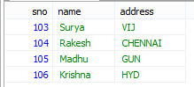

Select Operations
====================

**SELECT** \* **FROM** \`student\`;

**SELECT** s.sno, s.name **FROM** \`student\` s;

**SELECT** \* **FROM** \`student\` s **WHERE** s.sno =104;

**SELECT** \* **FROM** \`student\` s **WHERE** s.name="Satya" **AND**
s.address="HYD";

**SELECT** \* **FROM** \`student\` s **WHERE** s.name="Satya" **OR**
s.address="HYD";

**SELECT** \* **FROM** \`student\` s **WHERE** s.name **like** '%a';

-   **like** '%a' **Ending with ‘a’**

-   **like** 'a%' **Starting with ‘a’**

-   **like** '%a%' **Contains with ‘a’**

-   **like** '%' **Contains any**

**SELECT** \* **FROM** \`student\` s **WHERE** s.address **IN** ('HYD', 'VIJ');

**IN operator allows you to apply multiple where conditions**

**SELECT** \* **FROM** \`student\` s **WHERE** s.sno **BETWEEN** 103 **AND** 106

(Mostly used in date comparision)

**SELECT DISTINCT** s.address **FROM** \`student\` s;

**SELECT** s.name **AS** 'Student_Name', s.address **AS** 'CITY' **FROM**
\`student\` s

**SELECT** \* **FROM** \`student\` s **ORDER BY** s.address **asc**; (default)

**SELECT** \* **FROM** \`student\` s **ORDER BY** s.address **desc**;

**UPDATE** student\` **SET** \`name\`='Vishnu' **WHERE** \`sno\`=107 **AND**
\`name\`='Satya' **AND** \`address\`='VIJ' **LIMIT** 1;

**DELETE FROM** \`mydb\`.\`student\` **WHERE** \`sno\`=107 **AND**
\`name\`='Vishnu' **AND** \`address\`='VIJ' **LIMIT** 1;
