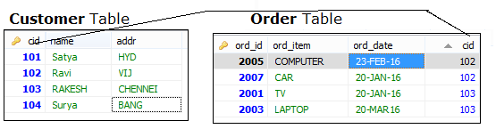
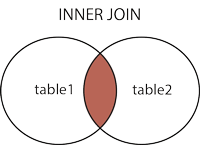
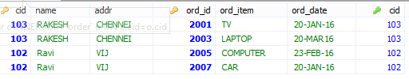
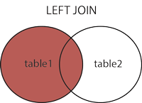
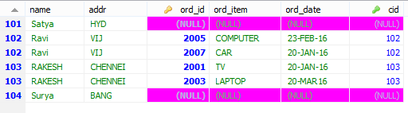
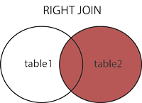
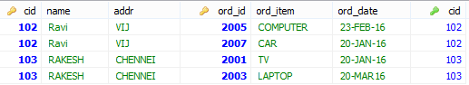
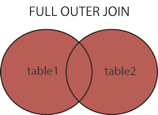
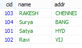

JOINS
========

An SQL JOIN clause is used to combine rows from two or more tables, based on a
common field between them.

**Rules**

1.  At least on common column must be present beween two tables

2.  PRIMARY_KEY of one table as FORIEN_KEY of another table is recommended.

**PRIMARY KEY Constraint**

-   The PRIMARY KEY constraint uniquely identifies each record in a database
    table.

-   Primary keys must contain UNIQUE values.

-   A primary key column cannot contain NULL values.

-   Table can have **only ONE primary key.**

**FOREIGN KEY Constraint**

-   A **FOREIGN KEY in one table points to a PRIMARY KEY in another table**.

**CASCADE** will propagate the change when the parent changes. (If you delete a
row, rows in constrained tables that reference that row will also be deleted,
etc.)

**SET NULL** sets the column value to NULL when a parent row goes away.

**RESTRICT** causes the attempted DELETE of a parent row to fail.

```sql
CREATE TABLE `customer` (
`cid` INT NOT NULL,
`name` VARCHAR(50) NULL,
`addr` VARCHAR(50) NULL,
PRIMARY KEY (`cid`)
) ;

CREATE TABLE `order` (
`ord_id` INT NOT NULL,
`ord_item` VARCHAR(50) NULL,
`ord_date` VARCHAR(50) NULL,
`cid` INT NULL,
PRIMARY KEY (`ord_id`),
CONSTRAINT `FK__customer` FOREIGN KEY (`cid`) REFERENCES `customer` (`cid`) ON UPDATE CASCADE ON DELETE CASCADE
)
COLLATE='utf8_general_ci'
ENGINE=InnoDB;
SELECT `DEFAULT_COLLATION_NAME` FROM `information_schema`.`SCHEMATA` WHERE `SCHEMA_NAME`='mydb';
```



We have 4 types of Joins

#### 1.INNER JOIN:
Returns all rows when there is at least one match in BOTH tables.




**SELECT** \* **FROM** customer c **INNER JOIN** \`order\` o **ON** c.cid=o.cid



#### 2.LEFT JOIN:

Return **all rows from the left table, and the matched rows from the right
table.** It will fill rows with **NULL** for unmatched rows on **right**



**SELECT** \* **FROM** customer c **LEFT JOIN** \`order\` o **ON** c.cid=o.cid



### 3.RIGHT JOIN:

**Return all rows from the right table, and the matched rows from the left
table.** It will fill rows with **NULL** for unmatched rows on **left**.




**SELECT** \* **FROM** customer c **RIGHT JOIN** \`order\` o **ON** c.cid=o.cid




### 4.FULL JOIN:

Return **all rows when there is a match in ONE of the tables**


```sql
SELECT * FROM customer c FULL OUTER JOIN `order` o ON c.cid=o.cid
```


In MySQL we don’t have Full Outer Join, for this we have to use Unions


#### **UNION Operator**

SQL UNION operator **combines the result of two or more SELECT statements**
```sql
SELECT * FROM customer c WHERE c.cid>102
UNION
SELECT * FROM customer c
```



-   The UNION operator selects only distinct values by default.

-   To allow duplicate values, to get duplicates also use **UNION ALL**

-   Column name must be equal in TWO tables

### **SELECT INTO**

SELECT INTO statement **copies data from one table** and inserts it into a **new
table**.
```sql
SELECT * INTO old_customer FROM customer;		(mysql not supporting)
```


### **INSERT INTO SELECT**

It selects data from one table and inserts it into an **existing table**

**Constraints**

-   NOT NULL - Indicates that a column cannot store NULL value

-   UNIQUE - Ensures that each row for a column must have a unique value

-   PRIMARY KEY - A combination of a NOT NULL and UNIQUE

-   FOREIGN KEY - Ensure the referential integrity of the data in one table to
    match values in another table

-   CHECK - Ensures that the value in a column meets a specific condition

-   DEFAULT - Specifies a default value for a column


<br>


### **Views**

View is a **virtual table based on the result-set of an SQL statement**.

-   A view contains rows and columns, just like a real table.

-   The fields in a view are fields from one or more real tables in the database
```sql
CREATE OR REPLACE VIEW view_name AS
SELECT column_name(s)
FROM table_name
WHERE condition
```

```sql
CREATE OR REPLACE VIEW [Current Product List] AS
SELECT ProductID,ProductName,Category
FROM Products
WHERE Discontinued=No
```


We can perform INSERT, DELETE, UPDATE Opetations as normal as Table operations

#### **Date Functions**

The following table lists the most important built-in date functions in MySQL:

| **Function**                                                       | **Description**                                              |
|--------------------------------------------------------------------|--------------------------------------------------------------|
| [NOW()](http://www.w3schools.com/sql/func_now.asp)                 | **Returns the current date and time**                        |
| [CURDATE()](http://www.w3schools.com/sql/func_curdate.asp)         | **Returns the current date**                                 |
| [CURTIME()](http://www.w3schools.com/sql/func_curtime.asp)         | **Returns the current time**                                 |
| [DATE()](http://www.w3schools.com/sql/func_date.asp)               | **Extracts the date part of a date or date/time expression** |
| [EXTRACT()](http://www.w3schools.com/sql/func_extract.asp)         | **Returns a single part of a date/time**                     |
| [DATE_ADD()](http://www.w3schools.com/sql/func_date_add.asp)       | **Adds a specified time interval to a date**                 |
| [DATE_SUB()](http://www.w3schools.com/sql/func_date_sub.asp)       | **Subtracts a specified time interval from a date**          |
| [DATEDIFF()](http://www.w3schools.com/sql/func_datediff_mysql.asp) | **Returns the number of days between two dates**             |
| [DATE_FORMAT()](http://www.w3schools.com/sql/func_date_format.asp) | **Displays date/time data in different formats**             |
