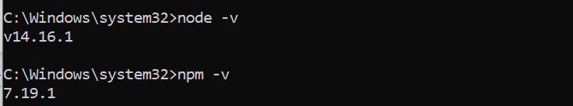
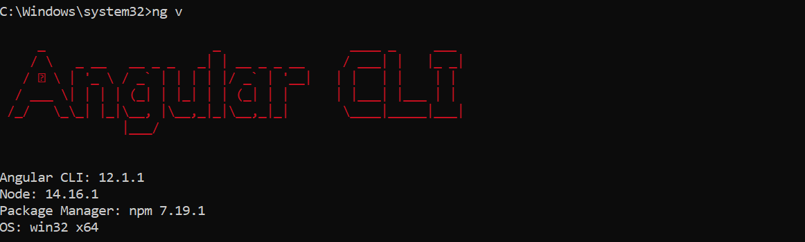
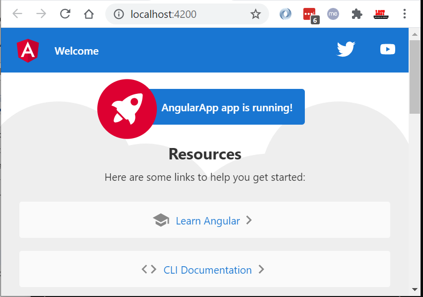
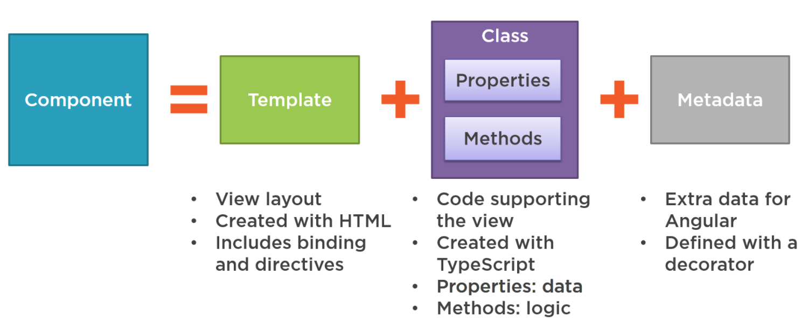

# Angular Tutorial

Angular is an open-source JavaScript MVC framework for the web applications. It extends the HTML and makes it dynamic. **Angular is used to create Single Page Applications**.

**AngularJS** or **Angular 1.x** was the first iteration of the Angular framework. With the release of **Angular 2**, Angular was completely redesigned using TypeScript and component-based architecture.

It is important to know that when developers say **Angular**, they mean **Angular** versions **2 and higher**. **AngularJS** refers to version 1 of Angular only.

<br/>


## Install Angular

#### Install Node.js

Angular uses NPM ([Node Package Manager](https://www.tutorialsteacher.com/nodejs/what-is-node-package-manager)) to install libraries, packages. So you need to install NPM before installing Angular.



After installing Node.js and NPM, install the Angular CLI.

#### Install Angular CLI

Angular CLI (Command Line Interface) used to install libraries required for your application. Angular CLI is also used to generate, build, run, and deploy Angular application

To install the Angular CLI globally using NPM, open a terminal/command window, and enter the following command:

```Code
npm install -g @angular/cli
```

check the Angular version using **ng v**



<br/>


## TypeScript – Datatypes

AngularJS used Javascript as its primary language. Angular began using TypeScript starting in Angular 2. Since then, TypeScript has become the primary language of Angular.

TypeScript uses JavaScript’s **var, let,** and **const** keywords to initialize variables. It also uses a colon **(:)** after the variable name to designate the type.

TypeScript does not require you to statically type variables. Plain Javascript syntax WILL work in TypeScript. However, by convention, most programmers statically type variables in TypeScript because it helps to provide structure and prevent programmer errors.

### String

**Javascript:**

```
let  = 'Fred'
```

**TypeScript:**

```
let :  = 'Fred'
```

Based on this convention, we could initialize a **shoeColor** string in TypeScript as such:

```
let :  = 'blue';
console.log(shoeColor);
```

It is possible to change **variable** values over time:

```java
 = 'red' ;
console.log(shoeColor);
```


<br/>


### Numbers

We can initialize a **seatCount** number variable in TypeScript like this:

```
let seatCount: number = 42;
```

TypeScript does not designate between integers and floating point or decimal numbers like other languages when it comes to typing. **Initializing a decimal number is just like initializing an integer**:

```
let registrationPercentage: number = 92.87;
```

If you were to try to reassign **registrationPercentage** to a **string** value in another line of that program, the program would not compile, and your text editor would most likely throw an error.

registrationPercentage = 'Ninety Two';  
**// WILL CAUSE AN ERROR because registrationPercentage is statically typed as a number.**


<br/>


### Boolean

**Boolean** values are either true or false. In TypeScript, you can declare and statically type a variable without initializing it with a value. Booleans always return **true** or **false** values. These values are not strings, they are actually their own data type.

```
let : boolean;
```

If you try to use **isRegistered** at this point in the program, however, you will get an error. We need to initialize with value before using it.


<br/>


### Enums

**Enum** values in Typescript are collections of constants. Think of an Enum as a type of fixed array of things that you use as a reference, such as days of the week, states in the USA, etc. The number of elements and the order of elements doesn’t change either.  
Let’s create an enum called **spiceLevel:**

```
 spiceLevel {
NONE = "no spice",
LOW = "barely spicy",
MEDIUM = "medium spicy",
HIGH = "hot"
}
console.log(spiceLevel.MEDIUM);
```


<br/>


### any

The 'any' type is essentially a wild card. **It can hold anything**. We can declare an 'any' data type in TypeScript like this:

```
let userData: any;
```

**userData** will now be a container that can hold any data type. Once **userData** is initialized, however, it will infer the type from the value given to it.

```
 userData: any;

userData = 22;
console.log(userData + 2);


userData = "free";
console.log(userData + "man");
```

Note that with an **any** data type, even though the type is inferred upon assignment, you can re-assign the variable to another data type and it still works.


<br/>


### Interface

An interface is defined with the keyword interface and it can include properties and method declarations using a function or an [arrow function](https://www.tutorialsteacher.com/typescript/arrow-function).

```
interface IPerson {
firstName:string,
lastName:string,
sayHi: ()=>string
}
var customer:IPerson = {
firstName:"Tom",
lastName:"Hanks",
sayHi: ():string =>{return "Hi there"}
}
console.log("Customer Object ")
console.log(customer.firstName)
console.log(customer.lastName)
console.log(customer.sayHi())
var employee:IPerson = {
firstName:"Jim",
lastName:"Blakes",
sayHi: ():string =>{return "Hello!!!"}
}
console.log("Employee Object ")
console.log(employee.firstName);
console.log(employee.lastName);
```

We can use **optional** fields in an interface in TypeScript. Optional fields are not part of the strict interface contract. You can omit them when creating an instance of that interface.

```
interface Order {
customerName: string,
itemNumbers: number[],
isComplete?: boolean
}
```

Notice the question mark after isComplete. **isComplete?** means that we can omit that.


<br/>
<br/>


## Create Angular Application

To create an application, and execute the ng new \<project name\>

```
ng new AngularApp
```

Build Application

```
ng serve -o
```

Start Application

```
npm start
```

Open Application in browser

<http://localhost:4200>



The **ng serve** command keep watching source files, so if you make any changes in any file of the project, it will rebuild it and refresh the browser automatically to reflect the changes.

 
<br/>

## Angular Component

-   Angular is a SPA framework, and a view is made of one or more component.

-   An Angular component represents a portion of a view.

-   Angular Component = HTML Template + Component **Class** + Component Metadata



**HTML Template**

HTML template is nothing but a regular HTML code with additional Angular specific syntax to communicate with the component class.  

**Class**

Essentially, a component class is a [TypeScript](https://www.tutorialsteacher.com/typescript) class that includes **properties** and **methods**.

Properties store data and methods include the logic for the component. Eventually, this class will be compiled into [JavaScript](https://www.tutorialsteacher.com/javascript/javascript-tutorials).

**Metadata**

Metadata is some extra data for a component used by Angular API to execute the component, such as the location of HTML and CSS files of the component, selector, providers, etc.


# Next Read Edureka Materials 

#### <a href="/books/angular/1. Angular2 - Beginner tutorial.pdf" target="_blank">1. Angular2 - Beginner tutorial</a>


#### <a href="/books/angular/2. AngularCLI Tutorial.pdf" target="_blank">2. AngularCLI Tutorial</a>


#### <a href="/books/angular/3. Angular4 - Beginner tutorial.pdf" target="_blank">3. Angular4 - Beginner tutorial</a>


#### <a href="/books/angular/4. Angular vs ReactJs.pdf" target="_blank">4. Angular vs ReactJs</a>