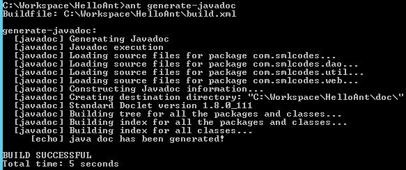

## 1.Introduction


Apache Ant is a Java based build tool from Apache Software Foundation. Apache
Ant's build files are written in XML and they take advantage of being open
standard, portable and easy to understand.

Ant's build file, called **build.xml** should reside in the base directory of
the project. However, *there is no restriction on the file name or its
location*. You are free to use other file names or save the build file in some
other location.
```xml
<?xml version="1.0"?>
   <project name="Hello World" default="info">
   
   <target name="info">
      <echo>Hello World Apache Ant!</echo>
   </target>   
</project>
```


2.Configuring Apache Ant in Windows
------------------------------------

1.To install [Apache Ant](http://ant.apache.org/bindownload.cgi) on Windows,
you just need to download the Ant’s zip file


2.**Unzip Downloaded file. It Folder Structure will be as follows**


3.Configure the **JAVA_HOME** Windows environment variables by specifying Java
Installation Location

**Control Panel → User Accounts → User Accounts → Change my Environment
Variables**


4.Add **ANT_HOME** as the Windows environment variable, and point it to your
Ant folder


5.Update **PATH** variable, append **%ANT_HOME%\\bin** at the end, so that you
can run the Ant’s command everywhere


6.Verify ANT is installed properly or not by below command


3.Ant Hello World Application
------------------------------

Ant build tool is used to manage a Java project, compile, and package it into a
Jar file

**1. Create a Java Project**  
In Eclipse IDE, create a new Java project named **“HelloAnt".**


**2. Create Java Program**  
Create a new Java class to print “Hello Ant!"
```java
package com.smlcodes;

public class HelloAnt {

	public static void main(String[] args) {
		System.out.println(sayHello());
	}

	private static String sayHello() {
		return "Hello Ant!!";
	}
}
```


**3. Create build.xml**  
Create a new **build.xml** in the project root folder. In eclipse

**Right Click on Project →Export → General →Ant Bulild Files →Select Project
→Finish**


```xml
<project name="HelloAnt" default="main" basedir=".">
	<description>
		Create a Java Project (JAR) with Ant build script
	</description>

	<property name="projectName" value="HelloAnt" />

	<!-- Java sources -->
	<property name="src.dir" location="src" />

	<!-- Java classes -->
	<property name="build.dir" location="bin" />

	<!-- Output, Jar -->
	<property name="dist.dir" location="dist" />

	<target name="init">
		<!-- Create the time stamp -->
		<tstamp />
		<!-- Create the build directory structure used by compile -->
		<mkdir dir="${build.dir}" />
	</target>

	<target name="compile" depends="init" description="compile the source ">
		<!-- Compile the java code from ${src.dir} into ${build.dir} -->
		<javac includeantruntime="false" srcdir="${src.dir}" destdir="${build.dir}" />
	</target>

	<target name="dist" depends="compile" description="package, output to JAR">

		<!-- Create the distribution directory -->
		<mkdir dir="${dist.dir}" />

		<!-- Put everything in ${build} into the {$projectName}-${DSTAMP}.jar file -->
		<jar jarfile="${dist.dir}/${projectName}-${DSTAMP}.jar" basedir="${build.dir}">
			<manifest>
				<attribute name="Main-Class" value="com.com.smlcodes.HelloAnt" />
			</manifest>
		</jar>
	</target>

	<target name="clean" description="clean up">
		<delete dir="${build.dir}" />
		<delete dir="${dist.dir}" />
	</target>

	<!-- Default, run this -->
	<target name="main" depends="clean, compile, dist" />

</project>
```

### 3.1 Run Ant Build Scrpits

Open Command Prompt & Go to Project location

**1. Compile the source code using >**   `ant compile`
```xml
<target name="compile" depends="init" description="compile the source ">
		<!-- Compile the java code from ${src.dir} into ${build.dir} -->
		<javac includeantruntime="false" srcdir="${src.dir}" destdir="${build.dir}" />
</target>
```


Above metioned **$varibles** are declared on top with below values
```xml
<!-- Java sources -->
<property name="src.dir" location="src" />

<!-- Java classes -->
<property name="build.dir" location="bin" />

<!-- Output, Jar -->
<property name="dist.dir" location="dist" />
```


It will compile the java socurce code and places in **/bin** folder.


**2.Package the project into an executable Jar file using >`ant dist`**
```xml
<target name="dist" depends="compile" description="package, output to JAR">

		<!-- Create the distribution directory -->
		<mkdir dir="${dist.dir}" />

		<!-- Put everything in ${build} into the {$projectName}-${DSTAMP}.jar file -->
		<jar jarfile="${dist.dir}/${projectName}-${DSTAMP}.jar" basedir="${build.dir}">
			<manifest>
				<attribute name="Main-Class" value="com.com.smlcodes.HelloAnt" />
			</manifest>
		</jar>
	</target>
```


Verify Created Jar


**3. Delete folders using > `ant clean`**
```xml
<target name="clean" description="clean up">
	<delete dir="${build.dir}" />
	<delete dir="${dist.dir}" />
</target>
```


4.If no options, the default target will be executed, in this example, the
default target is **main**


4.Advanced Ant
---------------

### 4.1 Ant -How to Create a Jar File with external libraries

In Maven if we write dependency details it will automatically contacts the repo
server and downloads Jar files mentioned in pom.xml. In Ant manage the project
external libraries with **Apache Ivy**

**1.Create this file ivy.xml**

We use Apache Ivy to get the project’s external libraries / dependencies.
```xml
//ivy.xml
<ivy-module version="2.0">
	<info organisation="org.apache" module="dateUtilsProject" />
	<dependencies>
		<dependency org="joda-time" name="joda-time" rev="2.5"  />
		<dependency org="org.slf4j" name="slf4j-api" rev="1.7.6" />
		<dependency org="ch.qos.logback" name="logback-classic" rev="1.1.2" />
	</dependencies>
</ivy-module>
```

**2.Update build.xml**

Update build.xml, add ivy namespace on top, and “ivy" task to download the ivy
module, and “resolve" task to ask Ivy module to download the external libraries
```xml
//build.xml
<project xmlns:ivy="antlib:org.apache.ivy.ant"
	name="dateUtilsProject" default="main" basedir=".">

	<!-- ivy start -->
	<!-- ivy to get dependencies and copy to project lib folder automatically -->
	<target name="resolve" description="retrieve dependencies with ivy">
		<ivy:retrieve />
	</target>

	<!-- install ivy -->
	<target name="ivy" description="Install ivy">
		<mkdir dir="${user.home}/.ant/lib" />
		<get dest="${user.home}/.ant/lib/ivy.jar"
			src="http://search.maven.org/remotecontent?filepath=org/apache/ivy/ivy/2.4.0-rc1/ivy-2.4.0-rc1.jar" />
	</target>
	<!-- ivy end -->

</project>
```

For the first time, download the ivy module from Maven center repository to
local `${user.home}/.ant/lib/ivy.jar.`
```xml
$ ant ivy
```


To download the external libraries, run task “resolve". The declared libraries
will be downloaded to the project lib folder.
```xml
$ ant resolve
```


### 4.2 Ant -Build Java Documentation 

**1. Add below <target>in build.xml as follows**
```xml
<!-- Ant Ant -Build Java Documentation  -->
	<target name = "generate-javadoc">
	   <javadoc packagenames="com.smlcodes.*" sourcepath="${src.dir}" 
	      destdir = "doc" version = "true" windowtitle = "Fax Application">
	      
	      <doctitle><![CDATA[= Fax Application =]]></doctitle>
	      
	      <bottom>
	         <![CDATA[Copyright © 2011. All Rights Reserved.]]>
	      </bottom>
	      
	      <group title = "doa packges" packages = "com.smlcodes.dao.*"/>
	      <group title = "web packages" packages = "com.smlcodes.web.*"/>
	      <group title = "data packages" packages = "com.smlcodes.util.*"/>
	   </javadoc>
	   
	   <echo message = "java doc has been generated!" />
	</target>
```

2.If we execute the javadoc Ant task. It generates and places the java
documentation files in the **doc folder**.
```xml
ant generate-javadoc
```




**3. Open C:\\Workspace\\HelloAnt\\doc folder to check generated java document**


### 4.3 Ant – Creating JAR files

In HelloAnt application it self we Covered Craeting Jar files. Ok, just recall
target & Command once
```xml
<target name="dist" depends="compile" description="package, output to JAR">

		<!-- Create the distribution directory -->
		<mkdir dir="${dist.dir}" />

		<!-- Put everything in ${build} into the {$projectName}-${DSTAMP}.jar file -->
		<jar jarfile="${dist.dir}/${projectName}-${DSTAMP}.jar" basedir="${build.dir}">
			<manifest>
				<attribute name="Main-Class" value="com.com.smlcodes.HelloAnt" />
			</manifest>
		</jar>
	</target>
```
Command for creating jar file is **>ant dist**


### 4.4 Ant – Creating war Files

War files will be created only for web applciations. So , I created AntWeb
webapllication it contains only index.jsp file for testing purpose

**1. Add following lines in build.xml**
```xml
<target name="build-war">

        	   <war destfile="AntWeb.war" webxml="${web.dir}/web.xml">
        	      <fileset dir="WebContent">
        	         <include name="**/*.*"/>
        	      </fileset>
        	      
        	      <classes dir="${build.dir}/web"/>
        	   </war>
        	   
    </target>
```
Command for creating jar file is ** >ant build-war**


### 4.5 Ant – JUnit Integration

JUnit is the commonly used unit testing framework for Java-based developments.
To Configure JUnit in build.xml add below lines to build.xml
```xml
<target name="unittest">
   <junit haltonfailure="true" printsummary="true">
      <test name="com.smlcodes.HelloTestCase"/>
   </junit>
</target>
```
