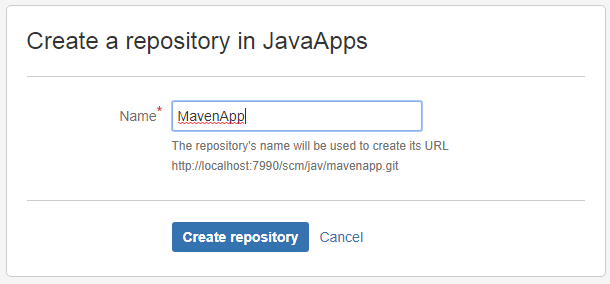

## **1.Introduction**

**Bitbucket** is a web-based hosting service that is owned by
Atlassian, used for source code and development projects that use revision
control systems.

Bitbucket offers both commercial plans and free accounts. It offers free
accounts with an unlimited number of private. Bitbucket integrates with other
Atlassian software **like Jira, HipChat, Confluence and Bamboo.**


It is similar to [GitHub](https://en.wikipedia.org/wiki/GitHub), which primarily
uses [Git](https://en.wikipedia.org/wiki/Git_(software)). Bitbucket has
traditionally tailored itself towards helping professional developers with
private proprietary code, especially since being acquired by Atlassian in
2010. In September 2016, Bitbucket announced it had reached 5 million developers
and 900,000 teams on its
platform.[[4]](https://en.wikipedia.org/wiki/Bitbucket#cite_note-4) Bitbucket
has 3 deployment models: Cloud, Bitbucket Server and Data Center.

 

### **Features**

Bitbucket is mostly used **for code and code review**. Bitbucket supports the
following features:

-   Pull requests with code review and comments

-   Bitbucket

-   Merge Checks

-   Code

-   Git Large File Storage

-   Documentation, including automatically rendered README files in a variety of
    Markdown-like file formats

-   Issue tracking

-   Add-ons and integrations

-   REST APIs to build third party applications which can use any development
    language

-   Snippets that allow developers to share code segments or files

-   Smart Mirroring

 

### **Installing BitBucket in windows**

Follow this article to install BitBucket in Windows

<http://localhost:6666/sml/devops/how-to-install-bitbucket-on-windows/>
 

## **2. Working with BitBucket**
 
For working with any Source control tool we need know how they perform the
Operations like Creating Repository, adding files into repo & How to commit the
changes.
 

Similarly, BitBucket also perform above operations in its own way.

-   **Create a Git repository**

-   **Copy your Git repository and add files**

-   **Pull changes from your Git repository on Bitbucket Cloud**

-   **Use a Git branch to merge a file**  


Let’s see how we can do it in BitBucket.


**1. Creating projects in BitBucket**  
Projects allow you to group repositories and to manage permissions for them in
an aggregated way.

-   To create a project, go to **Projects** & click on **Create project**

    
 

-   Fill out the form & Click **Create project** when you're done.

    
 
-   It will show the Empty Project Dashboard as below

    
 

**2.Creating new Repository in BitBucket**
 
Initially, the repository you create in Bitbucket is going to be empty without
any code in it. This Bitbucket repository will be the central repository for
your files, which means that others can access that repository if you give them
permission.


**Steps to create new repository:**

-   **Repositories > Create repository** button at the top of the page
 
-   It displays the **Create a new repository page**, fill the details & click
    on **Create repository** button

    
 

-   It will show the Empty Repository as below

    
 

**3. Cloning a repository**

Before Cloning Repo, we need to add SSH key to our Repo.for doing this open
command prompt & go to C:/Users<Your_Account> and type below command to
generate SSH key  

`ssh-keygen -t rsa -C "admin@example.com"`
 

If you already installed Git, then use **ssh-keygen** command & just press <\Enter\> key


```bash
$ ssh-keygen
Generating public/private rsa key pair.
Enter file in which to save the key (/c/Users/kaveti_S/.ssh/id_rsa):
Created directory '/c/Users/kaveti_S/.ssh'.
Enter passphrase (empty for no passphrase):
Enter same passphrase again:
Your identification has been saved in /c/Users/kaveti_S/.ssh/id_rsa.
Your public key has been saved in /c/Users/kaveti_S/.ssh/id_rsa.pub.
The key fingerprint is:
SHA256:D2bOf2p8mlo3qAua8AWOtKjVjkyH/pTeHgVfGw7hrRs kaveti_S@HYDPCM90480L
The key's randomart image is:
+---[RSA 2048]----+
|        .        |
|       . o       |
|      . o +      |
|       o = o     |
|  . .   E o      |
| o * o * = .     |
|. B * + +.+ o    |
|.= O = o +ooo.   |
|. +.B.o ++==     |
```


Key is generated in in `C:\Users<Your_Account>_S\.ssh\id_rsa`  file. On
Windows, in your command prompt, change directory to your .ssh directory, and
copy the public key file to your clipboard by running
```bash
cd %userprofile%/.ssh
clip < id_rsa.pub
```

 

Go to **BitBucket Home> Manage Account > SSH Keys > Add Key** Paste the key
in text box.


 

For Details Check this
[article](https://confluence.atlassian.com/bitbucketserver046/using-bitbucket-server/controlling-access-to-code/using-ssh-keys-to-secure-git-operations/creating-ssh-keys?utm_campaign=in-app-help&utm_medium=in-app-help&utm_source=stash)

-   From the repository, click **Clone** in the sidebar & Copy the clone command
    (SSH/HTTPS).

    

 

-   From a terminal window, Paste the command you copied from Bitbucket.
