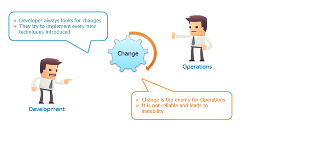

1.DevOps Introduction
=====================

We can say from the very beginning software industry is divided into two parts
,**Development and Operations.**

-   **Development** focuses on creating and testing software's.

-   **Operations** is focused on delivering those software's to user in form of
    a website or as an installable software.

Once delivered we our job is

-   maintain the software,

-   we deliver new features to our users

-   make sure the software's stay up and running and healthy

if we make quick changes (adding new features continuously) then stability
becomes an issue. We are living in a world where there are frequent changes to
our software’s and apps.

-   Developers aim to create latest features quickly and rapidly.

-   Operations aim is to keep systems stable.

-   Quick changes are the user demand.

-   User also needs stable software or Apps.

DevOps whole and sole objective is to Deliver latest and greatest features to
the user with stability.




DevOps LifeCycle
----------------

DevOps Lifecycle includes Development and Operations teams working together. As
Developers work on their agile iterations, Ops must work in setting up systems
and automating the procedure of deployment.

agile model gives code repeatedly to deploy it on systems, that’s going to be
continuous release of code and that must be continuously deployed to many
servers in Dev, QA, Staging & Production environments.

If the code deployment process is not automated then ops team must manually do
the deployment. Deployment may include below mentioned procedures.

-   Create servers if they don’t exist (On cloud or virtual env).

-   Install and setup prerequisites or dependencies on servers.

-   Build the software from raw source code (If not done by Developers).

-   Deploy software to servers.

-   Do config changes to OS and software.

-   Setup Monitoring.

-   Feedback & Report.

For this, all the process must be automated, we must automate first Build and
Release process which includes.

-   Developers push the code in a centralised place.

-   Fetch the developers code.

-   Validate code.

-   Build & test code

-   Package it into distributable format(software/artifacts).

-   Release it.


The DevOps Lifecycle Looks Like This:

-   Check in code

-   Pull code changes for build

-   Run tests (continuous integration server to generate builds & arrange
    releases): Test individual models, run integration tests, and run user
    acceptance tests.

-   Store artefacts and build repository (repository for storing artefacts,
    results & releases)

-   Deploy and release (release automation product to deploy apps)

-   Configure environment

-   Update databases

-   Update apps

-   Push to users – who receive tested app updates frequently and without
    interruption

-   Application & Network Performance Monitoring (preventive safeguard)

-   Rinse and repeat

What Is Continuous Integration.
-------------------------------

Developers will push their code several times in a day to a central repository,
every time there is code change it should be pulled, built, tested and notify to
the user. **No deployment involved here**


Refer in old devops notes

DevOps Tools
------------


**Version Control Systems:**

Is used to store the source code, a central place to keep all the code and
tracks its version.

For Example:

-   Git

-   SVN

-   TFS

-   Github

-   bitbucket

**Build Tools:**

Build process is where we take the raw source code, test it and build it into a
software. This process is automated by build tools.

For Example:

-   Maven

-   ANT

-   MSBuild

-   Gradle

-   NANT

**Continuous Integration Tools:**

For Example:

-   Jenkins

-   Circle CI

-   Hudson

-   Bamboo

-   Teamcity

**Configuration Management Tools:**

Also known as automation tools, can be used to automate system related tasks
like software installation, service setup, file push/pull etc. Also used to
automate cloud and virtual infrastructure.

For Example:

-   Ansible

-   Chef

-   Puppet

-   Saltstack

**Cloud Computing:**

Well this is not any tool but a service accessed by users through internet. A
service that provides us with compute resource to create virtual servers,
virtual storage, networks etc. There are few providers in the market who gives
us public cloud computing services.

For Example:

-   AWS

-   Azure

-   Google Cloud

-   Rackspace

**Monitoring Tools:**

Is used to monitor our infrastructure and application health. It sends us
notifications and reports through email or other means.

For Example:

-   Nagios

-   Sensu

-   Icinga

-   Zenoss

-   Monit

**Containers & Microservices:**

Well to be very frank this cannot be described to you right now. Its described
in detail in separate chapter. We need to have lot of Infra & Development
knowledge to understand this category of tool.

For Example:

-   Docker

-   RKT

-   Kubernetes

3. Virtualization
=================

In computing, virtualization refers to the act of creating a virtual version of
something, including virtual computer hardware platforms, storage devices, and
computer network resources.

Virtualization gained huge momentum because of **Vmware** as it has solved the
problem of **running multiple OS and apps on one physical computer**.

#### isolated system 

**isolated system** (plural **isolated systems**) (physics) A **system** that
does not interact with its surroundings; that is, its total energy and mass stay
constant

Applications runs on servers. We deploy one application per server because we
want our applications to be isolated. For example, if we need web app, db app
and few backend apps. We may end up having multiple physical system each running
a single instance of that app.


The Virtual Machine
-------------------

A virtual computer system is known as a -virtual machine" (VM): a tightly
isolated software container with an operating system and application inside.
Each self-contained VM is completely independent. Putting multiple VMs on a
single computer enables several operating systems and applications to run on
just one physical server, or -host".

VMs have the following characteristics, which offer several benefits.

-   Partitioning

-   Run multiple operating systems on one physical machine

-   Divide system resources between virtual machines

-   Isolation

-   Provide fault and security isolation at the hardware level

-   Preserve performance with advanced resource controls

-   Encapsulation

-   Save the entire state of a virtual machine to files

-   Hardware Independence

-   Provision or migrate any virtual machine to any physical server

Hypervisors
-----------

As generally we install OS on the physical server and then install our apps on
that. By setting up Hypervisor on the physical server we can create multiple VMs
each with their own OS.

There are two types of hypervisors:

**Type 1**

hypervisors run directly on the system hardware. They are often referred to as a
"native" or "bare metal" hypervisors.

They get installed on a physical computer like an OS. **So instead of installing
OS** we install Hypervisor to achieve virtualization.

We can activate/deactivate this on Boot menu(F12)

Example:

-   Microsoft Hyper-V

-   VMware ESX/ESXi.

-   Xen Hypervisors

**Type 2**

Type 2 hypervisors run on a host operating system. In this kind, we install
hypervisor on the OS like Linux or windows.

Example:

-   Vmware server/workstation/player

-   Oracle virtualbox.


**Host Operating System (Host OS).**

This is the operating system of the physical computer on which VirtualBox was
installed. There are versions of VirtualBox for Windows, Mac OS X, Linux and
Solaris hosts.

**Guest Operating System (Guest OS).**

This is the operating system that is running inside the virtual machine.

Installing virtualbox on windows.

Installing OS on the newly created VM.

<https://youtu.be/63_kPIQUPp8>


<br>

2.Bash Scripting
================

Shell Commands list
-------------------
```bash
#!/bin/bash
##############################################################################
# SHORTCUTS and HISTORY
##############################################################################

CTRL+A  # move to beginning of line
CTRL+C  # halts the current command
CTRL+L  # clears screen and redisplay the line
history   # shows command line history
!!        # repeats the last command
!<n>      # refers to command line 'n'
!<string> # refers to command starting with 'string'

exit      # logs out of current session


##############################################################################
# BASH BASICS
##############################################################################

env                 # displays all environment variables

echo $SHELL         # displays the shell you're using
/bin/bash

echo $BASH_VERSION  # displays bash version
4.2.46(2)-release

bash                # if you want to use bash (type exit to go back to your previously opened shell)
whereis bash        # locates the binary, source and manual-page for a command
which bash          # finds out which program is executed as 'bash' (default: /bin/bash, can change across environments)

clear               # clears content on window (hide displayed lines)


##############################################################################
# FILE COMMANDS
##############################################################################


ls                            # lists files in current directory, ls <dir> print files in a specific directory
ls -l                         # lists your files in 'long format', which contains the exact size of the file, who owns the file and who has the right to look at it, and when it was last modified
ls -a                         # lists all files, including hidden files (name beginning with '.')
ln -s <filename> <link>       # creates symbolic link to file
touch <filename>              # creates or updates (edit) your file
cat <filename>                # prints file raw content (will not be interpreted)
any_command > <filename>      # '>' is used to perform redirections, it will set any_command's stdout to file instead of "real stdout" (generally /dev/stdout)
more <filename>               # shows the first part of a file (move with space and type q to quit)
head <filename>               # outputs the first lines of file (default: 10 lines)
tail <filename>               # outputs the last lines of file (useful with -f option) (default: 10 lines)
vim <filename>                # opens a file in VIM (VI iMproved) text editor, will create it if it doesn't exist
mv <filename1> <dest>         # moves a file to destination, behavior will change based on 'dest' type (dir: file is placed into dir; file: file will replace dest (tip: useful for renaming))
cp <filename1> <dest>         # copies a file
rm <filename>                 # removes a file
diff <filename1> <filename2>  # compares files, and shows where they differ
wc <filename>                 # tells you how many lines, words and characters there are in a file. Use -lwc (lines, word, character) to ouput only 1 of those informations
chmod -options <filename>     # lets you change the read, write, and execute permissions on your files (more infos: SUID, GUID)
gzip <filename>               # compresses files using gzip algorithm
gunzip <filename>             # uncompresses files compressed by gzip
gzcat <filename>              # lets you look at gzipped file without actually having to gunzip it
lpr <filename>                # prints the file
lpq                           # checks out the printer queue
lprm <jobnumber>              # removes something from the printer queue
genscript                     # converts plain text files into postscript for printing and gives you some options for formatting
dvips <filename>              # prints .dvi files (i.e. files produced by LaTeX)
grep <pattern> <filenames>    # looks for the string in the files
grep -r <pattern> <dir>       # search recursively for pattern in directory


##############################################################################
# DIRECTORY COMMANDS
##############################################################################


mkdir <dirname>  # makes a new directory
cd               # changes to home
cd <dirname>     # changes directory
pwd              # tells you where you currently are


##############################################################################
# SSH, SYSTEM INFO & NETWORK COMMANDS
##############################################################################


ssh user@host            # connects to host as user
ssh -p <port> user@host  # connects to host on specified port as user
ssh-copy-id user@host    # adds your ssh key to host for user to enable a keyed or passwordless login

whoami                   # returns your username
passwd                   # lets you change your password
quota -v                 # shows what your disk quota is
date                     # shows the current date and time
cal                      # shows the month's calendar
uptime                   # shows current uptime
w                        # displays whois online
finger <user>            # displays information about user
uname -a                 # shows kernel information
man <command>            # shows the manual for specified command
df                       # shows disk usage
du <filename>            # shows the disk usage of the files and directories in filename (du -s give only a total)
last <yourUsername>      # lists your last logins
ps -u yourusername       # lists your processes
kill <PID>               # kills the processes with the ID you gave
killall <processname>    # kill all processes with the name
top                      # displays your currently active processes
bg                       # lists stopped or background jobs ; resume a stopped job in the background
fg                       # brings the most recent job in the foreground
fg <job>                 # brings job to the foreground

ping <host>              # pings host and outputs results
whois <domain>           # gets whois information for domain
dig <domain>             # gets DNS information for domain
dig -x <host>            # reverses lookup host
wget <file>              # downloads file


##############################################################################
# VARIABLES
##############################################################################


varname=value                # defines a variable
varname=value command        # defines a variable to be in the environment of a particular subprocess
echo $varname                # checks a variable's value
echo $$                      # prints process ID of the current shell
echo $!                      # prints process ID of the most recently invoked background job
echo $?                      # displays the exit status of the last command
export VARNAME=value         # defines an environment variable (will be available in subprocesses)

array[0]=valA                # how to define an array
array[1]=valB
array[2]=valC
array=([2]=valC [0]=valA [1]=valB)  # another way
array=(valA valB valC)              # and another

${array[i]}                  # displays array's value for this index. If no index is supplied, array element 0 is assumed
${#array[i]}                 # to find out the length of any element in the array
${#array[@]}                 # to find out how many values there are in the array

declare -a                   # the variables are treaded as arrays
declare -f                   # uses function names only
declare -F                   # displays function names without definitions
declare -i                   # the variables are treaded as integers
declare -r                   # makes the variables read-only
declare -x                   # marks the variables for export via the environment

${varname:-word}             # if varname exists and isn't null, return its value; otherwise return word
${varname:=word}             # if varname exists and isn't null, return its value; otherwise set it word and then return its value
${varname:?message}          # if varname exists and isn't null, return its value; otherwise print varname, followed by message and abort the current command or script
${varname:+word}             # if varname exists and isn't null, return word; otherwise return null
${varname:offset:length}     # performs substring expansion. It returns the substring of $varname starting at offset and up to length characters

${variable#pattern}          # if the pattern matches the beginning of the variable's value, delete the shortest part that matches and return the rest
${variable##pattern}         # if the pattern matches the beginning of the variable's value, delete the longest part that matches and return the rest
${variable%pattern}          # if the pattern matches the end of the variable's value, delete the shortest part that matches and return the rest
${variable%%pattern}         # if the pattern matches the end of the variable's value, delete the longest part that matches and return the rest
${variable/pattern/string}   # the longest match to pattern in variable is replaced by string. Only the first match is replaced
${variable//pattern/string}  # the longest match to pattern in variable is replaced by string. All matches are replaced

${#varname}                  # returns the length of the value of the variable as a character string

*(patternlist)               # matches zero or more occurrences of the given patterns
+(patternlist)               # matches one or more occurrences of the given patterns
?(patternlist)               # matches zero or one occurrence of the given patterns
@(patternlist)               # matches exactly one of the given patterns
!(patternlist)               # matches anything except one of the given patterns

$(UNIX command)              # command substitution: runs the command and returns standard output


##############################################################################
# FUNCTIONS
##############################################################################


# The function refers to passed arguments by position (as if they were positional parameters), that is, $1, $2, and so forth.
# $@ is equal to "$1" "$2"... "$N", where N is the number of positional parameters. $# holds the number of positional parameters.


function functname() {
  shell commands
}

unset -f functname  # deletes a function definition
declare -f          # displays all defined functions in your login session


##############################################################################
# FLOW CONTROLS
##############################################################################


statement1 && statement2  # and operator
statement1 || statement2  # or operator

-a                        # and operator inside a test conditional expression
-o                        # or operator inside a test conditional expression

# STRINGS

str1 == str2               # str1 matches str2
str1 != str2               # str1 does not match str2
str1 < str2                # str1 is less than str2 (alphabetically)
str1 > str2                # str1 is greater than str2 (alphabetically)
-n str1                    # str1 is not null (has length greater than 0)
-z str1                    # str1 is null (has length 0)

# FILES

-a file                   # file exists
-d file                   # file exists and is a directory
-e file                   # file exists; same -a
-f file                   # file exists and is a regular file (i.e., not a directory or other special type of file)
-r file                   # you have read permission
-s file                   # file exists and is not empty
-w file                   # your have write permission
-x file                   # you have execute permission on file, or directory search permission if it is a directory
-N file                   # file was modified since it was last read
-O file                   # you own file
-G file                   # file's group ID matches yours (or one of yours, if you are in multiple groups)
file1 -nt file2           # file1 is newer than file2
file1 -ot file2           # file1 is older than file2

# NUMBERS

-lt                       # less than
-le                       # less than or equal
-eq                       # equal
-ge                       # greater than or equal
-gt                       # greater than
-ne                       # not equal

if condition
then
  statements
[elif condition
  then statements...]
[else
  statements]
fi

for x in {1..10}
do
  statements
done

for name [in list]
do
  statements that can use $name
done

for (( initialisation ; ending condition ; update ))
do
  statements...
done

case expression in
  pattern1 )
    statements ;;
  pattern2 )
    statements ;;
esac

select name [in list]
do
  statements that can use $name
done

while condition; do
  statements
done

until condition; do
  statements
done

##############################################################################
# COMMAND-LINE PROCESSING CYCLE
##############################################################################


# The default order for command lookup is functions, followed by built-ins, with scripts and executables last.
# There are three built-ins that you can use to override this order: `command`, `builtin` and `enable`.

command  # removes alias and function lookup. Only built-ins and commands found in the search path are executed
builtin  # looks up only built-in commands, ignoring functions and commands found in PATH
enable   # enables and disables shell built-ins

eval     # takes arguments and run them through the command-line processing steps all over again


##############################################################################
# INPUT/OUTPUT REDIRECTORS
##############################################################################


cmd1|cmd2  # pipe; takes standard output of cmd1 as standard input to cmd2
< file     # takes standard input from file
> file     # directs standard output to file
>> file    # directs standard output to file; append to file if it already exists
>|file     # forces standard output to file even if noclobber is set
n>|file    # forces output to file from file descriptor n even if noclobber is set
<> file    # uses file as both standard input and standard output
n<>file    # uses file as both input and output for file descriptor n
n>file     # directs file descriptor n to file
n<file     # takes file descriptor n from file
n>>file    # directs file description n to file; append to file if it already exists
n>&        # duplicates standard output to file descriptor n
n<&        # duplicates standard input from file descriptor n
n>&m       # file descriptor n is made to be a copy of the output file descriptor
n<&m       # file descriptor n is made to be a copy of the input file descriptor
&>file     # directs standard output and standard error to file
<&-        # closes the standard input
>&-        # closes the standard output
n>&-       # closes the ouput from file descriptor n
n<&-       # closes the input from file descripor n


##############################################################################
# PROCESS HANDLING
##############################################################################


# To suspend a job, type CTRL+Z while it is running. You can also suspend a job with CTRL+Y.
# This is slightly different from CTRL+Z in that the process is only stopped when it attempts to read input from terminal.
# Of course, to interrupt a job, type CTRL+C.

myCommand &  # runs job in the background and prompts back the shell

jobs         # lists all jobs (use with -l to see associated PID)

fg           # brings a background job into the foreground
fg %+        # brings most recently invoked background job
fg %-        # brings second most recently invoked background job
fg %N        # brings job number N
fg %string   # brings job whose command begins with string
fg %?string  # brings job whose command contains string

kill -l               # returns a list of all signals on the system, by name and number
kill PID              # terminates process with specified PID
kill -s SIGKILL 4500  # sends a signal to force or terminate the process
kill -15 913          # Ending PID 913 process with signal 15 (TERM)

ps           # prints a line of information about the current running login shell and any processes running under it
ps -a        # selects all processes with a tty except session leaders

trap cmd sig1 sig2  # executes a command when a signal is received by the script
trap "" sig1 sig2   # ignores that signals
trap - sig1 sig2    # resets the action taken when the signal is received to the default

disown <PID|JID>    # removes the process from the list of jobs

wait                # waits until all background jobs have finished


##############################################################################
# TIPS & TRICKS
##############################################################################


# set an alias
cd; nano .bash_profile
> alias gentlenode='ssh admin@gentlenode.com -p 3404'  # add your alias in .bash_profile

# to quickly go to a specific directory
cd; nano .bashrc
> shopt -s cdable_vars
> export websites="/Users/mac/Documents/websites"

source .bashrc
cd $websites


##############################################################################
# DEBUGGING SHELL PROGRAMS
##############################################################################


bash -n scriptname  # don't run commands; check for syntax errors only
set -o noexec       # alternative (set option in script)

bash -v scriptname  # echo commands before running them
set -o verbose      # alternative (set option in script)

bash -x scriptname  # echo commands after command-line processing
set -o xtrace       # alternative (set option in script)

trap 'echo $varname' EXIT  # useful when you want to print out the values of variables at the point that your script exits

function errtrap {
  es=$?
  echo "ERROR line $1: Command exited with status $es."
}

trap 'errtrap $LINENO' ERR  # is run whenever a command in the surrounding script or function exits with non-zero status

function dbgtrap {
  echo "badvar is $badvar"
}

trap dbgtrap DEBUG  # causes the trap code to be executed before every statement in a function or script
# ...section of code in which the problem occurs...
trap - DEBUG  # turn off the DEBUG trap

function returntrap {
  echo "A return occurred"
}

trap returntrap RETURN  # is executed each time a shell function or a script executed with the . or source commands finishes executing
```


Bash Script
-----------

Anything you can run normally on the command line can be put into a script and
it will do exactly the same thing. Similarly, anything you can put into a script
can also be run normally on the command line and it will do exactly the same
thing.
```bash
vi test.sh
---------------------
#!/bin/bash
# A sample Bash script
echo Hello World!
```


**#!/bin/bash**

-   Tells type of interpreter to use while running script

-   **#!** is called as the **SHEBANG** character

-   if we change that to /usr/bin/python then it tells the script to use python
    interpreter.

**#** -

This is a comment. Anything after \# is not executed.

Whenever you create a file in Linux system by default it will not have an
execute permission, this is for security reasons. You make your script
executable and then you can run it.
```bash
[satyacodes]# ./print.sh
bash: ./print.sh: Permission denied

[satyacodes]# chmod 755 print.sh

[satyacodes]# ./print.sh
hello
[satyacodes]#
```


### Command Line Arguments

 we use the variables **$1** to represent the first command line argument,
**$2** to represent the second command line argument and so on. 

###### Ask The User For Input
```bash
print.sh
------------------
echo "Enter your Name ?"
read name
echo "Hello, $name"
--------------------------
[satyacodes]# ./print.sh
Enter your Name ?
Satya
Hello, Satya

echo Enter your Name, Profession & Interests in same order seprated by a space?
read name profession interest
echo Your entered name is: $name
echo Your profession is: $profession
echo Your are interested in: $interest

-----------------------------------------
[satyacodes]# ./print.sh
Enter your Name, Profession,Interests in same order seprated by a space?
Satya SSE Movies
Your entered name is: Satya
Your profession is: SSE
Your are interested in: Movies
```


SSH - Running Command On Remote Servers/Nodes
---------------------------------------------

<https://www.hostinger.in/tutorials/ssh-tutorial-how-does-ssh-work>

SSH is used to connect Remote Servers from Your System & do Operations. But how
will you tell your system is Secure to Connect & perform Operations ?

SSH, or Secure Shell, is a remote administration protocol that allows users to
control and modify their remote servers over the Internet.

It provides a mechanism for authenticating a remote user, transferring inputs
from the client to the host, and relaying the output back to the client.

If you’re using Linux or Mac, then using SSH is very simple. If you use Windows,
you will need to utilize an SSH client to open SSH connections. The most popular
SSH client is **PuTTY**

The SSH command consists of 3 distinct parts

ssh {user}@{host}

When you hit enter, you will be prompted to enter the password for the requested
account.  If your password is correct, you will be greeted with a remote
terminal window.

There are three different encryption technologies used by SSH:

1.  Symmetrical encryption

2.  Asymmetrical encryption

3.  Hashing.


<https://www.youtube.com/watch?v=y2SWzw9D4RA>


