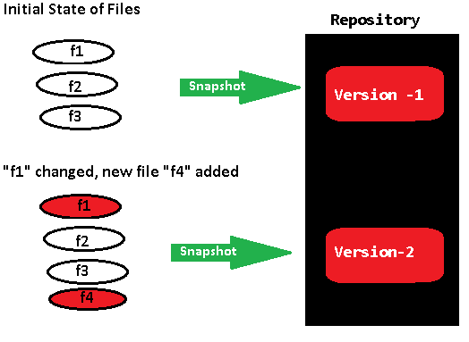
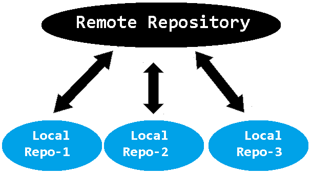
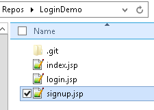
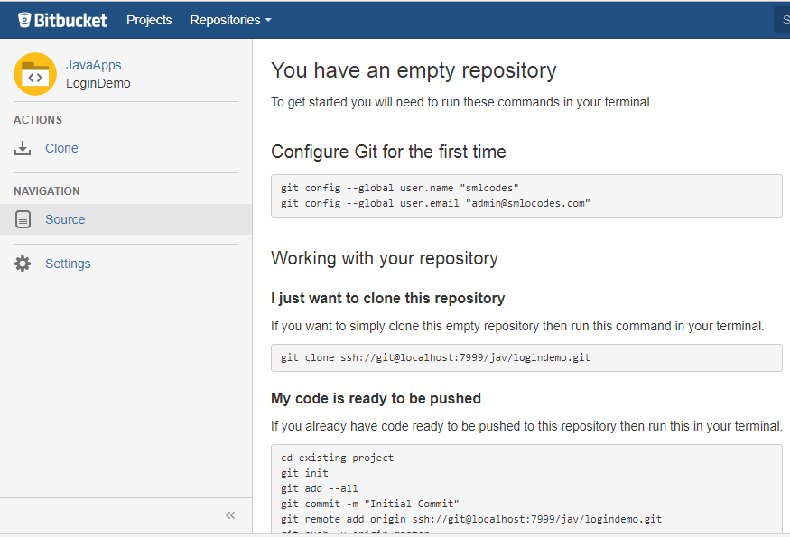
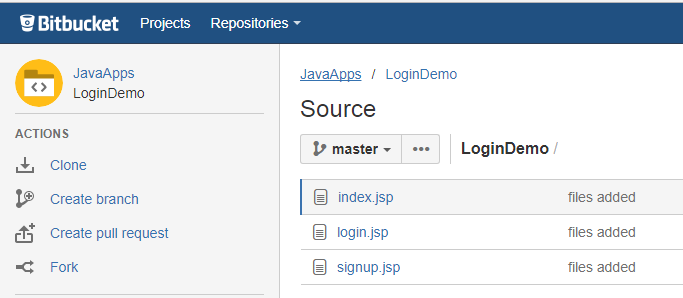
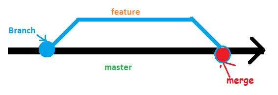

1.Introduction
--------------

## Version Control System (VCS)

A **version control system (VCS)** allows you to track the history of a
collection of files. It supports creating different versions of this collection.
Each version captures a snapshot of the files at a certain point in time and the
VCS allows you to switch between these versions. These versions are stored in a
specific place, typically called a repository



We have 3 types of version control systems

1.  **Localized version control systems**

2.  **Centralized version control systems**

3.  **Distributed version control systems**

**1. Localized version control systems**  
A localized version control system keeps local copies of the files. This
approach can be as simple as creating a manual copy of the relevant files.  
**Examples: Revision Control System (RCS) Source Code Control System (SCCS)**

**2. Centralized version control systems**  
A centralized version control system provides a server software component which
stores and manages the different versions of the files. A developer can copy
(checkout) a certain version from the central sever onto their individual
computer.  
**Examples: Subversion (SVN), TFS**

Both approaches have the drawback that they have one single point of failure. In
a localized version control systems it is the individual computer and in a
centralized version control systems it is the server machine

**3. Distributed version control systems**  
In a distributed version control system each user has a complete local copy of a
repository on his individual computer. The user can copy an existing repository.
This copying process is typically called *cloning*. Every clone contains the
full history of the collection of files and a cloned repository has the same
functionality as the original repository.

Typically, there is a central server for keeping a repository but each cloned
repository is a full copy of this repository.

**Examples : GIT, BitBucket, GitHub**



## Introduction to GIT

Git is a distributed version control system, founded in 2005 by Linus Torvald.we
can Setup GIT in our machine by downloading it from below links

-   [Download git for OSX](http://git-scm.com/download/mac)

-   [Download git for Windows](http://msysgit.github.io/)

-   [Download git for
    Linux](http://git-scm.com/book/en/Getting-Started-Installing-Git)

### Git configuration

`git config` command allows you to configure your Git settings. Git stores all
global configurations in **.gitconfig** file, which is located in your home
directory

```dos
Setting username: This information is used by Git for each commit.
[SmlCodes_Admin]$ git config --global user.name "Small Codes"

Setting email id: This information is used by Git for each commit.
[SmlCodes_Admin]$ git config --global user.email "admin@smlcodes.com"
```

<br>

# Git Basic Operations 


### `git init` – Create a new repository

Every Git repository is stored in the **.git** folder of the directory in which
the Git repository has been created. This directory contains the complete
history of the repository. The .**git/config** file contains the configuration
for the repository.

We use the git init command to create a Git repository in the current directory

```powershell
kaveti_s@HYDPCMCSTS MINGW64 /e/Users/devops/Repos
$ mkdir LoginDemo

kaveti_s@HYDPCMCSTS MINGW64 /e/Users/devops/Repos
$ cd LoginDemo/

kaveti_s@HYDPCMCSTS MINGW64 /e/Users/devops/Repos/LoginDemo
$ git init
Initialized empty Git repository in E:/Users/devops/Repos/LoginDemo/.git/

kaveti_s@HYDPCMCSTS MINGW64 /e/Users/devops/Repos/LoginDemo (master)
$ git status
On branch master

Initial commit

nothing to commit (create/copy files and use "git add" to track)
```

###  `git add` – Add a new file to the repo

In LoginDemo repo I want to add 3 files -index.jsp, signup.jsp, login.jsp.



We use git add command to put a snapshot of the file to the staging area.

```powershell
1.Adding single file to Stage
=========================================
Syntax : git add <file-name>
Example: git add index.php
 
2.Adding files of same type
=========================================
Syntax : git add “<wildcard>.<extension>”
Example: git add “*.jsp”
 
3.Adding all files at a time
=========================================
Syntax : git add .


kaveti_s@HYDPCMCSTS MINGW64 /e/Users/devops/Repos/LoginDemo (master)
$ git status
On branch master

Initial commit

Untracked files:
  (use "git add <file>..." to include in what will be committed)

        index.jsp
        login.jsp
        signup.jsp

nothing added to commit but untracked files present (use "git add" to track)

kaveti_s@HYDPCMCSTS MINGW64 /e/Users/devops/Repos/LoginDemo (master)
$ git add .

kaveti_s@HYDPCMCSTS MINGW64 /e/Users/devops/Repos/LoginDemo (master)
$ git status
On branch master

Initial commit

Changes to be committed:
  (use "git rm --cached <file>..." to unstage)

        new file:   index.jsp
        new file:   login.jsp
        new file:   signup.jsp


kaveti_s@HYDPCMCSTS MINGW64 /e/Users/devops/Repos/LoginDemo (master)
$
```

### `git commit` – commiting changes

git commit command will Stores the current contents of the index in a new commit
along with a log message from the user describing the changes.
```powershell
Syntax : git commit -m "<message>"
```


### `git log` 

git log command will Shows the commit logs.
```powershell
kaveti_s@HYDPCMCSTS MINGW64 /e/Users/devops/Repos/LoginDemo (master)
$ git log
commit 08032d113ef458a2783da26464d91881449e14a1
Author: Kaveti Vs Satyanarayana <Kaveti_S@ad.infosys.com>
Date:   Thu Jul 13 17:56:33 2017 +0530
```


# 3.Remote repositories
 

We created a new empty repository in BitBucket called LoginDemo



### `git remote`

Now our code is ready in local system, we have to add this into newly created
bitbucket repo. For doing this we need use git remote command
```powershell
kaveti_S@HYDPCM90480L MINGW64 /d/Repo/LoginDemo (master)
$ git remote add origin ssh://git@localhost:7999/jav/logindemo.git
```


### `git push`

Now we conncted with remote repo. To place these files in Remote repository we
use git push command
```powershell
kaveti_S@HYDPCM90480L MINGW64 /d/Repo/LoginDemo (master)
$ git push -u origin master
Counting objects: 5, done.
Delta compression using up to 4 threads.
Compressing objects: 100% (5/5), done.
Writing objects: 100% (5/5), 800 bytes | 0 bytes/s, done.
Total 5 (delta 0), reused 0 (delta 0)
To ssh://localhost:7999/jav/logindemo.git
 * [new branch]      master -> master
Branch master set up to track remote branch master from origin.
```
 Now code is Pushed into remote repository.


### `git clone`

git clone is used to checkout the remote repository & create a working copy of a
local repository.

Syntax: **git clone /path/to/repository**
```powershell
kaveti_S@HYDPCM90480L MINGW64 /d/Repo
$ git clone ssh://git@localhost:7999/jav/logindemo.git
Cloning into 'logindemo'...
remote: Counting objects: 5, done.
remote: Compressing objects: 100% (5/5), done.
remote: Total 5 (delta 0), reused 0 (delta 0)
Receiving objects: 100% (5/5), done.
```

### `git pull`

git pull is used for check the changes on our remote repository and pull down if
any new changes exist.

Syntax: **git pull origin <branch name>**
```powershell
kaveti_S@HYDPCM90480L MINGW64 /d/Repo/logindemo (master)
$ git pull origin master
From ssh://localhost:7999/jav/logindemo
 * branch            master     -> FETCH_HEAD
Already up-to-date.
```


# 4. Branching
Branches are used to develop features isolated from each other. The master
branch is the "default" branch when you create a repository. Use other branches
for development and merge them back to the master branch upon completion.


