## **1. Introduction**

**GitHub is a code hosting platform for version control and collaboration**. It
lets you and others work together on projects from anywhere.

This tutorial teaches you GitHub essentials
like **repositories, branches, commits, and Pull Requests**. You’ll create your
own Hello World repository and learn GitHub’s Pull Request workflow, a popular
way to create and review code
 

## **2. Create GitHub Account**

1.  Access  **Github.com** and click [Sign
    up](https://github.com/join?source=header-home)**.**

2.  Choose the free account.

3.  You will receive a verification email at the address provided.

4.  Click the emailed link to complete the verification process.

## **3. GitHub Workflow**

GitHub Flow is a lightweight, branch-based workflow that supports teams and
projects where deployments are made regularly.

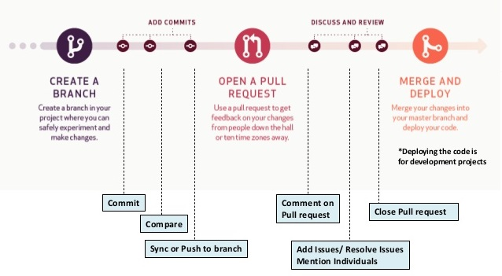

1.  [Create a
    branch](https://help.github.com/articles/creating-and-deleting-branches-within-your-repository)from
    the repository.

2.  [Create](https://help.github.com/articles/creating-new-files)**, [edit](https://help.github.com/articles/editing-files)**, **[rename](https://help.github.com/articles/renaming-a-file)**, **[move](https://help.github.com/articles/moving-a-file-to-a-new-location)**,
    or **[delete](https://help.github.com/articles/deleting-files)**

3.  [Send a pull
    request](https://help.github.com/articles/about-pull-requests)from your
    branch with your proposed changes to kick off a discussion.

4.  Make changes on your branch as needed. Your pull request will update
    automatically.

5.  [Merge the pull
    request](https://help.github.com/articles/merging-a-pull-request)once the
    branch is ready to be merged.

6.  [Tidy up](https://help.github.com/articles/deleting-unused-branches)your
    branches using the delete button in the pull request or on the branches
    page.

To know much more about GitHub workflow please [checkout
this](https://guides.github.com/introduction/flow/).

## **4. Working with GitHub**

 **4.1 Create a Repository in GitHub**

A **repository** is usually used to organize a single project. Repositories can
contain folders and files, images, videos, spreadsheets, and data sets –
anything your project needs.

 

**Steps to create a new repository**

1.In the upper right corner, next to your avatar or identicon, click  and then
select **New repository**.

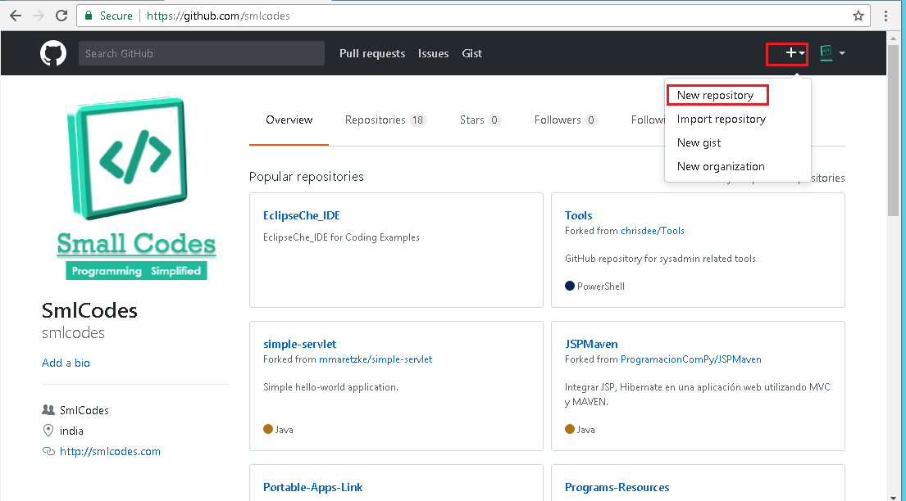

 

2.Name your repository,write a short description, Select **Initialize this
repository with a README**.

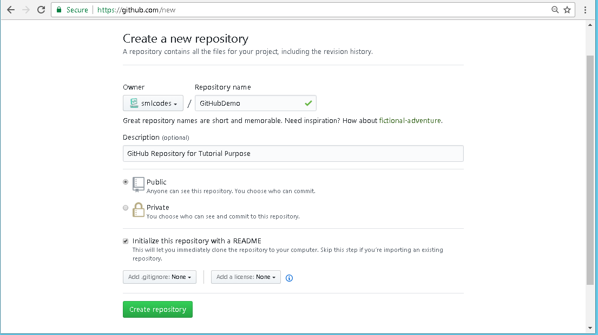

 

3.On Clicking Create repository it will creates the new repository and it is
ready for commit the code.

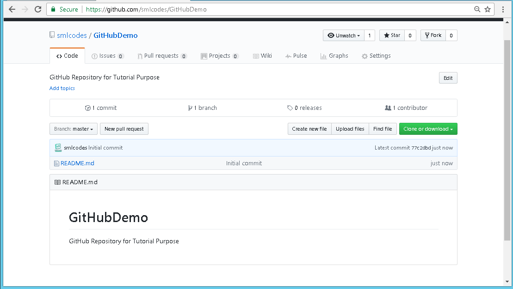

 

**4.2 Adding files to Repository**

We can add the files in two ways in GitHub. creating new file

1.  *Creating files in Github itself*

2.  *Upload files from your PC*

 

**1.Creating files in Github**

-   Open the repository in which you want to create a new file

-   Click on create a new-file button on the top

    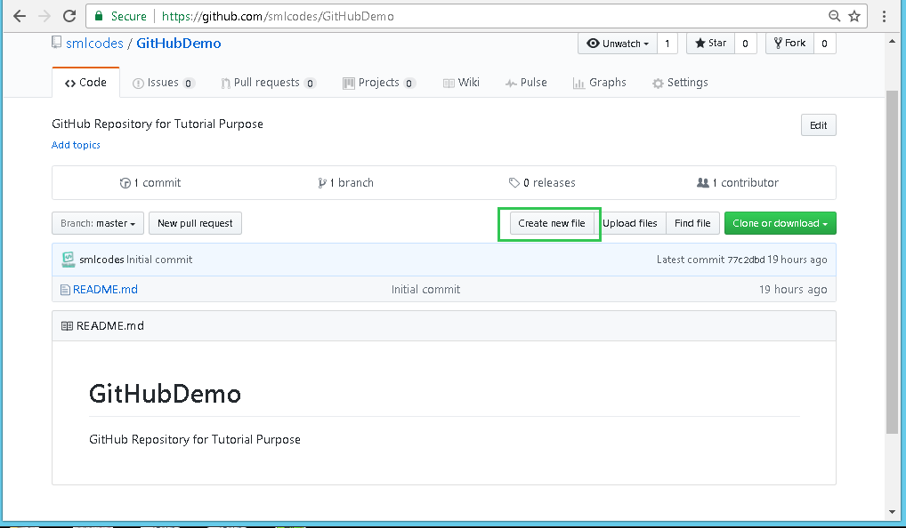
 
-   Provide file name, enter the code you want, give some commit message & say
    commit new file it will create file in the repository

    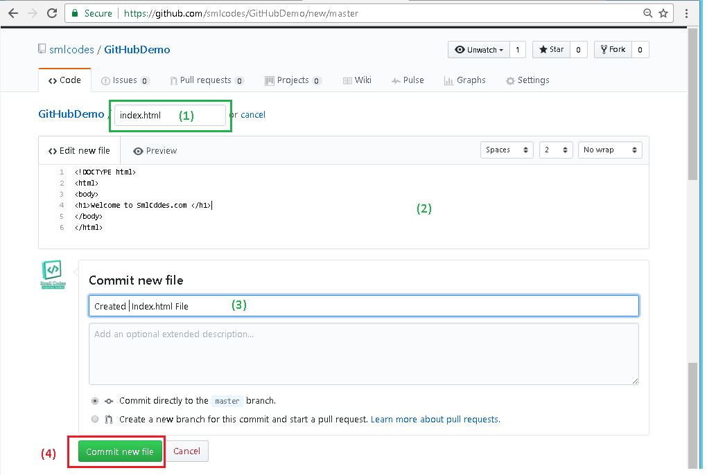

 

**2.Upload files from your PC**

-   Open the repository in which you want to upload the files

-   Click on Upload Files button on the top

    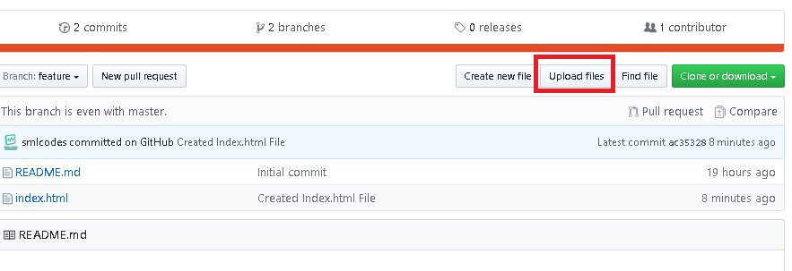
 
 

-   Add/ Drag files to add them to your repository and commit

    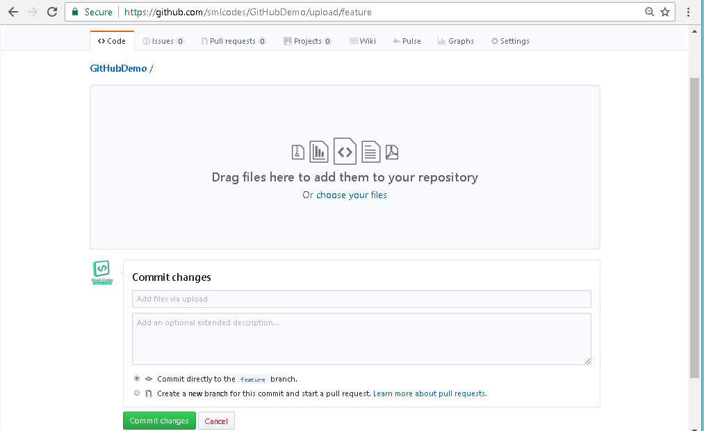
 

 

**What is commit changes**

On GitHub, saved changes are called *commits*. Each commit has an
associated *commit message*, which is a description explaining why a particular
change was made. Commit messages capture the history of your changes, so other
contributors can understand what you’ve done and why.

 

**4.3 Create a Branch in GitHub**

**Branching** is the way to work on different versions of a repository at one
time.

By default your repository has one branch named **master** which is considered
to be the definitive branch. We use branches to experiment and make edits before
committing them to master.

  

I want to create a new branch named **feature**, Here the Steps to do so.

1.  Go to your new repository **GitHubDemo**.

2.  Click the drop down at the top of the file list that says **branch:
    master**.

3.  Type a branch name, **feature**, into the new branch text box.

4.  Select the blue **Create branch** box or hit “Enter" on your keyboard.

    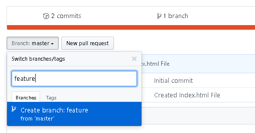
 

Here developers, writers, and designers use branches for keeping bug fixes and
feature work separate from our master (production) branch. When a change is
ready, they merge their branch into master.
 

**4.4 Pull Request in GitHub**  
Pull Requests are the heart of collaboration on GitHub. When you open a *pull
request*, you’re proposing your changes and requesting that someone review and
pull in your contribution and merge them into their branch.

Pull requests show **diffs, or differences,** of the content from both branches.
The changes, additions, and subtractions are shown in green and red.

Here I made changes in index.html, I added new line in feature/index.html. See
how we can create Pull request in github.
 

1.Click the **Pull Request** tab, then from the Pull Request page, click the
green **New pull request** button.

2.Select the branch you made, **feature**, to compare with **master(the original)** Look over your changes in the diffs on the Compare page, make sure
they’re what you want to submit

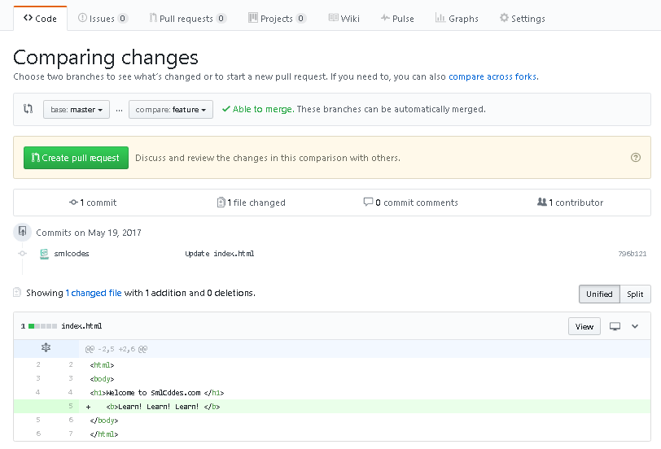

 

3.When you’re satisfied that these are the changes you want to submit, click the
big green **Create Pull Request **button.

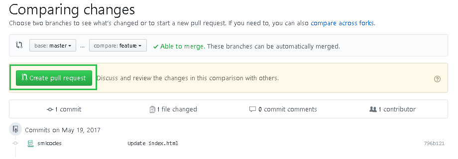

4.Give your pull request a title and write a brief description of your changes.
When you’re done with your message, click **Create pull request**!

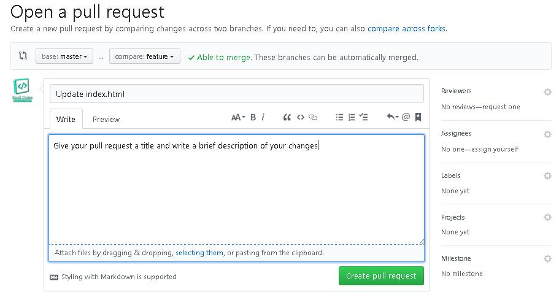

**4.5 Merge Pull Request in GitHub**

In this final step, it’s time to bring your changes together – merging
your feature branch into the master branch.

1.  Click the green **Merge pull request** button to merge the changes
    into master.

2.  Click **Confirm merge**.

3.  Go ahead and delete the branch, since its changes have been incorporated,
    with the **Delete branch** button in the purple box.

    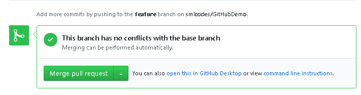

## **5.GitHub with Git Command-line Tool**

Before you can work with Git on the command line, you will need to set some
basic configurations:

1.  Open your git terminal application.

2.  Type git --version to ensure Git is installed.
    Check [git-scm.com](https://git-scm.com/) to download the latest version.

3.  Type git config --global user.name "USER NAME", replacing USERNAME with your
    first and last name.

4.  Type git config --global user.email "EMAIL", replacing EMAIL with the email
    account associated with your GitHub account.

5.  Depending on your operating system, set the core.autocrlf.

    -   **Windows users:** Type git config --global core.autocrlf true.

    -   **Mac & Linux users:** Type git config --global core.autocrlf input.

6.  Type git config --list to see your current configurations.

  

**5.1 Clone the Repository Using the Command Line**

After you’ve created a repository on the remote, the next step is to clone it to
your local environment.

1.  Navigate to the Code tab of the repository on GitHub.com.

2.  Click **Clone or download**.

3.  Copy the **Clone URL**

4.  Open your command line/terminal application and cdinto the directory where
    you would like to copy the repository. This can be anywhere in your local
    file system.

5.  Type git clone URL. Be sure to replace URL with the Clone URL you copied in
    the previous step. The repository will be cloned into a new directory in
    this location.

6.  Type cd REPOSITORY-NAMEto move into the directory of the repository you just
    created.

7.  Type git status.

git status is a command you will use often to verify the current state of your
repository and the files it contains. Right now, we can see that we are on
branch master, everything is up to date with origin/master and our working
directory is clean.

 

**5.2 Create Local Branches with Git**

Now that you have a local copy of the repository, let’s use the steps of
the [GitHub Flow](https://guides.github.com/introduction/flow/) to make a change
in your project. First we will create a branch:

1.  Create a new branch with a descriptive name: git branch BRANCH-NAME.

2.  Type git status to see that although you created a new branch, you are still
    checked out to **master** (as indicated by the in-line response from Git).

3.  Check out to your new branch: git checkout BRANCH-NAME.

4.  Type git status to verify you are now checked out to your new branch.

 

**5.3 Add Local Commits With Git**

After you have finished making your changes, it is time to commit them.

1.  Type git status. Remember that git status allows us to see the status of the
    files on our branch at any given time. Your file is listed under the
    heading *Untracked files*.

2.  Type git add FILE-NAME. This adds the file to the staging area and prepares
    it to become part of the next commit.

3.  Type git status again to see what has changed. Your file is now listed under
    the heading *Changes to be committed*.

4.  Type git commit. This tells git to collect all of the files in the staging
    area and commit them to version control as a single unit of work. Git will
    open your default text editor where you can enter the commit message.

5.  Type the commit message, save and quit your editor.

    -   The default text editor associated with git is vi in most cases, which
        requires that you type :wq to save and quit after entering your commit
        message.

    -   Alternatively, you can bypass vi altogether and enter your commit
        message inline with git commit -m "your message"

6.  To see the history of commits, type git log.

 
 

**5.4 Open a Pull Request on GitHub using Git**

Now that you have made some local commits, it is time to send your changes to
the remote copy of your repository on GitHub.com and create a Pull Request:

1.  Type git push -u origin BRANCH-NAME to push your commits to the remote, and
    set a tracking branch.

2.  Enter your GitHub username and password, if prompted to do so.

3.  Create a Pull Request on GitHub.

4.  Fill out the body of the Pull Request with information about the changes
    you’re introducing.

 

Since this is your repository, you probably don’t have anyone to collaborate
with (yet). Go ahead and merge your Pull Request now:

1.  On GitHub.com, navigate to the Pull Request that you just opened.

2.  Scroll down and click the big green **Merge Pull Request** button.

  

**5.5 Git Pull**

After you merge your Pull Request, you will need to update your local copy of
the repository:

1.  In your command line, type git checkout master.

2.  Type git pull

