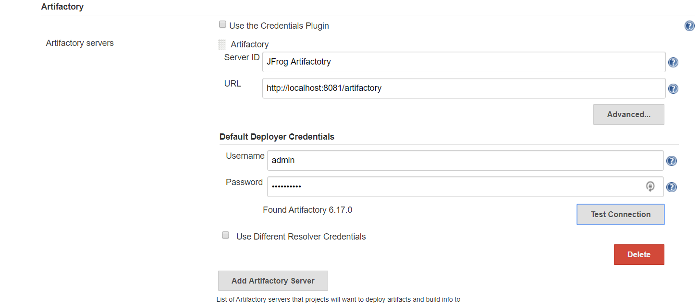
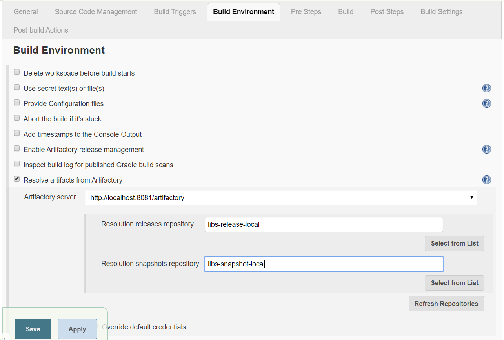
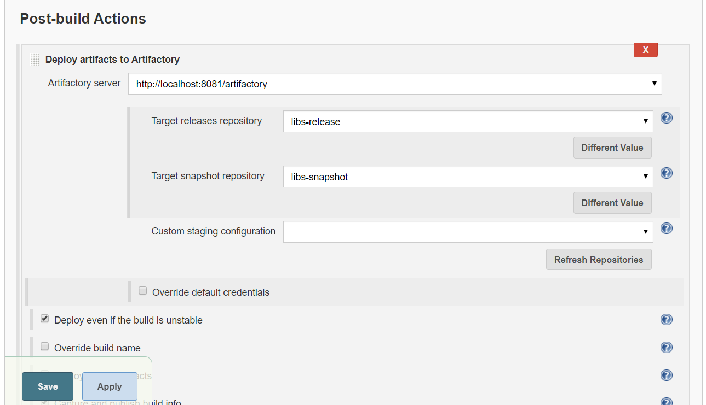

JFrog Introductioon
===================

Artifactory is a product by **JFrog** that serves as a binary repository manager.

The binary repository is a natural extension to the source code repository, in
that it will store the outcome of your build process, often denoted as
artifacts.

-   **Java**: jar, ear, war etc has [Maven](https://maven.apache.org/) and the
    official [MavenCentral](https://search.maven.org/). There are many other
    package managers that will use the maven binary repository format as well
    ([ivy](http://ant.apache.org/ivy/), [gradle](https://gradle.org/) etc).

-   **.Net**:  [nuget](https://www.nuget.org/) for .NET components (DLL and EXE) but
    can also be used as a distribution mechanism under windows thorugh systems
    like [Chocolatey](https://chocolatey.org/). Newer versions of Powershell can
    also leverage this to distribute powershell modules though the [powershell
    gallery](https://www.powershellgallery.com/) of which one could build a
    local distribution with a binary repository and a repository in nuget
    format. Also check [OneGet](https://github.com/OneGet/oneget) if Windows
    distribution management is of interest to you.

-   **JavaScript** : we have [npm](https://www.npmjs.com/) which is one of the
    most popular, will require [nodejs](https://nodejs.org/en/).

-   **python** : there is [pip](https://pypi.python.org/pypi/pip) and the official
    package index [pypi](https://pypi.python.org/pypi), which one can also
    create a local instance through binary repository that will support the
    format.

<br>

### Github vs Artifactory  
**Git** is used for `source code` and **Artifactory** is used for the `binaries` which go
with the source code.

The difference between source code repository and binary repository was to think
of it like:  Github or Bitbucket is useful to maintain all `'code'`  Jfrog
Artifactory is useful to maintain the built `'binary'` 

<br>

### Uses

-   Reduce number of downloads from remote repositories, this can save not only
    bandwidth but also time.

-   Improve build stability since you are less dependent on external
    repositories

-   Become effective platform for exchanging binary artifact within and beyond
    your organization without the need of building the source

<br>

### Features

-   **Reliability**: As a local proxy to the outside world, Artifactory
    guarantees consistent access to the components needed by your build tools.

-   **Efficiency**: Remote artifacts are cached locally for reuse, so that you
    don’t have to download them repeatedly.

-   **Security**: Advanced security features give you control over who can
    access your artifacts, and where they can deploy them.

-   **Stability**: Supports large load bursts with extremely high concurrency
    and unmatched data integrity.

-   **Automation**: Automate all aspects of artifact management using a powerful
    REST API.

<br>

JFrog Windows Installation
==========================

Artifactory is a repository manager that allows you to store and retrieve
artifacts, such as dependencies or package files. It is like a local repository
in the organization

Download the JFrog artifactory .zip folder from
<https://jfrog.com/open-source/>

Extract the .zip folder & Go to the **'\\bin'** folder and execute
**artifactory.bat**

Open browser hit : <http://localhost:8081/> . Login with below cred's

```bash
#The default administrator user is:
username: admin
password: password
```


**You can create New Users by going**,  
admin \> Security \> users \> Click on NEW from Users management window \> Add
new user\>Save


JFrog – Maven Repository Creation
=================================

#### JFrog – Maven Repository Using Quick Setup – Recommended 


Top Admin Menu \> Create Repositories \> Quick Setup


Select : Maven \> Create


Click on Artifacts. We mostly use “libs-release-local” to store maven artifacts


<br>

#### JFrog – Maven Repository manually 


We have to create **"Local repository"** to store package files created by the
Jenkins/Maven.

Go to Admin \> Repositories \> Local \> New \> Select : Maven


Enter : Repository Key : Maven-artifacts (for example) \> Save &Finish


To delete repository , admin \> Repositories" (Ex."Local") \> click the **x** on
the right end of the repository you want to delete


<br>


JFrog – Maven Integration 
==========================

#### a. Upload artifact to JFrog manually


Build the maven project & get artifact


Open Artifacts \> Select: Maven-artifacts \> click Deploy button


Browse & upload the File \> Deploy


Now we can use this artficat in others projects by specifing maven dependency in
pom.xml


#### b. Upload artifact via maven Build 
Go to JFrog home page \> ARTIFACTS\> choose the repository \>Click on “Set me
up” \>Click on “Generate Maven Settings” \> Download Snippet.


Save downloaded “settings.xml” file under the Maven Home directory (typically
**it is, user./home/.m2/settings.xml)**


**Open `settings.xml` & replace username/password from**

```bash
<username>${security.getCurrentUsername()}</username>
<password>${security.getEscapedEncryptedPassword()!"AP3eyqG1vjaDmngxsHxxB3B9Uio"}</password>
```

To
```
<username>admin</username>
<password>123abcABC@</password>
```


Then, go into your **JUnit-Maven** directory, and add the
following **distributionManagement** section to your **pom.xml**
```xml
<distributionManagement>
    <repository>
        <id>central</id>
        <name>001403-releases</name>
        <url>http://localhost:8081/artifactory/libs-release-local</url>
    </repository>
</distributionManagement>
```


Now you can deploy the project by Running below command:
```bash
mvn clean deploy
```


Then go browse your snapshot repository and you will see your project’s artifact
in there!


JFrog – Jenkins Integration
===========================

**Add Artifactory Plugin to Jenkins**  
Go to Jenkins dashboard -\> Manage Jenkins -\> Manage Plugins -\> Available -\>
**Artifactory** -\> Install without restart.


**Configure Artifactory-related settings in Jenkins**  
Go to Jenkins dashboard -\> Configure System -\>Artifactory section -\>Add
artifactory server -\> provide the details -\> Test the connection -\>apply &
save




**Configure Project** : to creates package file after compiling all of the
source files.

Go to Build Environment section -\> Resolve artifacts from artifactory -\> Click
on refresh Repositories -\>select the repository in release and snapshot field
from the lists.




**post-build section**  
Go to Add post-build section -\>select **deploy artifacts to artifactory** -\>
click on refresh -\> choose the target releases and snapshot repository
(repositories created earlier) -\>save




**Click on Build now.**  
Jar files are resolved from the local repository or Artifactory.

**check the package**  
Once the package is created, it is stored in artifactory too. Go in the
artifactory and check the package.

Ref.
====

<https://devops4solutions.com/jfrog-artifactory-download-installation/>

<https://youtu.be/F-Tb0OFaaKQ?list=PLc2Tk7OAM5i6wtkHChsmj41xhXowHfWi3>

<https://medium.com/@anusha.sharma3010/configuring-maven-repository-manager-with-jfrog-artifactory-a0eb4b98dc22>

<https://devops4solutions.com/jenkins-jfrog-artifactory-integration/>
