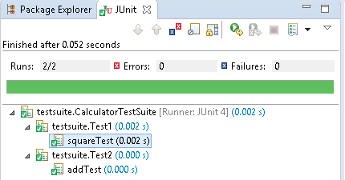

1.JUNIT Introduction
--------------------

Testing is the process of checking the functionality of an application to ensure
it runs as per requirements. **Unit testing** comes into picture at the
developers’ level; it is the testing of single entity **(class or method).**
Unit testing can be done in two ways –**manual testing & automated testing**

**1. Manual Testing:** If you execute the test cases manually without any tool
support, it is known as manual testing. It is time consuming and less reliable.

**2. Automated Testing: If** you execute the test cases by tool support, it is
known as automated testing. It is fast and more reliable.

**XUnit** architecture **introduced automated unit testing**. There are many
unit testing frame works for different programming. Few of the unit testing
frame works are:

-   JAVA - **JUnit**,

-   C - **CUnit**,

-   C++ - **CPPUnit**,

-   .NET - .**NUnit** etc..

XUnit architecture was first implemented for java.**It is known as JUnit**

# JUnit

It is an open-source testing framework for java programmers. The java programmer
can create test cases and test his/her own code.It is one of the unit testing
framework. Current version is **junit 5**.you can download it from [JUnit
website
(github)](https://github.com/junit-team/junit4/wiki/Download-and-Install) or use
below maven dependency in your **pom.xml**
```xml
<dependency>
  <groupId>junit</groupId>
  <artifactId>junit</artifactId>
  <version>4.12</version>
  <scope>test</scope>
</dependency>
```


The Junit 4.x framework is annotation based. Here’re some basic JUnit
annotations

-   **@Test -**Given method is the test method.= public void

-   **@Test(timeout=1000)** -method will be failed if it takes more then 1000
    milliseconds (1 sec).

-   **@BeforeClass** - method will be invoked only once, before starting all
    the tests. public static void

-   **@AfterClass** -method will be invoked only once, after finishing all the
    tests public static void

-   **@Before** -method will be invoked before each test. Run before
    @Test, public void

-   **@After** - method will be invoked after each test. Run after
    @Test, public void

The most important package in JUnit is **junit.framework**, which contains all the core classes. Some of the most important classes are given below  

    1.Assert - set of assert methods.

    2.TestCase - It is the testing of single entity (class or method)

    3.TestSuite - A test suite bundles a few unit test cases and runs them
    together.

    4.TestResult - Contains methods to collect the results of executing a
    test case.


By default Maven uses the following naming conventions when looking for tests to
run:

-   **Test\***

-   ***Test**

-   ***TestCase**

**1.Assert**  
The `org.junit.Assert` class provides methods to assert the program logic. Assert
methods are usually used to **compare the actual value with the expected
value**. All assert methods are static methods. Return type of all assert
methods are void

1.  **void assertEquals(boolean expected,boolean actual)**: checks that two
    primitives/objects are equal. It is overloaded.

2.  **void assertTrue(boolean condition)**: checks that a condition is true.

3.  **void assertFalse(boolean condition)**: checks that a condition is false.

4.  **void assertNull(Object obj)**: checks that object is null.

5.  **void assertNotNull(Object obj)**: checks that object is not null.


**2.Test Case**  
It is the testing of single entity (class or method)
```java
public class TestJunit1 {

   String message = "Robert";	
   MessageUtil messageUtil = new MessageUtil(message);
   
   @Test
   public void testPrintMessage() {	
      System.out.println("Inside testPrintMessage()");    
      assertEquals(message, messageUtil.printMessage());     
   }
}
```

**3.Test Suites**  
A test suite bundles a few unit test cases and runs them together.
```java
import org.junit.runner.RunWith;
import org.junit.runners.Suite;

//JUnit Suite Test
@RunWith(Suite.class)

@Suite.SuiteClasses({ 
   TestJunit1.class ,TestJunit2.class
})

public class JunitTestSuite {
}
```

**4.Test Runners**  
Test runner is used for executing the test cases.
```java
public class TestRunner {
   public static void main(String[] args) {
      Result result = JUnitCore.runClasses(TestJunit.class);
 
      for (Failure failure : result.getFailures()) {
         System.out.println(failure.toString());
      }
 
      System.out.println(result.wasSuccessful());
   }
}
```


**TestResult(**Result**)** − Contains methods to collect the results of
executing a test case.

Example 1 : Testing Annotations Working
```java
package basic;
import org.junit.*;
public class AnnotationsTest {
	// Run once, e.g. Database connection, connection pool
    @BeforeClass
    public static void runOnceBeforeClass() {
        System.out.println("@BeforeClass - runOnceBeforeClass");
    }

    // Run once, e.g close connection, cleanup
    @AfterClass
    public static void runOnceAfterClass() {
        System.out.println("@AfterClass - runOnceAfterClass");
    }

    // Should rename to @BeforeTestMethod
    // e.g. Creating an similar object and share for all @Test
    @Before
    public void runBeforeTestMethod() {
        System.out.println("@Before - runBeforeTestMethod");
    }

    // Should rename to @AfterTestMethod
    @After
    public void runAfterTestMethod() {
        System.out.println("@After - runAfterTestMethod");
    }

    @Test
    public void TestMethod1() {
        System.out.println("@Test - TestMethod1");
    }

    @Test
    public void TestMethod2() {
        System.out.println("@Test - TestMethod2");
    }
}
=================== output =================
@BeforeClass – runOnceBeforeClass

@Before - runBeforeTestMethod
@Test - TestMethod1
@After – runAfterTestMethod

@Before - runBeforeTestMethod
@Test - TestMethod2
@After – runAfterTestMethod

@AfterClass - runOnceAfterClass
```
Note: All sources of production code commonly reside in the src/main/java directory, while all test source files are kept at src/test/java


# 2.JUnit Hello World!
 

To write testcases we must figute out below points

1.  *Class to be tested*

2.  *Write Testcases for selected class*

3.  *Run the Test (Commandline / TestRunner class)*

```java
//1. Class to be tested
package junit;
public class Calculator {
public int square(int x){
	return x*x;
}
}

//2. Write Testcases for selected class
package junit;
import static org.junit.Assert.*;
import org.junit.Test;
public class CalculatorTest {
	@Test
	  public void squareTest() {
	    Calculator calculator = new Calculator();
	    int sqr = calculator.square(2);
	    //Checking for 2
    assertEquals("2*2=4 Passed",4, sqr);//pass
	    assertEquals("2*2=4 Passed",6, sqr); //Fail
	  }
}

//3. Run the Test (Commandline / TestRunner class)
Using command line
java -cp .;junit-4.XX.jar;hamcrest-core-1.3.jar org.junit.runner.JUnitCore CalculatorTest

//Using TestRunner class
package junit;
import org.junit.runner.*;
public class TestRunner {
	public static void main(String[] args) {
 Result result = JUnitCore.runClasses(CalculatorTest.class);

 for (Failure failure : result.getFailures()) {
 	System.out.println("Failure : " + failure.toString());
 }
 System.out.println("Success : " + result.wasSuccessful());
	}
}
Failure : squareTest(junit.CalculatorTest): 2*2=4 Passed expected:<6> but was:<4>
Success : false  //for assertEquals("2*2=4 Passed",6, sqr); //Fail
Success : true //for assertEquals("2*2=4 Passed",4, sqr);//pass
```

# 4.JUnit Examples
 

4.1 Assert all Methods Example
------------------------------
```java
import static org.hamcrest.CoreMatchers.*;
import static org.junit.Assert.*;
import java.util.Arrays;
import org.hamcrest.core.CombinableMatcher;
import org.junit.Test;

public class AssertTests {
  @Test
  public void testAssertArrayEquals() {
    byte[] expected = "trial".getBytes();
    byte[] actual = "trial".getBytes();
    assertArrayEquals("failure - byte arrays not same", expected, actual);
  }

  @Test  public void testAssertEquals() {
    assertEquals("failure - strings are not equal", "text", "text");
  }

  @Test  public void testAssertFalse() {
    assertFalse("failure - should be false", false);
  }

  @Test  public void testAssertNotNull() {
    assertNotNull("should not be null", new Object());
  }

  @Test  public void testAssertNotSame() {
    assertNotSame("should not be same Object", new Object(), new Object());
  }

  @Test  public void testAssertNull() {
    assertNull("should be null", null);
  }

  @Test  public void testAssertSame() {
    Integer aNumber = Integer.valueOf(768);
    assertSame("should be same", aNumber, aNumber);
  }

  // JUnit Matchers assertThat
  @Test  public void testAssertThatBothContainsString() {
    assertThat("albumen", both(containsString("a")).and(containsString("b")));
  }

  @Test  public void testAssertThatHasItems() {
    assertThat(Arrays.asList("one", "two", "three"), hasItems("one", "three"));
  }

  @Test  public void testAssertThatEveryItemContainsString() {
    assertThat(Arrays.asList(new String[] { "fun", "ban", "net" }), everyItem(containsString("n")));
  }

  // Core Hamcrest Matchers with assertThat
  @Test  public void testAssertThatHamcrestCoreMatchers() {
    assertThat("good", allOf(equalTo("good"), startsWith("good")));
    assertThat("good", not(allOf(equalTo("bad"), equalTo("good"))));
    assertThat("good", anyOf(equalTo("bad"), equalTo("good")));
    assertThat(7, not(CombinableMatcher.<Integer> either(equalTo(3)).or(equalTo(4))));
    assertThat(new Object(), not(sameInstance(new Object())));
  }

  @Test  public void testAssertTrue() {
    assertTrue("failure - should be true", true);
  }
}
```

4.2 Test Suite 
---------------

**Test suite** is used to bundle a few unit test cases and run them together.
**@RunWith and @Suite** annotations are used to run the suite tests.

In below Example we are running Test1 & Test2 together using Test Suite.

```java
//1. Class to be tested
package testsuite;

public class Calculator {
	public int square(int x) {
 return x * x;
	}

	public int sum(int x, int y) {
 return x + y;
	}
}


//2. Write Testcases for selected class
//1.Test1.java
package testsuite;

import static org.junit.Assert.assertEquals;
import org.junit.Test; 

public class Test1 {
	@Test
	  public void squareTest() {
	    Calculator calculator = new Calculator();
	    int sqr = calculator.square(2);	    
	    assertEquals("2*2=4 Passed",4, sqr);
	  }
}
-------------------------------------------------------------------
//2.Test2.java
package testsuite;

import static org.junit.Assert.assertEquals;
import org.junit.Test; 

public class Test2 {
	@Test
	  public void addTest() {
	    Calculator calculator = new Calculator();
	    int sum = calculator.sum(8,2);	    
	    assertEquals("8+2=10 Passed",10, sum);
	  }
}

//3.Create Test Suite Class
package testsuite;
import org.junit.runner.RunWith;
import org.junit.runners.Suite;

@RunWith(Suite.class)
@Suite.SuiteClasses({
   Test1.class,
   Test2.class
})
public class CalculatorTestSuite {
}


//4. Run the Test (Commandline / TestRunner class)
Remember, TestRunner class is same for all Examples
package testsuite;

import org.junit.runner.JUnitCore;
import org.junit.runner.Result;
import org.junit.runner.notification.Failure;

public class TestRunner {
	public static void main(String[] args) {
 Result result = JUnitCore.runClasses(CalculatorTestSuite.class);

 for (Failure failure : result.getFailures()) {
 	System.out.println("Failure : " + failure.toString());
 }
 System.out.println("Success : " + result.wasSuccessful());
	}
}
```



4.3 Ignore Test
---------------

**@Ignore** annotation is used to create Ignore test. We use @ignore in two
cases

   **1. At Method Level** : if a method annotated with @Ignore,  that method will not be executed.

   **2. At Class Level Level** : if a class annotated with  @Ignore, all its   methods will not be executed.
```java
//1. Class to be tested
package ignoretest;
public class IgnoreTestClassLevel {
	private String str1;
	private String str2;
	private String str3;

	public IgnoreTestClassLevel(String str1, String str2) {
 this.str1 = str1;
 this.str2 = str2;
	}

	public String addStrings() {
 str3 = str1 + str2;
 System.out.println("addStrings : " + str3);
 return str1 + str2;
	}

	public String upperCase() {
 str3 = (str1 + str2).toUpperCase();
 System.out.println("upperCase : " + str3);
 return str1 + str2;
	}
}

//2. Ignore Test at Method Level
package ignoretest;
import org.junit.Test;
import org.junit.Ignore;
import static org.junit.Assert.assertEquals;

public class IgnoreTestMethodLevel {
	StringUtil util = new StringUtil("a", "b");
	String res = "";

	@Ignore
	@Test
	public void testAddStrings() {
 System.out.println("Inside testAddStrings()");
 res = "ab";
 assertEquals(res, util.addStrings());
	}

	@Test
	public void testUpperCase() {
 System.out.println("Inside testUpperCase()");
 res = "AB";
 assertEquals(res, util.upperCase());
	}
}
Inside testUpperCase()
upperCase : AB
Success : true

//3. Ignore Test at Class Level
package ignoretest;
import org.junit.Test;
import org.junit.Ignore;
import static org.junit.Assert.assertEquals;

@Ignore
public class IgnoreTestClassLevel {
	StringUtil util = new StringUtil("a", "b");
	String res = "";

	@Test
	public void testAddStrings() {
 System.out.println("Inside testAddStrings()");
 res = "ab";
 assertEquals(res, util.addStrings());
	}

	@Test
	public void testUpperCase() {
 System.out.println("Inside testUpperCase()");
 res = "AB";
 assertEquals(res, util.upperCase());
	}
}
Empty Output, because  none of its test methods will be executed.
```

 
Empty Output, because none of its test methods will be executed.

4.4 Time Test
-------------

**@Test(timeout)- timeout** parameter along with @Test annotation as used for
Time Test.If a test case takes more time than the specified number of
milliseconds, then JUnit will automatically mark it as failed.

Example: Time Test example for above StringUtil.java Class
```java
Example: Time Test example for above StringUtil.java Class
package ignoretest;
import org.junit.Test;
import org.junit.Ignore;
import static org.junit.Assert.assertEquals;

public class StringUtilTimeTest {
	StringUtil util = new StringUtil("a", "b");
	String res = "";

	@Test(timeout = 1000)
	public void testAddStrings() {
 System.out.println("Inside testAddStrings()");
 res = "ab";
 assertEquals(res, util.addStrings());
	}

	@Test
	public void testUpperCase() {
 System.out.println("Inside testUpperCase()");
 res = "AB";
 assertEquals(res, util.upperCase());
	}
}
```

 

4.5 Exceptions Test
-------------------

**@Test(expected)- expected** parameter along with @Test annotation as used
for Exceptions Test. we can test whether our code throws an expected exception
or not

Example: ExceptionsTest
 ```java
Example: ExceptionsTest
package junit;

public class Calculator {
	public int square(int x) {
 return x * x;
	}
	public int div(int a, int b) {
 return a / b;
	}
}

package junit;
import static org.junit.Assert.*;
import org.junit.Test;

public class CaluculatorExceptionTest {
	 @Test(expected = ArithmeticException.class)
	  public void divTest() {
	    Calculator calculator = new Calculator();
	    int res = calculator.div(12,0);	//success
	   // int res = calculator.div(12,0);	//error	    
	    assertEquals(4, res);
	}
}
```


4.6 Parameterized Test
----------------------

Parameterized tests allow a developer to run the same test over and over again
using different values.we use **@RunWith(Parameterized.class)** to achive this
type of tests.

Example
```java
public class EvenNumbers {
	public Boolean checkEven(final Integer num) {

 for (int i = 1; i <= num; i++) {
 	if (i % 2 == 0) {
  return true;
 	}
 }
 return false;
	}
}
```

 
There are five steps to create Parameterized tests−

-   First, test class is annotated with **@RunWith** which is a
    **Parameterized.class.**

-   Then create a **public static method** which is annotated with
    **@Parameters**. it returns a Collection of Objects as test data set.

-   Next, create a public constructor**, which takes in one row of test data**.

-   Create an instance variable that is for each column of the test data row.

-   Create tests case(s) using the instance variables as a source of the test
    data.

-   The test case invokes once per each row of data.

 ```java
package parameterizedtest;

import java.util.*; 
import org.junit.*;
import static org.junit.Assert.assertEquals;

@RunWith(Parameterized.class)
public class PrimeNumberCheckerTest {
   private Integer inum;
   private Boolean res;
   private EvenNumbers evenObj;

   @Before
   public void initialize() {
      evenObj = new EvenNumbers();
   }

    
   public PrimeNumberCheckerTest(Integer inum, Boolean res) {
      this.inum = inum;
      this.res = res;
   }

   @Parameterized.Parameters
   public static Collection evenNumbers() {
      return Arrays.asList(new Object[][] {
         { 2, true },
         { 6, true },
         { 18, true },
         { 19, false },
         { 48, true }
      });
   }
  
   @Test
   public void testPrimeNumberChecker() {
      System.out.println("Parameterized Number is : " + inum);
      assertEquals(res, evenObj.checkEven(inum));
   }
}
Parameterized Number is : 2
Parameterized Number is : 6
Parameterized Number is : 18
Parameterized Number is : 19
Parameterized Number is : 48
```


4.7 JUnit List Example
----------------------
```java
package other;

import org.junit.Test;

import java.util.ArrayList;
import java.util.Arrays;
import java.util.List;
import org.hamcrest.collection.IsEmptyCollection;
import static org.hamcrest.CoreMatchers.*;
import static org.hamcrest.collection.IsCollectionWithSize.hasSize;
import static org.hamcrest.collection.IsIterableContainingInAnyOrder.containsInAnyOrder;
import static org.hamcrest.collection.IsIterableContainingInOrder.contains;
import static org.hamcrest.number.OrderingComparison.greaterThanOrEqualTo;
import static org.hamcrest.number.OrderingComparison.lessThan;
import static org.hamcrest.MatcherAssert.assertThat;

public class ListExample{

    @Test
    public void testAssertList() {

        List<Integer> actual = Arrays.asList(1, 2, 3, 4, 5);
        List<Integer> expected = Arrays.asList(1, 2, 3, 4, 5);

        //All passed / true

        //1. Test equal.
        assertThat(actual, is(expected));

        //2. Check List has this value
        assertThat(actual, hasItems(2));

        //3. Check List Size
        assertThat(actual, hasSize(4));

        assertThat(actual.size(), is(5));

        //4.  List order

        // Ensure Correct order
        assertThat(actual, contains(1, 2, 3, 4, 5));

        // Can be any order
        assertThat(actual, containsInAnyOrder(5, 4, 3, 2, 1));

        //5. check empty list
        assertThat(actual, not(IsEmptyCollection.empty()));

        assertThat(new ArrayList<>(), IsEmptyCollection.empty());

 //6. Test numeric comparisons
        assertThat(actual, everyItem(greaterThanOrEqualTo(1)));

        assertThat(actual, everyItem(lessThan(10)));

    }


}
```


4.8 JUnit Map Example
----------------------
```java
public class MapExample {
	@Test
    public void testAssertMap() {

        Map<String, String> map = new HashMap<>();
        map.put("j", "java");
        map.put("c", "c++");
        map.put("p", "python");
        map.put("n", "node");

        Map<String, String> expected = new HashMap<>();
        expected.put("n", "node");
        expected.put("c", "c++");
        expected.put("j", "java");
        expected.put("p", "python");

        //All passed / true

        //1. Test equal, ignore order
        assertThat(map, is(expected));

        //2. Test size
        assertThat(map.size(), is(4));

        //3. Test map entry, best!
        assertThat(map, IsMapContaining.hasEntry("n", "node"));

        assertThat(map, not(IsMapContaining.hasEntry("r", "ruby")));

        //4. Test map key
        assertThat(map, IsMapContaining.hasKey("j"));

        //5. Test map value
        assertThat(map, IsMapContaining.hasValue("node"));

    }
}
```


4.9 JUnit Tools
---------------

Following are the JUnit Tools used for Testing −

1.  [Cactus](http://jakarta.apache.org/cactus/)

2.  [JWebUnit](https://jwebunit.github.io/jwebunit/)

3.  [XMLUnit](http://www.xmlunit.org/)

4.  [MockObject](http://search.cpan.org/~chromatic/Test-MockObject-1.20161202/lib/Test/MockObject.pm)

References
----------

<http://junit.org/junit4/>

<https://www.tutorialspoint.com/junit/>

<http://www.javatpoint.com/junit-tutorial>

<http://www.mkyong.com/tutorials/junit-tutorials/>
