Codenvy is a cloud environment for coding, building, and debugging
apps.

## **1.Introduction & Setup Codenvy Environment**

Codenvy makes on-demand workspaces to give you a better agile experience.
Codenvy SaaS is available for self-service at codenvy.com. You can also install
Codenvy on your own infrastructure with Codenvy On-Prem.

Codenvy is a commercial offering based on the [Eclipse
Che](https://eclipse.org/che/) open source project, so Eclipse Che workspaces
and plug-ins will work within Codenvy. Eclipse Che was designed as a single-user
system and can be used by Codenvy users on their local machines to provide
offline access to their Codenvy workspaces. Simply clone the Codenvy workspace
locally and start it in Che, then push it back to Codenvy when you are back
online.

**Features**

-   Java improvements: **Maven, javac and classpath**

-   On-demand workspaces for **GitHub and GitLab**

-   New plug-in for **Subversion**

-   UX improvements: notifications, debugger, dashboard and consoles

-   Editor personalization

-   Support for **Docker Registry Mirrors**

-   **Simplified installation** and more flexibility for configuration

-   **Generic debugger API** and structural refactoring

 **Setup a New Account**

-   Go to <https://codenvy.com/site/login>

-   Use **GITHUB** / **Google** credential’s for signup or use email for signup

-   Verify email id, login to account

-   **Note: for visualization we are using**
    [https://beta.codenvy.com](https://beta.codenvy.com/)**.**

## **2.Create Workspace in Codenvy**

**1.For creating workspace goto** <https://beta.codenvy.com/dashboard/>

**2.Click on Dashboard → Workspaces**

**3.on the Top bar click on ADD[+] button**

**4.Follow below steps**

1.  *select Source*

2.  *Select Stack*

3.  *Information*

4.  *Create workspace* 

    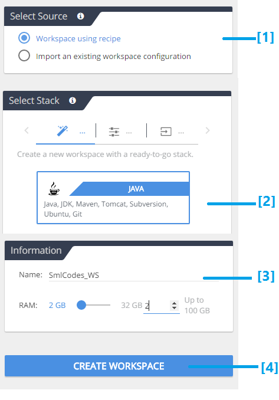
 
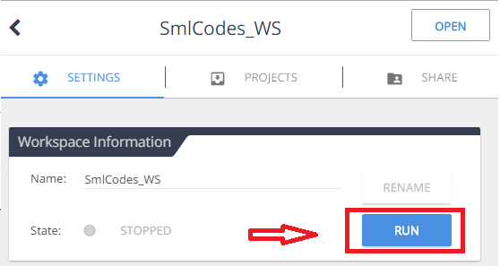

Click RUN

**5.By Default it was in STOP state. Click RUN button to Start working with
workspace**

Workspace is running

**6.Workspace is running. Now we can create projects on this workspace**

## **3.Create Java Project in Codenvy**

We can create project in two ways

1.  **create project using Wizrd**

2.  **create project using IDE**

**1.Create project using Wizard**

Go to Dashboard <https://beta.codenvy.com/dashboard/#/>

1. go to **Workspaces**

2. Choose **Projects Tab**
 

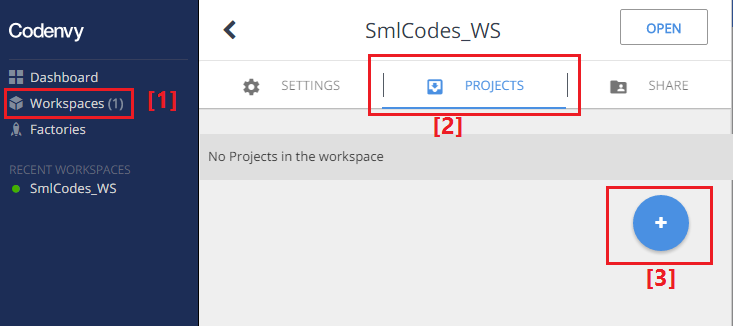

create new Project 

3.**Click on +Button to create new Project**

4.**Follow below steps to create Java Project**

1.  Select Source *→ New*

2.  Select Stack *→ Java*

3.  Select Template →*for now it is Console*

4.  Project meta *→ Project Name, and description*

5.  Create Project → It will create project[caption id="attachment_164"
    align="aligncenter" width="904"]

    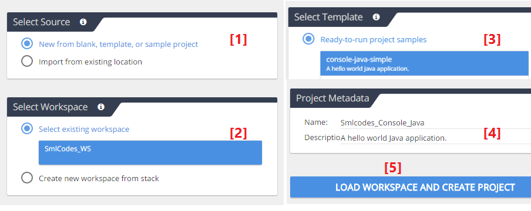

    create Java Project

It will create and opens the java project.

**2.Create project using IDE**

1.go to workspaces <https://beta.codenvy.com/dashboard/#/workspaces>

 

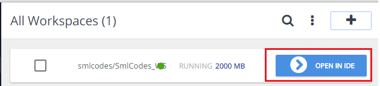

Create project using IDE[/caption]

2.Click on **OpenIDE. It will Opens the IDE**

3.Go to **Top Menu → workspace → Create Project → Java → Java → Create**

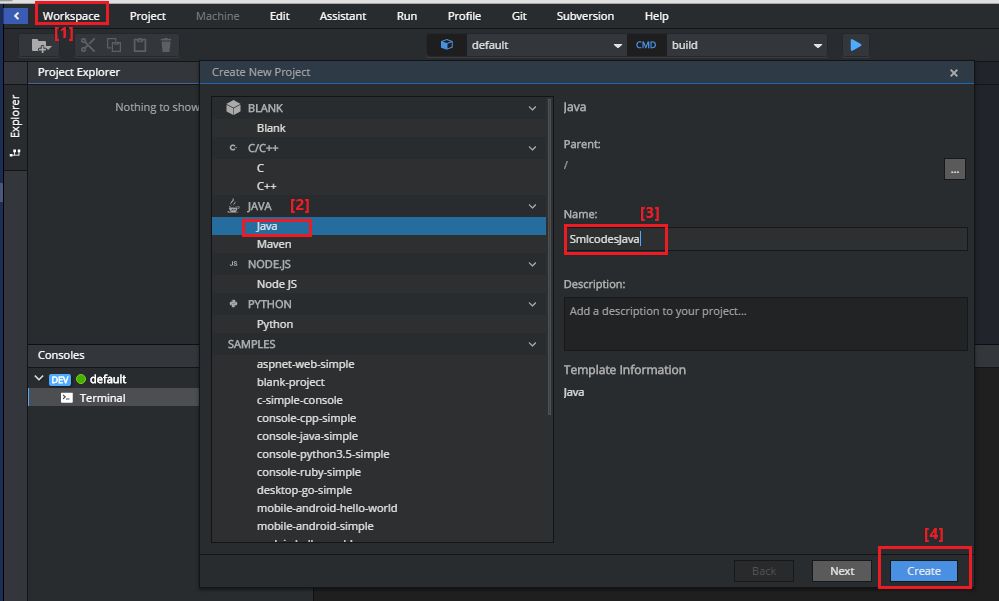

**4.After that it will opens the created project as below**

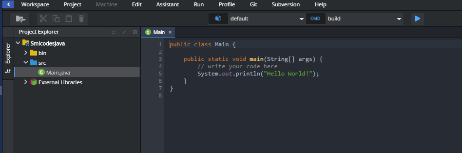

**4.Execute Java Program in Codenvy**

In above topic we successfully created Java Project. By default it will give
**Main.java**

before execute any java file in CodeNvy we must configure our run time
environment.

### **Steps to Configure Java Environment in CodeNvy**

1.Open IDE and open Java program

2.On the top goto **CMD → Edit Commands**

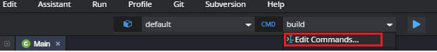

3.To **configure Java Environment** follow below steps

1.  Expand **Java[+]**

2.  Add new Environment Name **JAVA_RUNTIME**

3.  **Choose Main Class**

4.  **Save** it!

    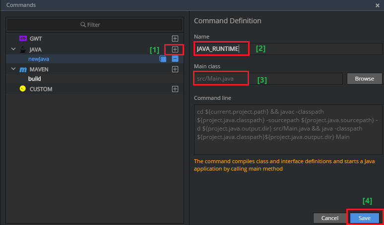

4.To RUN the Program **CMD → JAVA_RUNTIME → [>] Run button**

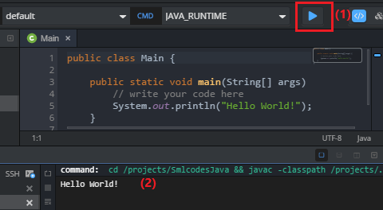

5.In the same way we **can configure Maven Environment** as below

**CMD → Edit Commands → Maven → give details → Save**

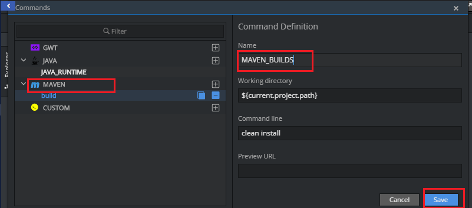

### **5.Create Maven Project in Codenvy**

**Create Maven project using Wizard**

**1.Click on create project**

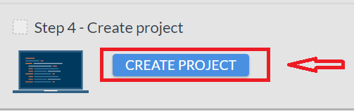

2.Choose **Java → Maven Project, provide project details → create Project**

3.To Start IDE, go to **Projects** → **Select project**→ **Open IDE**

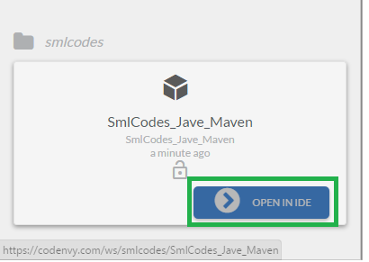

4.It will open the Dashboard as below .

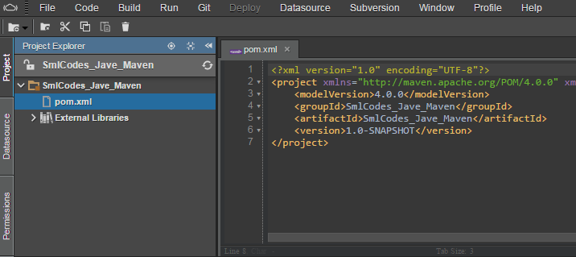

**5.Run Maven Build** to create java folder structure. For doing this go to

**[1].Top →CMD→ Maven → Build** then click on

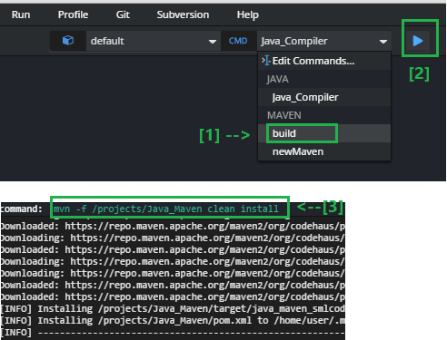

**[2].RUN button**

**References**

<https://codenvy.readme.io/>

<https://codenvy.com/>
