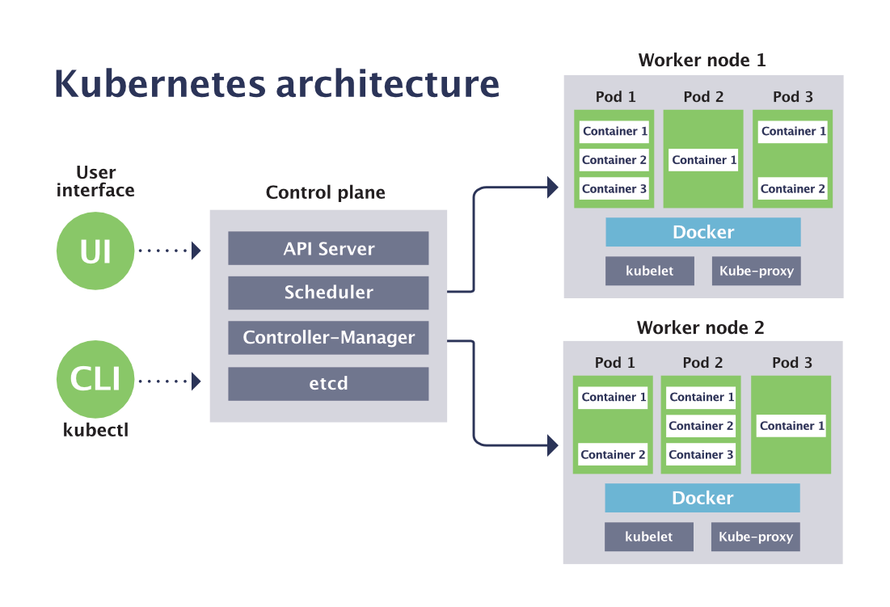

Introduction
============

Kubernetes is an open-source container management (orchestration) tool. It’s
container management responsibilities include container deployment, scaling &
descaling of containers & container load balancing.

-   Kubernetes is an open-source system for automating deployment, scaling, and
    management of containerized applications.

-   Kubernetes is originally developed by Google; it is open sourced since its
    launch and managed by a large community of contributors

-   Kubernetes (commonly referred to as K8s) is an orchestration engine for
    container technologies such as Docker and rkt that is taking over the DevOps
    scene in the last couple of years. It is already available on Azure and
    Google Cloud as a managed service.

-   Kubernetes can speed up the development process by making easy, automated
    deployments, updates (rolling-update) and by managing our apps and services
    with almost zero downtime.

-   It also provides self-healing. Kubernetes can detect and restart services
    when a process crashes inside the container.

###### Before Kubernetes

before containers came into existence, the developers and the testers always had
a tiff between them. This usually, happened because what worked on the dev side,
would not work on the testing side. Both of them existed in different
environments. Now, to avoid such scenarios containers were introduced so that
both the Developers and Testers were on the same page.

Handling a large number of containers all together was also a problem. Sometimes
while running containers, on the product side, few issues were raised, which
were not present at the development stage. This kind of scenarios introduced the
Container Orchestration System. 

**Challenges Without Container Orchestration**

 


###### Why Kubernetes

If your application is in Container form, then we won’t use only 1 or 2
containers in Prod. But rather, **10’s or 100’s** of containers for load
balancing the traffic and ensuring high availability.

Keep in mind that, as the traffic increases, they even have to scale up the
number of containers to service the ‘n’ no of requests that come in every
second. And, they have to also scale down the containers when the demand is
less. 

That is why, the need for container management tools is imminent. Both **Docker
Swarm** and **Kubernetes** are popular tools for Container management and
orchestration.

Features
--------


**1. Automatic Binpacking**

Kubernetes automatically packages your application and schedules the containers
based on their requirements and available resources while not sacrificing
availability. To ensure complete utilization and save unused resources,
Kubernetes balances between critical and best-effort workloads.

**2. Service Discovery & Load balancing**

With Kubernetes, there is no need to worry about networking and communication
because Kubernetes will automatically assign IP addresses to containers and a
single DNS name for a set of containers, that can load-balance traffic inside
the cluster. 

**3. Storage Orchestration**

With Kubernetes, you can mount the storage system of your choice. You can either
opt for local storage, or choose a public cloud provider such as GCP or AWS, or
perhaps use a shared network storage system such as NFS, iSCSI, etc.

**4. Self-Healing**

Personally, this is my favorite feature. Kubernetes can automatically restart
containers that fail during execution and kills those containers that don’t
respond to user-defined health checks. But if nodes itself die, then it replaces
and reschedules those failed containers on other available nodes.

**5. Secret & Configuration Management**

Kubernetes can help you deploy and update secrets and application configuration
without rebuilding your image and without exposing secrets in your stack
configuration.

**6. Batch Execution **

In addition to managing services, Kubernetes can also manage your batch and CI
workloads, thus replacing containers that fail, if desired.

**7. Horizontal Scaling**

Kubernetes needs only 1 command to scale up the containers, or to scale them
down when using the CLI. Else, scaling can also be done via the Dashboard
(kubernetes UI).

**8. Automatic Rollbacks & Rollouts**

Kubernetes progressively rolls out changes and updates to your application or
its configuration, by ensuring that not all instances are worked at the same
instance. Even if something goes wrong, Kubernetes will rollback the change for
you.

Architecture 
-------------


Kubernetes Architecture has the 3 main components:

-   Master nodes

-   Worker/Slave nodes

-   Distributed key-value store(etcd.)


###### Kubernetes Cluster


Kubernetes Cluster is primarily made up of following components

-   Master:

    -   Kube API Server

    -   Control Plane (kube-scheduler + kube-controller-manager +
        Cloud-controller Manager)

    -   Etcd

-   Node:

    -   Kubelet

    -   Kube-proxy

    -   Container Runtime

-   Addons:

    -   DNS

    -   WebUI

    -   Container Resource Monitoring

    -   Cluster Level Logging

###### Master Node

It is the entry point for all administrative tasks which is responsible for
managing the Kubernetes cluster. There can be more than one master node. If more
than one master node, one master node acts as a main master node other node will
just follows.

-   The main machine that controls the nodes

-   Main entry point for all administrative tasks

-   It handles the orchestration of the worker nodes


**API server:** 

-   Performs all the administrative tasks through the API server within the
    master node.

-   In this REST commands are sent to the API server which validates and
    processes the requests.

-   After requesting, the resulting state of the cluster is stored in the
    distributed key-value store.

**Scheduler:**

-   The scheduler schedules the tasks to slave nodes. It stores the resource
    usage information for each slave node.

-   It schedules the work in the form of Pods and Services.

**Controller manager**

-   Basically, a controller watches the desired state of the objects it
    manages and watches their current state through the API server.

-   If the current state of the objects it manages does not meet the desired
    state, then the control loop takes corrective steps to make sure that the
    current state is the same as the desired state

**ETCD**

-   etcd is a distributed key-value store which stores the cluster state.

-   It can be part of the Kubernetes Master, or, it can be configured
    externally.

-   it is also used to store configuration details such as subnets, ConfigMaps,
    Secrets, etc.

###### Worker Node

It is a physical server or you can say a VM which runs the applications using
Pods (**a pod scheduling unit**) which is controlled by the master node. On a
physical server (worker/slave node), pods are scheduled. For
accessing the applications from the external world, we connect to nodes. 

-   It is a worker machine in Kubernetes (used to be known as minion)

-   This machine performs the requested tasks. Each Node is controlled by the
    Master Node

-   Runs containers inside pods

-   This is where the Docker engine runs and takes care of downloading images
    and starting containers


**Container runtime: **

-   To run and manage a container’s lifecycle, we need a **container
    runtime **on the worker node. 

-   Sometimes, Docker is also referred to as a container runtime, but to be
    precise, Docker is a platform which uses **containers **as a container
    runtime. 

**Kubelet: **

-   It is an agent which communicates with the Master node and executes on nodes
    or the worker nodes. It gets the Pod specifications through the API server
    and executes the containers associated with the Pod and ensures that the
    containers described in those Pod are running and healthy.

**Kube-proxy: **

-   Kube-proxy runs on each node to deal with individual host sub-netting and
    ensure that the services are available to external parties.

-   It serves as a network proxy and a load balancer for a service on a single
    worker node and manages the network routing for TCP and UDP packets.

-   It is the network proxy which runs on each worker node and listens to the
    API server for each Service endpoint creation/deletion.

-   For each Service endpoint, kube-proxy sets up the routes so that it can
    reach to it.

**Pods**

-   A pod is one or more containers that logically go together. Pods run on
    nodes. Pods run together as a logical unit. So they have the same shared
    content.

-   They all share the same IP address but can reach other Pods via localhost,
    as well as shared storage. Pods don’t need to all run on the same machine as
    containers can span more than one machine. One node can run multiple pods.

Kubernetes vs Docker Swarm
--------------------------

**Kubernetes** and **Docker Swarm** are leading container orchestration tools in
today’s market.


Use Case
--------

**Use Case: How Luminis Technologies used Kubernetes in production**

**Problem:** Luminis, a software technology company used AWS for deploying their
applications. For deploying the applications, it required custom scripts and
tools to automate which was not easy for teams other than operations.
Their small teams didn’t have the resources to learn all of the details about
the scripts and tools. 

**Main Issue:** There was no **unit-of-deployment** which created a gap between
the development and the operations teams. 

**Solution: **

**How did they Deploy in Kubernetes:**


They used a [blue-green
deployment](https://martinfowler.com/bliki/BlueGreenDeployment.html) mechanism
to reduce the complexity of handling multiple concurrent versions. (As there’s
always only one version of the application running in the background) 

In this, a component called “**Deployer**” that orchestrated the deployment was
created by their team by open sourcing their implementation under the Apache
License as part of the Amdatu umbrella project. This mechanism performed the
health checking on the pods before re-configuring the load balancer because they
wanted each component that was deployed to provide a health check.

**How did they Automate Deployments?**


With the **Deployer **in place, they were able to engage up deployments to a
build pipeline. After a successful build,  their build server pushed a new
Docker image to a registry on Docker Hub. Then the build server invoked
the **Deployer** to automatically deploy the new version to a test environment.
That same image was promoted to production by triggering the **Deployer** on the
production environment.

Use case -2
-----------

**Kubernetes Case-Study**

-   **Yahoo! JAPAN** is a web services provider headquartered in Sunnyvale,
    California. As the company aimed to virtualize the hardware, company started
    using **OpenStack** in 2012. Their internal environment changed very
    quickly. However, due to the progress of cloud and container technology, the
    company wanted the capability to launch services on various platforms.

-   **Problem:** How to create images for all required platforms from one
    application code, and deploy those images onto each platform?

-   For your better understanding, refer to the below image. When the code is
    changed at the code registry, then bare metal images, Docker containers, and
    VM images are created by continuous integration tools, pushed into the image
    registry, and then deployed to each infrastructure platform. 


-   Now, let us focus on container workflow to understand how they used
    Kubernetes as a deployment platform. Refer to the below image to sneak peek
    into platform architecture.


>   Solution of Case Study - Kubernetes Tutorial - Edureka

-   OpenStack instances are used, with Docker, Kubernetes, Calico, etcd on top
    of it to perform various operations like Container Networking, Container
    Registry, and so on.

**DevOps Training**

-   When you have a number of clusters, then it becomes hard to manage them
    right?

-   So, they just wanted to create a simple, base OpenStack cluster to provide
    the basic functionality needed for Kubernetes and make the OpenStack
    environment easier to manage.

-   By the combination of Image creation workflow and Kubernetes, they built the
    below toolchain which makes it easy from code push to deployment.


>   Solution of Case Study - Kubernetes Tutorial - Edureka

>     
>   This kind of toolchain made sure that all factors for production deployment
>   such as multi-tenancy, authentication, storage, networking, service
>   discovery were considered.

-   That’s how folks, **Yahoo! JAPAN** built an automation toolchain for
    “one-click” code deployment to Kubernetes running on OpenStack, with help
    from **Google** and **Solinea**.

Installation
------------


## Kuberneters Architecture 


**Kubernetes Master**


1. **kube-apiserver**: REST API endpoint to serve as the frontend for the Kubernetes control plane

2. **etcd**: Key value store for the cluster data (regarded as the single source of truth)
 
3. **kube-scheduler**: Watches new workloads/pods and assigns them to a node based on several scheduling factors (resource constraints, anti-affinity rules, data locality, etc.)
 
4. **kube-controller-manager:** Central controller that watches the node, replication set, endpoints (services), and service accounts.


  <br>


**Node Components**

Unlike Master components that usually run on a single node (unless High Availability Setup is explicitly stated), Node components run on every node.

1. **kubelet**: Agent running on the node to inspect the container health and report to the master as well as listening to new commands from the kube-apiserver

2. **kube-proxy**: Maintains the network rules

3. **container runtime**: Software for running the containers (e.g. Docker, rkt, runc)

 - `Node` single machine in your cluster
 
 - `Pods` Kubernetes doesn’t run containers directly; instead it wraps one or more containers into a higher-level structure called a pod. 
 
 - Master + Nodes = Kubernetes Cluster 
 
 In Simple,
  - We have a Cluster
  - Inside Cluster, we have POD
  - Inside POD, We have a Container
  - Running Cantainer called as a Service, which is accessed by hostname:port.
  
  
    

  <br>


## MiniKube Installation Windows 10
minikube is local Kubernetes, focusing on making it easy to learn and develop for Kubernetes.

All you need is Docker (or similarly compatible) container or a Virtual Machine environment, and Kubernetes is a single command away: `minikube start`

1. Download .exe from <a href="https://minikube.sigs.k8s.io/docs/start/" target="_blank">Here</a>


2. Open PowerShell as Administrator & Set Path by running below code
    ```powershell
    $oldpath=[Environment]::GetEnvironmentVariable("Path", [EnvironmentVariableTarget]::Machine)
    if($oldpath -notlike "*;C:\minikube*"){`
      [Environment]::SetEnvironmentVariable("Path", $oldpath+";C:\minikube", [EnvironmentVariableTarget]::Machine)`
    }
    ```

3. Start your cluster
    ```powershell
    minikube start --driver=hyperv
    ```
    
    If Any error Create Swith manually in Hyper-V Manager, <a href="https://stackoverflow.com/questions/62221215/minikube-hanging-on-creating-hyperv-vm" target="_blank">Follow Here</a>
    
    
    Run Below command  
    ```dos
    minikube start --vm-driver hyperv --hyperv-virtual-switch "MiniSwitch"
    ```

    
    
    
4. Install minikube Dashboard
    ```dockerfile
    minikube dashboard
    ```
    
    
    Open above URL in Browser
    
    

## Create Pod.yaml

A POD can have one or more containers

1.Create `pod.yaml` in Project Root
```yaml
apiVersion: v1
kind: Pod
metadata:
  name: pod1
  labels:
    app: java
spec:
  containers: 
    - name: pod1
      image: smlcodes/empapp:latest
```

  <br>


2.Check if any other PODS are running
```bash
kubectl get pods
No POD Resources are Running
```

  <br>


3.Now Create POD, using below cmd where `pod.yaml` resides
```yaml
kubectl create -f pod.yaml
```


Now if we see Kubernetes Dashboard, You will find POD with one Node there


  <br>

4.We have POD created, inside we have empapp container Running. To expose the application to outside world we need to do `kubectl expose -h`  
```bash
Syntax:
kubectl expose pod <POD_NAME> --name <EXPOSE_SERVICE_NAME> --port <PORT_NO> --type [ClusterIP/NodePort/LoadBalancer]
```

```dos
kubectl expose pod pod1 --name pod1srv --port 5001 --type  NodePort
```


  <br>
  
5.To access Application, we must know the IP/host where `pod1srv` service is Running. for that we use below one.

```dos
minikube service pod1srv
```


## ReplicationController 
Replication Controller is one of the key features of Kubernetes, which is responsible for managing the pod lifecycle. It is responsible for making sure that the specified number of pod replicas are running at any point of time. It is used in time when one wants to make sure that the specified number of pod or at least one pod is running. It has the capability to bring up or down the specified no of pod.

It is a best practice to use the replication controller to manage the pod life cycle rather than creating a pod again and again.

```go
apiVersion: v1
kind: ReplicationController --------------------------> 1
metadata:
   name: Tomcat-ReplicationController --------------------------> 2
spec:
   replicas: 3 ------------------------> 3
   template:
      metadata:
         name: Tomcat-ReplicationController
      labels:
         app: App
         component: neo4j
      spec:
         containers:
         - name: Tomcat- -----------------------> 4
         image: tomcat: 8.0
         ports:
            - containerPort: 7474 ------------------------> 5
```

#### Setup Details


-   **Kind**: ReplicationController → In the above code, we have defined the kind as replication controller which tells the kubectl that the yaml file is going to be used for creating the replication controller.

-   **name**: Tomcat-ReplicationController → This helps in identifying the name with which the replication controller will be created. If we run the kubctl, get rc < Tomcat-ReplicationController > it will show the replication controller details.

-   **replicas**: 3 → This helps the replication controller to understand that it needs to maintain three replicas of a pod at any point of time in the pod lifecycle.

-   **name**: Tomcat → In the spec section, we have defined the name as tomcat which will tell the replication controller that the container present inside the pods is tomcat.

-   **containerPort**: 7474 → It helps in making sure that all the nodes in the cluster where the pod is running the container inside the pod will be exposed on the same port 7474.


## ReplicationSet

Replica Set ensures how many replica of pod should be running. It can be considered as a replacement of replication controller. The key difference between the replica set and the replication controller is, the replication controller only supports equality-based selector whereas the replica set supports set-based selector.

```go
apiVersion: extensions/v1beta1 --------------------->1
kind: ReplicaSet --------------------------> 2
metadata:
   name: Tomcat-ReplicaSet
spec:
   replicas: 3
   selector:
      matchLables:
         tier: Backend ------------------> 3
      matchExpression:
{ key: tier, operation: In, values: [Backend]} --------------> 4
template:
   metadata:
      lables:
         app: Tomcat-ReplicaSet
         tier: Backend
      labels:
         app: App
         component: neo4j
   spec:
      containers:
      - name: Tomcat
      image: tomcat: 8.0
      ports:
      - containerPort: 7474
```


#### Setup Details


-   `apiVersion`: extensions/v1beta1 → In the above code, the API version is the advanced beta version of Kubernetes which supports the concept of replica set.

-   `kind`: ReplicaSet → We have defined the kind as the replica set which helps kubectl to understand that the file is used to create a replica set.

-   `tier`: Backend → We have defined the label tier as backend which creates a matching selector.

-   `{key: tier, operation: In, values: [Backend]}`  → This will help matchExpression to understand the matching condition we have defined and in the operation which is used by matchlabel to find details.

Run the above file using `kubectl` and create the backend replica set with the provided definition in the `yaml` file.


<br>


<br>


# Kubernetes - Commands 


### Listing Resources

To list one or more pods, replication controllers, services, or daemon sets, use the `kubectl get` command.

Generate a plain-text list of all namespaces:

```
kubectl get namespaces
```


<br>


Generate a plain-text list of all pods:

```
kubectl get pods
```


<br>


Generate a detailed plain-text list of all pods, containing information such as node name:

```
kubectl get pods -o wide
```


<br>


Generate a list of all pods running on a particular node server:

```
kubectl get pods --field-selector=spec.nodeName=[server-name]
```


<br>


List a specific replication controller in plain-text:

```
kubectl get replicationcontroller [replication-controller-name]
```


<br>


Generate a plain-text list of all replication controllers and services:

```
kubectl get replicationcontroller,services
```


<br>


Generate a plain-text list of all [daemon sets](https://phoenixnap.com/kb/kubernetes-daemonset):

```
kubectl get daemonset
```


<br>


<br>


### Creating a Resource

Create a resource such as a service, a deployment, a job, or a namespace using the `kubectl create` command.

For example, to create a new namespace, type:

```
kubectl create namespace [namespace-name]
```


<br>


Create a resource from a JSON or [YAML file](https://phoenixnap.com/blog/what-is-yaml-with-examples):

```
kubectl create --f [filename]
```


<br>


<br>


### Applying and Updating a Resource

To apply or update a resource use the `kubectl apply` command. The source in this operation can be either a file or the standard input (stdin).

Create a new service with the definition contained in [service-name].yaml:

```
kubectl apply -f [service-name].yaml
```


<br>


Create a new replication controller with the definition contained in [controller-name].yaml:

```
kubectl apply -f [controller-name].yaml
```


<br>


Create the objects defined in any .yaml, .yml, or .json file in a directory:

```
kubectl apply -f [directory-name]
```


<br>


To update a resource by editing it in a text editor, use `kubectl edit`. This command is a combination of the `kubectl get` and `kubectl apply` commands.

For example, to edit a service, type:

```
kubectl edit svc/[service-name]
```


<br>


This command opens the file in your default editor. To choose another editor, specify it in front of the command:

```
KUBE_EDITOR="[editor-name]" kubectl edit svc/[service-name]
```


<br>


<br>


### Displaying the State of Resources

To display the state of any number of resources in detail, use the `kubectl describe` command. By default, the output also lists uninitialized resources.

View details about a particular node:

```
kubectl describe nodes [node-name]
```


<br>


View details about a particular pod:

```
kubectl describe pods [pod-name]
```


<br>


Display details about a pod whose name and type are listed in pod.json:

```
Kubectl describe --f pod.json
```


<br>


See details about all pods managed by a specific replication controller:

```
kubectl describe pods [replication-controller-name]
```


<br>


Show details about all pods:

```
kubectl describe pods
```


<br>


<br>


### Deleting Resources

To remove resources from a file or stdin, use the `kubectl delete` command.


<br>


Remove a pod using the name and type listed in pod.yaml:

```
kubectl delete -f pod.yaml
```


<br>


Remove all pods and services with a specific label:

```
kubectl delete pods,services -l [label-key]=[label-value]
```


<br>


Remove all pods (the command includes uninitialized pods as well):

```
kubectl delete pods --all
```


<br>


<br>


### Executing a Command

Use `kubectl exec` to issue commands to a container or to open a shell in a container.


<br>


Receive output from a command run on the first container in a pod:

```
kubectl exec [pod-name] -- [command]
```


<br>


Get output from a command run on a specific container in a pod:

```
kubectl exec [pod-name] -c [container-name] -- [command]
```


<br>


Run `/bin/bash` from a specific pod. The received output comes from the first container:

```
kubectl exec -ti [pod-name] -- /bin/bash
```


<br>


<br>


### Modifying kubeconfig Files

The `kubectl config` command lets you view and modify kubeconfig files. This command is usually followed by another sub-command.


<br>


Display the current context:

```
kubectl config current-context
```


<br>


Set a cluster entry in kubeconfig:

```
kubectl config set-cluster [cluster-name] --server=[server-name]
```


<br>


Unset an entry in kubeconfig:

```
kubectl config unset [property-name]
```


<br>


<br>


### Printing Container Logs

To print logs from containers in a pod, use the `kubectl logs` command.


<br>


The syntax for printing logs is:

```
kubectl logs [pod-name]
```


<br>


To stream logs from a pod, use:

```
kubectl logs -f [pod-name]
```


<br>


<br>


Short Names for Resource Types
------------------------------

Some of the kubectl commands listed above may seem unwieldy due to their length. For this reason the names of common kubectl resource types also have shorter versions.


<br>


For example, consider the command mentioned above:

```
kubectl create namespace [namespace-name]
```


<br>


You can also write this command as:

```
kubectl create ns [namespace-name]
```


<br>


Here is the full list of kubectl short names:

| Short Name | Long Name |
| `csr` | `certificatesigningrequests` |
| `cs` | `componentstatuses` |
| `cm` | `configmaps` |
| `ds` | `daemonsets` |
| `deploy` | `deployments` |
| `ep` | `endpoints` |
| `ev` | `events` |
| `hpa` | `horizontalpodautoscalers` |
| `ing` | `ingresses` |
| `limits` | `limitranges` |
| `ns` | `namespaces` |
| `no` | `nodes` |
| `pvc` | `persistentvolumeclaims` |
| `pv` | `persistentvolumes` |
| `po` | `pods` |
| `pdb` | `poddisruptionbudgets` |
| `psp` | `podsecuritypolicies` |
| `rs` | `replicasets` |
| `rc` | `replicationcontrollers` |
| `quota` | `resourcequotas` |
| `sa` | `serviceaccounts` |
| `svc` | `services` |


<a href="https://phoenixnap.com/kb/wp-content/uploads/2021/06/kubectl-commands-cheat-sheet-by-PhoenixNAP.pdf" target="_blank">Download Cheetsheet </a>


Ref.
====

<http://dockerlabs.collabnix.com/>

<https://collabnix.github.io/kubelabs/>
