Ken Thompson and Dennis Ritchie of Bell Laboratories developed the UNIX
operating system in 1969. It was later rewritten in C.

A Linux system is divided into three main parts:

-   **Hardware** - This includes all the hardware, memory, CPU, disks, etc.

-   **Kernel** - kernel is the core of the operating system. It manages the
    hardware and tells it how to interact with the system.

-   **User Space** - This is where users like yourself will be directly
    interacting with the system.


## 1. Linux Distributions

Operating systems like Microsoft combine each bit of codes internally and
release it as a single package. You have to choose from one of the version they
offer (Win98, XP, Win 7, Win 8, Win 10 etc.)

Linux is different, **Different parts of Linux (kernel, shell utilities, X
server, system environment, graphical programs, etc.) are developed by different
organizations**. But it’s not an easy task to assemble the parts correctly. From
here on distribution (also called as **distros**) comes into the picture.

**Distros** will assemble all these parts for us and give us a compiled
operating system of Linux to install and use.

| **Distribution** | **Pros**                                                                                                                       | **Cons**                                                                                                                                                |
|------------------|--------------------------------------------------------------------------------------------------------------------------------|---------------------------------------------------------------------------------------------------------------------------------------------------------|
| **RHEL& CentOS** | Very stable and reliable; very well supported; used almost everywhere; very traditional layout and management approach         | Very long release cycle; packages will be older and generally more difficult to bring to current if required                                            |
| **Fedora**       | Quite cutting-edge – sometimes bleeding-edge; lots of supported software with recent releases                                  | Can be less than stable due to fast-paced package and release updates; generally thought to be Red Hat’s testing distribution                           |
| **Ubuntu**       | Solid release cycle based on LTS (Long Term Support) and intermediate releases; user friendly, with lots of “helper" commands  | Tends to move quickly and packages can be less stable than others; has unique conventions that don’t translate to other distributions                   |
| **Debian**       | Very stable and reliable; wide variety of support packages; all-volunteer maintainers; supports large variety of architectures | Very conservative; release cycle can be slow                                                                                                            |
| **openSUSE**     | Stable, solid distribution; plenty of support packages; has sys admin tools such as YaST                                       | Has been stunted by Novell’s acquisition and dealings with Microsoft that assume rights over portions of Linux; has unique sys admin tools such as YaST |

## 2. Linux Features

**Multiuser capability**: Multiple users can access the same system resources
like memory, hard disk, etc. However, **they have to use different terminals to
operate.**

**Multitasking**: More than one task can be performed simultaneously by dividing
the CPU time intelligently.

**Portability:** it supports different types of hardware.

**Security:** It provides security in three ways namely **authenticating** (by
assigning password and login ID), **authorization** (by assigning permission to
read, write and execute) and encryption (converts file into an unreadable
format).

**Application support**: It has its own software repository from where users can
download and install many applications.

**File System:** Provides hierarchical file system in which files and
directories are arranged.

**Open Source:** Linux code is freely available to all and is a community based
development project.

## 3. Unix Vs Linux

Some people think UNIX and Linux are same, but that is not true. Many operating
systems were developed to be like UNIX but none of them got the popularity as
Linux.

Linux is the clone of UNIX. It has several features similar to UNIX, still have
some key differences. Before Linux and Windows, UNIX dominated computer world.

| **Comparison**               | **Linux**                                                                                                                                                     | **Unix**                                                                                                        |
|------------------------------|---------------------------------------------------------------------------------------------------------------------------------------------------------------|-----------------------------------------------------------------------------------------------------------------|
| Definition                   | It is an open-source operating system, which is *freely available to everyone*.                                                                               | It is an operating system, which *can be only used by its copyrighters*.                                        |
| Examples                     | Ubuntu, Redhat, Fedora, etc.                                                                                                                                  | IBM AIX, HP-UX and Sun Solaris.                                                                                 |
| Users                        | Anyone can use Linux like home user, developer or a student.                                                                                                  | It was developed mainly for servers, workstations and mainframes.                                               |
| Usage                        | Used everywhere from servers, PC, smartphones, tablets to supercomputers.                                                                                     | used in servers, workstations& PCs.                                                                             |
| Cost                         | Linux is freely distributed, downloaded.                                                                                                                      | Unix copyright vendors decide different costs for their respective Unix OS’s                                    |
| Manufacturer                 | The community of developers from different parts of the world develops Linux kernel. Although the father of Linux, Linus Torvalds oversees things.            | Unix has three distributions IBM AIX, HP-UX and Sun Solaris. Apple also uses Unix to make OSX operating system. |
| Operating system             | Linux is just the kernel.                                                                                                                                     | Unix is a complete package of Operating system.                                                                 |
| Security                     | It provides higher security. Linux has about 60-100 viruses listed till date.                                                                                 | Unix is also highly secured. It has about 85-120 viruses listed till date                                       |
| Error detection and solution | As Linux is open-source, whenever a user post any kind of threat, developers from all over the world start working on it. Hence, it provides faster solution. | In Unix, users have to wait for some time for the problem to be resolved.                                       |

## 4. Linux Commands

A command is an instruction given to our computer by us to do whatever we want.
In Mac OS, and Linux it is called terminal, whereas, in windows it is called
command prompt. Commands are always case sensitive.

Commands are executed by typing in at the command line followed by pressing
enter key

There are two types of shell commands

-   **Built-in shell commands:** They are part of a shell. Each shell has some
    built in commands.

-   **External/Linux commands:** Each external command is a separate executable
    program written in C or other programming languages

 

# 2.Linux File System


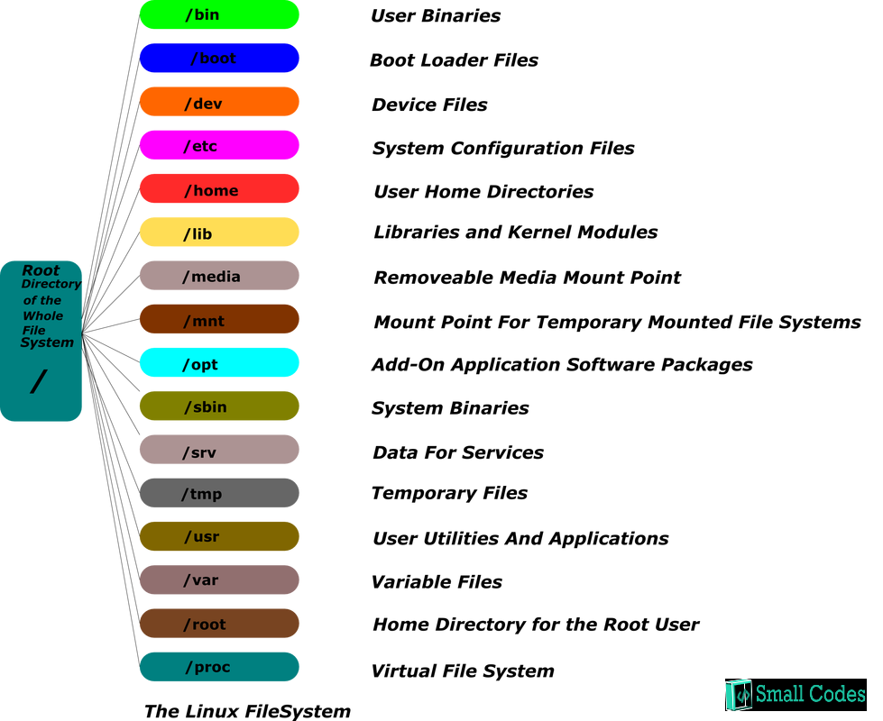

All the directories in the Linux system comes under the root directory which is
represented by a **forward** slash **(/)**

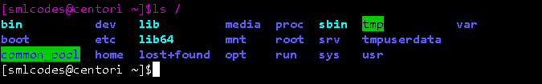

| **Command** | **Full Form**             | **Description**                                                                                                         |
|-------------|---------------------------|-------------------------------------------------------------------------------------------------------------------------|
| **pwd**     | Present Working Directory | Displays the current working location or directory of the user complete path starting with /. It is a built-in command. |
| **cd**      | Change Directory          | It is used to change to the directory you want to work from the present directory.                                      |
| **ls**      | List                      | The ls command is used to show the list of a folder. It will list out all the files in the directed folder.             |
| **mkdir**   | Make Directory            | With mkdir command, you can create your own directory.                                                                  |
| **rmdir**   | Remove Directory          | The rmdir command is used to remove a directory from your system.                                                       |

###### 1. pwd Example

Linux pwd (print working directory) command displays your location currently you
are working on. It will give the whole path starting from the root ending to the
directory
```dos
[smlcodes@centori ~]$pwd
/home/smlcodes
```


###### 2. cd Example

The "cd" stands for 'change directory' and this command is used to change the
current directory i.e.; the directory in which the user is currently working.
```bash
[smlcodes@centori ~]$cd java/                                                    
[smlcodes@centori java]$pwd                                                      
/home/smlcodes/java                                                              
[smlcodes@centori java]$
```


**cd Options**

| **option**              | Description                                                                     |
|-------------------------|---------------------------------------------------------------------------------|
| **cd \~**               | Brings you to your home directory.                                              |
| **cd -**                | Brings you to your previous directory of the current directory.                 |
| **cd ..**               | Brings you to the parent directory of current directory.                        |
| **cd /**                | It takes you to the entire system's root directory.                             |
| **cd ../ ../dir1/dir2** | It will take you two directories up then move to dir1 and then finally to dir2. |

###### 3. ls Example

The ls is the list command in Linux. It will show the full list or content of
your directory.
```bash
[smlcodes@centori ~]$ls
java  json  jsp  spring
```


**Linux ls command options**

| **ls option**                  | **Description**                                                                                                                                                                                                         |
|--------------------------------|-------------------------------------------------------------------------------------------------------------------------------------------------------------------------------------------------------------------------|
| **ls -a**                      | list including the hidden files.                                                                                                                                                                                        |
| **ls -l**                      | It will show the list in a long list format.                                                                                                                                                                            |
| **ls -lh**                     | This command will show you the file sizes in human readable format. Size of the file is very difficult to read when displayed in terms of byte. The (ls -lh)command will give you the data in terms of Mb, Gb, Tb, etc. |
| **ls -lhS**                    | If you want to display your files in descending order (highest at the top) according to their size, then you can use (ls -lhS) command.                                                                                 |
| **ls -l - -block-size=[SIZE]** | It is used to display the files in a specific size format. Here, in [SIZE] you can assign size according to your requirement.                                                                                           |
| **ls -d \*/**                  | It is used to display only sub directories.                                                                                                                                                                             |
| **ls -g or ls -lG**            | With this, you can exclude column of group information and owner.                                                                                                                                                       |
| **ls -n**                      | It is used to print group ID and owner ID instead of their names.                                                                                                                                                       |
| **ls --color=[VALUE]**         | This command is used to print list as colored or discolored.                                                                                                                                                            |
| **ls -li**                     | This command prints the index number if file in the first column.                                                                                                                                                       |
| **ls -p**                      | It is used to identify the directory easily by marking the directories with a slash (/) line sign.                                                                                                                      |
| **ls -r**                      | It is used to print the list in reverse order.                                                                                                                                                                          |
| **ls -R**                      | It will display the content of the sub-directories also.                                                                                                                                                                |
| **ls -lX**                     | It will group the files with same extensions together in the list.                                                                                                                                                      |
| **ls -lt**                     | It will sort the list by displaying recently modified filed at top.                                                                                                                                                     |
| **ls \~**                      | It gives the contents of home directory.                                                                                                                                                                                |
| **ls ../**                     | It give the contents of parent directory.                                                                                                                                                                               |
| **ls --version**               | It checks the version of ls command.                                                                                                                                                                                    |

###### 4. mkdir Example 

```bash
To make Single directory one by one
[smlcodes@centori ~]$mkdir java
[smlcodes@centori ~]$mkdir jsp
 [smlcodes@centori ~]$mkdir json

To make multiple directories
Syntax: mkdir <dir1> <dir3>…<dir-n>
[smlcodes@centori ~]$mkdir j1, j2
```


**mkdir Options**

| Options                 | Description                                 |
|-------------------------|---------------------------------------------|
| **mkdir -p, -parents**  | Add directory including its sub directory.  |
| **mkdir -v, -verbose**  | Print a message for each created directory. |
| **mkdir -m -mode=MODE** | Set access privilege.                       |

###### 5.rmdir Example

Delete a single file
```bash
[smlcodes@centori ~]$rmdir json/                                                 
[smlcodes@centori ~]$ls                                                          
java  jsp  spring
```

rmdir –p : delete a directory including its sub-directories

# 3.Linux Files

In Linux, everything is consider as a file, not only text files, images but also
system partitions are also treated as files.

We have following types of files in Linux

1.  **Regular files (-):** It contain programs, executable files and text files.

2.  **Directory files (d):** It is shown in blue color. It contain list of
    files.

3.  **Special files**

    -   **Block file (b)**

    -   **Character device file (c)**

    -   **Named pipe file (p)**

    -   **Symbolic link file (l)**

    -   **Socket file (s)**

To work with files, we have following commands

| **Command** | **Description**              |
|-------------|------------------------------|
| **file**    | Determines file type.        |
| **touch**   | Used to create a file.       |
| **rm**      | To remove a file.            |
| **cp**      | To copy a file.              |
| **mv**      | To rename or to move a file. |
| **rename**  | To rename file.              |

### 3.1 “file" command 

The **file** command is used to determine a file's type. The type printed will
usually contain one of the words **text** (ASCII), **executable** or **data.**
```bash
Syntax: file <filename>

Example
[smlcodes@centori ~]$file a.txt                                                  
a.txt: ASCII text
```


File command tell us the file type with the help of a magic file that contains
all the patterns to recognize a file type. Path of magic file is
/usr/share/file/magic. For more information, enter the command 'man 5 magic'.

#### Linux File Command Options

| **Option**                  | **Function**                                                           |
|-----------------------------|------------------------------------------------------------------------|
| **file \***                 | Used to list types of all the files.                                   |
| **file /directory name\*** | Used to list types of all the files from mentioned directory.          |
| **file [range]\***          | Lists files starting from the alphabet present within the given range. |

#### Examples

```bash
[smlcodes@centori files]$pwd
/home/smlcodes/files

[smlcodes@centori files]$file *
a.txt:       ASCII text
a.xtx:       ASCII text
b.txt:       ASCII text
img2.jpng:   ASCII text
img.png:     ASCII text
rarfile.rar: empty
special:     directory
zipfile.zip: empty

[smlcodes@centori files]$file /home/smlcodes/files/special/*
/home/smlcodes/files/special/s1.txt: empty
/home/smlcodes/files/special/s2.txt: empty

[smlcodes@centori files]$file [a-m]*
a.txt:     ASCII text
a.xtx:     ASCII text
b.txt:     ASCII text
img2.jpng: ASCII text
img.png:   ASCII text
```

### 3.2 “touch" command

The **touch** command is the easiest way to **create new, empty files**. It is
also used to **change the timestamps** (i.e., dates and times of existing files
and directories).
```bash
Syntax 
touch [option] file_name(s)

Example
[smlcodes@centori files]$touch 1.txt
```


To create multiple files just type all the file names with a single touch
command 
```bash
[smlcodes@centori files]$touch file1, file2, file3                               
[smlcodes@centori files]$ls
1.txt  a.xtx  file1,  file3      img.png      special
a.txt  b.txt  file2,  img2.jpng  rarfile.rar  zipfile.zip
```


#### touch Options

| **Option**   | **Full Form** | **Function**                                                 |
|--------------|---------------|--------------------------------------------------------------|
| **touch -a** | Access        | To change **file access and modification time**.             |
| **touch -m** | Modify        | It is used to change **only modify time of a file**.         |
| **touch -r** | Reference     | To update time of one file with reference to the other file. |
| **touch -t** | With Time     | To create a file by specifying the time.                     |
| **touch -c** | \-            | It does not create an empty file.                            |

#### Examples

**Touch –a** , to see the time stamp we use stat <filename> command
```bash
[smlcodes@centori files]$stat a.txt 
  File: ‘a.txt’
  Size: 105             Blocks: 8          IO Block: 4096   regular file
Device: 811h/2065d      Inode: 3736598     Links: 1
Access: (0664/-rw-rw-r--)  Uid: (79458/smlcodes)   Gid: (79459/smlcodes)
Context: guest_u:object_r:user_home_t:s0
Access: 2017-08-01 08:05:59.706000000 +0200
Modify: 2017-08-01 07:57:44.409000000 +0200
Change: 2017-08-01 07:57:44.414000000 +0200
 Birth: -

[smlcodes@centori files]$touch -a a.txt                                          
[smlcodes@centori files]$stat a.txt                                              
  File: ‘a.txt’
  Size: 105             Blocks: 8          IO Block: 4096   regular file
Device: 811h/2065d      Inode: 3736598     Links: 1
Access: (0664/-rw-rw-r--)  Uid: (79458/smlcodes)   Gid: (79459/smlcodes)
Context: guest_u:object_r:user_home_t:s0
Access: 2017-08-01 08:23:36.216000000 +0200
Modify: 2017-08-01 07:57:44.409000000 +0200
Change: 2017-08-01 08:23:36.216000000 +0200
 Birth: -
[smlcodes@centori files]$
```

### 3.3 “rm" (remove) command

The **rm** command removes (deletes) files or directories. The command line
doesn't have a recycle bin or trash unlike other GUI's to recover the files

**Syntax:**
```bash
rm <filename>
```


#### rm Options

| **Option**         | **Description**                             |
|--------------------|---------------------------------------------|
| **rm \*extension** | Used to delete files having same extension. |
| **rm -r or R**     | To delete a directory recursively.          |
| **rm -i**          | Remove a file interactively.                |
| **rm -rf**         | Remove a directory forcefully.              |

#### Example

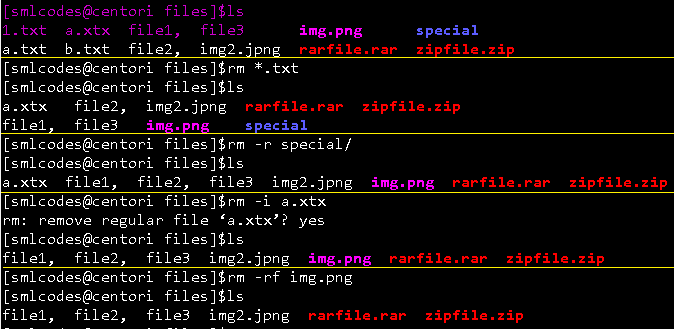

### 3.4 “cp" (copy) command

The **cp** command is used to make copies of files and directories

**Syntax**
```bash
cp [OPTION] <SOURCE PATH> <DESTINATION PATH>
```


#### cp Options

| **Option**                         | **Function**                                             |
|------------------------------------|----------------------------------------------------------|
| **cp -r**                          | To copy a directory along with its sub dirctories.       |
| **cp file1 file 2 directory name** | To copy multiple file or directories in a directory.     |
| **cp -backup**                     | To backup the existing file before over writing it.      |
| **cp -i**                          | Asks for confirmtion.                                    |
| **cp -l**                          | To create hard link file.                                |
| **cp -p**                          | Preserves attribute of a file.                           |
| **cp -u -v**                       | To make sure source file is newer then destination file. |

#### Examples
```bash
##### 1. cp <f1>,
[smlcodes@centori files]$pwd                                                     
/home/smlcodes/files                                                             
[smlcodes@centori files]$ls                                                      
a.txt  b.txt  folder1  folder2
[smlcodes@centori files]$cp a.txt 1.txt                                          
[smlcodes@centori files]$ls                                                      
1.txt  a.txt  b.txt  folder1  folder2


######## cp -r	To copy a directory along with its sub dirctories.
[smlcodes@centori ~]$cp -r files newfolder                                       
[smlcodes@centori ~]$ls                                                          
a.txt  files  j1,  j2  java  jsp  newfolder  spring
[smlcodes@centori ~]$cd newfolder/                                               
[smlcodes@centori newfolder]$ls                                                  
1.txt  a.txt  b.txt  folder1  folder2
```

### 3.5 “mv" (move) command

The mv command is used to move or rename files. **mv** renames
file *SOURCE* to *DEST*, or moves the *SOURCE* file (or files) to *DIRECTORY*.
```bash
**Syntax:**
mv [OPTION]... SOURCE... DIRECTORY
```


#### mv Option

| **Option**      | **Function**                                                 |
|-----------------|--------------------------------------------------------------|
| **mv -i**       | Asks for permission to over write.                           |
| **mv \***       | Move multiple files to a specific directory.                 |
| **mv --suffix** | Used to take backup before over writing.                     |
| **mv -u**       | Only move those files that doesn't exist.(replace with skip) |

#### Examples
```bash
[smlcodes@centori files]$ls
1.txt  a.txt  b.txt  folder1  folder2
[smlcodes@centori files]$mv 1.txt 2.txt
[smlcodes@centori files]$ls
2.txt  a.txt  b.txt  folder1  folder2

[smlcodes@centori files]$mv -i 2.txt 3.txt
[smlcodes@centori files]$ls
2.txt  a.txt  b.txt  folder1  folder2

[smlcodes@centori files]$mv * /folder2
[smlcodes@centori files]$ls
2.txt  a.txt  b.txt  folder1  folder2
```

### 3.6 “rename" command

When you want to rename a large group of files at once then it will be difficult
to rename it with 'mv' command. In these cases, it is adviced to use 'rename'
command. It can convert upper case files to lower case files and vice versa and
cn overwrite files using perl expressions
```bash
Syntax:
rename 's/old-name/new-name/'
```


#### rename options

| **Option**                        | **Function**                              |
|-----------------------------------|-------------------------------------------|
| **rename -n**                     | Check changes before running the command. |
| **rename -v**                     | Print the output.                         |
| **rename (a-z)(A-Z)/ (A-Z)(a-z)** | Convert into upper case/lower case.       |
| **rename -f**                     | Forcefully over write existing files.     |

### 3.7 “man" (manual) command

  We can see the **manuals** for a command with the **man** command. On Linux
and other Unix-like operating systems, man is the interface used to view the
system's reference manuals
```bash
Syntax:
man [option(s)] keyword(s)
```


#### man Options

| **Commands**          | **Function**                                                    |
|-----------------------|-----------------------------------------------------------------|
| **man -aw**           | List all available sections of a command.                       |
| **man -a**            | To view all man pages of a command.                             |
| **sman -k (apropos)** | Shows a list of results in man page containing a keyword match. |
| **-f, whatis**        | It displays description from manual page if available.          |
| **whereis**           | Used to determine location of a man page                        |

#### Example

>man ls

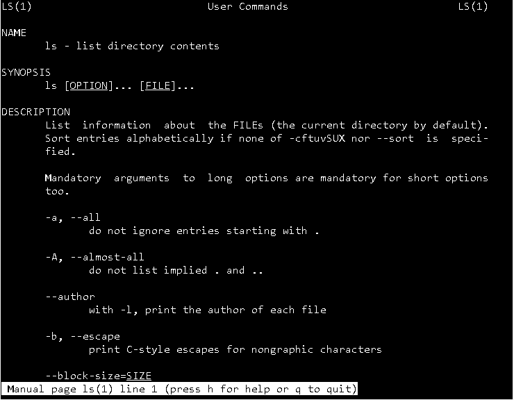

# 4.Linux File Content

There are many commands which help to look at the contents of a file. Below are
cery frequently used commands on

| **Commands** | **Function**                                                                |
|--------------|-----------------------------------------------------------------------------|
| **head**     | It displays the beginning of a file.                                        |
| **tail**     | It displays the last last part of a file.                                   |
| **cat**      | This command is versatile and multi worker.                                 |
| **tac**      | Opposite of cat.                                                            |
| **more**     | Command line diaplays contents in pager form that is either in more format. |
| **less**     | Command line diaplays contents in pager form that is either in less format. |

### 1. “head" command

The 'head' command displays the starting content of a file. **By default, it
displays starting 10 lines of any file.**

**Syntax:**

head <file name>

| **Option**                    | **Description**                           |
|-------------------------------|-------------------------------------------|
| **head <f1><f2>..<fn>** | Displays First 10 lines of multiple files |
| **head -n**                   | Displays specified number of lines..      |
| **head -c**                   | Counts the number of bytes of a file.     |

#### Examples
```bash
[smlcodes@centori ~]$head file.txt                                              
lin1 : sajjkldlkasjldasjlkdjlasdjasdjlas                                        
line2:sajkdasjkhdhsakhdaskhdaskj                                                
lin3 :sajdilsajdjsajldjasdjasdjlkas                                              
l4:askdhashkdhasdhkasdjkasdhk                                                    
l5:askdasdjkashdhashdkaskhdasjk                                                  
l6:sadjkhsajkdhasjkdhashkdhkasjdh                                                
l7:92378472384789234782379842379472                                              
l8:asljkdaskduqwioeru23o4u2390erj2                                               
l9:dsakdasioduo7820983902908302                                                  
line10:pioaseioqwpieqipweipqwo 

[smlcodes@centori ~]$head -2 file.txt                                            
lin1 : sajjkldlkasjldasjlkdjlasdjasdjlas                                         
line2:sajkdasjkhdhsakhdaskhdaskj
```


### 2. “tail" command

The 'tail' command displays the last lines of a file. By default, it will also
display the last ten lines of a file

**Syntax:**
```bash
tail <file name>
```


| **Option**                    | **Description**                              |
|-------------------------------|----------------------------------------------|
| **tail <f1><f2>..<fn>** | Displays last 10 lines of multiple files     |
| **tail -n**                   | Displays specified number of lines from last |
| **tail -c**                   | Counts the number of bytes of a file.        |

#### Example
 ```bash
[smlcodes@centori ~]$tail file.txt                                               
line10:pioaseioqwpieqipweipqwo                                                   
lin11 : sajjkldlkasjldasjlkdjlasdjasdjlas                                        
line12:sajkdasjkhdhsakhdaskhdaskj                                                
 lin13 :sajdilsajdjsajldjasdjasdjlkas                                            
l14:askdhashkdhasdhkasdjkasdhk                                                   
l15:askdasdjkashdhashdkaskhdasjk                                                
l16:sadjkhsajkdhasjkdhashkdhkasjdh                                              
l17:92378472384789234782379842379472                                             
l18:asljkdaskduqwioeru23o4u2390erj2                                              
l19:dsakdasioduo7820983902908302                                                 
li20:sadjkasjkldlasjdlasjljl
```


### 3. “cat" (catenate) command

cat stands for "**catenate**." It reads data from files, and outputs their
contents. It is the simplest way to display the contents of a file at the
command line.

**cat** is one of the most commonly-used commands in Linux. It can be used to:

-   **Display text files**

-   **Copy text files into a new document**

-   **Append the contents of a text file to the end of another text file,
    combining them**

```bash
//Display text files
cat <fileName>
[smlcodes@centori ~]$cat java.txt 
In java we have follwing concepts
- Java Colelctions
-Java Swings
-Servlts
-JSP


//Copy text files into a new document
cat sends its output to stdout (standard output), which is usually the terminal screen. However, you can redirect this output to a file using the shell redirection symbol ">".
cat mytext.txt > newfile.txt
[smlcodes@centori ~]$cat java.txt>a.txt                                          
[smlcodes@centori ~]$cat a.txt
In java we have follwing concepts
- Java Colelctions
-Java Swings
-Servlts
-JSP

Similarly, you can catenate several files into your destination file. For instance:
cat mytext.txt mytext2.txt > newfile.txt


Append the contents of a text file to the end of another text file
Instead of overwriting another file, you can also append a source text file to another using the redirection operator ">>".
cat mytext.txt >> another-text-file.txt
[smlcodes@centori ~]$cat a.txt>>java.txt
[smlcodes@centori ~]$cat java.txt 
In java we have follwing concepts
- Java Colelctions
-Java Swings
-Servlts
-JSP
In java we have follwing concepts
- Java Colelctions
-Java Swings
-Servlts
-JSP
```


| **Option**                                         | **Function**                                        |
|----------------------------------------------------|-----------------------------------------------------|
| **cat > [fileName]**                              | To create a file.                                   |
| **cat [oldfile] > [newfile]**                     | To copy content from older to new file.             |
| **cat [file1 file2 and so on] > [new file name]** | To concatenate contents of multiple files into one. |
| **cat -n/cat -b [fileName]**                       | To display line numbers.                            |
| **cat -e [fileName]**                              | To display $ character at the end of each line.    |
| **cat [fileName] <<EOF**                         | Used as page end marker.                            |

### 4. “tac" command

The 'tac' command is the reverse of the 'cat' command. It is also known as 'cat'
backwards. It will display the file content in reverse order.
```bash
Syntax:
tac <filename>


[smlcodes@centori ~]$tac a.txt
-JSP
-Servlts
-Java Swings                                                                     
- Java Colelctions                                                               
In java we have follwing concepts
```


### 5. “more" command

'cat' command displays the file content. Same way 'more' command also displays
the content of a file. Only difference is that, in case of larger files, 'cat'
command output will scroll off your screen while 'more' command displays output
one screenful at a time.

Following keys are used in 'more' command to scroll the page:

-   **Enter** key : To scroll down page line by line.

-   **Space** bar : To go to next page.

-   ‘**B’** key : To go to the backward page.

-   **‘/**’ key : Lets you search the string.
```bash
•	‘/’ key	: Lets you search the string.
Syntax:
more <filename>

[smlcodes@centori ~]$more log.txt 
CAT(1)                           User Commands                          CAT(1)
NAME
       cat - concatenate files and print on the standard output

SYNOPSIS
       cat [OPTION]... [FILE]...

DESCRIPTION
       Concatenate FILE(s), or standard input, to standard output.

       -A, --show-all
              equivalent to -vET
       -b, --number-nonblank
              number nonempty output lines, overrides -n

       -e     equivalent to -vE

       -E, --show-ends
              display $ at end of each line

       -n, --number
              number all output lines

       -s, --squeeze-blank                                                       
              suppress repeated empty output lines                               

       -t     equivalent to -vT
--More--(32%)
```

### 6. “less" command

The 'less' command is same as 'more' command but include some more features.It
automatically adjust with the width and height of the teminal window, while
'more' command cuts the content as the width of the terminal window get shorter.

Syntax:
```bash
less <filename>
```


### 7."histrory"

It will gives the history of previously executed commands
```bash
[satya@centori \~]$history

1 dir

2 pwd

3 pwd

4 ls

5 mkdir java

6 mkdir jsp

7 mkdir spring

8 mkdir json


```


**clear** will clears the screen


# 5. Linux Pipes & Filters


Linux Filter commands accept input data from **stdin** (standard input) and
produce output on **stdout** (standard output). It transforms plain-text data
into a meaningful way and can be used with pipes to perform higher operations.

These filters are very small programs that are designed for a specific function
which can be used as building blocks.

###### Linux Filter Commands

1.  **cat**

2.  **cut**

3.  **grep**

4.  **comm**

5.  **tee**

6.  **tr**

7.  **uniq**

8.  **wc**

9.  **od**

10. **sort**

11. **gzip**

### 1.“cat" inside Pipes

When we use cat command inside pipes, it moves the stdin to stout.
```bash
Syntax:
cat <fileName> | cat or tac |  cat or tac |. . .

Example
[smlcodes@centori ~]$cat a.txt                                                   
In java we have follwing concepts                                                
- Java Colelctions                                                               
-Java Swings                                                                     
-Servlts                                                                         
-JSP               

##############Reverseing cat ##################
[smlcodes@centori ~]$cat a.txt|tac                                               
-JSP                                                                             
-Servlts                                                                         
-Java Swings                                                                     
- Java Colelctions                                     
 In java we have follwing concepts                                                

##############Printing ##################
[smlcodes@centori ~]$cat a.txt|tac|cat                           
-JSP                                                                             
-Servlts                                                                         
-Java Swings                                                                     
- Java Colelctions                                                               
In java we have follwing concepts                         

##############Reverseing cat ##################                       
[smlcodes@centori ~]$cat a.txt|tac|cat|tac                                       
In java we have follwing concepts                                                
- Java Colelctions                                                               
-Java Swings                                                                     
-Servlts                                                                         
-JSP                                                                             
[smlcodes@centori ~]$
```


### 2.“cut" inside Pipes

 'cut' command is used for selecting a specific column of a file.The coulmns can
be separated by a demiter like ‘ ’, ‘-’ , ‘,’(space, dash, comma) etc.
```bash
Syntax: (here column number staers from 1,2,3…)
cut -d(delimiter) -f(columnNumber) <fileName>

cut -d ' ' -f2 cri.txt
[smlcodes@centori ~]$cat cri.txt 
sachin-350
Gunguly-301
Yuvraj-267
Dravid-321
Dhoni-284
```


### 3."grep" command

**grep**, which stands for **"global regular expression print**," processes text
line by line and prints any lines which match a specified pattern.

**grep syntax**
```bash
grep [OPTIONS] PATTERN [FILE...]
```


#### Example: Check 3 in cri.txt file
```bash
grep 3 cri.txt
```
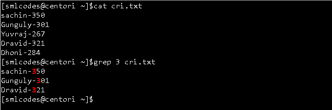

You can give above example in a single command by using pipe as below
```bash
$cat cri.txt |grep 3 cri.txt
```


#### grep Options

**grep -v**: The 'grep -v' command displays lines not matching to the specified
word.

[satya@centori \~]$cat cri.txt \|grep -v 3 cri.txt

Yuvraj-267

Dhoni-284

**grep -i**: command filters output in a case-insensitive way.

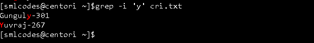


### 4. “comm" command  
The 'comm' command compares two files or streams. By default, 'comm' will always
display three columns. Both the files has to be in sorted order for 'comm'
command to be executed.

1.  First column indicates non-matching items of first file

2.  second column indicates non-matching items of second file

3.  third column indicates matching items of both the files.

    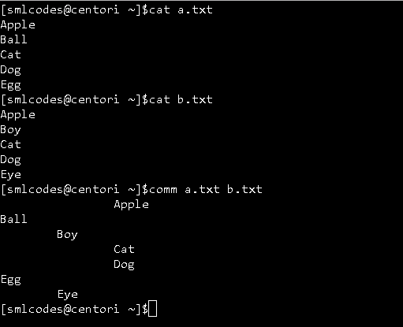


### 5."tee" Command  
The 'tee' command is similar to 'cat' command with only one difference. It puts
stdin on stdout and also put them into a file.

Syntax:
```bash
cat or tac <fileName> | tee <newFile> |  cat or tac |.....
```
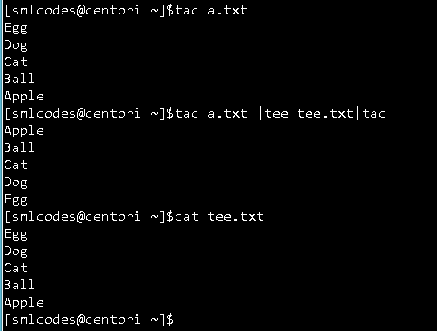

Here tee.txt is newly created file.


### 6. “tr" command  
The command 'tr' stands for **'translate'**. It is used to translate, like from
lowercase to uppercase and vice versa or new lines into spaces

**Syntax**
```bash
command | tr <'old'> <'new'>
```
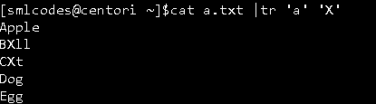


### 7."uniq" command  
With the help of uniq command you can form a sorted list in which every word
will occur only once

**Syntax:**
```bash
command <fileName> | uniq
```
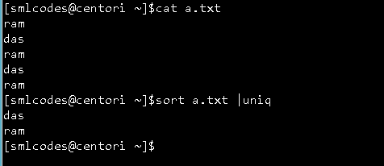

uniq –c : command will counts the number of occurences of a word.
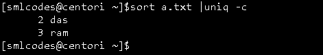


### 8. “wc" (Word Count) Command

**wc**, or "word count," prints a count of **newlines**, **words**,
and **bytes** for each input file.

-   Wc –l : for line counts

-   Wc –w : for word counts

-   Wc –c : for character counts

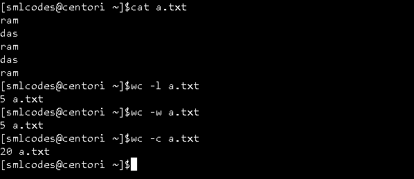


### 9. “od" (Octal dump) command

The 'od' term stands for octal dump. It displays content of a file in different
human-readable formats like hexadecimal, octal and ASCII characters.

**Syntax:**
```bash
od -b <fileName> (display files in octal format)
od -t x1 <fileName> (display files in hexadecimal bytes format)
od -c <fileName> (display files in ASCII (backslashed) character format)
```


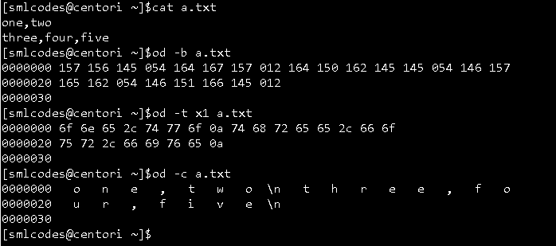

### 10. “sort" command

The 'sort' command sorts the file content in an alphabetical order.

**sort -k<columnNumber> <file>:** column number is used to sort a specific
column

**sort –n -k<columnNumber>:** Numarical Sorting with column

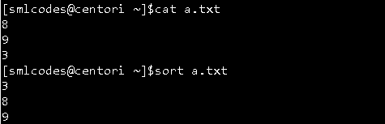


### 11. “gzip" command

Gzip (GNU zip) is a compressing tool, which is used to truncate the file size.
By default original file will be replaced by the compressed file ending with
extension (.gz).
```bash
gzip <file1> <file2> <file3>. . . 
gunzip <file1> <file2> <file3>. . .
```


# 6.Linux I/O Redirection

Sometimes we need output of a command result as input for another command.
```bash
Ex:
cat cri.txt |grep -v 3 cri.txt
```


This type of operations are known as I/O redirection.We can perform I/O redirect
to a **File** or a **Program (to another command)**


### I/O redirect to a File

We can use **Single bracket '>**'(overwrite) or **double bracket '>>'**
(append) can be used to redirect standard output

**Ovewrite (<):**  
Commands with a single bracket **'>' overwrite** existing file content.

-   **>** : standard output

-   **<** : standard input

-   **2>** : standard error

Note: Writing **'1>'** or **'>' **and **'0<'** or **'<'** is same thing. But
for stderr you have to write **'2>'**.

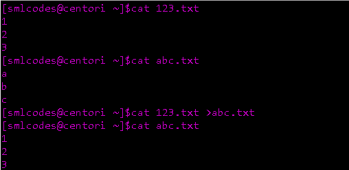

**Append(<<)**  
Commands with a double bracket **'>>' do not overwrite **the existing file
content.

-   **>>** - standard output

-   **<<** - standard input

-   **2>>**- standard error

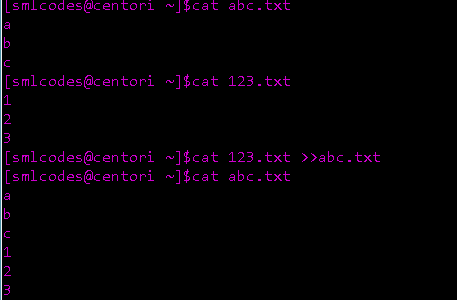


###### I/O Redirect to a Program  
**Pipe ’\|’** redirects a stream from one **program** to another. When pipe is
used to send standard output of one program to another program, first program's
data will not be displayed on the terminal, only the second program's data will
be displayed
```bash
ls *.txt | cat > txtFile
```


### I/O Redirection Types

The bash shell has three standard streams in I/O redirection:

-    `Standard input (stdin) :`  The stdin stream is numbered as stdin (0). The
    bash shell takes input from stdin. By default, keyboard is used as input.

-   `Standard output (stdout) :` The stdout stream is numbered as stdout (1).
    The bash shell sends output to stdout. Output goes to display.

-   `Standard error (stderr) :` The stderr stream is numbered as stderr (2).
    The bash shell sends error message to stderr. Error message goes to display


#### 1. Input Redirection

In input redirection, a file is made input to the command with the help of '<'
sign.

**Syntax: To give <file> as input to comamnd**
```bash
cat < <filename>
```
Here we are giving 123.txt file as input to cat comamnd

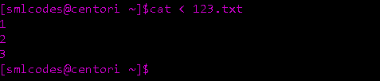


#### 2. Output Redirection
Output redirection is used to put output of one command into a file or into
another command.
```bash
echo Hello Smlcodes. > sml.txt
```


#### 3. Error Redirection  
Command '2>' redirects the error of an output.It helps us you to keep our
display less messy by redirecting error messages.
```bash
zcho hyii 2> /dev/null
```


# 7.Linux UNIX Tools


Basic UNIX tools are used to do basic work like find a file, locate a file, set
the date and time, display calender, etc. There are a number of basic UNIX
tools. Some of them are listed below

###### 1."find" command

The find command help us to find a particular file wihtin a directory and also
used to find a list of files having same pattern name.

we may use following symbols in find command

-   **(.)** : For current directory name

-   **(/)** : For root
```bash
find . -name  	: Finding by Name
find . –type	: Find by type
find . –newer	: Finding Newer Files
```


Example:
```bash
[smlcodes@centori ~]$ls                                                          
123.txt  abc.txt  c.zip  javanotes  javaprogs  tik.jpg  users  xxx.zip

####1: all the files ending with '.txt' by name
 [smlcodes@centori ~]$find . -name "*.txt"                                        
./.magic_string.txt                                                              
./123.txt                                                                        
./abc.txt    

###2 : displays all the directories start with 'java’.                                                                 
[smlcodes@centori ~]$find . -type d -name "java*"                                
./javaprogs                                                                      
./javanotes                                                                      
[smlcodes@centori ~]$                                                            

########### Here Options f: regular file
d: directory,	l:symbolic links, c: character devices, b: block devices
```


###### 2."locate" command 

The **locate** command finds files by name. **locate** reads one or
more databases prepared by **updatedb** and writes file names matching at least
one of the PATTERNs to standard output.

locate command is a background process and searches the file in database
whereas, find command searches in filesystem
```bash
locate syntax
locate [OPTION]... PATTERN...

Example:
locate sys.conf
```


###### 3."date" command

The **date** command is used to print out, or change the value of, the system's
time and date information.
```bash
date syntax:
date [OPTION]... [+FORMAT]

Example:
[smlcodes@centori ~]$date                                                    
Wed Aug  2 12:40:01 CEST 2017                                                    
[smlcodes@centori ~]$date +'%A %d-%m-%y'                                     
Wednesday 02-08-17
```


###### 4. “cal" command

cal displays current month's calender with current day highlighted. We can also
display past or future year's month with cal command.

Syntax:
```bash
cal [options] [[[day] month] year]
```
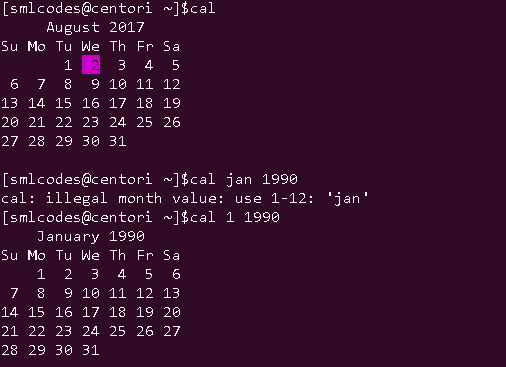


###### 5.“sleep" command  
sleep command let the terminal wait by the specified amount of time. By default
it takes time in seconds
```bash
sleep syntax
sleep NUMBER[SUFFIX]
```


SUFFIX may be "**s**" for seconds (the default), "**m**" for minutes, "**h**"
for hours, or "**d**" for days.

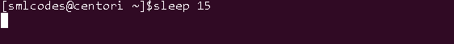

In above screen, terminal will sleep for 15 seconds


###### 6."time" command

Report how long it took for a command to execute.
```bash
time [-p] command [arguments...]
```


Example: Check how much time it will take to excecute time command

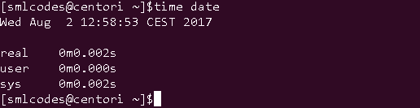


###### 7."df" command

The 'df' command tells about the disk space used in the file system. It defines
the number of blocks used, number of blocks available and the directory where
file system is mounte

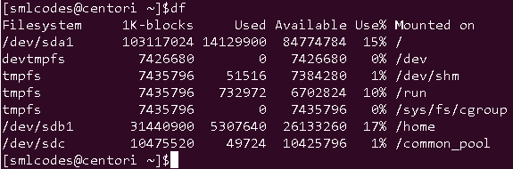


# 8.Linux RegEx


Regular expression(regex) is a pattern for a matching string that follows some
pattern.Regex can be used in a variety of programs like grep, sed, vi, bash,
rename and many more

### Metacharacters

A regular expression may have one or several repeating metacharacters.

| **Metacharacter** | **Description**                                                            |
|-------------------|----------------------------------------------------------------------------|
| **.**             | Replaces any character.                                                    |
| **^**            | Matches start of string and represents characters not in the string.       |
| **$**            | Matches end of string.                                                     |
| *****            | Matches zero or more times the preceding character.                        |
| ****            | Represents the group of characters.                                        |
| **()**            | Groups regular expressions.                                                |
| **?**             | Matches exactly one character.                                             |
| **+**             | Matches one or more times the preceding character.                         |
| **{N}**           | Preceding character is matched exactly N times.                            |
| **{N,}**          | Preceding character is matched exactly N times or more.                    |
| **{N,M}**         | Preceding character is matched exactly N times, but not more than N times. |
| **-**             | Represents the range.                                                      |
| **b**           | Matches empty string at the edge of a word.                                |
| **B**           | Matches empty string if it is not at the edge of a word.                   |
| **<**          | Matches empty string at the beginning of a word.                           |
| **>**          | Matches empty string at the end of a word.                                 |

###### Regex Versions

There are three versions of regular expressions syntax:

1.  **BRE : Basic Regular Expressions**

2.  **ERE : Extended Regular Expressions**

3.  **PRCE: Perl Regular Expressions**

Depending on tool or programs, one or more of these versions can be used.

### Examples
```bash
[smlcodes@centori ~]$cat ex.txt                                                  
my name is satya kaveti                                                          
come,coming,came                                                                 
going,go, gone                                                                   
sleeping,sleep,slept 

1. Beginning of a line with ‘^a’
[smlcodes@centori ~]$grep ^c ex.txt                                              
come,coming,came

2. End of a line with ‘e$’
[smlcodes@centori ~]$grep e$ ex.txt                                              
come,coming,came
going,go, gone

3. Matching any single character with ‘.a’
[smlcodes@centori ~]$grep .a ex.txt                                              
my name is satya kaveti
come,coming,came
```


**4. Bracket notation with []**

-   This can be a little tricky, brackets allow us to specify characters found
    within the bracket.  
    d[iou]g  
    would match: dig, dog, dug

-   The previous anchor tag \^ when used in a bracket means anything except the
    characters within the bracket.  
    d[\^i]g  
    would match: dog and dug but not dig

-   Brackets can also use ranges to increase the amount of characters you want
    to use.

    d[a-c]g  
    will match patterns like dag, dbg, and dcg

-   Be careful though as brackets are case sensitive:  
    d[A-C]g  
    will match dAg, dBg and dCg but not dag, dbg and dcg


# 9.Linux Users

### 1.User information commands (Run for output)
```bash
1. whoami : It tells you about the system's username.
[smlcodes@centori ~]$whoami                                                      
smlcodes  

2.who : command gives the users currtely logged users information
[smlcodes@centori ~]$who                                                      
smlcodes  

3. who am i : This command displays the information about the current user only.
[smlcodes@centori ~]$who am i                                                   
smlcodes  

4. ‘w’ : This command tells about the users who are logged in and what are they doing.
[smlcodes@centori ~]$w                                                           
 15:06:07 up 90 days, 20:22,  0 users,  load average: 0.01, 0.05, 0.05           
USER     TTY      FROM 

5. id :  command tells about your user id, primary group id, and a list of groups that belongs to you.
[smlcodes@centori ~]$id                                                          
uid=79458(smlcodes) gid=79459(smlcodes) groups=79459(smlcodes) context=guest_u:gu	est_r:guest_t:s0
```


### 2. “su" (Switch User) Command

Su used to Change the current user ID to that of the superuser, or another user.

**su syntax**

su [options] [username]

**Example:**

su – hope

Switch the current user ID to that of user **hope**, and set the environment
to **hope**'s login environment.

The su command, which is short for substitute user or switch user, is used to
become another user during a login session.

-   The root user can become any existing user without knowing that user's
    password. Otherwise, password is needed

-   If any user name is not mentioned then by default, it will assume root as
    the target user

### 3. User management commands

User management includes everything from creating a user to deleting a user on
your system. The root user is the superuser and have all the powers for creating
a user, deleting a user and can even login with the other user's account. The
root user always has userid 0.

The local user database in Linux is **/etc/passwd** directory.
```bash
[smlcodes@centori ~]$tail -5 /etc/passwd                                          
monoidlamba:x:80111:80112::/home/monoidlamba:                                     
bsanchezmu:x:80112:80113::/home/bsanchezmu:                                       
Amitbhawsar:x:80113:80114::/home/Amitbhawsar:                                     
jayanthi123:x:80114:80115::/home/jayanthi123:                                     
moni31:x:80115:80116::/home/moni31:
```


#### 1.useradd (adding user)

With useradd commands you can add a user.
```bash
Syntax:
useradd -m -d /home/<userName> -c "<userName>" <userName>  

Example:
useradd -m -d /home/xyz -c "xyz" xyz
```


#### 2. usermod (modifying user)

The command usermod is used to modify the properties of an existing user.
```bash
Syntax:
usermod -c <'newName'> <oldName>  


Example:
usermod -c 'jhonny' john
```


#### 3. userdel (Deleting user)

The userdel -r command deletes a user account and all associated files.
```bash
Syntax:
userdel -r <userName>  


Example:
userdel -r john
```


#### 4. passwd 

The **passwd** command is used to change the password of a user account. A
normal user can run **passwd** to change their own password, and a system
administrator (the superuser) can use **passwd** to change another user's
password, or define how that account's password can be used or changed.

**passwd syntax**
```bash
>   passwd [ OPTION ] [*USER*]
```


**Example: Change Your Password**
```bash
>   passwd
```


Running **passwd** with no options will change the password of the account
running the command. You will first be prompted to enter the account's current
password:

### 4. Group management commands

Users can be listed in different groups. Group allow us to set permission on the
group level instead of setting the permission on individual level.

**Group File**:The /etc/group file defines the group membership. A user can be a
member of more than one group.
```bash
[smlcodes@centori ~]$tail -5 /etc/group                                           
monoidlamba:x:80112:
bsanchezmu:x:80113:
Amitbhawsar:x:80114:
jayanthi123:x:80115:
moni31:x:80116:
```


#### 1. groupadd

The groupadd command creates a new group account using the values specified on
the command line plus the default values from the system.

**groupadd syntax**

>   groupadd [options] <group_name>

**Example:** would create a new group called **"homegroup"**.

>   groupadd homegroup

#### 2. groupmod 

The **groupmod** command modifies the definition of the specified GROUP

**groupmod syntax**

>   groupmod [*options*] *GROUP*

example : change the group "**homegroup**" to "**familygroup**"

>   groupmod -n familygroup homegroup

#### 3.gruopdel

The command groupdel will delete a group permanently from the system.

**Syntax:**

>   groupdel **<group>**  

**Example:**

>   groupdel **familygroup**


# 10.Linux Permissions


Every Linux system have three types of owners

1.  **User:** A user is the one who created the file. By default, whosoever,
    creates the file becomes the owner of the file. A user can create, delete,
    or modify the file.

2.  **Group:** A group can contain multiple users. All the users belonging to a
    group have same access permission for a file.

3.  **Other:** Any one who has access to the file other
    than **user** and **group** comes in the category of** other**. Other has
    neither created the file nor is a group member.

Users and groups can be locally managed in **/etc/psswd** or **/etc/group.**

To check perimissions of files , use ls –lh command

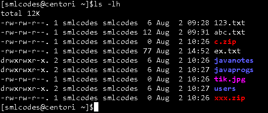

In above output we have r,w,x. following table explains what they are

| **permission**  | **Value** | **on a file **            | **on a directory **              |
|-----------------|-----------|---------------------------|----------------------------------|
| **r (read)**    | **4**     | read file content (cat)   | read directory content (ls)      |
| **w (write)**   | **2**     | change file content (vi)  | create file in directory (touch) |
| **x (execute)** | **1**     | execute the file          | enter the directory (cd)         |

**File permissions order is like (-rwx-rwx-rwx), for example** drwxrwxr-x.

-   **1st Position(d) : denotes file type**

-   **1st rwx : user permissions**

-   **2nd rwx : group permissions**

-   **3rd rwx : other permissions**

###### 1.chmod (Chanfe mode) command

**chmod** is used to set/ change the permissions of files or directories.

Syntax:
```bash
chmod [options] <permissions>  <filename>
```


#### Exampels:
```plaintext
Exampels:
1. Set permissions of file.htm to "owner can read and write; group can read only; others can read only".
chmod 644 file.htm

2.To add permissions to a group.
Syntax	: chmod <groupName>+<permissionName> <fileName>  
Example:chmod u+x file  

3. To remove permissions from a group
Syntax: chmod <groupName>-<permissionName> <fileName>  
Example:	chmod g-x file   

4. To add permission to all the groups together
Syntax: chmod a+<permissionName> <fileName>  
Example:	chmod a+w file  

5.To add permission to all the groups without typing a
Syntax :	chmod +<permissionName> <fileName>  
Example	:	chmod +w file
```

###### 2. Unmask

Every file that is created comes with a default set of permissions. If you ever
wanted to change that default set of permissions, you can do so with the umask
command
```plaintext
$ umask 021
```


In the above example, we are setting the default permissions of new files to021

###### 3. Sticky Bit
Files can be protected in a directory from being removed by other users who do not own it by preventing it with sticky bit. It is displayed at the same location as the x permission for others

It is represented by a t (x is also there) or a T (no x is there). Generally, sticky bit is found on /tmp directory.


**Example:**
```plaintext
chmod +t hello.java
```


# 11.Linux commands


We have two types of commands in shell.

-   **Built-in** commands are internal commands that are built-in the shell.
    Built-in commands are called from the shell and executed directly within the
    shell itself. example of built-in commands are 'pwd', 'help', 'type', 'set',
    'unset', etc.

-   **External** commands are other than built-in commands. These commands are
    programs which have their own binary and located in the filesystem Mostly
    these commands reside in /bin, /sbin, /usr/sbin

###### 1."type" command

We can check the commands which are belongs to which type by “type" command
```plaintext
[smlcodes@centori ~]$type date                                                    
date is /bin/date                                                                 
[smlcodes@centori ~]$type pwd                                                     
pwd is a shell builtin                                                            
[smlcodes@centori ~]$
```


###### 2. “alias" command

Sometimes typing commands can get really repetitive, or if you need to type a
long command many times, it’s best to have an alias you can use for that. To
create an alias for a command you simply specify an alias name and set it to the
command.

>   $ alias foobar='ls -la'

Now instead of typing ls -la, you can type foobar.Keep in mind that this command
won't save your alias after reboot, so you'll need to add a permanent alias in:

>   \~/.bashrc

You can remove aliases with the unalias command:

>   $ unalias foobar

###### 3 ."env" command

“env" outputs a whole lot of information about the environment variables you
currently have set.

>   $env


# 12.Linux networking


### 1. TCP/IP Internet protocol

TCP/IP is a set of protocols, and is the primary tech of the internet. When you
browse the web, send email, chat online, online gaming, TCP/IP is working busily
underneath

#### Example: 

Suppose you are sending email, or downloading a file, or chat with a friend
online, or visiting a web page. What happens underneath?

You application (email, chat, etc) breaks the data into thousands of tiny
independent pieces. Each piece is called a Datagram (aka packet). Each datagram
has embedded with it the destination IP address. Your computer send this
datagram to your Router (aka “link"), and your router send it to a appropriate
node (another router or computer) on the network that's closer to the
destination.

That router again send it to a another node (router) on the network that's
closer to the destination. This process continues until the designated machine
with the IP address receives it. This is done for each and every datagram.

On the receiving machine, it re-assembles all these datagrams into the original
whole piece in the right order, and send it to the right application on that
machine (the email server, or web server, or chat server. (which in turn, repeat
the same thing to send it to your friend's machine.))

Computer/software follow a set of standardized rules of procedure when talking
to each other. This standardized rules of procedure used for internet is called
the **TCP/IP Internet protocol suite**.

2.Network Components
---------------------


###### 1. Network Interface Controller

First, you have Network interface controller (NIC) (i.e. **network interface
card**, **network adapter**, **LAN adapter**, **network card**). It's a piece of
hardware that lets your computer talk to the internet.

###### 2. Router

Then, the second most important hardware is Router. Router transfer packets
between computers.

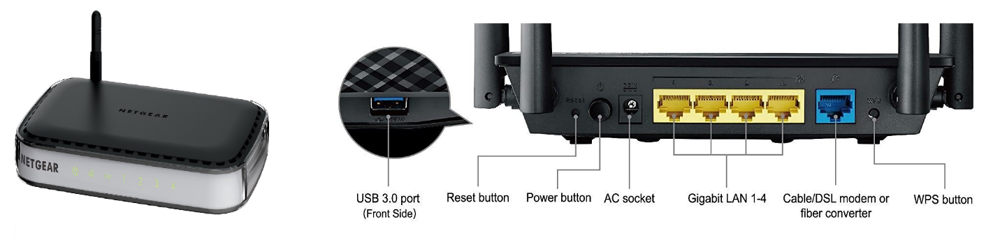

###### 3.MAC Address = Hardware Address = Physical Address

Each Network Adapter has a ID, called [MAC
address](http://en.wikipedia.org/wiki/MAC_address) (aka **hardware
address**, **physical address**). This ID is burned into the hardware. (“MAC" is
abbreviation for “Media Access Control" (the name is historical).)

MAC address is a 48 bits number. Usually written as 6 groups of 2 hex digits.
For example, 01-23-45-67-89-abor 01:23:45:67:89:ab. Each 2 hex is a octet.

**We can find the MAC address of the Network Adapters by using**

-   **ip link**

-   **ifconfig -a.**
```bash
[smlcodes@centori ~]$ifconfig -a                                                  
Warning: cannot open /proc/net/dev (Permission denied). Limited output.
Warning: cannot open /proc/net/dev (Permission denied). Limited output.
eth0: flags=4163<UP,BROADCAST,RUNNING,MULTICAST>  mtu 1500
        inet 217.182.92.164  netmask 255.255.255.255  broadcast 217.182.92.164
        ether fa:16:3e:20:dc:3c  txqueuelen 1000  (Ethernet)                                                                                  
Warning: cannot open /proc/net/dev (Permission denied). Limited output.
lo: flags=73<UP,LOOPBACK,RUNNING>  mtu 65536
        inet 127.0.0.1  netmask 255.0.0.0
        loop  txqueuelen 0  (Local Loopback)
```


###### 4. IP Address

**IP address is used to identify all internet devices**. (Each internet device
may have one ore more IP address.) It's part of the IP protocol. There are 2
versions of IP
address: [IPv4](http://en.wikipedia.org/wiki/IPv4) and [IPv6](http://en.wikipedia.org/wiki/IPv6).

-   **IPv4 address** = 32 bits (4 octets). Usually written in 4 groups, each as
    a decimal. For example, 172.16.254.1 (for IPv4), each decimal group is 1
    octet.

-   **IPv6 address** = 128 bits (16 octets). Usually written in 8 groups, 4
    digits of hex per group, separated by colon, with leading 0 omitted, for
    example, 2001:db8:0:1234:0:567:8:1. Each group of hex represents 2 octets.

IPv4 is the older standard. Because it's only 32 bits, good for 2\^32 unique
address (about 4.2 billion). This is not enough since late 1990s. So, IPv6 was
invented.

to find the IP address any router use : ip route. 

###### 5. Host, Hostname

A “host" typically refers to a particular computer (or internet device).
A [Hostname](http://en.wikipedia.org/wiki/Hostname) is basically just a name for
a machine. It is used mostly as a human-friendly form to identify a machine.

A host/machine may have more than one IP address (because it can have multiple
Network Adapter, or, a computer can be setup to function as a router, etc.).

 to find your hostname use : hostname

###### 6.Port Number

**port** → a integer number. **It serves as a address for software application
to talk to TCP**. **IP address is used to identify a computer**. Once the packet
arrived on the computer, the port number serves as a address to identify the
software that send/receive messages

###### 7. Network socket

Network Socket is basically a API for programs to talk to the network. A socket
address is a combination of IP address and a port number.

So, when a browser, or email app, want to talk to the internet, they speak to
the socket. The socket is usually provided by the Operating System as a API. The
programer don't have to worry about TCP/IP details, he just create a socket (by
calling a function or new object), specify IP address, port number, and type of
connection, and call functions/methods to send/receive data on it.

###### 8. Routing

[Routing](http://en.wikipedia.org/wiki/Routing) is one of the most important
element in internet, because it is routing that moves data.

By definition, a router has 2 or more network adapters, because a router is used
to forward data between different networks. For home routers, usually one end is
connected to a cable modem or DSL modem to the internet, and the other hand are
Ethernet ports for the home network.

-   receive data from one of its attached networks.

-   check the destination address in the IP header. If it's on the network from
    whence the data came, the datagram is ignored. (because already reached its
    destination. (Ethernet sends it to all in the same network))

-   If destination IP address for a different network, the router checks the
    routing table to determine where to forward the datagram.

-   it dis-assemble and re-assemble the datagram and send it to the right
    adapter.

###### 9. Routing Table

Routing table, or Routing Information Base (RIB), is a data table stored in a
router or a computer that lists the routes to particular network destinations,
and in some cases, metrics (distances) associated with those routes. The routing
table contains information about the topology of the network immediately around
it.

To see the routing table your my computer use : ip route or route

[satya@centori \~]$ip route

default via 217.182.88.1 dev eth0 proto static metric 100

217.182.88.1 dev eth0 proto static scope link metric 100

217.182.92.164 dev eth0 proto kernel scope link src 217.182.92.164 metric 100

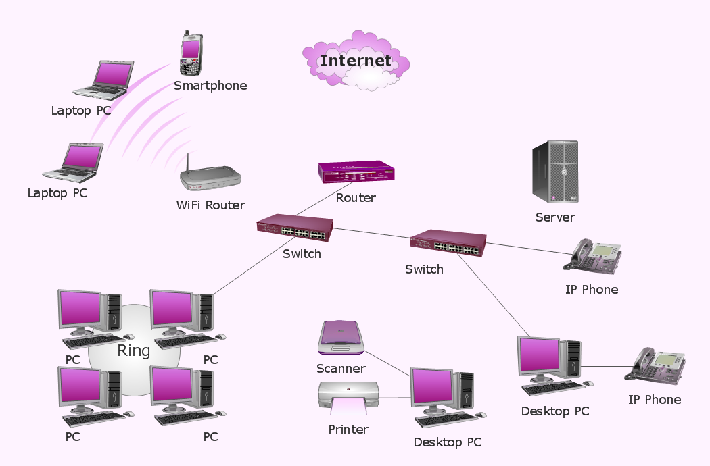

3.Linux Neworking Commands
--------------------------

###### 1.ifconfig 

**ifconfig** stands for "interface configuration". It is used to view and change
the configuration of the network interfaces on your system.
```bash
[smlcodes@centori ~]$ifconfig                                                     
Warning: cannot open /proc/net/dev (Permission denied). Limited output.           
Warning: cannot open /proc/net/dev (Permission denied). Limited output.           
eth0: flags=4163<UP,BROADCAST,RUNNING,MULTICAST>  mtu 1500                        
        inet 217.182.92.164  netmask 255.255.255.255  broadcast 217.182.92.164    
        ether fa:16:3e:20:dc:3c  txqueuelen 1000  (Ethernet)                    
                                                                                  
Warning: cannot open /proc/net/dev (Permission denied). Limited output.           
lo: flags=73<UP,LOOPBACK,RUNNING>  mtu 65536                                      
        inet 127.0.0.1  netmask 255.0.0.0                                         
        loop  txqueuelen 0  (Local Loopback)
```

Here, **eth0, lo and wlan0** are the names of the active network interfaces on
the system.

-   **eth0** is the first ethernet interface. (Additional ethernet interfaces
    would be named eth1, eth2, etc.) This type of interface is usually a NIC
    connected to the network by a category 5 cable.

-   **lo** is the loopback interface. This is a special network interface that
    the system uses to communicate with itself.

-   **wlan0** is the name of the first wireless network interface on the system.
    Additional wireless interfaces would be named wlan1, wlan2, etc

###### 2. PING Command

**PING (Packet INternet Groper) command is the best way to test connectivity
between two nodes**. Whether it is Local Area Network (LAN) or Wide Area
Network (WAN). Ping use ICMP (Internet Control Message Protocol) to communicate
to other devices. You can ping host name of ip address using below command.

**syyntax:**

>   ping <destination>  

**Example:**

>   ping satya.com  

###### 3. TRACEROUTE Command

traceroute is a network troubleshooting utility which **shows number of hops
taken to reach destination also determine packets traveling path**. Below we are
tracing route to global DNS server IP Address and able to reach destination also
shows path of that packet is traveling.

**Syntax:**

>   traceroute **<destination>**  

**Exmaple:**

>   traceroute satya.com  

###### 4. NETSTAT Command

**Netstat (Network Statistic)** command display connection info, routing table
information etc. To displays routing table information use option as -r.

**Syntax:**

>   netstat  

###### 5. DIG Command

**Dig (domain information groper)** query DNS related information like A
Record, CNAME, MX Record etc. This command mainly use to
troubleshoot DNS related query.

**Syntax:**

>   dig <domainName> 

###### 6. NSLOOKUP Command

nslookup command also use to find out DNS related query. The following examples
shows A Record (IP Address) of satya.com.

**Syntax:**

>   nslookup <domainName>  

**Example:**

>   nslookup satya.com 

###### 7. ROUTE Command

route command also shows and manipulate ip routing table. In computer
networking, a router is a device responsible for forwarding network traffic.
When datagrams arrive at a router, the router must determine the best way to
route them to their destination.
```bash
Route

Route Adding
# route add -net 10.10.10.0/24 gw 192.168.0.1

Route Deleting
# route del -net 10.10.10.0/24 gw 192.168.0.1

Adding default Gateway
# route add default gw 192.168.0.1
```


###### 8. HOST Command

host command to find name to IP or IP to name in IPv4 or IPv6 and also
query DNS records.

**Syntax:**

>   host  **<resourceName>**  

Example

Host satya.com

###### 9. ARP Command

ARP stands for **Address Resolution Protocol**, will manipulates or displays the
kernel's IPv4 network neighbour cache. It can add entries to the table, delete
one, or display the current content.

**Syntax:**

>   arp  

###### 10. IWCONFIG Command

iwconfig command in Linux is use to configure a wireless network interface. You
can see and set the basic Wi-Fi details like SSID channel and encryption

IWCONFIG

###### 11. HOSTNAME Command

hostname is to identify in a network. Execute hostname command to see the
hostname of your box. You can set hostname permanently
in /etc/sysconfig/network. Need to reboot box once set a proper hostname.

**Syntax:**

>   hostname 

###### 12. whois

The whois command displays information about a website's record. You may get all
the information about a website regarding its registration and owner's
information.

**Syntax:**

>   whois **<websiteName>**   

**Example:**

>   whois satya.com  


# 13.Linux SysAdmin
 

A system administrator manages configuration, upkeep and reliable operations of
computer operations. Sysadmin handles servers, has to manage system performance
and security without exceeding the budget to meet users need.

Some important commands for system administrators

| **Command**       | **Function**                                              |
|-------------------|-----------------------------------------------------------|
| man               | Display information about all commands                    |
| uptime            | Show how long system is running                           |
| users             | Show username who are currently logged in                 |
| service           | Call and execute script                                   |
| pkill             | Kill a process                                            |
| pmap              | Memory map of a process                                   |
| wget              | Download file from network                                |
| ftp or sftp       | Connect remote ftp host                                   |
| free              | Show memory status                                        |
| top               | Display processor activity of system                      |
| last              | Display user's activity in the system                     |
| ps                | Display about processes running on the system             |
| Shutdown commands | Shutdown and reboot system                                |
| info              | Display information about given command                   |
| env               | Display environment variable for currently logged-in user |
| netstat           | Display network status                                    |
| arp               | Check ethernet connectivity and IP address                |
| df                | Display filesystem information                            |
| du                | Display usage                                             |
| init              | Allow to change server bootup                             |
| nano              | A command line editor                                     |
| nslookup          | Check domain name and IP information                      |
| shred             | Delete a file by over writing its content                 |
| cat               | Display, copy or combine text files                       |
| pwd>             | Print path of current working directory                   |
| locate            | Finding files by name on system                           |
| chown             | Change ownership of a file                                |
| >alias           | To short a command                                        |
| echo              | Display text                                              |
| cmp               | Compare two files byte by byte                            |
| mount             | Mount a filesystem                                        |
| ifconfig          | Display configuration                                     |
| traceroute>      | Trace existing network                                    |
| sudo              | Run a command as a root user                              |
| route             | List routing table for your server                        |
| ping              | Check connection by sending packet test packet            |
| find              | Find location of files/directories                        |
| users             | Show current logged in user                               |
| who               | Same as w but doesn't show current process                |
| ls                | List all the files                                        |
| tar               | Compress directories                                      |
| grep              | Search for a string in a file                             |
| su                | Switch from one to another user                           |
| awk               | Search lines for a given pattern                          |

Linux Process Management
------------------------

Processes are the programs that are running on your machine. They are managed by
the kernel and each process has an ID associated with it called the **process ID
(PID).**

###### 1."ps" command

(**ps**) Displays information about active processes

ps syntax

>   ps [options]

Example:
```bash
[smlcodes@centori ~]$ps                                                           
  PID TTY          TIME CMD                                                       
10681 pts/27   00:00:00 sh                                                        
10776 pts/27   00:00:00 ps
```


###### 2."kill" command

kill is used to send a signal to a process. The default signal for **kill** is
TERM (which will terminate or "kill" the process). 

**Syntax:**

>   kill -SIGNAL <ProcessId(PID)>  

| **Signal Name** | **Signal Number** | **Signal Use**            |
|-----------------|-------------------|---------------------------|
| SIGNULL         | 0                 | NULL, check access to PID |
| SIGHUP          | 1                 | Hangup                    |
| SIGINT          | 2                 | Interrupt                 |
| SIGQUIT         | 3                 | Quit                      |
| SIGKILL         | 9                 | Kill                      |
| SIGTERM         | 15                | Terminate                 |
| SIGSTOP         | 24                | Stop                      |

Kill -9 22891

###### 3.service

The service command starts, stop and restart a daemon or services by calling the
script. Usually all scripts are stored in **/etc/init.d** directory.It runs a
script in as predictable environment as possible.

**Syntax:**

>   service script_name command  

Here, command can be anyone from start, stop, restart and status.

-   **stop command : service script_name stop  **

-   **start command : service script_name start  **

-   **restart command : service script_name restart  **

-   **status command : service script_name status  **

VI Editor Usefull commands
--------------------------

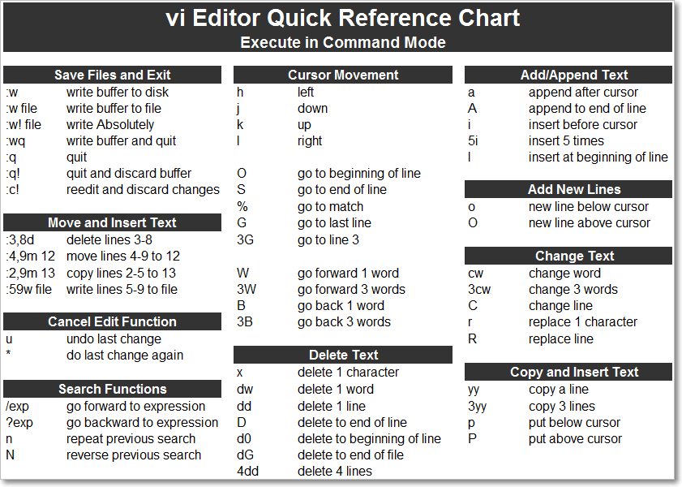

#### References

<https://www.javatpoint.com/linux-tutorial>

<https://linuxjourney.com/>

<http://www.webminal.org/terminal/>

<https://www.tecmint.com/linux-network-configuration-and-troubleshooting-commands/>

networking : <http://xahlee.info/linux/tcp_ip_tutorial.html>

<http://www.conceptdraw.com/samples/network-diagram>

<https://www.tecmint.com/linux-network-configuration-and-troubleshooting-commands/>
