1.Introduction
---------------

[Apache Maven](http://maven.apache.org/)**,** is an innovative software project
management tool, provides new concept of a project object model (**POM**) file
to manage project’s build, dependency and documentation.

**The most powerful feature is able to download the project dependency libraries
automatically.**

**Ant** and **Maven** both are build tools provided by Apache. The main purpose
of these technologies is to ease the build process of a project. There are many
differences between ant and maven that are given below

| **Ant**                                                                                                                     | **Maven**                                                                                                                                                |
|-----------------------------------------------------------------------------------------------------------------------------|----------------------------------------------------------------------------------------------------------------------------------------------------------|
| Ant doesn't has formal conventions, so we need to provide information of the project structure in **build.xml** file.       | Maven has a convention to place source code, compiled code etc. So we don't need to provide information about the project structure in **pom.xml** file. |
| Ant is procedural, you need to provide information about what to do and when to do through code. You need to provide order. | Maven is declarative, everything you define in **the pom.xml** file.                                                                                     |
| There **is no life cycle in Ant.**                                                                                          | There **is life cycle in Maven.**                                                                                                                        |
| **It is a tool** box.                                                                                                       | **It is a framework**.                                                                                                                                   |
| It is **mainly a build tool.**                                                                                              | It is mainly **a project management tool.**                                                                                                              |
| The **ant scripts are not reusable.**                                                                                       | The **maven plugins are reusable**.                                                                                                                      |
| It **is less preferred** than Maven.                                                                                        | It is **more preferred** than Ant.                                                                                                                       |

POM.XML Structure
```xml
<project xmlns="http://maven.apache.org/POM/4.0.0" xmlns:xsi="http://www.w3.org/2001/XMLSchema-instance"
   xsi:schemaLocation="http://maven.apache.org/POM/4.0.0 http://maven.apache.org/xsd/maven-4.0.0.xsd">
   <modelVersion>4.0.0</modelVersion>

   <groupId>com.companyname.project-group</groupId>
   <artifactId>project</artifactId>
   <version>1.0</version>
 
<repositories>
	     . . . . 
	</repositories>

<dependencies>
     . . . .
<dependencies>

<build>
		<plugins>
		    . . .
        </plugins>
	</build>
</project>
```

2.Maven Installation & Configuration
-------------------------------------

### 2.1 Maven Windows Installation

**1. Download Apache Maven**

Go to [Maven official website](http://maven.apache.org/download.cgi), download
the Maven zip file, Unzip It.

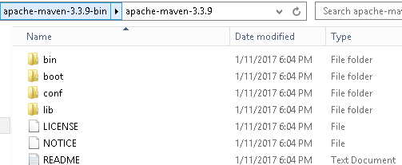

2.Configure the **JAVA_HOME** Windows environment variables by specifying Java
Installation Location

**Control Panel → User Accounts → User Accounts → Change my Environment
Variables**


3.Add both **M2_HOME** and **MAVEN_HOME** as Windows environment variable &
point it to Maven folder

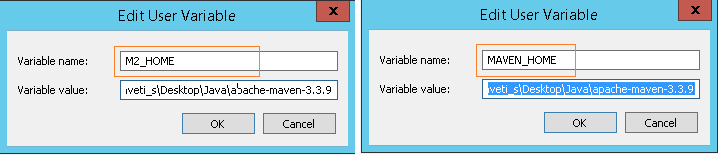

4.Update **PATH** variable, append Maven bin folder – **%M2_HOME%\\bin**, so
that you can run the Maven’s command everywhere.  
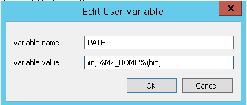

5.Verify Maven is installed properly or by mvn –version command

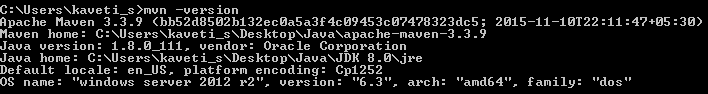

**6. Change PROXY Settings**  
If you are behind a proxy, Maven will fail to download any dependencies.in this
type of situation we have to declare the proxy server setting in Maven
configuration file settings.xml.

Find **{M2_HOME}/conf/settings.xml,** and put your proxies detail inside.
Un-comment the proxy options and fill in your proxy server detail.
```xml
<!-- proxies
   | This is a list of proxies which can be used on this machine to connect to the network.
   |-->
  <proxies>
      <proxy>
      <id>optional</id>
      <active>true</active>
      <protocol>http</protocol>
      <username>smlcodes</username>
      <password>password</password>
      <host>proxy.smlcodes.com</host>
      <port>8888</port>
      <nonProxyHosts>local.net|some.host.com</nonProxyHosts>
    </proxy>
  </proxies>
```

### 2.2 Maven Ubuntu Installation

1. In a terminal, run apt-cache search maven, to get all the available Maven
package.

2. Run command sudo apt-get install maven, to install the latest Apache Maven.

3. Run command mvn -version to verify your installation.
```dos
$ mvn -version
Apache Maven 3.0.4
Maven home: /usr/share/maven
Java version: 1.7.0_09, vendor: Oracle Corporation
Java home: /usr/lib/jvm/java-7-openjdk-amd64/jre
Default locale: en_US, platform encoding: UTF-8
OS name: "linux", version: "3.5.0-17-generic", arch: "amd64", family: "unix"
```


3.Maven Repository
-------------------

A **maven repository** is a directory of packaged JAR file with pom.xml file.
Maven searches for dependencies in the repositories. There are 3 types of maven
repository:

1.  **Local Repository**

2.  **Central Repository**

3.  **Remote Repository**


Maven searches for the dependencies in the following order:

**Local repository** then **Central repository** then **Remote repository**.

**If dependency is not found in these repositories, maven stops processing and
throws an error.**

### 3.1 Local Repository

The maven local repository is a local folder that is used to store all your
project’s dependencies (plugin jars and other files which are downloaded by
Maven). In simple, when you build a Maven project, all dependency files will be
stored in your Maven local repository. By default, Maven local repository is
default to **.m2** 

Folder **C:\\Documents and Settings\\{your-username}\\.m2**

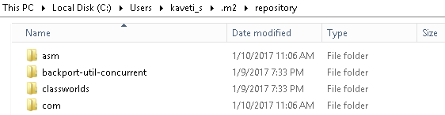

We can change the location of maven local repository by changing
the **settings.xml** file. It is located in **MAVEN_HOME/conf/settings.xml**
update localRepository to other repo folder & **save**
```xml
//{M2_HOME}\conf\setting.xml
<settings>
  <!-- localRepository
   | The path to the local repository maven will use to store artifacts.
   |   Default: ~/.m2/repository
  <localRepository>/path/to/local/repo</localRepository>
  -->
<localRepository>E:/maven-repo</localRepository>
```

Now, your new Maven local repository is now changed to E:/maven-repo.

### 3.2 Central Repository

When you build a Maven’s project, Maven will check your pom.xml file, to
identify which dependency to download. First, Maven will get the dependency from
your **Local repository**, if not found, then get it from the default *Maven
central
repository* – [http://repo1.maven.org/maven2/](http://repo1.maven.org/maven/)

**Maven** **central repository** is located on the web. It has been created by
the apache maven community itself.The path of central repository
is: <http://repo1.maven.org/maven2/>

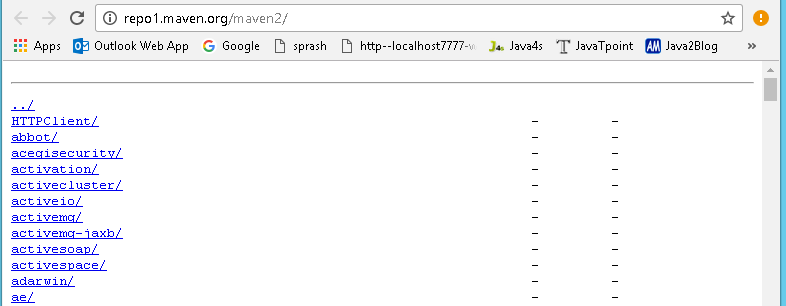

The central repository contains a lot of common libraries that can be viewed by
this URL <http://search.maven.org/#browse>

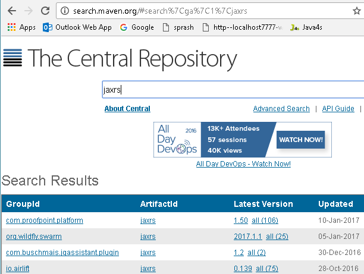

### 3.3 Remote Repository

Maven **remote repository** is located on the web. Most of libraries can be
missing from the central repository such as JBoss library etc, so we need to
define remote repository in **pom.xml** file.

In Maven, when you’re declared library does not exist either in **local
repository** nor Maven **center repository**, the process will stop and output
error messages to your Maven console. For Example **org.jboss.resteasy.jar**
will be only available in **jboss repository** only.

To tell Maven to get the dependency from Java.net, you need to declared a remote
repository in your pom.xml file like this 
```xml
<project xmlns="http://maven.apache.org/POM/4.0.0”>
  <modelVersion>4.0.0</modelVersion>
  <groupId>JAXRS-HeaderParam-Example</groupId>
  <artifactId>JAXRS-HeaderParam-Example</artifactId>
  <version>0.0.1-SNAPSHOT</version>
  <packaging>war</packaging>  

<repositories>
		<repository>
			<id>JBoss repository</id>
			<url>https://repository.jboss.org/nexus/content/groups/public-jboss/</url>
		</repository>
	</repositories>

	<dependencies>
		<dependency>
			<groupId>org.jboss.resteasy</groupId>
			<artifactId>resteasy-jaxrs</artifactId>
			<version>2.2.1.GA</version>
		</dependency>
	</dependencies>    
</project>
```

### 3.4 How to add Jar file to Maven Local Repository Manually 

For example, [kaptcha](http://code.google.com/p/kaptcha/)**,** a popular third
party Java library, used to generate **“captcha"** image to stop spam, but it’s
not available in the Maven center repository.

Follow below steps to add this into Local Repository

1. Download the “[kaptcha](http://code.google.com/p/kaptcha/downloads/list)“,
extract it and copy kaptcha-version.jar, in c drive for example.

2. Run following command:
```dos
mvn install:install-file -Dfile=c:\kaptcha-{version}.jar -DgroupId=com.google.code
-DartifactId=kaptcha -Dversion={version} -Dpackaging=jar
```
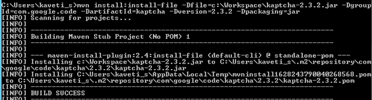


4.Maven pom.xml file
---------------------

**POM** is an acronym for **Project Object Model**. The pom.xml file contains
information of project and configuration information for the maven to build the
project such as dependencies, build directory, source directory, test source
directory, plugin, goals etc.

**Maven reads the pom.xml file, then executes the goal.**

Before maven 2, it was named as project.xml file.since maven 2 it is renamed as
pom.xml.

### 4.1 Elements of maven pom.xml file

**P.S: element details are provided in the comments**

```xml
<project xmlns="http://maven.apache.org/POM/4.0.0" xmlns:xsi="http://www.w3.org/2001/XMLSchema-instance"
	xsi:schemaLocation="http://maven.apache.org/POM/4.0.0 http://maven.apache.org/maven-v4_0_0.xsd">
  <modelVersion>4.0.0</modelVersion> //2.It specifies the modelVersion
  <groupId>JAXRS-HeaderParam-Example</groupId> //  3.It specifies the id for the project group.
  <artifactId>JAXRS-HeaderParam-Example</artifactId>//4.generated .jar, .war file name
  <version>0.0.1-SNAPSHOT</version>//5.pecifies the version of the artifact
  <packaging>war</packaging> //6.packaging type such as jar, war etc
	<repositories>
		<repository>
			<id>JBoss repository</id>
			<url>https://repository.jboss.org/nexus/content/groups/public-jboss/</url>
		</repository>
	</repositories>

	<dependencies>
		<dependency>
			<groupId>junit</groupId>
			<artifactId>junit</artifactId>
			<version>4.8.2</version>
			<scope>test</scope>
		</dependency>

		<dependency>
			<groupId>org.jboss.resteasy</groupId>
			<artifactId>resteasy-jaxrs</artifactId>
			<version>2.2.1.GA</version>
		</dependency>
	</dependencies>

	<build>
		<finalName>RESTfulExample</finalName>
		<plugins>
			<plugin>
				<artifactId>maven-compiler-plugin</artifactId>
				<configuration>
					<source>1.6</source>
					<target>1.6</target>
				</configuration>
			</plugin>
		</plugins>
	</build>

</project> //1. It is the root element of pom.xml file
```


5.Maven Example
----------------

We have a maven template for creating project using Maven. That is,
```xml
mvn archetype:generate -DgroupId={project-packaging}
   -DartifactId={project-name}
   -DarchetypeArtifactId=maven-archetype-quickstart
   -DinteractiveMode=false
```


This tells Maven to create a Java project from the
Maven maven-archetype-quickstart template. If we ignore
the archetypeArtifactId option, a huge list of the Maven templates will be
listed.

Normally, we just use the following two templates
1.	`maven-archetype-webapp` – Java Web Project (WAR)
2.	`maven-archetype-quickstart` – Java Project (JAR)


### Example: Create “MavenSample" Project using Maven

**1. Navigate to the folder you want to create the Java project. Type below
command:**
```xml
mvn archetype:generate -DgroupId=com.smlcodes 
-DartifactId=MavenSample	
-DarchetypeArtifactId=maven-archetype-quickstart 
-DinteractiveMode=false
``` 
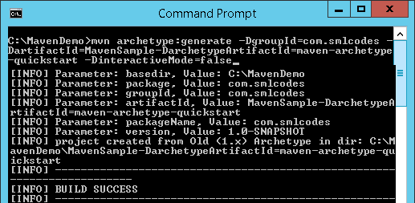
 

**2. If we check the Generated project folder it will contains following
structure**

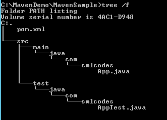

All source code files puts in folder /src/main/java/, all unit test code puts
in /src/test/java/.

3.The above created Project is Normal Project**, Eclipse cannot recognize it to
Importing, To make this as an Eclipse project, in terminal, navigate to
“MavenSample" project, type this command

`mvn eclipse:eclipse`  

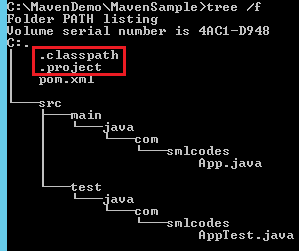

**4. The generated pom.xml will be in below formate**
```xml
<project xmlns="http://maven.apache.org/POM/4.0.0" xmlns:xsi="http://www.w3.org/2001/XMLSchema-instance"
  xsi:schemaLocation="http://maven.apache.org/POM/4.0.0 http://maven.apache.org/maven-v4_0_0.xsd">
  <modelVersion>4.0.0</modelVersion>
  <groupId>com.smlcodes</groupId>
  <artifactId>MavenSample</artifactId>
  <packaging>jar</packaging>
  <version>1.0-SNAPSHOT</version>
  <name>MavenSample</name>
  <url>http://maven.apache.org</url>
  <dependencies>
    <dependency>
      <groupId>junit</groupId>
      <artifactId>junit</artifactId>
      <version>3.8.1</version>
      <scope>test</scope>
    </dependency>
  </dependencies>
</project>
```


**5. Update Java resources with appropriate logic**
```java
//App.java
package com.smlcodes;
public class App {
	public static void main(String[] args) {
		App ob = new App();
		System.out.println("Your Random Number Is : " + ob.randomNumber());
	}
	public int randomNumber() {
		int random = (int) (Math.random() * 1000) ;
		return random;
	}
}

//AppTest.java
package com.smlcodes;
import org.junit.Assert;
import org.junit.Test;
public class AppTest {
	@Test
	public void testRandomNumber() {
		App ob = new App();
		Assert.assertTrue(ob.randomNumber()>0);
	}
}
```

**6. In pom.xml packing method is <packaging>jar</packaging>** , to do
packing we have to use

**mvn package** command

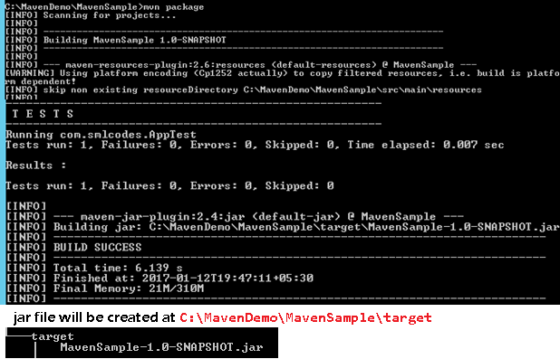

**7.We can test the Jar file by using below command on project root directory**
```java
java -cp target/MavenSample-1.0-SNAPSHOT.jar com.smlcodes.App
```


6.Maven with Eclipse IDE
-------------------------

### 6.1 Configure Maven in Eclipse

**1. Go to Window →Preferences →Maven →Installations →Add →Maven location →
Finish**


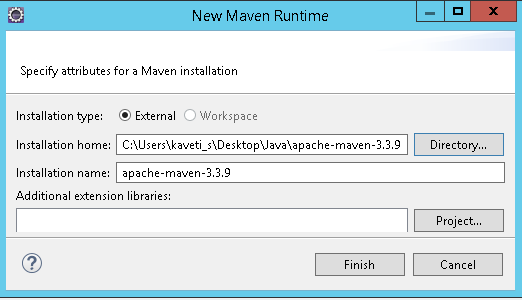

**2. Select the maven installation then click ok**

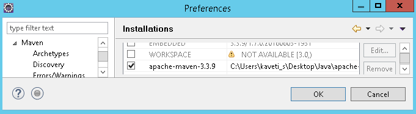

3.**Go to Maven User Settings locate settings.xml**
(**apache-maven-3.3.9\\conf\\settings.xml** )

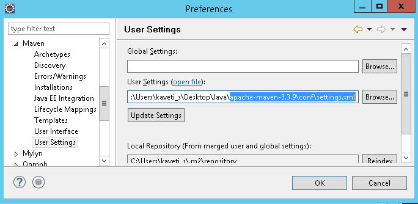


### 6.2 How to Convert Java Project into Maven Project in Eclipse

**Right Click on Project →Configure → Convert to Maven Project → provide
details→Finish**

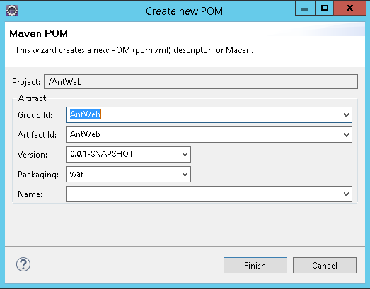


### 6.3 How to import Maven Project to Eclipse

1. Open Eclipse IDE, File **→ Import →Maven → Existing Maven Projects → Choose
Root Directory → Finish**

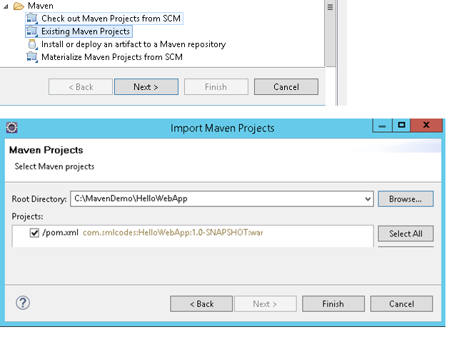

### 6.4 Create Web Application with Maven

To create Java Webapplication using maven we have to
maven-archetype-webapp template
```java
//Syntax
> mvn archetype:generate -DgroupId={project-packaging}
	-DartifactId={project-name}
	-DarchetypeArtifactId=maven-archetype-webapp
	-DinteractiveMode=false
```


**1. Navigate to the folder you want to create the project & type this command**
```java
> mvn archetype:generate -DgroupId=com.smlcodes
	-DartifactId=HelloWebApp
	-DarchetypeArtifactId=maven-archetype-webapp
	-DinteractiveMode=false
```


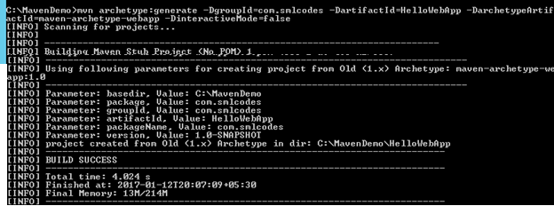

**2. If we check the Generated project folder it will contains following
structure**

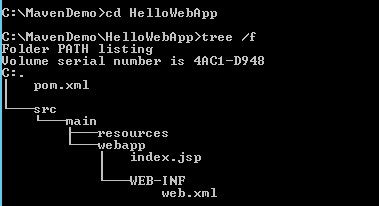

3.The above created Project is Normal Project **, Eclipse cannot recognize it to
Importing, to make this as an Eclipse project, in terminal, navigate to
“MavenSample" project, and type this command**
```java
mvn eclipse:eclipse -Dwtpversion=2.0
```


7.Maven Commands & Operations
------------------------------

So far we used some maven commands like

1.  **mvn archetype → For generating maven Project**

2.  **mvn eclipse:eclipse → For Converting maven Project to eclipse maven
    project**

3.  **mvn install:install-file → For adding jar to local maven repository**

4.  **mvn package → For packing project to .jar / .war**

Like that we have many maven commands, now we will see the most usefull commands
in maven.

### 7.1 Maven build lifecycle

Maven is based around the central concept of a build lifecycle. What this means
is that the process for building and distributing a particular artifact
(project) is clearly defined.

Here are three built-in build lifecycles: default, clean and site.
The **default** lifecycle handles your project deployment,
the **clean** lifecycle handles project cleaning, while the **site** lifecycle
handles the creation of your project's site documentation.

For example, the default lifecycle comprises of the following phases (refer to
the [Lifecycle
Reference](http://maven.apache.org/guides/introduction/introduction-to-the-lifecycle.html#Lifecycle_Reference))

-   **validate** - validate the project is correct and all necessary information
    is available

-   **compile** - compile the source code of the project

-   **test** - test the compiled source code using a suitable unit testing
    framework. These tests should not require the code be packaged or deployed

-   **package** - take the compiled code and package it in its distributable
    format, such as a JAR.

-   **verify** - run any checks on results of integration tests to ensure
    quality criteria are met

-   **install** - install the package into the local repository, for use as a
    dependency in other projects locally

-   **deploy** - done in the build environment, copies the final package to the
    remote repository for sharing with other developers and projects.

### 7.2 mvn package

When you run “mvn package" command, it will compile source code, run unit test
and pack it depends on your “packaging" tag in pom.xml file.

Maven is run by phases, read this [default Maven build
lifecycle](http://maven.apache.org/guides/introduction/introduction-to-the-lifecycle.html) article
for more detail. So, when the “**package**" phase is executed, all its above
phases – “**validate**“, “**compile**" and “**test**“, including the current
phase “**package**" will be executed orderly.

1.  If **“packaging"=jar**, it will package your project into a “jar" file and
    put it into your target folder

2.  If **“packaging"=war**, it will package your project into a “war" file and
    put it into your target folder
```java
<project>
  <modelVersion>4.0.0</modelVersion>
  <groupId>AntWeb</groupId>
  <artifactId>AntWeb</artifactId>
  <version>0.0.1-SNAPSHOT</version>
  <packaging>war/jar</packaging>
</project>

C:\MavenDemo\MavenSample>mvn package
 [INFO] ------------------------------------------------------------------------
[INFO] Building MavenSample 1.0-SNAPSHOT
-------------------------------------------------------
 T E S T S
-------------------------------------------------------
Running com.smlcodes.AppTest
Tests run: 1, Failures: 0, Errors: 0, Skipped: 0, Time elapsed: 0.03 sec
```


### 7.2 mvn clean

In Maven based project, many cached output existed in your **“target"** folder.
When you want to build your project for deployment, you have to make sure clean
all the cached output so that you are always get the latest for deployment.

To clean our project cached output, we will use **mvn clean** command

```java
C:\MavenDemo\MavenSample>mvn clean
[INFO] Scanning for projects...
[INFO] Building MavenSample 1.0-SNAPSHOT
[INFO] ------------------------------------------------------------------------
 [INFO] --- maven-clean-plugin:2.5:clean (default-clean) @ MavenSample ---
[INFO] Deleting C:\MavenDemo\MavenSample\target
[INFO] ------------------------------------------------------------------------
[INFO] BUILD SUCCESS
[INFO] ------------------------------------------------------------------------
[INFO] Total time: 1.032 s
```


### 7.3 mvn test

To run unit test via Maven we will use **mvn test** command.it will run the
entire unit tests in your project

```java
//1. To run the entire unit test (Application1 and Application2),use below command
mvn test

//2. To run single test (Application1), use below command
mvn -Dtest= Application1 test

//3. To run single test (Application2), use below command
mvn -Dtest= Application2 test
```


for more different operations on mvn test refer
[this](http://maven.apache.org/surefire/maven-surefire-plugin/examples/single-test.html)

### 7.4 mvn install

When we use “mvn install", it will package your project and deploy to local
repository automatically, so that other developers can use it.

When “**install**" phase is executed, all above phases “**validate**“,
“**compile**“, “**test**“, “**package**“, “**integration-test**“, “**verify**"
phase , including the current “**install**" phase will be executed orderly.
Refer to this [Maven
lifecycle](http://maven.apache.org/guides/introduction/introduction-to-the-lifecycle.html) for
detail

Before running **mvn install** the folder structure of the project is as below

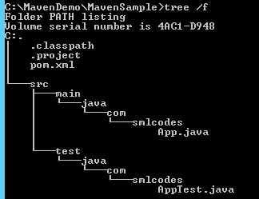

```java
C:\MavenDemo\MavenSample>mvn install
[INFO] Scanning for projects...
 [INFO] ------------------------------------------------------------------------
[INFO] Building MavenSample 1.0-SNAPSHOT
[INFO] ------------------------------------------------------------------------
 [INFO] --- maven-resources-plugin:2.6:resources (default-resources) @ MavenSample ---
 [INFO] Compiling 1 source file to C:\MavenDemo\MavenSample\target\classes
 [INFO] skip non existing resourceDirectory C:\MavenDemo\MavenSample\src\test\resources
 [INFO] Compiling 1 source file to C:\MavenDemo\MavenSample\target\test-classesmaven-surefire-plugin:2.12.4:test (default-test) @ MavenSample ---
[INFO] Surefire report directory: C:\MavenDemo\MavenSample\target\surefire-reports
-------------------------------------------------------
 T E S T S
-------------------------------------------------------
Running com.smlcodes.AppTest
Tests run: 1, Failures: 0, Errors: 0, Skipped: 0, Time elapsed: 0.013 sec
 [INFO]
[INFO] --- maven-jar-plugin:2.4:jar (default-jar) @ MavenSample ---
[INFO] Building jar: C:\MavenDemo\MavenSample\target\MavenSample-1.0-SNAPSHOT.jar
 [INFO] ------------------------------------------------------------------------
[INFO] BUILD SUCCESS
```

After running **mvn install** , project structure is as below, & it creates
**MavenSample-1.0-SNAPSHOT.jar**

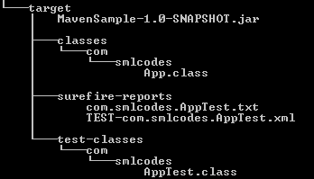

It’s always recommended to run “**clean**" and “**install**" together, so that
you are always deploy the latest project to your local repository.

**mvn clean install**


### 7.5 mvn site

“mvn site" is used to generate a documentation site for your project information

```java
C:\MavenDemo\MavenSample>mvn site
[INFO] Scanning for projects...
[INFO]
[INFO] ------------------------------------------------------------------------
[INFO] Building MavenSample 1.0-SNAPSHOT
[INFO] ------------------------------------------------------------------------
[INFO]
[INFO] --- maven-site-plugin:3.3:site (default-site) @ MavenSample --- [INFO] Rendering site with org.apache.maven.skins:maven-default-skin:jar:1.0 skin.
[INFO] Generating "Dependencies" report    --- maven-project-info-reports-plugin:2.9
[INFO] Generating "Dependency Convergence" report    --- maven-project-info-reports-p
[INFO] Generating "Dependency Information" report    --- maven-project-info-reports-p
[INFO] Generating "About" report    --- maven-project-info-reports-plugin:2.9
[INFO] Generating "Plugin Management" report    --- maven-project-info-reports-plugin
[INFO] Generating "Plugins" report    --- maven-project-info-reports-plugin:2.9
[INFO] Generating "Summary" report    --- maven-project-info-reports-plugin:2.9
[INFO] ------------------------------------------------------------------------
[INFO] BUILD SUCCESS
[INFO] ------------------------------------------------------------------------
[INFO] Total time: 55.925 s
[INFO] Finished at: 2017-01-13T11:51:09+05:30
[INFO] Final Memory: 20M/288M
[INFO] ------------------------------------------------------------------------
```

If we open the /**site** folder of our project, we can find the generated
documenet files

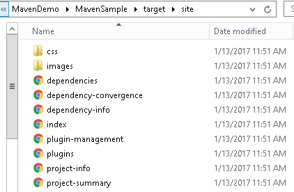

**Open index.html, it will navigates to Home page of your project document**

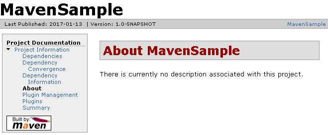

“mvn site:deploy" to deploy your generated documentation site to server
automatically, via WebDAV mechanism.

### 7.6 How to Deploy War File in Tomcat using Maven

To depoloy .War file in tomcat we need tomcat user credencials. We can find
those from **apache-tomcat-8.0.37\\conf\\tomcat-users.xml**

**1. Add a user with roles** manager-gui **and** manager-script.

tomcat-users.xml location is : **apache-tomcat-8.0.37\\conf\\tomcat-users.xml**
```xml
<?xml version='1.0' encoding='utf-8'?>
<tomcat-users>

  <role rolename="manager-gui"/>
  <role rolename="admin-gui"/>
  <role rolename="tomcat"/>
  <role rolename="role1"/>
  <role rolename="manager-script"/>	
  <user username="tomcat" password="tomcat" roles="tomcat"/>
  <user username="both" password="tomcat" roles="tomcat,role1"/>
  <user username="role1" password="tomcat" roles="role1"/>
  <user username="admin" password="admin" roles="tomcat,role1,manager-gui,admin-gui,manager-script" />
  <user username="root" password="root" roles="tomcat,role1,manager-gui,admin-gui,manager-script" />
</tomcat-users>
```

**2. Add above Tomcat’s user in the Maven setting file, later Maven will use
this user to login Tomcat server.**

settings.xml location is : **apache-maven-3.3.9\\conf\\settings.xml**

```xml
<?xml version="1.0" encoding="UTF-8"?>
<settings ...>
	<servers>
		<server>
			<id>TomcatServer</id>
			<username>admin</username>
			<password>admin</password>
		</server>
	</servers>
</settings>
```

**3. Declares a Maven Tomcat plugin in POM.xml**
```xml
<project>	
	<build>
		<finalName>JAXRS-FormParam-Example</finalName>
		<plugins>			
			<plugin>
				<groupId>org.apache.tomcat.maven</groupId>
				<artifactId>tomcat7-maven-plugin</artifactId>
				<version>2.2</version>
				<configuration>
					<url>http://localhost:8080/manager/text</url>
					<server>TomcatServer</server>
					<path>/demo</path>
				</configuration>
			</plugin>
		</plugins>
	</build>
</project>
```

**4. Deploy the Application .war file Tomcat**

Use following mvn commands for deploying war in tomcat server

1.  **For Deploying in Tomcat 7**  
    Deploy URL = **http://localhost:8080/manager/text**  
    Command = mvn tomcat7:deploy

2.  **For Deploying in Tomcat 6**  
    Deploy URL = **http://localhost:8080/manager/**  
    Command = mvn tomcat6:deploy

**C:\\Workspace\\HelloWeb>mvn tomcat7:deploy**
```dos
C:\Workspace\HelloWeb>mvn tomcat7:deploy
[INFO] Scanning for projects...
[INFO]
[INFO] ------------------------------------------------------------------------
[INFO] Building HelloWeb 0.0.1-SNAPSHOT
[INFO] ------------------------------------------------------------------------
[INFO]
[INFO] >>> tomcat7-maven-plugin:2.2:deploy (default-cli) > package @ HelloWeb >>>
 [INFO] Packaging webapp
[INFO] Assembling webapp [HelloWeb] in [C:\Workspace\HelloWeb\target\HelloWeb-0.0.1-SNAPSHOT]
[INFO] Processing war project
[INFO] Copying webapp resources [C:\Workspace\HelloWeb\WebContent]
[INFO] Webapp assembled in [93 msecs]
[INFO] Building war: C:\Workspace\HelloWeb\target\HelloWeb-0.0.1-SNAPSHOT.war
[INFO]
[INFO] <<< tomcat7-maven-plugin:2.2:deploy (default-cli) < package @ HelloWeb <<<
[INFO]
[INFO] --- tomcat7-maven-plugin:2.2:deploy (default-cli) @ HelloWeb ---
[INFO] Deploying war to http://localhost:8080/demo
Uploading: http://localhost:8080/manager/text/deploy?path=%2Fdemo
Uploaded: http://localhost:8080/manager/text/deploy?path=%2Fdemo (3 KB at 1385.3 KB/sec)
[INFO] tomcatManager status code:200, ReasonPhrase:OK
[INFO] OK - Deployed application at context path /demo
[INFO] ------------------------------------------------------------------------
[INFO] BUILD SUCCESS
[INFO] ------------------------------------------------------------------------
[INFO] Total time: 7.158 s
[INFO] Finished at: 2017-01-13T12:43:53+05:30
[INFO] Final Memory: 15M/191M
[INFO] ------------------------------------------------------------------------
```

