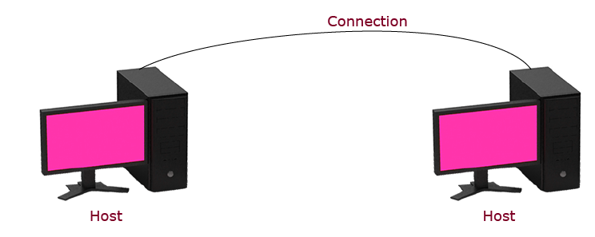
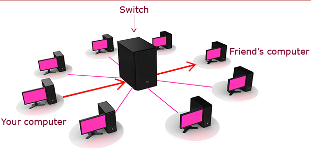
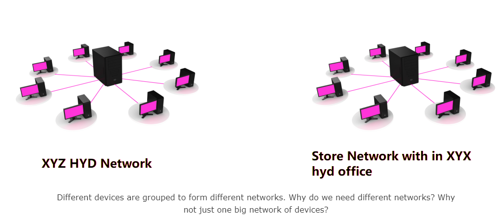
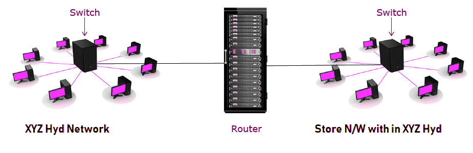
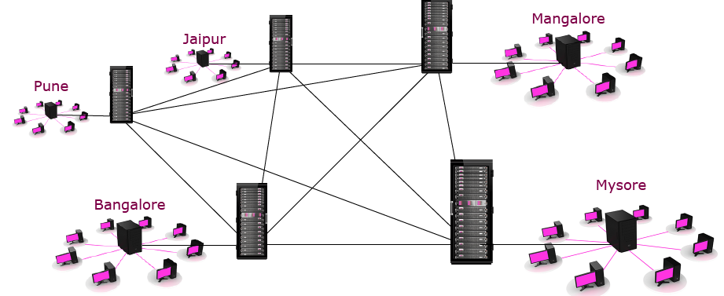
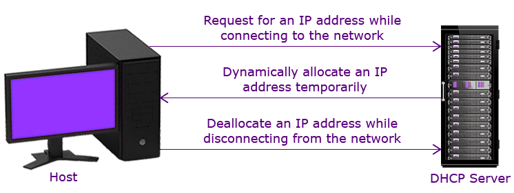
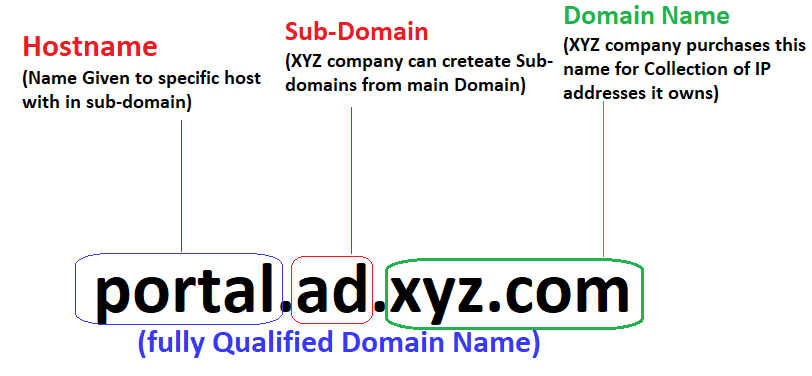
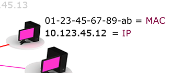
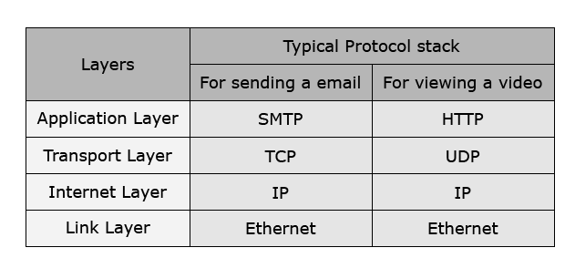

When two or more machines are connected with each other, it is called a network
and the devices in a network are called hosts.

Your classroom computer is actually part of XYZ Company network. All the
computers in XYZ Company are connected with each other, That’s why you are able
to send a mail to any XYZ Company mail Id.

**What do you think is the use of LAN cable?**

LAN cable is used to transmit data to and from the computer.

The amount of data that can be transmitted in a given period of time is called
Bandwidth. It is measured in Mbps, Gbps, etc.

| **Type of cable** | **Bandwidth** |
|-------------------|---------------|
| Twisted-Pair      | 100 Mbps      |
| Fiber-Optic       | >10Gbps      |

**The LAN cable starts from your desktop. Do you know where it ends?**

**It ends in a Switch.**

Switch has many ports. Each port can be connected with an individual network
device

Check if your computer is directly connected to your friends computer. How does
your data reach his computer?

-   The message you send reaches the switch. The switch sends the message to
    your friends machine. 

-   A switch is a device which connects all the devices within a network. All
    your computers are connected to a switch!

Here we can see that all the computers are connected to a single switch, like a
star. The layout of a network is called a topology and local networks use the
star topology.

If your switch cannot send data beyond XYZ Company Mysore network, how can you
send data to a machine in the supermarkets network?

A router is a device which is used to connect different networks.

Just the way a switch has ports, a router has interfaces through which other
switches and routers are connected.

We can form a network of networks also. Internet is the largest network of
networks!

Here we can see that the routers are highly interconnected, like a mesh. Such a
topology is called a Mesh topology. The mesh topology improves redundancy, as
the data can reach the destination in a different route if some link fails.

IpAddress

Let’s say you want to send a parcel to your friend in USA. There are millions of
houses all over the world. How can you uniquely identify your friends house?

Just the way you can uniquely identify your friends **house by the unique house
address,** we can uniquely **identify every device in the network by its address
called the IP address!**

Since the number of devices on the internet far exceeds the number that can be
supported by IPv4, world is gradually adopting the IPv6 system

**Find your IP address by typing ipconfig -all in command prompt.**

Since available IP addresses are limited, organizations allocate IP addresses to
machines temporarily and later deallocate them. A machine which does this is
DHCP server. DHCP stands for Dynamic Host Configuration Protocol.

The below approach is used for trainee machines.

Find the duration of the temporary IP allocation through ipconfig -all

Domain Name

Domain Name is a name given to an IP address or a collection of IP addresses. No
two organizations can have the same domain name.   
  
www.XYZ Company.com is the name given to the IP address of the computer within
XYZ Company.com domain, which stores the XYZ Company website

DNS (Domain Name System) Server is a machine which has a database of domain
names and the corresponding IP addresses.

*DNS is used for Resolving names into IP address*

Ping is a command which checks the connectivity with a specific machine. It also
gives the IP address associated with a domain name

Your machine will check if the destination machine is within the same network.

How can your device know if the destination IP address is within the same
network?

If the network ID of the IP addresses are same, then it means both the addresses
are in same network.

Subnet mask is a value which is used to separate out the network ID and the host
ID.

For example, consider IP address 10.68.190.51

| **Subnet mask** | **Network ID** |
|-----------------|----------------|
| 255.0.0.0       | 10             |
| 255.255.0.0     | 10.68          |
| 255.255.255.0   | 10.68.190      |

Note: Network ID is determined by a bitwise AND operation between IP Address and
Subnet Mask.

Applying the subnet mask of 255.255.255.0, the Network ID of sender and receiver
is 10.123.45. Hence, they both are in the same network.

Among all the machines in the same network how can your machine find out which
is the receiver machine?

A similar thing happens in a network also. Switch sends a broadcast message to
the rest of the devices

The machine with the IP address responds back, giving details of its MAC
address. MAC is a unique value given to a computer. 

  
  
This process is called ARP. ARP – Address Resolution Protocol  
MAC – Media Access Control  
A MAC address is also a unique value given to every device.

If IP address itself can uniquely identify a computer, then why do we need a MAC
address?

Different unique values are meant for different purposes. For example, your
employee number though unique is relevant only within XYZ Company, whereas a
unique passport number is relevant throughout the world.   
  
Similarly, IP and MAC are meant for different purposes.

Some uses of Mac are:

-   Uniquely identify a machine when IP address is not available. For example, a
    DHCP server uses MAC address to assign the IP address.

-   A IP address can change, for example, when you take your laptop from one DC
    to another. **But, MAC is permanent**. **That is why it is also called the
    physical address of the system.**

| **IP Address**                              | **MAC Address**                               |
|---------------------------------------------|-----------------------------------------------|
| Unique                                      | Unique                                        |
| Example: 10.123.45.12                       | Example: 01-23-45-67-89-ab                    |
| It can change.                              | It is permanent. It never changes.            |
| Used to identify the network and the device | Used to identify the device                   |
| Switch does not understand IP address       | Switch understands only MAC address and PORT. |

Now that your machine knows the MAC address of the receiver machine, it can now
send the data.

The switch has a MAC table. The MAC table has a list of port numbers and MAC
addresses. Depending on the MAC address passed, it will send information to that
specific machine alone.

Your mobile is not connected to network through wires. Then how it is able to
send and receive data? This is done through Wi-Fi.

Internet

