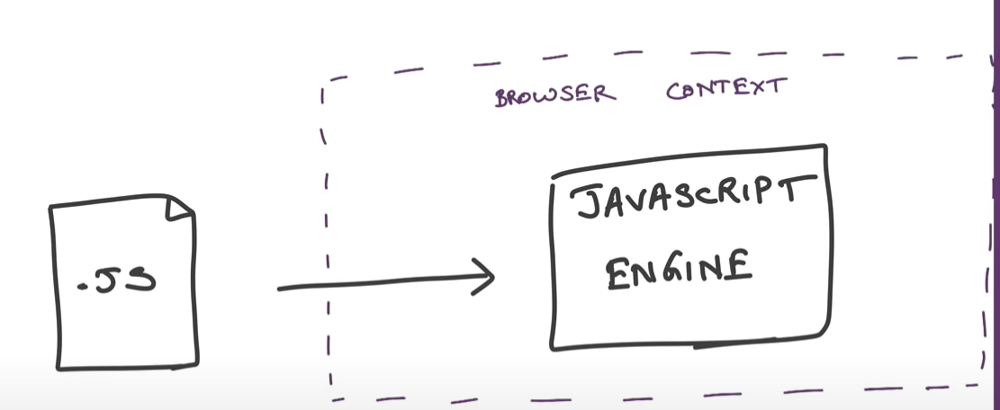
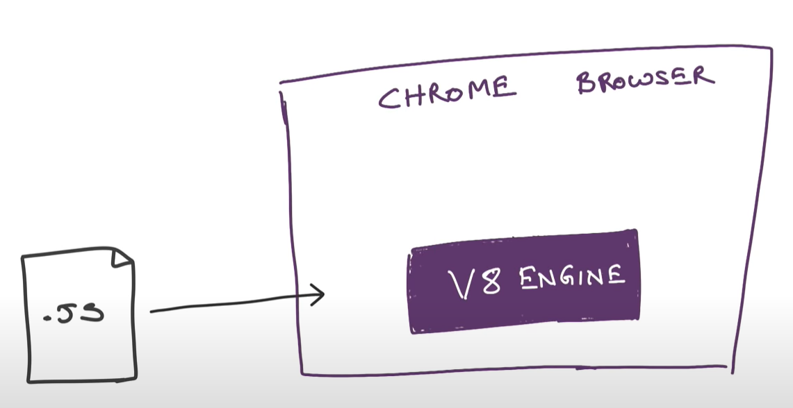
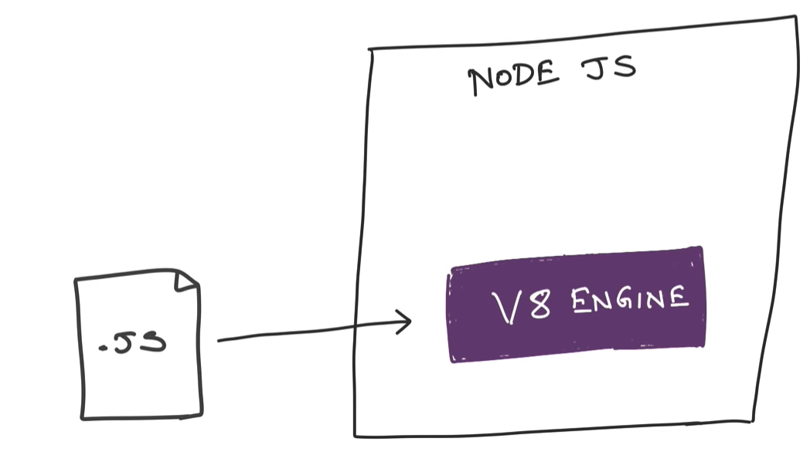
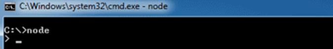
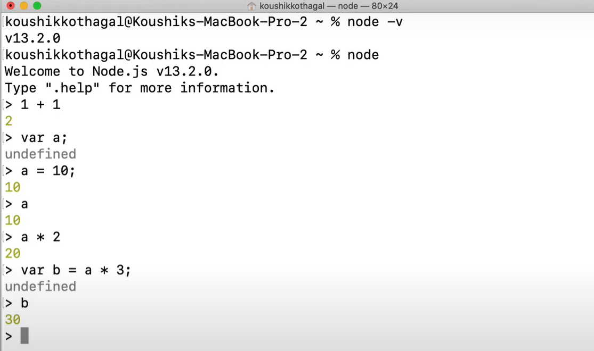
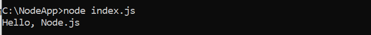
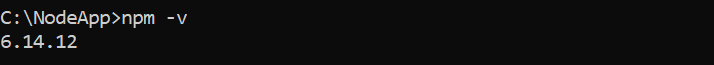
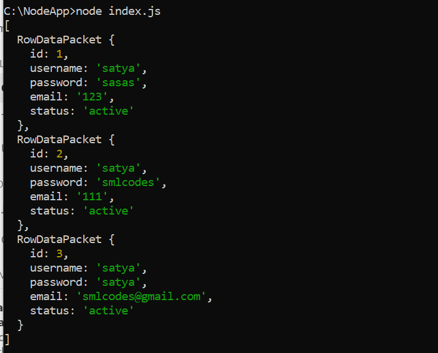

# Node.js

Node.js is an open-source server-side runtime environment built on Chrome's V8
JavaScript engine. It provides an event driven, non-blocking (asynchronous) I/O
and cross-platform runtime environment for building highly scalable server-side
applications using JavaScript.





Node.js can be used to build different types of applications such as command
line application, web application, real-time chat application, REST API server
etc.

## Architecture model

#### Normal Sever Request Processing

In Normal web server model, each request is handled by a dedicated thread from
the thread pool. If no thread is available in the thread pool, then the request
waits till the next available thread. 

#### Nodejs Request Processing

Node.js runs in a single process and the application code runs in a single
thread. All the user requests to your web application will be handled by a
single thread and all the I/O work or long running job is performed
asynchronously for a particular request.

So, this single thread doesn't have to wait for the request to complete and is
free to handle the next request. When asynchronous I/O work completes then it
processes the request further and sends the response.

An event loop is constantly watching for the events to be raised for an
asynchronous job and executing callback function when the job completes.


Node.js is not fit for an application which performs CPU-intensive operations
like image processing or other heavy computation work because it takes time to
process a request and thereby blocks the single thread.


<br>


## Node.js Console - REPL

Node.js comes with virtual environment called REPL (aka Node shell). REPL stands
for Read-Eval-Print-Loop. It is a quick and easy way to test simple
Node.js/JavaScript code.

To Start REPL, just type node





To execute JavaScript file from cmdline, use node <.js-filename>

```javascript
//index.js
console.log("Hello, Node.js");
```



<br>


## Node.js Basics

#### Variables

to create a variable in Node.js, you need to make use of a reserved keyword
**var**. You do not have to assign a data type, as **the compiler will
automatically pick it**.

#### Datatypes

Node.js has various datatypes, categorized into Primitive and Non-Primitive
datatypes.

**Primitive Data Types are:**

1.  String

2.  Number

3.  Boolean

4.  Null

5.  Undefined

var str = "Satya";

var num = 10;

All the Datatypes are taken care by compiler – based on data we are assigning,
we don’t need to define datatype manually.

**Non-Primitive Data Types are:**

1.  Object

2.  Date

3.  Array

```javascript
var obj = {
    authorName: 'Ryan Dahl',
    language: 'Node.js'
}
```


#### Buffer

Node.js includes an additional data type called Buffer (not available in
browser's JavaScript). Buffer is mainly used to store binary data, while reading
from a file or receiving packets over the network.

#### Functions

A function can have attributes and properties also. It can be treated like a
class in JavaScript.
```javascript
function Display(x) { 
    console.log(x);
}

Display(100);
```
 

#### Global Scope

In a browser, global scope is the **window** object.
```javascript
window.location = "http://www.yoururl.com";
```
In Node.js, **global** object represents the **global scope**.


<br>


## Node.js Modules

Module in Node.js is a simple or complex functionality organized in single or
multiple JavaScript files which can be reused throughout the Node.js
application.

Each module in Node.js has its own context, so it cannot interfere with other
modules or pollute global scope. Also, each module can be placed in a separate
.js file under a separate folder.

Node.js includes three types of modules:

1.  **Core Modules**

2.  **Local Modules**

3.  **Third Party Modules**


#### 1.Core Modules

Node.js is a lightweight framework. The core modules include bare minimum
functionalities of Node.js. These core modules are compiled into its binary
distribution and load automatically when Node.js process starts. However, you
**need to import the core module** first in order to use it in your application.

The following table lists some of the important core modules in Node.js.

| Core Module                                                | Description                                                                     |
|------------------------------------------------------------|---------------------------------------------------------------------------------|
| [**http**](https://nodejs.org/api/http.html)               | http module includes classes, methods and events to create Node.js http server. |
| [**url**](https://nodejs.org/api/url.html)                 | url module includes methods for URL resolution and parsing.                     |
| [**querystring**](https://nodejs.org/api/querystring.html) | querystring module includes methods to deal with query string.                  |
| [**path**](https://nodejs.org/api/path.html)               | path module includes methods to deal with file paths.                           |
| [**fs**](https://nodejs.org/api/fs.html)                   | fs module includes classes, methods, and events to work with file I/O.          |
| [**util**](https://nodejs.org/api/util.html)               | util module includes utility functions useful for programmers.                  |

In order to use Node.js core or NPM modules, you first need to import it using
`require()` function as shown below.
```javascript
var module = require('module_name');
```


As per above syntax, specify the module name in the `require()` function. The
require() function will return an object, function, property or any other
JavaScript type, depending on what the specified module returns.

The following example demonstrates how to use Node.js http module to create a
web server.
```javascript
var http = require('http');

var server = http.createServer(function(req, res){
  //write code here
});
server.listen(5000);
```


In the above example, require() function returns an object because http module
returns its functionality as an object, you can then use its properties and
methods using dot notation e.g. http.createServer().


#### 2.Local Module

Local modules are modules created locally in your Node.js application. These
modules include different functionalities of your application in separate files
and folders. You can also package it and distribute it via NPM, so that Node.js
community can use it.

For example, if you need to connect to MongoDB and fetch data then you can
create a module for it, which can be reused in your application.

##### Writing Simple Module

Let's write simple logging module which logs the information, warning or error
to the console.

log.js
```javascript
var log = {
            info: function (info) { 
                console.log('Info: ' + info);
            },
            warning:function (warning) { 
                console.log('Warning: ' + warning);
            },
            error:function (error) { 
                console.log('Error: ' + error);
            }
    };

module.exports = log
```

Loading Local Module – `app.js`
```javascript
var myLogModule = require('./log.js');

myLogModule.info('Node.js started');
```


Run the above example using command prompt (in Windows) as shown below.
```javascript
C:\\> node app.js  
Info: Node.js started
```


In the above example of logging module, we have created an object with three
functions - info(), warning() and error(). At the end, we have assigned this
object to module.exports. The `module.exports` in the above example exposes a log
object as a module.

The module.exports is a special object which is included in every JS file in the
Node.js application by default. Use **module.exports** or **exports** to expose
a function, object or variable as a module in Node.js.


#### 3.External Modules

You can use the external or 3rd party modules only by downloading them via
**NPM**. These modules are generally developed by other developers and are free
to use. Few of the best external modules are *express, react, gulp, mongoose,
mocha etc*.

## NPM - Node Package Manager

-   Node Package Manager (NPM) is a command line tool that **installs, updates
    or uninstalls** Node.js packages in your application.

-   It is also an **online repository** for open-source Node.js packages.

-   The node community around the world creates useful modules and publishes
    them as packages in this repository.

-   Official website: [https://www.npmjs.com](https://www.npmjs.com/)

NPM is included with Node.js installation. After you install Node.js, verify NPM
installation by writing the following command in terminal or command prompt.



**INSTALL PACKAGE LOCALLY**

Use the following command to install any third party module in your local
Node.js project folder.
```javascript
C:\\> npm install <package name>
```


For example, the following command will install ExpressJS into MyNodeProj
folder.
```javascript
C:\\MyNodeProj> npm install express
```


All the modules installed using NPM are installed under **node_modules** folder.
The above command will create ExpressJS folder under node_modules folder in the
root folder of your project and install `Express.js` there.


**Save package in package.json**

Use --save at the end of the install command to add dependency entry into
package.json of your application.
```javascript
npm install express --save
```


**Install Package Globally**

NPM can also install packages globally so that all the node.js application on
that computer can import and use the installed packages. NPM installs global
packages into <User>local/lib/node_modules folder.

Apply -g in the install command to install package globally. For example, the
following command will install ExpressJS globally.
```javascript
C:\\MyNodeProj> npm install -g express


\#\# Update package
npm update express


\#\# Uninstall package
npm uninstall express
```


## Nodejs Examples – Module by Module

Before going to code, we must create a project to write a code. For that use npm
init & Provide required input. It will create required files & package.json
```javascript
C:\\Nodeapp>  npm init
```


About to write to `C:\\NodeApp\\package.json:`

```json
{
  "name": "nodeapp",
  "version": "1.0.0",
  "description": "",
  "main": "index.js",
  "scripts": {
    "test": "node index.js"
  },
  "author": "Satya",
  "license": "ISC"
}
```


### Node.js Server - HTTP module 

Example 1: Create a Webserver

Node.js provides capabilities to create your own web server which will handle
HTTP requests asynchronously.
```javascript
// 1 - Import Node.js core module
var http = require('http');
 
// 2 - creating server
var server = http.createServer(function(req, res) {
  //Logic to handle requests  
});
 
//3 - listen for incoming requests on port 5000
server.listen(5000);
console.log('Server Started ....')
```

```javascript
c:\\\\NodeApp> node server.js  
Server Started…
```
This is how you create a Node.js web server using simple steps. Now, let's see
how to handle HTTP request and send response in Node.js web server.


#### Example 2 : Handle HTTP Request

The http.createServer() method includes
[request](https://nodejs.org/api/http.html#http_http_incomingmessage) and
[response](https://nodejs.org/api/http.html#http_class_http_serverresponse)
parameters which is supplied by Node.js.

-   request object can be used to get information about the current HTTP request
    e.g., url, request header, and data.

-   response object can be used to send a response for a current HTTP request.

```javascript
// Import Node.js core module
var http = require('http'); 

//create web server
var server = http.createServer(function (req, res) {   
    if (req.url == '/') { //check the URL of the current request
        
        // set response header
        res.writeHead(200, { 'Content-Type': 'text/html' }); 
        
        // set response content    
        res.write('<html><body><p>This is home Page.</p></body></html>');
        res.end();
    
    }
    else if (req.url == "/student") {        
        res.writeHead(200, { 'Content-Type': 'text/html' });
        res.write('<html><body><p>This is student Page.</p></body></html>');
        res.end();
    }
    else if (req.url == "/admin") {        
        res.writeHead(200, { 'Content-Type': 'text/html' });
        res.write('<html><body><p>This is admin Page.</p></body></html>');
        res.end();    
    }
    else
        res.end('Invalid Request!');

});

server.listen(5000); //6 - listen for any incoming requests

console.log('Node.js web server at port 5000 is running..')
```
In the above example,
*  `req.url` is used to check the url of the current request and based on that it sends the response. 

*  To send a response, first it sets the response header using writeHead() method and then writes a string as a response body using `write()` method. 

*  Finally, Node.js web server sends the response using `end()` method.


##### Example 3 : Sending JSON Response
```javascript
var http = require('http'); 

var server = http.createServer(function (req, res) {      
    if (req.url == '/data') { //check the URL of the current request
            res.writeHead(200, { 'Content-Type': 'application/json' });
            res.write(JSON.stringify({ message: "Hello World"}));  
            res.end();  
    }
});

server.listen(5000);
```


### Node.js File System – ‘fs’ module

Node.js includes **fs** module to access physical file system. The fs module is
responsible for all the asynchronous or synchronous file I/O operations.

Read files  
`fs.readFile(fileName [,options], callback)`


```javascript
var fs = require('fs');

fs.readFile('a.txt', 
    function (err, data) {
                    if (err){
                        throw err;
                    }
    console.log(data);
});
```

 
`fs.readFileSync('dummyfile.txt', 'utf8');`
```javascript
var fs = require('fs');

var data = fs.readFileSync('a.txt', 'utf8');
console.log(data);
```


##### Write to files

```javascript
## fs.writeFile(filename, data[, options], callback)
var fs = require('fs');

fs.writeFile('test.txt', 'Hello World!', function (err) { 
                        if (err)
        console.log(err);
                        else
        console.log('Write operation complete.');
});


## fs.appendFile('test.txt', 'Hello World!', callback) 
var fs = require('fs');
fs.appendFile('test.txt', 'Hello World!', function (err) { 
                        if (err)
        console.log(err);
                        else
        console.log('Append operation complete.');
});


Delete files		: fs.unlink(path, callback);
Rename files	: fs.rename(oldPath, newPath, callback)
```


### Node.js Database – MySQL Module 

You have to install MySQL driver to access a MySQL database with Node.js.

To download and install the "mysql" module, open the Command Terminal and
execute the following:
```javascript
npm install mysql
```


Exampale
```javascript
var mysql = require('mysql');
var con = mysql.createConnection({
  host: "localhost",
  user: "root",
  password: "root",
  database:"webapp"
});

//Create Connection 
/*
con.connect(function (err) {
  if (err) throw err;
  console.log("Connected!");
});

*/

con.connect(function (err) {
  if (err) throw err;
  con.query("SELECT * FROM user", function (err, result) {
    if (err) throw err;
    console.log(result);
  });
});
con.end;
```



Similarly, for MongoDB, we need to use 'mongodb' module.

```javascript
var MongoClient = require('mongodb').MongoClient;
var url = "mongodb://localhost:27017/MongoDatabase";
MongoClient.connect(url, function (err, db) {
  if (err) throw err;
  console.log("Database created!");
  db.close();
});

var http = require('http');
var MongoClient = require('mongodb').MongoClient;
var url = "mongodb://localhost:27017/MongoDatabase";
MongoClient.connect(url, function (err, db) {
  if (err) throw err;
  db.collection("employees").findOne({}, function (err, result) {
    if (err) throw err;
    console.log(result.name);
    db.close();
  });
});
```


### Events Module
<https://www.tutorialsteacher.com/nodejs/nodejs-eventemitter>


<br>


## Node.js – Frameworks

There are various third party open-source frameworks available in Node Package
Manager which makes Node.js application development faster and easy.

The following table lists frameworks for Node.js., Many more there… above are
few of them.

| Open-Source Framework                      | Description                                                                                                                                                                                                                                                                                                                 |
|--------------------------------------------|-----------------------------------------------------------------------------------------------------------------------------------------------------------------------------------------------------------------------------------------------------------------------------------------------------------------------------|
| [Express.js](https://expressjs.com/)       | Express is a minimal and flexible Node.js web application framework that provides a robust set of features for web and mobile applications. This is the most popular framework as of now for Node.js.                                                                                                                       |
| [Mojito](https://github.com/yahoo/mojito)  | This HTML5 framework for the browser and server from Yahoo offers direct MVC access to the server database through the local routines. One clever feature allows the code to migrate. If the client can't run JavaScript for some reason, Mojito will run it on the server -- a convenient way to handle very thin clients. |
| [Restify](http://mcavage.me/node-restify/) | Restify is a node.js module built specifically to enable you to build correct REST web services.                                                                                                                                                                                                                            |
| [Chocolate.js](https://chocolatejs.org/)   | Chocolate is a simple webapp framework built on Node.js using Coffeescript.                                                                                                                                                                                                                                                 |

## Node.js – Differences 

### Difference between Node.js and AngularJS

| **Node.js**                                                                                                                                                                  | **AngularJS**                                                                                                                                 |
|------------------------------------------------------------------------------------------------------------------------------------------------------------------------------|-----------------------------------------------------------------------------------------------------------------------------------------------|
| You have to install Node.js on your computer system to use it further for creating web or chat applications.                                                                 | You have to add the AngularJS file just like any other JavaScript file to use it in applications. It doesn’t need to be installed separately. |
| Node.js supports non-blocking input output I/O and follows an event driven architecture. It is used to create real-time applications such as instant messaging or chat apps. | AngularJS is completely written in JavaScript. It is mainly used to create single-page client-side applications.                              |
| Node.js is a platform built on the top of Google's V8 JavaScript engine.                                                                                                     | AngularJS is an open source framework, follows the syntax of JavaScript and developed by Google.                                              |
| Node.js is written in C, C++ and JavaScript languages.                                                                                                                       | AngularJS is written completely in JavaScript, but it is different from other web application frameworks like jQuery.                         |
| Node.js has a lot number of frameworks such as Express.js, Sails.js, Partial.js etc.                                                                                         | AngularJS itself is a web application framework of JavaScript.                                                                                |


## Ref.

<https://www.tutorialsteacher.com/nodejs/nodejs-tutorials>
