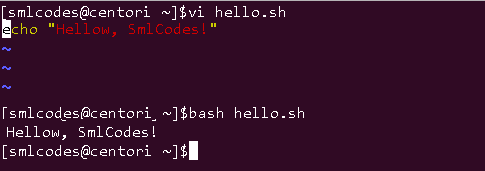
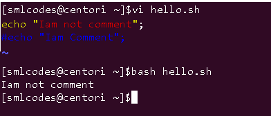

 1.Shell Introduction
----------------------

An Operating is made of many components but its two main components are -

-   Kernel

-   Shell

## Types of Shell

A shell in a Linux operating system takes input from you in the form of
commands, processes it, and then gives an output. There are two main shells in
Linux:

**1**. **The** **Bourne Shell**: The prompt for this shell is **$** and its
derivatives are listed below:

-   POSIX shell  also known as sh

-   Korn Shell also known as sh

-   **B**ourne **A**gain **SH**ell also known as bash (most popular)

**2.** **The C shell**: The prompt for this shell is % and its subcategories
are:

-   C shell also known as csh

-   Tops C shell also known as tcsh


Steps to write the Shell Script
----------------------------------

1.  **Create a file** **using** a **vi** editor(or any other editor). 

2.  Name  script file with **extension .sh**

3.  **Start** the script with **#! /bin/sh**

4.  Write the code.

5.  Save the script file as filename.sh

6.  For **executing** the script type **bash filename.sh**

"\#!" is an operator called shebang, which directs the script to the interpreter
location. So, if we use"\#! /bin/sh" the script gets directed to the
bourne-shell.



#### 1. Shell comments(\#)

Comment means, that line will not take part in script execution. . In Shell, the
syntax to add a comment is

\#comment



#### 2.Shell Variables

A variable in a unix script can be assigned any type of value, such as a text
string or a number. In unix to create a variable, we simply put in our script: 

>   VARIABLE_NAME=value

To use the variable, we simply put a dollar sign **"$"** before the name of the
variable in our script code

>   $VARIABLE_NAME

```bash
[smlcodes@centori ~]$vi hello.sh                                     
a=Satya;
b=Kaveti;                                                                                  
echo $a;                                                                          
echo $b;
:wq

[smlcodes@centori ~]$bash hello.sh                                                
Satya                                                                             
Kaveti                                                                            
[smlcodes@centori ~]$
```


We can also assign variable value from user by using “read". See below example
```bash
[smlcodes@centori ~]$vi hello.sh                                 
echo "What is your name?"
read name
echo "How old are you?"
read age
echo "Your name is : $name, age is : $age"

[smlcodes@centori ~]$bash hello.sh                                                
What is your name?                                                                
Satya                                                                             
How old are you?
27
Your name is : Satya, age is : 27
[smlcodes@centori ~]$
```


2.Shell Control Statements
---------------------------

#### 1.if -then -else

The if then else condition loop states that **if** condition meets, output goes
to if part otherwise it goes to **else** part. The word **fi** represents if
loop termination .
```bash
Syntax:
If [CONDITION]
then
	“Statements"
else
	“Statements"
fi

Example
-------------------
[smlcodes@centori ~]$vi con.sh                                                    
echo "Enter a Value"
read a

echo "Enter b value"
read b

if(a>b)
then
        echo "a: $a, is BIG";
else
        echo "b: $b, is BIG";
[smlcodes@centori ~]$bash con.sh                                                  Enter a Value                                                                     
100                                                                               
Enter b value                                                                     
200                                                                               
b= 200, is BIG                                                                    
[smlcodes@centori ~]$
```


#### 2. if then elif
```bash
If [CONDITION]
then
	“Statements"

elif[Condition]
	“Statements"

else
“Statements"
fi

Example
----------------------------------------
echo "Please enter your age:"
read AGE
if [ "$AGE" -lt 20 ] || [ "$AGE" -ge 50 ]; then
	echo "Sorry, you are out of the age range."
elif [ "$AGE" -ge 20 ] && [ "$AGE" -lt 30 ]; then
	echo "You are in your 20s"
elif [ "$AGE" -ge 30 ] && [ "$AGE" -lt 40 ]; then
	echo "You are in your 30s"
elif [ "$AGE" -ge 40 ] && [ "$AGE" -lt 50 ]; then
	echo "You are in your 40s"
fi
```

#### 3. For Loops

**for** loops iterate through a set of values until the list is exhausted:
```bash
#!/bin/sh
for i in 1 2 3 4 5
do
  echo "Looping ... number $i"
done
```


#### 4. while loop

While execute set of statements until the conditions are TRUE

```bash
Syntax:
while [ conditions ] ; 
do 
statements ; 
done

Example
--------------------------
ANSWER=5          # The correct answer
echo "Guess a number between 1 and 10. "
while read NUM
do
        # Validate the input...
        if [ "$NUM" -lt 1 ] || [ "$NUM" -gt 10 ]; then
                echo "The number must be between 1 and 10! Guess again. "
        elif [ "$NUM" -eq "$ANSWER" ]; then
                echo "You got the answer correct!"
                exit
        else
                echo "Incorrect, guess again. "
        fi
done
```

#### 5. case 

A case construct helps us to simplify nested if statement. You can match several
variables against one variable. Each case is an expression matching a certain
pattern.

**Example:**
```bash
echo "Enter a number between 1 and 10. "
read NUM
case $NUM in
	1) echo "one" ;;
	2) echo "two" ;;
	3) echo "three" ;;
	4) echo "four" ;;
	5) echo "five" ;;
	6) echo "six" ;;
	7) echo "seven" ;;
	8) echo "eight" ;;
	9) echo "nine" ;;
	10) echo "ten" ;;
	*) echo "INVALID NUMBER!" ;;
esac
```


3.Shell Functions
------------------

Overall functionality of a function can be divided into smaller or logical
parts, which can be called to perform their task

#### Simple function
```bash
Syntax to create a function:
 function functionName () {  
        Commands to be executed  
}  
Syntax to calling a function
functionName

[smlcodes@centori ~]$vi fun.sh

#Creating function
function hello(){
echo "Hello, Smlcodes";
}
                                                                                  
#calling function
hello 
                                                    
[smlcodes@centori ~]$bash fun.sh 
Hello, Smlcodes
[smlcodes@centori ~]$vi fun.sh
```

#### Passing parameters to functions

You can pass one or more parameters in a function. Parameters will be defined as
$1, $2 and so on.
```bash
#Creating function
function hello(){
echo "Hello, Smlcodes- Values $1, $2";
}
                                                                                  
#calling function
hello 100 200

[smlcodes@centori ~]$bash fun.sh 
Hello, Smlcodes- Values 100, 200
```


# 4.Shell Files
 

Reading and writing files in linux is simple, you just use the standard
utilities for reading files such
as **cat**, **grep**, **tail**, **head**, **awk** etc.. Moreover, you primarily
use the output redirect operator **>** and standard commands like **sed** for
writing files.

Let's say we want to write a program that interacts with a user data file called
users.dat.
```bash
#!/bin/sh

OP=$1

if [ "$1" == "-a" ]; then
	ID=$2
	FIRST=$3
	LAST=$4
	AGE=$5
	
	echo "$ID,$FIRST,$LAST,$AGE" >> users.dat
	echo "User Added"
	
elif [ "$1" == "-l" ]; then
	cat users.dat
fi
```


The code for this is very simple. To add a user you simple use **echo** to print
out the fields with commas between them, then you redirect the output using
the **>>** operator. Using the **>** will redirect the output STDOUT to a
file and overwrite the entire file, this is why we use **>>**instead, because
it will append to a file instead of overwriting the file. And to print out the
file, we simply use the **cat** command, which will print out a file to the
console.

Now let's add some users to have a test data set. Let's call the script
users.sh.
```bash
./users.sh -a jsmith John Smith 25
./users.sh -a adoe Ann Doe 32
./users.sh -a bgates Bob Gates 17
./users.sh -a kmelvin Kay Melvin 47
./users.sh -a jgamez Joe Gamez 24
./users.sh -a msmith Mike Smith 18
./users.sh -a svai Steve Vai 42
```


This gave us a nice data set, so now if we want to print out the users, we can
use the -l option which gives us this list of data:
```bash
jsmith,John,Smith,25
adoe,Ann,Doe,32
bgates,Bob,Gates,17
kmelvin,Kay,Melvin,47
jgamez,Joe,Gamez,24
msmith,Mike,Smith,18
svai,Steve,Vai,42
```

As you can see, reading and writing files in unix is simple, next we will see
how to search and sort data

5.Shell Best practices
-----------------------

#### Substrings

Often times a programmer needs to be able to get a substring from a variable at
a given position. In unix you can use the **expr** command to do this with
the **substr** parameter. Let's say that we have the text string
"5283username$$2384/" and we want to get the text "username". To do this we
need to read from position 5 for a length of 8. The parameters
for **substr** are the input string, the starting position, and the length. See
the following example: 
```bash
#!/bin/sh

INPUT="5283username$$2384/"

USER=`expr substr $INPUT 5 8`

echo "Sub: '$USER'"
```


Sometimes you need to find text in a string. Maybe you want to list files but
print only the text appearing before the ".". So if the filename is asdf.txt,
you would want to print only asdf. To do this, you will use **expr index**, and
pass it the string followed by the text for which you are searching. Let's try
an example: 
```bash
#!/bin/sh

# Get the files:
FILES=`ls -1`

for FILE in $FILES
do
	IDX=`expr index $FILE .`

	if [ "$IDX" == 0 ]; then
 IDX=`expr length $FILE`
	else
 IDX=`expr $IDX - 1`
	fi

	SUB=`expr substr $FILE 1 $IDX`
	echo "Sub File: $SUB"
done
```

If the substring doesn't exist, 0 is returned. If 0 is returned, we want to make
the IDX variable the length of the name so that we just display the whole
filename. If a dot is found in the file, we want to subtract 1 from
our **$IDX** variable because we don't want to display the dot. 

#### To lower/upper case

If you want to transform a string to upper or lower case, you can do so with the
unix **tr** command. Here's a simple example. 
```bash
#!/bin/sh

STR_ORIGINAL=aBcDeFgHiJkLmNoP
STR_UPPER=`echo $STR_ORIGINAL | tr a-z A-Z`
STR_LOWER=`echo $STR_ORIGINAL | tr A-Z a-z`

echo "Original: $STR_ORIGINAL"
echo "Upper   : $STR_UPPER"
echo "Lower   : $STR_LOWER"
```


#### Editing a file with sed

If you want to edit a file from within your script, you can use the
unix **sed** command. It will take a regular expression and a filename and put
the file manipulations to standard output. For instance, let's say that we have
a file with two fields "username" and "home directory". All the home directories
start with "/home", but what if the admin changes the location of the "/home"
directory to "/usr/local/home". We can have sed automatically update our file.
Here is the file, save it as testfile2. 
```bash
user1 /home/user1
root /home/root
user2 /home/user2
user3 /home/user3
```


We want our regular expression to search for "/home" and replace it with
"/usr/local/home", a search expression is in the following format:
"s/find/replace/", where "find" is the string you are searching for and
"replace" is what you want to replace it with. Since the **/** character is a
special character, we will need to escape it with a backslash in our find and
replace strings. Here is the command we will use to do the file edit: 
```bash
$ sed "s\/home\/usr\/local\/home/" testfile2 > tmp; cp tmp testfile2 
$ cat testfile2 
user1 /usr/local/home/user1
root /usr/local/home/root
user2 /usr/local/home/user2
user3 /usr/local/home/user3
```


Notice that we redirect the output of sed to a file named **tmp**, we then on
the same line copy the tmp file over the testfile2 file. We cannot specify
testfile2 to be the output since it is also being read from by sed during the
command. On the next line we **cat** the output and you can see the file
modifications.

#### Automating another application

Sometimes we may want to automate another program or script. If the other script
expects user input, we may want to write a script to automatically fill in that
information. First let's create a simple program that accepts a user name and
password: 
```bash
#!/bin/sh

#Grab user name:
echo "user: "
read USER

#Grab password:
echo "pass: "
read PWD

if [ "$USER" == "dreamsys" ] && [ "$PWD" == "soft" ]; then
	echo "Login Success!"
else
	echo "Login Failed!"
fi
```

Save this file as **up.sh**. Now we need to create a script to automate this
script. To do this, all we need to do is output the user name followed by the
password to the command line, we will pass these as two parameters: 
```bash
#!/bin/sh
USER=$1
PWD=$2

echo $USER
echo $PWD
```


Now to run this automation script, we simply need to pipe the output to
the **up.sh** script. First we will try to run it with an invalid user and
password, then we will try to run it with the correct user and password: 
```bash
$ ./auto.sh testuser testpass | ./up.sh
user:
pass:
Login Failed!
$ ./auto.sh dreamsys soft | ./up.sh
user:
pass:
Login Success!
```
