## **1. Introduction -SonarQube Tutorial**

[SonarQube](http://en.wikipedia.org/wiki/SonarQube)  (previously known as Sonar)
is an open source platform for **Continuous Inspection of code** quality. It is
written in java and supported for **25+ languages** such as Java, C/C++, C\#,
PHP, Flex, Groovy, JavaScript, Python, PL/SQL, COBOL, etc, it is also used for
Android Development


**1.1  SonarQube Architecture**  
The SonarQube Platform is made of 4 components:

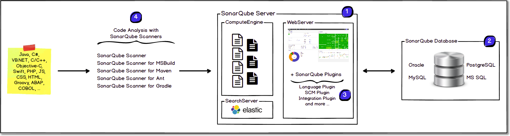

 

1.One **SonarQube Server** starting 3 main processes:

-   **Web Server** for developers, managers to browse quality snapshots and
    configure the SonarQube instance

-   **Search Server** based on Elasticsearch to back searches from the UI

-   **Compute Engine Server** in charge of processing code analysis reports and
    saving them in the SonarQube Database


2.One **SonarQube Database** to store:

-   The configuration of the SonarQube instance (security, plugins settings,
    etc.)

-   The quality snapshots of projects, views, etc.


3.Multiple **SonarQube Plugins** installed on the server, possibly including
language, SCM, integration, authentication, and governance plugins


4.One or more**SonarQube Scanners** running on your Build / Continuous
Integration Servers to analyze projects

 

**1.2 SonarQube Integration**

The following schema shows how SonarQube integrates with other ALM tools and
where the various components of SonarQube are used.

1.  Developers code in their IDEs and
    use [SonarLint](http://en.wikipedia.org/wiki/SonarQube) to run the local
    analysis.

2.  Developers push their code into their favorite SCM: git, SVN, TFVC, ...

3.  The Continuous Integration Server triggers an automatic build, and the
    execution of the SonarQube Scanner required to run the SonarQube analysis.

4.  The analysis report is sent to the SonarQube Server for processing.

5.  SonarQube Server processes and stores the analysis report results in the
    SonarQube Database and displays the results in the UI.

6.  Developers review, comment, challenge their Issues to manage and reduce
    their Technical Debt through the SonarQube UI.

7.  Managers receive Reports from the analysis.  
    Ops use APIs to automate configuration and extract data from SonarQube.  
    Ops use JMX to monitor SonarQube Server.

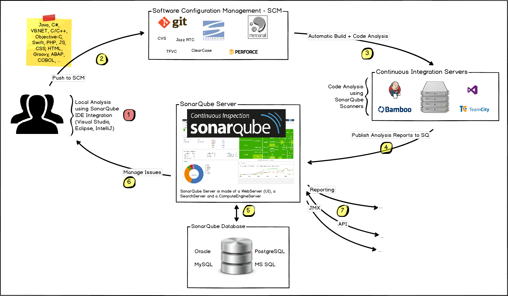

 


## **2. Installation & Configuration**

**1.**[Download](http://www.sonarsource.org/downloads/) and unzip the SonarQube
distribution (let's say in "C:\\sonarqube" or "/etc/sonarqube")


**2.Start the SonarQube server as follows**
```bash
# On Windows, execute:
C:\sonarqube\bin\windows-x86-xx\StartSonar.bat
 
# On other operating system, execute:
/etc/sonarqube/bin/[OS]/sonar.sh console
```


3.It will Open the command prompt & you can observe the message once it is ready
like.“SonarQube is up"
```bash
jvm 1    | 2017.03.21 18:18:36 INFO  app[][o.s.p.m.Monitor] Process[web] is up
jvm 1    | 2017.03.21 18:18:36 INFO  app[][o.s.p.m.JavaProcessLauncher] Launch p
rocess[ce]: E:\Users\SmlCodes\Desktop\Java\JDK 8.0\jre\bin\java -Djav
a.awt.headless=true -Dfile.encoding=UTF-8 -Xmx512m -Xms128m -XX:+HeapDumpOnOutOf
MemoryError -Djava.io.pngdir=C:\DevOps\sonarqube\temp -javaagent:E:\Users\smlcodes
_s.SmlCodes\Desktop\Java\JDK 8.0\jre\lib\management-agent.jar -cp ./lib/common
/*;./lib/server/*;./lib/ce/*;C:\DevOps\sonarqube\lib\jdbc\h2\h2-1.3.176.jar org.
sonar.ce.app.CeServer C:\DevOps\sonarqube\temp\sq-process5966313576283705229prop
erties
jvm 1    | 2017.03.21 18:18:55 INFO  app[][o.s.p.m.Monitor] Process[ce] is up
jvm 1    | 2017.03.21 18:18:55 INFO  app[][o.s.application.App] SonarQube is up
```

4.Once it is up, open <http://localhost:9000/> from the browser to access
SonarQube

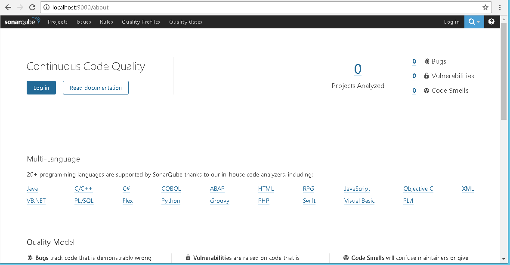


5.You can Login by using default [System
administrator](https://docs.sonarqube.org/display/SONAR/Authorization) credentials
**admin/admin**


**6.9000** is the default port and can be changed in
```bash
SONAR_HOME\conf\sonar.properties
```

 

### **2.1 Configure MySQL Database with SonarQube**

1.Go to [MySQL website](https://www.mysql.com/downloads/), **download & Install
MySQL Server Database**

2.Login to MySQL database

3.Create new Database. For Ex: **CREATE DATABASE** \`sonarqube\`;

4.Go To SonarQube config folder location(C:\\DevOps\\sonarqube\\conf) edit
sonar.properties file and **uncomment** the following line for MySql and save it
```bash
sonar.jdbc.url=jdbc:mysql://localhost:3306/sonar?useUnicode=true&
characterEncoding=utf8&rewriteBatchedStatements=true&useConfigs=maxPerformance
```


5.Start the sonar server by executing
`C:\DevOps\sonarqube\bin\windows-x86-64\StartSonar.bat`


 

### **2.2 SonarQube Runner**

[SonarQube
Runner](https://docs.sonarqube.org/display/SONARQUBE45/Installing+and+Configuring+SonarQube+Runner)
 Download the latest version of SonarQube runner from and unzip to the desired
location. SonarQube Runner is recommended as the default launcher to analyze a
project with SonarQube.

 

1.Set a new environment variable as **SONAR_RUNNER_HOME**. And its value should
be the unzipped path of **sonar-runner zip file**.
Example,**“C:\\DevOps\\sonar-runner-2.4"** don’t put the semicolon (;)

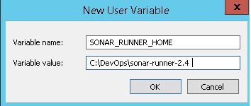

 

**2**.Append Sonar Runner’s bin path **(%SONAR_RUNNER_HOME%\\bin)** to the
environment variable **“PATH".**

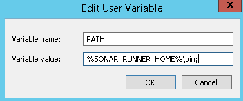

 

3.Uncomment the following lines in the property file,
‘C:\\DevOps\\sonar-runner-2.4\\conf\\sonar-runner.properties’ and save it.
```bash
#----- Default SonarQube server
 sonar.host.url=http://localhost:9000

 
#----- MySQL sonar.jdbc.url=jdbc:mysql://localhost:3306/sonar?useUnicode=true&amp;characterEncoding=utf8
```

 

## **3. Analyzing Source Code**  
SonarQube can perform analysis on [20+ different
languages](https://docs.sonarqube.org/display/PLUG/Plugin+Library). The outcome
of this analysis will be quality measures and issues (instances where coding
rules were broken). However, what gets analyzed will vary depending on the
language

-   On all languages, "blame" data will automatically be imported from supported
    SCM providers. Git and SVN have supported automatically. Other providers
    require [additional
    plugins](https://docs.sonarqube.org/display/PLUG/Plugin+Library).

-   On all languages, a static analysis of source code is performed (Java files,
    COBOL programs, etc.)

-   A static analysis of compiled code can be performed for certain languages
    (*.class*files in Java, *.dll* files in C\#, etc.)

-   A dynamic analysis of code can be performed on certain languages.


During analysis, data is requested from the server, the files provided to the
analysis are analyzed, and the resulting data is sent back to the server at the
end in the form of a report, which is then analyzed asynchronously server-side.


 

**3.1 Running Analysis**  
First, you should install the plugin(s) for the language(s) of the project to be
analyzed, either by [a direct
download](https://docs.sonarqube.org/display/PLUG/Plugin+Library) or through
the [update center](https://docs.sonarqube.org/display/SONAR/Update+Center).


Then, you need to choose an analysis method. The following are available:

-   [SonarQube
    Scanner](https://docs.sonarqube.org/display/SCAN/Analyzing+with+SonarQube+Scanner): Launch
    analysis from the command line

-   [SonarQube Scanner for
    MSBuild](https://docs.sonarqube.org/display/SCAN/Analyzing+with+SonarQube+Scanner+for+MSBuild): Launch
    analysis of .Net projects

-   [SonarQube Scanner for
    Ant](https://docs.sonarqube.org/display/SCAN/Analyzing+with+SonarQube+Scanner+for+Ant):
    Launch analysis from Ant

-   [SonarQube Scanner for
    Maven](https://docs.sonarqube.org/display/SCAN/Analyzing+with+SonarQube+Scanner+for+Maven):
    Launch analysis from Maven with minimal configuration

-   [SonarQube Scanner for
    Gradle](https://docs.sonarqube.org/display/SCAN/Analyzing+with+SonarQube+Scanner+for+Gradle)**:**
    Launch Gradle analysis

-   [SonarQube Scanner For
    Jenkins](https://docs.sonarqube.org/display/SCAN/Analyzing+with+SonarQube+Scanner+for+Jenkins)**:**
    Launch analysis from Jenkins

**We can add any plugins by downloading jars and places**
sonarqube\\extensions\\plugins folder


 

**3.2 Using the Update Center behind a Proxy**  
Update Center uses HTTP(S) connections to external servers to provide these
services. If SonarQube is located behind a proxy, additional information must be
provided in the *SONAR_HOME/conf/sonar.properties* configuration file:
```bash
http.proxyHost=<your.proxy.host>
http.proxyPort=<yout.proxy.port>

#If proxy authentication is required
http.proxyUser=<your.proxy.user>
http.proxyPassword=<your.proxy.password>
```

 

**3.3 SonarQube Java Project Configuration**

1.Go to the root folder of the Java Project to be analyze

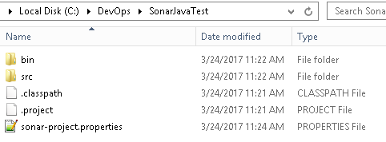


2.Create  **‘sonar-project.properties’** file  under the root folder of the
project


3.Provide project details in sonar-project.properties like below
```plaintext
sonar.projectKey=SonarJavaTest
sonar.projectName=Sonar Java Test
sonar.projectVersion=1.0 
sonar.sources=.
```


4.Go to the project root folder through the Command prompt


5.Execute the command **‘sonar-runner -e’.**

-   ‘-e’ option is useful when some error occurs and it gives the stack trace.

-   ‘-X’ options will run it in debug mode.

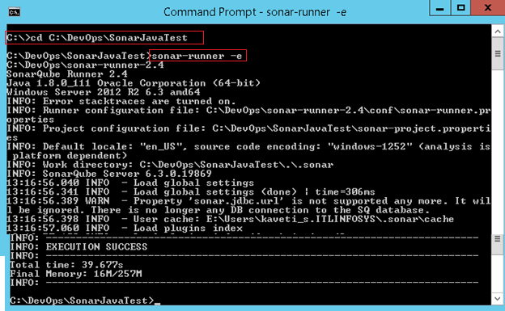


6.Once the analysis is successful, launch the sonar web application
<http://localhost:9000> and login as administrator.


7.Go to <http://localhost:9000/projects> it will show the summary of the
analysis of the project.

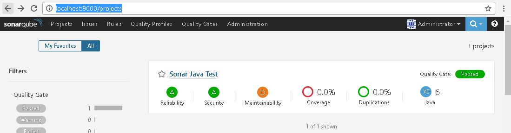


8.By Clicking on the Sonar Java Test, you can get the more details about the
project

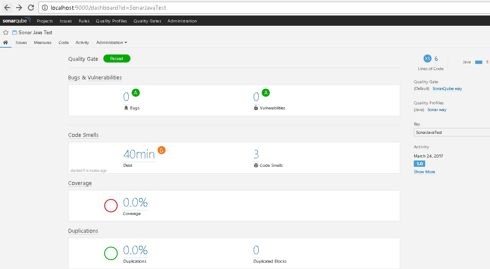


9.If you want to run the analysis in module wise just change
**sonar-project.properties’** file as below
```plaintext
sonar.projectKey=Project Name
sonar.projectName= Project project
sonar.projectVersion=1.0 
sonar.sources=. 
sonar.modules=Module1, Module2,Module3
Module1.projectName=Module 1
Module2.projectName=Module 2
Module3.projectName=Module 3
```

-   [SonarQube Ant Project
    Configuration](http://localhost:6666/sml/devops/sonarqube-ant-project-configuration/)

-   [SonarQube Maven Project
    Configuration](http://localhost:6666/sml/devops/sonarqube-maven-project-configuration/)

-   [SonarQube Eclipse Configuration with SonarLint
    Plugin](http://localhost:6666/sml/devops/sonarqube-eclipse-configuration-with-sonarlint-plugin/)


## SonarQube Eclipse Configuration with SonarLint Plugin

**SonarQube Eclipse Configuration with SonarLint Plugin**

The SonarQube Eclipse plugin does not work with SonarQube 5.2+. It is replaced
by [SonarLint for Eclipse](http://www.sonarlint.org/eclipse/index.html)**.**
SonarLint is an Eclipse plugin that provides on-the-fly feedback to developers
on new bugs and quality issues injected into Java, JavaScript, and PHP code. To
Configure SonarLint in eclipse follow below steps.


1.Open Eclipse IDE


2.Choose any one from below Options

-   open browser, navigate to
    <https://marketplace.eclipse.org/content/sonarlint> & Drag Install button
    from marketplace to Eclipse IDE

    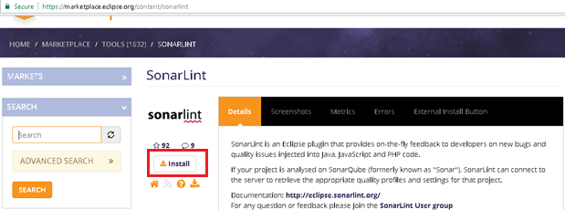


-   Go to **Help > Eclipse Marketplace...** and search for "SonarQube"

    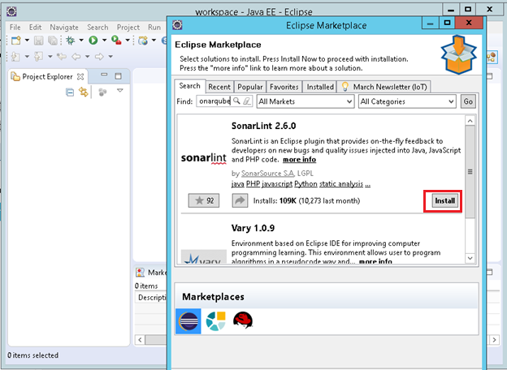


**3.Select the Features and Confirm Installation**

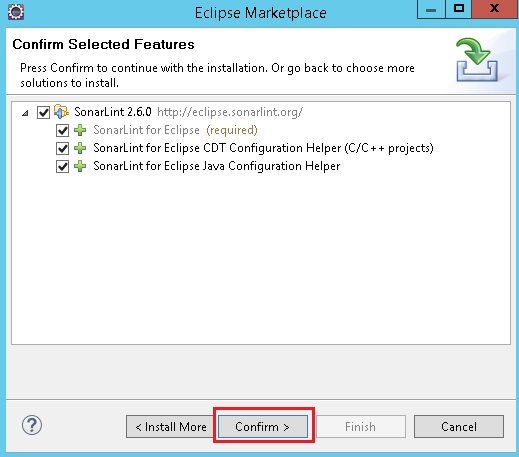


**4.Accept the license, Finish the Installation and restart Eclipse**

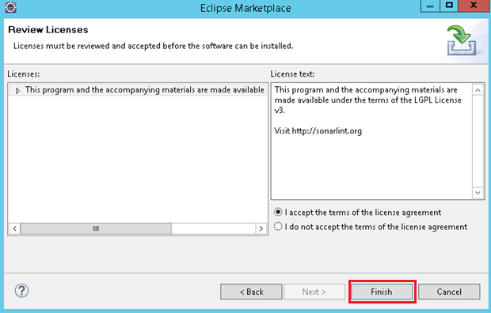


### **Add SonarQube Server to Eclipse**

To add SonarQube Server to Eclipse do following things

1.Select **File → New → Other →  SonarLint → New Server → Next → fill the
details**

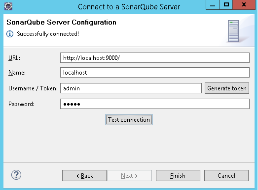

**2.Test the Connection & Finish**


## **Configuring Eclipse Project with SonarLint plugin**

1.Select Project to be Configure SonarLint, for Ex: SonarJava as below

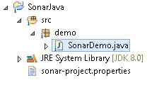

2.Navigate to root folder of the project & run **sonar-runner -e**


3.Open <http://localhost:9000/projects> check whether it is analyzed or not

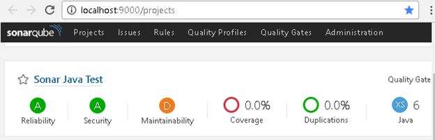


**4.If analyzed, Right Click on Project & Select → SonarLint →Bind to SonarQube
Object & Select appropriate SonarQube Project from the Server & Finish**

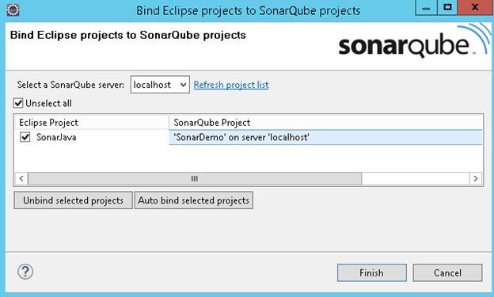


### **Analyze Eclipse Project with SonarLint plugin**

Do some changes in the files or add new Files to the Project & analyze project
by

**Right Click on Project & Select → SonarLint →Analized Changed files**


Go to project home page in SonarQube for Ex:
<http://localhost:9000/dashboard?id=SonarDemo> and see the changes

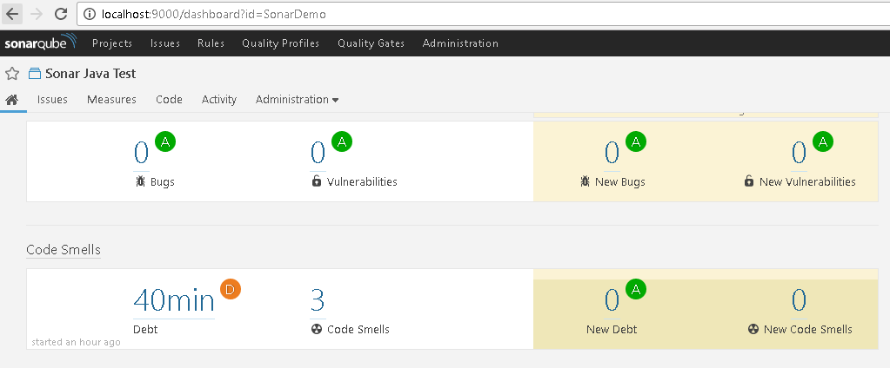


## SonarQube Maven Project Configuration


1.Install & Configure [Apache Maven](https://maven.apache.org/download.cgi) in
your local system


2.Go to Maven conf folder change the **settings.xml** by adding sonar details
```plaintext
<settings>
    <profiles>
        <profile>
            <id>sonar</id>
            <activation>
                <activeByDefault>true</activeByDefault>
            </activation>
            <properties>
<!-- Optional URL to server. Default value is http://localhost:9000 -->
                <sonar.host.url>
                  http://myserver:9000
                </sonar.host.url>
            </properties>
        </profile>
     </profiles>
</settings>
```

3.Chose the Java Maven Project for Analyzing Source Code. Ex:**MavenWeb** as
below

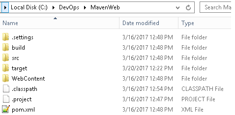


4.Open **pom.xml** & Configure sonar plugin as below
```plaintext
<plugin>
        <groupId>org.codehaus.mojo</groupId>
        <artifactId>sonar-maven-plugin</artifactId>
        <version>2.7</version>
 </plugin>
```


5.Open the command prompt, navigate to your maven project, and start giving the
following commands

**mvn clean verify sonar:sonar**

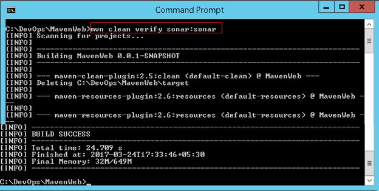


6.open <http://localhost:9000/projects> it will display the analysis report

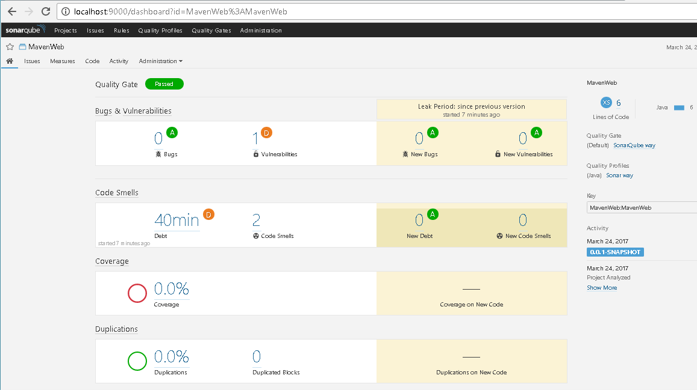
