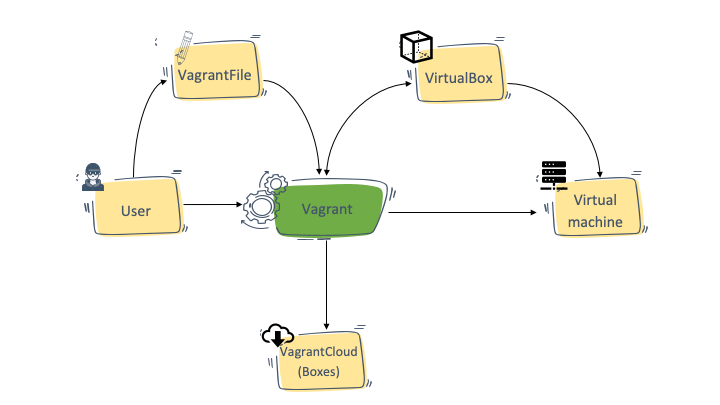
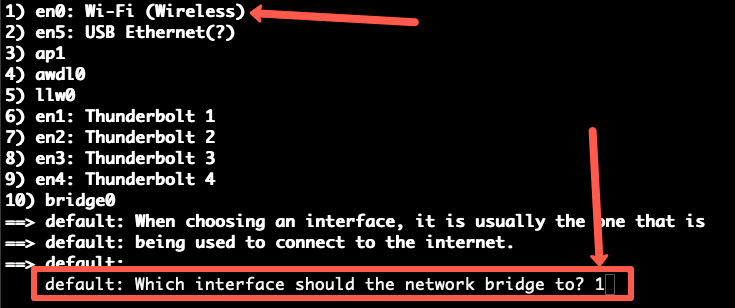
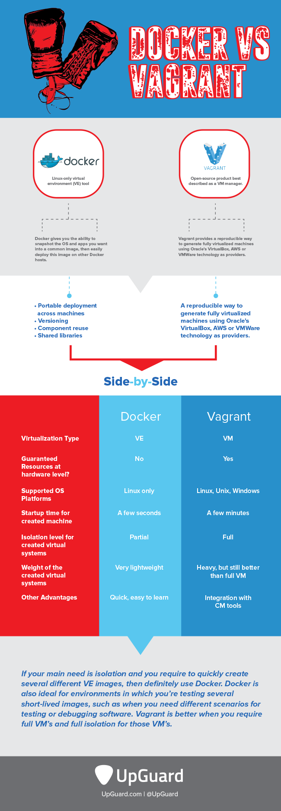

Vagrant
=======


What is Vagrant?
----------------

[Vagrant](https://www.vagrantup.com/) is an open-source utility created by guys in Hashicorp.

It is a wrapper utility that works on top of Virtual machine solutions like Virtualbox, HyperV, VMware, and also Docker. It abstracts away all the complex activities involved in managing a VM through the VM solutions and can automate most of the tasks.

### Vagrant Architecture

 

### Vagrantfile

Using Vagrant, you can easily create virtual development environments from exiting VM images and have all the VM configs in a configuration file called Vagrantfile. To put it simply, you define everything you need in a VM in the Vagrantfile, and Vagrant will take care of configuring those in the VM.

Here is an example Vagrantfile,

```
# -*- mode: ruby -*-
# vi: set ft=ruby :

Vagrant.configure("2") do |config|

    config.vm.box = "ubuntu/trusty64"

    config.vm.network "private_network", ip: "192.168.33.10"

    config.vm.provider "virtualbox" do |vb|
      vb.memory = "1024"
    end
end
```

If someone has Vagrant installed on their system, you can share the Vagrantfile with them and they can build a similar VM you have created. A similar workflow like [how Docker Works](https://devopscube.com/what-is-docker/)

### Vagrant Boxes

In the sample Vagrantfile, you can see a parameter named "`config.vm.box`".

The vagrant box is a prebaked Virtual machine image (Ubuntu, Centos, etc). This box format can be shared with anyone who uses Vagrant.

You can download readily available community boxes from [Vagrantcloud](https://app.vagrantup.com/boxes/search)

You can also add shell scripts or use chef cookbooks, puppet modules, or [Ansible](https://devopscube.com/install-configure-ansible-server-nodes/) playbooks to the Vagrantfile to [automate the VM configuration](https://devopscube.com/devops-tools-for-infrastructure-automation/) process. You can then package the box with all configurations and share it with other team members.

Vagrant Use Cases
-----------------

Following are the real world use cases for Vagrant

1.  Development Environments: Let's say you want identical development environments for all the developers in a team. In this case, you can create a common Vagrantfile with all the configs required to provision the VM with development environment dependencies (Softwares). And then share the Vagrantfile with all the developers. This way, there will not be any change in the underlying software or configs used. Some companies host Vagrant boxes in a common location for different approved software so that everyone in the organization can use it.

2.  Sandboxed environments: If you want a sandboxed environment for testing, you could use Vagrant to spin up and destroy VMs in minutes.

Prerequisites
-------------

1.  You should have a virtual box installed. You can download the latest Virtualbox setup from here <https://www.virtualbox.org/wiki/Downloads>
2.  You should have root access to install the software on your workstation.
3.  Open internet access to download a few software and VM images.
4.  Your workstation should have more than 4 GB of RAM.

Installing Vagrant
------------------

Step 1: Download the vagrant installation file from <https://www.vagrantup.com/downloads>

Step 2: Install Vagrant from the downloaded file based on your operating system. The vagrant executable will be automatically added to your system path and you can start using the vagrant command.

Step 3: To verify the installation for vagrant, execute the following vagrant command see if it output the version.

```
vagrant --version
```

Getting Started With Vagrant (Creating Development Environments With Vagrant)
-----------------------------------------------------------------------------

In this section, I will walk you through the following 4 processes to get a basic understanding of how vagrant works and how you can use it for your development purposes.

1.  Create a Ubuntu-based VM using Vagrant. Let's name is apache-vm
2.  SSH into the newly created Vagrant VM.
3.  Install an Apache web server on the VM
4.  Access the webserver page over the browser.

Let's get started with the setup.

Create a Virtual Machine Using Vagrant
--------------------------------------

In this section, you will learn how to create a Virtual machine using vagrant.

Step 1: Choose a folder to keep all vagrant-related files and Create a VM project directory.

```
mkdir apache-vm
```

Step 2: Initialize a Vagrantfile with Ubuntu Image. This file will contain all the necessary configs for your reference. Here we are going to use the generic Ubuntu Trusty image available in the vagrant cloud.

> Note: In Vagrant, we create VMs using [prebaked Virtual Machine images](https://devopscube.com/packer-tutorial-for-beginners/). All these images can be found in the [Vagrant cloud catalog](https://app.vagrantup.com/boxes/search). It is completely free.

Execute the following command to initialize the Vagrantfile

```
vagrant init ubuntu/trusty64
```

If you check now, you will see a Vagrantfile in your current folder. If you open the file, you will see most of the lines commented out. For now, let's not worry about it. Let's bring up the ubuntu VM.

Step 3: Start the Vagrant VM using the following command.

```
vagrant up
```

> Note: If you don't have a virtual box installed, you will get a "*No usable default provider could be found for your system*" error.

The above command will first download the `ubuntu/trusty64` VM image from the vagrant cloud and then it will start the VM.

Also, it will generate an SSH key pair and adds the public key to the VM during this process. So that we can SSH into the machine once it is up and running.

Step 4: You can check the status of the VM using the following command.

```
vagrant status
```

It should show the output as `running (virtualbox)`

SSH into Vagrant Virtual Machine
--------------------------------

Now lets look at how to SSH in to the VM started by Vagrant.

Make sure that you are executing the commands from the `apache-vm` folder.

You can SSH into the Vagrant using the following command.

```
vagrant ssh
```

When you run the ssh command, it vagrant fetches the private key from the `apache-vm/.vagrant/machines/default/virtualbox` folder and connects to the VM.

Install Apache Web Server
-------------------------

Now let's install an apache server and see if we can access it through our web browser.

Step 1: Install apache using the following command.

```
sudo apt-get install apache2 -y
```

Step 2: Start the Apache server.

```
sudo service apache2 start
```

Step 3: check the status of the server. You will see the output as running.

```
sudo service apache2 status
```

Step 4: Let's use curl and see if we are able to access the webpage. It should output the apache 2 HTML welcome page.

```
curl localhost
```

Step 5: Let's get the IP address of the VM using the following command.

```
ip route get 1.2.3.4 | awk '{print $7}'
```

The above command should output the IP address.

Step 5: Try curl with the IP address. You should see the same output as step 4. Replace the IP address with the one you see in the output.

```
curl 10.0.2.15
```

Step 6: Now, try accessing the IP address from your systems web browser. You will not be able to access it. The reason is the current network of VM is not in a private network now. Meaning, there is a connection to the VM from the outside world.

Let's make some changes to the Vagrant file to access the VM from your browser.

Step 7: Destroy the VM using the following command.

```
vagrant destroy
```

Step 8: Now, open the Vagrantfile and uncomment the following line.

```
config.vm.network "private_network", ip: "192.168.33.10"
```

It means, we are enabling the private network and setting the IP address of the VM to 192.168.33.10.

If you want to enable access to the VM from a different computer on your wifi network, enable the following option.

```
config.vm.network "public_network"
```

When you bring up the VM, it will ask for the interface to bridge as shown below.



You can also configure port forwarding from the host to Vagrant VM. For example, if you run an apache server on 80 on the VM, you can configure the host port 8080 to forward requests to VM port 80.

```
config.vm.network "forwarded_port", guest: 80, host: 8080
```

This way, you can access the apache server from your host web browser on `http://localhost:8080`

Step 9: Bring up the VM again and ssh into it.

```
vagrant up
vagrant ssh
```

Step 10: Now install the apache server and start it using step 1 and 2

Step 11: Now if you try to access the apache welcome page using 192.168.33.10, you will be able to access it.

```
http://192.168.33.10
```

Vagrant Shared Folder
---------------------

If you are wondering how to share a host folder with Vagrant VM, here is where the` /vagrant` folder comes into play

### Vagrant Default Shared Folder

Every Vagrant VM will have a `/vagrant` folder. This folder is mounted to the host folder where you have the Vagrantfile. Meaning, the project folder you create to have the Vagrantfile will be mounted inside the VM on `/vagrant` location.

So form a vagrant VM if you access the `/vagrant` folder, you can see the Vagrantfile.

Here is the real use case for using the shared folder.

If you are working on your code on the host machine, you can set the vagrant project folder as the root folder for the code so that the webserver running in the VM can access your code and test it directly.

### Vagrant Custom Shared Folder Location

If you wish to use a custom host folder to be shared with a Vagrant VM, you can do it by adding the `config.vm.synced_folder `parameter.

For example,

```
config.vm.synced_folder "/host/code/", "/vm/code"
```

In the above config,` /host/code/` is the folder present in the host machine and `/vm/code `is the location inside the Vagrant VM.

This feature comes in handy if you use a common folder to store all your code and configs in the host machine.

Custom CPU & Memory
-------------------

You can define custom CPU & memory for your vagrant VM.

Set the CPU & memory values based on the available resources in your system.

Here is the config syntax.

```
config.vm.provider "virtualbox" do |vb|
    vb.memory = 2048
    vb.cpus = 1
end
```

Vagrant Provisioner
-------------------

The best thing about Vagrant is that you can add provisioning scripts to Vagrantfile.

Here is an example of having shell script as provisioner.

```
config.vm.provision "shell", inline: <<-SHELL
    apt-get update
    apt-get install -y apache2
    service apache2 start
  SHELL
```

You can also use Ansible, Chef, or puppet as provisioners.

Example Vagrantfiles
--------------------

From a single Vagrantfile, you can create single or multiple VMs. Lets have a look at the examples of single and multiple VM configurations.

### Single VM Vagrantfile

The following Vagrantfile has all the concepts I have explained above.

1.  Creates VM with ubuntu/trusty64 box
2.  Enables private network, public_network, and port forwarding on host port 8080
3.  Custom shared folder
4.  Custom CPU and memory
5.  Shell provisioner to install apache2

```
# -*- mode: ruby -*-
# vi: set ft=ruby :

Vagrant.configure("2") do |config|

  config.vm.box = "ubuntu/trusty64"

  config.vm.network "private_network", ip: "192.168.33.10"
  config.vm.network "public_network"
  config.vm.network "forwarded_port", guest: 80, host: 8080

  config.vm.synced_folder "code/", "/app/code"

  config.vm.provider "virtualbox" do |vb|
    vb.memory = 2048
    vb.cpus = 1
  end

  config.vm.provision "shell", inline: <<-SHELL
    apt-get update
    apt-get install -y apache2
    service apache2 start
  SHELL
end
```

### Multi VM Vagrantfile

The following Vagrantfile has configs to create two VMs named web and db with its own configurations.

```
Vagrant.configure("2") do |config|
  config.vm.provision "shell", inline: "echo Hello"

  config.vm.define "web" do |web|
    web.vm.box = "ubuntu/trusty64"
    web.vm.network "private_network", ip: "192.168.33.20"
    web.vm.synced_folder "code/", "/app/code"
    web.vm.provider "virtualbox" do |vb|
        vb.memory = 1048
        vb.cpus = 1
    end
  end

  config.vm.define "db" do |db|
    db.vm.box = "ubuntu/trusty64"
    db.vm.network "private_network", ip: "192.168.33.30"
    db.vm.synced_folder "data/", "/db/data"
    db.vm.provider "virtualbox" do |vb|
        vb.memory = 2048
        vb.cpus = 1
    end
  end
end
```

To ssh into the VMs, you need to use the names web and db

```
vagrant ssh web
vagrant ssh db
```

You can individually manage the VMs with its name.

### Multi VM Vagrantfile With Loop

Let's say you want to create 3 Vms of the same type.

In this case, you can use a loop to create multiple VMs with derived private IPs.

Here is an example.

```
Vagrant.configure("2") do |config|

  (2..4).each do |i|
    config.vm.define "vm-#{i}" do |web|
      web.vm.box = "ubuntu/trusty64"
      web.vm.network "private_network", ip: "192.168.33.#{i}", auto_config: false
      web.vm.provision "shell", inline: "echo hello #{i}"
      web.vm.synced_folder "code/", "/app/code"
    end
  end
end
```

Vagrant Vs Docker
-----------------

Vagrant is just a wrapper utility that can provision VMs or containers using backend providers like Virtualbox or Docker. In comparison, Docker is a lightweight container solution with its own set of tooling to manage containers.

If you use Virtualbox or Vmware as the provider for Vagrant, it can launch a Virtual machine as per the configs in the Vagrantfile.

If you use Docker as the provider for Vagrant, then it will launch docker containers as per the configs in the Vagrantfile.




