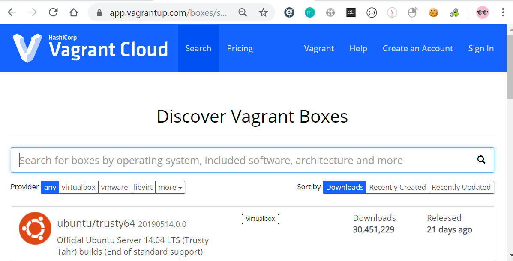
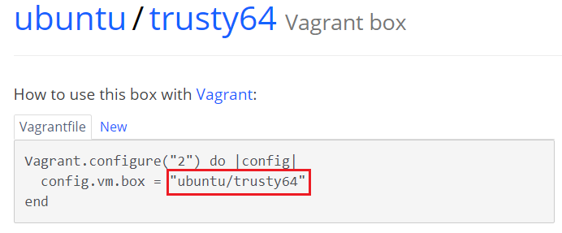
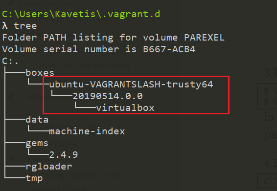
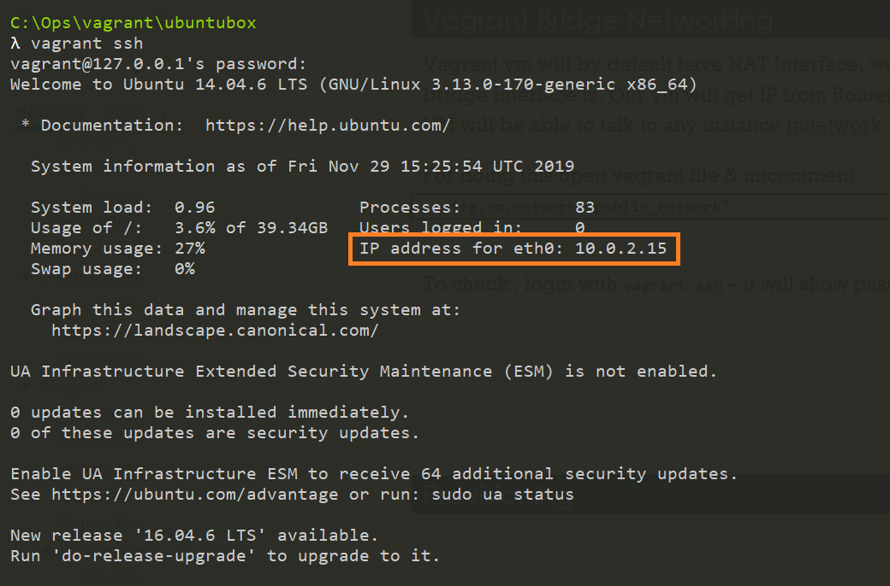
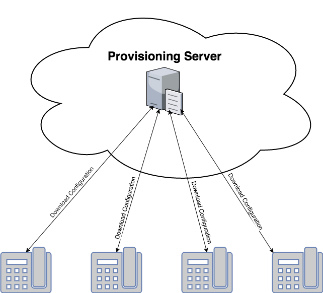
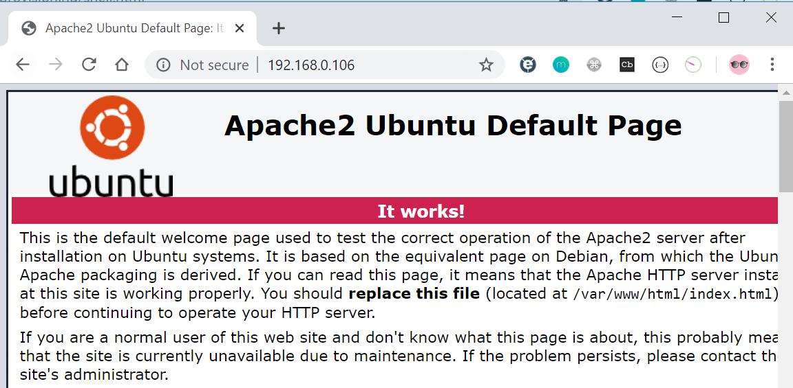

Vagrant
=======

Vagrant gets integrated with hypervisors like VirtualBox and gives as a command
line interface to automate vm lifecycle.

1.  The user creates a Vagrantfile, which is a declarative file (written in
    Ruby) that describes the type of machine needed, as well as how to configure
    and provision that machine. The user uses Vagrant to execute the
    Vagrantfile.

2.  Vagrant uses VirtualBox as a provider. It can also use other providers.

3.  The machine is up.

4.  Vagrant invokes a provisioner to configure the machine.

5.  The provisioner provisions the machine. It can be a simple shell script or
    Ansible, for example.

6.  One can access the deployed machine by ssh.

That’s it. You can manage and launch virtual machines with a few commands. And
its complexity is as much as you want.

Once you or someone else creates a single Vagrantfile, you just need to vagrant
up and everything is installed and configured for you to work.

Other members of your team create their development environments from the same
configuration, so whether you are working on Linux, Mac OS X, or Windows, all
your team members are running code in the same environment, against the same
dependencies, all configured the same way. Say goodbye to "works on my machine"
bugs.

Installing Vagrant on windows.
------------------------------

1.  Download the free VirtualBox for your operating system from [the VirtualBox
    website](https://www.virtualbox.org/wiki/Downloads).

2.  After download, just run the binary and install it.

3.  Download [Vagrant](https://www.vagrantup.com/downloads.html).

4.  Again, just run the binary to install it.

5.  Download git, Install with default settings.

Vagrant Cloud
-------------

Vagrant boxes are VM images which already has the OS and softwares installed in
them. We just need to download these boxes from vagrant cloud by using our
vagrant CLI.

<https://app.vagrantup.com/boxes/search>

Vagrant commands
----------------

**Creating a VM**

-   **vagrant init** -- Initialize Vagrant with a Vagrantfile and ./.vagrant
    directory, using no specified base image. Before you can do vagrant up,
    you'll need to specify a base image in the Vagrantfile.

-   **vagrant init \<boxpath\>** -- Initialize Vagrant with a specific box. To
    find a box, go to the [public Vagrant box
    catalog](https://app.vagrantup.com/boxes/search). When you find one you
    like, just replace it's name with boxpath. For example, vagrant init
    ubuntu/trusty64.

**Starting a VM**

-   **vagrant up** -- starts vagrant environment (also provisions only on the
    FIRST vagrant up)

-   **vagrant resume** -- resume a suspended machine (vagrant up works just fine
    for this as well)

-   **vagrant provision** -- forces reprovisioning of the vagrant machine

-   **vagrant reload** -- restarts vagrant machine, loads new Vagrantfile
    configuration

**Getting into a VM**

-   **vagrant ssh** -- connects to machine via SSH

-   **vagrant ssh \<boxname\>** -- If you give your box a name in your
    Vagrantfile, you can ssh into it with boxname. Works from any directory.

**Stopping a VM**

-   **vagrant halt** -- stops the vagrant machine

-   **vagrant suspend** -- suspends a virtual machine (remembers state)

**Cleaning Up a VM**

-   **vagrant destroy** -- stops and deletes all traces of the vagrant machine

-   **vagrant destroy** -f -- same as above, without confirmation

**Boxes**

-   **vagrant box list** -- see a list of all installed boxes on your computer

-   **vagrant box add \<name\> \<url\>** -- download a box image to your
    computer

-   **vagrant boxes remove \<name\>** -- deletes a box from the machine

-   **vagrant package** -- packages a running virtualbox env in a reusable box

**Tips**

-   **vagrant -v** -- get the vagrant version

-   **vagrant status** -- outputs status of the vagrant machine

>   \$ vagrant init [url]

>   \$ vagrant up

>   \$ vagrant halt

>   \$ vagrant destroy [--force]

>   \$ vagrant reload

>   \$ vagrant ssh

>   \$ vagrant status

Vagrantfile
-----------

A Vagrantfile is basically a configuration file that describes an environment.
It will include things like the boxes used, networking, CPU and memory,
providers used, shell scripts to run for provisioning among others.

1.Vagrant is a command-line based tool. Once installation is complete, open a
console window and create a new directory called 'ubuntubox’ to Create Ubuntu VM
using vagrant

cd \~ 

mkdir ubuntubox 

cd ubuntubox 

2.To add a box, goto box repository: <https://app.vagrantup.com/boxes/search>
and find the Box.

3.Use above box name & run below command

\$ vagrant box add \<name\>

\$ vagrant box add ubuntu/trusty64

In the above command, you will notice that boxes are namespaced. Boxes are
broken down into two parts - the **username and the box name** - separated by a
slash

4.It will download the Box to your local System, **Windows** :
**C:\\Users\\\<Username\>\\.vagrant.d\\boxes Linux/Mac: \~/.vagrant.d/boxes**

5.Create a new folder where you want to use as vagrant environment & use
**init** to initializes the current directory to be a Vagrant environment by
creating an initial Vagrantfile if one does not already exist. Im using
C:\\Ops\\vagrant\\ubuntubox folder

C:\\Ops\\vagrant\\ubuntubox

λ vagrant init ubuntu/trusty64

A \`Vagrantfile\` has been placed in this directory. You are now

ready to \`vagrant up\` your first virtual environment! Please read

the comments in the Vagrantfile as well as documentation on

\`vagrantup.com\` for more information on using Vagrant.

Open file, it contains

Vagrant.configure("2") do \|config\|

config.vm.box = "ubuntu/trusty64"

end

5.Start the Environment

\$ vagrant up

Vagrant up commands read the configuration from the Vagrantfile. 

6. connect to Environment

\$ vagrant ssh

Username/Password : vagrant/vagrant

To Set Shared folder, edit vagrantfile as

config.vm.synced_folder "D:\\\\DevOps\\\\Instl\\\\VagrantBoxes\\\\SyncFolder",
"/vagrant"

we named our syncd folder as “vagrant”, you can find the files in Syncfolder by
going /vagrant/

Vagrant Bridge Networking
-------------------------

Vagrant vm will by default have NAT Interface, we can create an extra bridge
interface. Benefit of bridge interface is, Our vm will get IP from
Router/Gateway/DHCP/Wifi router of our network. So our VM will be able to talk
to any instance innetwork and vice versa

For doing this open vagrant file & uncomment

config.vm.network "public_network"

To check , login with **vagrant ssh** – it will show password on welcome screen.

Provisioning 
-------------

### Provisioning Server

A Provisioning Server is any server that has many no. of Services installed.
Provisioning Servers are used to stream software from vDisks, as needed, to
target devices

Provisioning server sends configuration data to devices that request it. A
provisioning server receives requests for configuration information from devices
during the setup/bootup process or on a regular basis.

Provisioning and configuration management tools such as Terraform, AWS
CloudFormation, Puppet, Chef, SaltStack, and Ansible are popular choices for
standardizing software installation and management on infrastructure and
environments.

### Vagrant Provisioning

Provisioning helps execute command or script as soon as the vm comes up.  
Provisioners in Vagrant allow you to automatically install software, alter
configurations, and more on the machine as part of the vagrant up process.

Vagrant gives you multiple options for provisioning the machine, from simple
shell scripts to more complex, industry-standard configuration management
systems.

#### Setting up apache2 Ubuntu vm

-   Find **config.vm.provision** setting.

-   Update the file with below mentioned content.

>   config.vm.provision "shell", inline: \<\<-SHELL

>   apt-get update

>   apt-get install -y apache2

>   SHELL

-   Reload VM

>   vagrant reload --provision

-   Verify apache default page by providing vm’s bridge ip in browser.

    <http://192.168.0.106/>

    

    **External Script**

    The shell provisioner can also take an option specifying a path to a shell
    script on the host machine. Vagrant will then upload this script into the
    guest and execute it. An example:

>   Vagrant.configure("2") do \|config\|  
>   config.vm.provision "shell", path: "script.sh"  
>   end

Summary
-------

**Summary:**

-   Virtualization gave us the power of deploying multiple app in one physical
    server each having their own OS.

-   Hypervisor gives us power and interface to create multiple virtual server
    also known as VM on one physical machine.

-   There are two types of hypervisor, type1 which is installed directly on
    Hardware and type 2 which gets installed on a host OS.

-   Virtualbox is type 2 hypervisor which can be installed on Linux and windows
    machine's.

-   We can create & manage VM’s and their resources like virtual hard disk,
    Memory, Vcpu, network etc through virtualbox interface.

-   Creating &Managing lot vm from virtualbox interface is time consuming and
    mundane task.

-   Vagrant is a command line tool that helps us create & manage virtual machine
    lifecycle automatically.

-   Vagrantcloud hosts many of vm images AKA boxes which can be used by anyone
    using Vagrant tool. We don’t do OS installation anymore with Vagrant, we
    just pull vagrant box images and run them.

-   Vagrantfile is the single source of truth for your VM’s in Vagrant. We can
    mention box name, its memory, network and other settings while spinning a VM
    in the Vagrantfile.

-   Vagrantfile gives us the feature of provisioning by which we can run any
    automation script to configure VM after vm comes up.

-   Multiple VM’s can be managed by a single Vagrantfile.

**Conclusion:**

Vagrant is a great tool for our day to day DevOps tasks Maybe you have written a
script for deployment or maybe you are learning any new devops tool, to test all
these things you need VM’s. With Vagrant, we can quickly set up multiplevm’s and
start practicing. It’s part of our daily toolkit.  
We can also use Ansible, Chef or Puppet code in provisioning part of the
Vagrantfile, once we learn these tools in later chapters you can go ahead and
try those. Vagrant can also be used to provision instances on AWS cloud. If you
are working in DevOps you will encounter with local virtual machines, always use
Vagrant to maintain your local vmsetup.

Errors
------

Stderr: VBoxManage.exe: error: (VERR_NEM_MISSING_KERNEL_API).

VBoxManage.exe: error: VT-x is not available (VERR_VMX_NO_VMX)

VBoxManage.exe: error: Details: code E_FAIL (0x80004005), component ConsoleWrap,
interface IConsole

go to BIOS enable VT-x

I just solved this problem by disabling(uncheck) Hyper-V. Seems Hyper-V was
enabled when I installed Docker

Control Panel -\> Program And Features -\> Turn Windows Features on or off.

You may need to reboot afterwords.

**Warning**: **Vagrant with VirtualBox cannot work with Docker at the same
time.**

**apache2: Could not reliably determine the server's fully qualified domain
name, using 10.0.2.15. Set the 'ServerName'**

This is just a friendly warning and not really a problem (as in that something
does not work).

If you go to:

/etc/apache2/apache2.conf

and insert:

ServerName localhost

and then restart apache by typing into the terminal:

sudo systemctl reload apache2

the notice will disappear.

If you have a name inside /etc/hostname you can also use that name instead
of localhost.

And it uses 127.0.1.1 if it is inside your /etc/hosts:

127.0.0.1 localhost

127.0.1.1 myhostname

[Preferred
method](https://help.ubuntu.com/community/ApacheMySQLPHP#Troubleshooting_Apache)

Troubleshooting Apache

If you get this error:

apache2: Could not determine the server's fully qualified domain name,

using 127.0.0.1 for ServerName

then use a text editor such as "sudo nano" at the command line or "gksudo gedit"
on the desktop to create a new file,

sudo nano /etc/apache2/conf.d/fqdn

or

gksu "gedit /etc/apache2/conf.d/fqdn"

then add

ServerName localhost

to the file and save. This can all be done in a single command with the
following:

echo "ServerName localhost" \| sudo tee /etc/apache2/conf.d/fqdn

But on Ubuntu 14.04:

echo "ServerName localhost" \| sudo tee /etc/apache2/conf-available/fqdn.conf

sudo a2enconf fqdn

Don't forget the ".conf" (without will not work).
