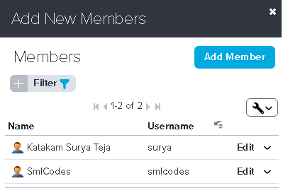

## **1. Introduction**

**VersionOne** is an all-in-one **Agile project management tool** built from the
ground up to support agile software development methodologies such as Scrum,
Kanban, Lean, XP, SAFe and hybrid. From small teams to distributed enterprises,
VersionOne's suite of right-sized product editions help companies scale agile
faster, easier and smarter.

 

**1.1  Features**

-   **Agile Management with** : centralized management, Simplify collaboration,
    Improve project visibility, Accelerate agile adoption

-   **Product Planning** : Plan and manage your requirements, epics, stories,
    and goals across multiple projects, products and teams.

-   **Release Planning** : Plan, forecast, and report progress on your releases
    and teams in a simple, drag-and-drop environment.

-   **Sprint Planning** : Iteratively plan your stories, defects, tasks, tests,
    and impediments in a single, easy-to-use environment.

-   **Tracking** : Track progress painlessly using our interactive Storyboard,
    Taskboard, Testboard and Burndown charts.

-   **Test Management** : Plan and track your acceptance and regression testing
    activities in the same tool as your stories and defects.

-   **Reporting & Analytics** : 50+ pre-packaged agile metrics and reports plus
    a new custom analytics platform for unparalleled visibility.

-   **Product Roadmapping** : Create, collaborate and visually communicate your
    product strategy using VersionOne’s flexible roadmapping capability.

-   **Collaboration** : Agile methods strongly emphasize constant communication
    and coordination with customers and between team members.

-   **Portfolio Management** : Visualize, manage and report on your strategic,
    cross-project initiatives, keeping organizational priorities aligned with
    tactical execution.

-   **Review** : Quickly close-out iterations and capture issues and action
    items from your retrospectives in one place.

-   **Open-Source Integration** : Open, web services API, Java and .NET SDK’s,
    and free, open-source integration connectors.

## **2. Installation & Configuration**

1.Go to <http://info.versionone.com/TeamEdition.html> , Register & click on get
it for free

 

2.On Next window, it will ask for choose the password , Project name & Sprint
details

 

3.It will Install the VersionOne Software on the next window

 

4.On completion of Installation, it will shows the URL of your VersionOne
Location, open it!

 

5.It will Navigates to Profile form, choose username& password and click on OK!

 

6.Then, it will navigate you to VersionOne Dashboard.

 

 

**2.1 Add New Team Member in VersionOne**

 1.Click to Admin on the left-top, Click on  **Add New members** button

 

2.It will opens a Pop-up window , click on **Add Member** Button

 

3.It will opens a Member form, fill the Details & Save

 

4.User is added & Listed in the Members. If you to change any thing just click
EDIT button

 

 

**2.2 Project Settings in VersionOne**

Once you insert the members, click on the project for creating a new one. You
can give a Title for the project, specify the Level of the project by adding
Description, Begin Date, End Date, Owner, Total Estimate Points and any other
information as you may need at this stage

 

1.Select **Admin**> **Projects.**

 2.Expand the **System (All Projects) **project

 3.Click on the **Add Child Project**button to create the new project.

 

4.Enter the project details as appropriate & Save

 

## **3. Project Management Activities**

 **3.1 Product Planning in VersionOne**

It is your first practical step towards organizing your backlogs and ranking the
stories as you need for executing tests.

You can build your backlog by managing the stories, test sets, and the defects
as you keep updating your work items. Product planning gives you helpful
resources such as estimation, associating your work to an Epic, ranking backlog
when there are numerous such stories, defects, and tests.

You can add stories and defects as many as you need or access them from any
project or sprint. Filtering allows you to drag and drop any item from the
backlog for prioritization purpose.  Stories can be imported from excel sheets
or created directly from the Add Story Inline menu situated on the right side of
the Product Planning page.

The picture below shows the main page of the backlog where you can organize the
stories by title, ID, Priority, Estimation point and project

 

**Backlog Importing Page**:

Download the Excel Template by clicking Import from Product Planning tab. You
can fill it out with your test scenarios, test cases, test data, and other
relevant columns based on the needs of each module of the Application under Test
(AUT).

You can go through the same steps for Defects and Issues. If there are any
issues during upload your excel sheet, VersionOne tells you what particular
column or row have to be corrected to complete the upload process.

 

 

**3.2 Release Planning in VersionOne**

In this feature of VersionOne, you can move any backlog story to any of the
releases. Release planning offers two approaches namely, Tactical and Strategic.
In tactical release plan, you schedule each item, defect, and test individually
at backlog level. While in strategic approach, you anticipate the backlog at the
portfolio level.
 

Besides, this feature offers the possibility of regression planning that lets
you describe and map out coordinated sets of testing activities for making sure
your existing functionality continues to work.
 

It is always recommended to have your schedules short in duration by using as
many sprints as you can. One of the primary rationales behind release plan is to
be able to track the teams and the release deadlines via effective
communication.
 

**There are two methods you can move backlog items**

-   Check the check boxes for multiple stories at a time from Move to project

-   Drag and drop them where you want

Simultaneously, you can add new releases to the project as you work on the
current ones. The project Burndown shows the overall status of the release in
terms of time

 

For Sprint release, you can view tests report metrics to measure your progress
towards the completion of the sprint.

**They are mentioned below:**

-   Portfolio Item Dependencies Report

-   Release Forecasting Report

-   Standup Dashboard Report

 
 

**3.3 Sprint/Iteration-planning in VersionOne**

Here is where you choose what items of the backlog are to be worked on for a
particular sprint based on your priorities. Then, you break them into specific
tests and estimate the efforts to get them completed.
 

An effective estimate is to look into the teams past performance levels and
progress and get an idea of the current work to be done. The primary functions
in this stage are mentioned below

-   Activating and Deactivating a Sprint

-   Closing a Sprint

-   Creating/Adding a Sprint

-   Deleting a Sprint

-   Managing Sprint Relationships
 

After you scheduled your work by using Sprint/Iteration scheduling and the
planning capacity, the team members get tasks assigned to them. The team can
decide which item of the backlog should be worked on at first and schedule
execution.
 

You can drag/drop each item you want, or you can do that by going through
multiple selections of the item, and you move them together into a sprint or a
project. You would see the details of the prioritized items under product
backlog schedule as shown in the below screen

 

There are various types of the reporting metrics for sprint tracking, helpful
for Scrum Masters, Team Leads, Team members, and the stakeholders. The major
types consist of the following

-   Cumulative Flow by Status Report

-   Member Load Trend Report

-   Pipeline Run Contents Report

-   Quick list Reports

-   Sprint/Iteration Dashboard Report

-   Standup Dashboard Report

-   Test Runs Report

-   Velocity Trend Report

-   Work item Cycle Time Report.

By clicking on sprint tracking tab, we step into the execution of the tests.

 
 

**3.4 Sprint/Iteration Tracking in VersionOne**

Once you create the tests, it is now time to execute your tests. You would see
what you have to test and update stories, tests and the defects on a daily
basis. You can go through dashboards to view status and progress. Key agile
metrics, the status of each story and defect are available for viewing in the
standard dashboard.
 
You can just drag and drop each of the stories and defects as you execute them. 
It gives the overall picture of how a team is doing regarding running the tasks
and the tests. Following describes what you can do in the Sprint Iteration
section.

-   **Detail Tracking:** You would see all your open work in this selected
    sprint including updated time and the status.

-   **Member Tracking:** This page shows the list of all team members assigned
    to their specific sprint. It is a list that indicates the relationship
    between the testers and the assigned tasks.

-   **Storyboard:** This page displays a visual view of all stories included in
    a sprint. It provides you a clear picture of the stories which have them in
    the columns of None, Future, In-progress, Done and Accepted.

-   **Taskboard:** It shows a visual status of the tasks grouped by defects and
    or by tasks. You can display the view below during the team’s daily meeting
    for giving a clear picture of the overall progress of the work.

-   **Test board:** This page displays acceptance tests grouped by backlog item
    for e.g. defect or test status. It shows the individual test status during
    the testing cycle.

 

**The reporting metrics for sprint tracking include the following:**

-   Member Load Trend

-   Work item Cycle Time

-   Velocity Trend

-   Sprint/Iteration Burndown

-   Standup Dashboard

-   Test Trend

-   Test Runs

-   Cumulative Flow

-   Effort Quick list
