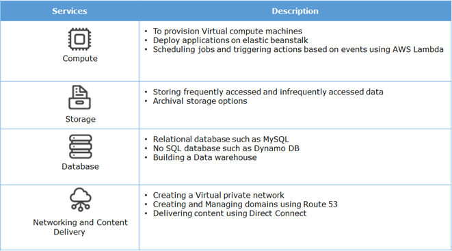
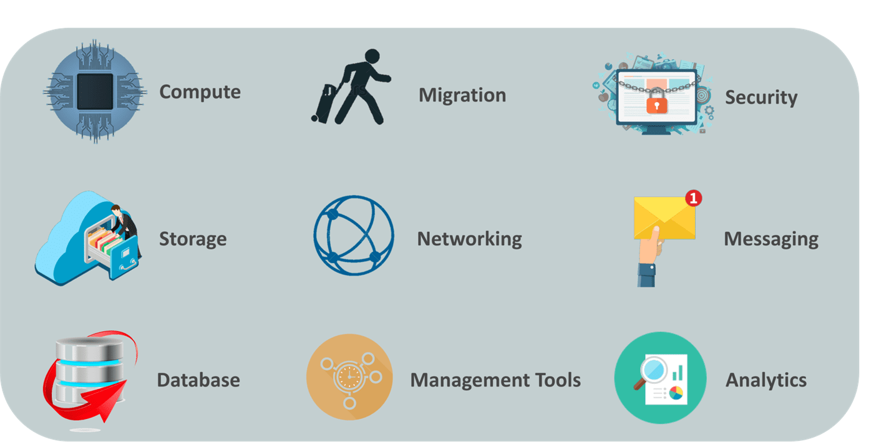
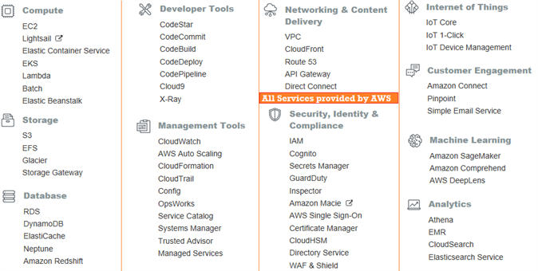
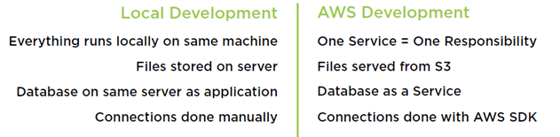

AWS Services
============

55 services currently available from AWS. The following are the various
categories of services offered by Amazon Web Services (AWS).

### Security, Identity, & Compliance

**AWS Identity & Access Management**  
Manage User Access and Encryption Keys

**Amazon Cognito**  
Identity Management for your Apps

**AWS Certificate Manager**  
Provision, Manage, and Deploy SSL/TLS Certificates

**AWS Directory Service**  
Host and Manage Active Directory

**AWS Single Sign-On**  
Cloud Single Sign-On (SSO) Service

 

### Compute

**Amazon EC2**  
Virtual Servers in the Cloud

**Amazon Elastic Container Registry(ECR)**  
Store and Retrieve Docker Images

**Amazon Elastic Container Service(ECS)**  
Run and Manage Docker Containers

**AWS Lambda**  
Run your Code in Response to Events

**AWS Batch**  
Run Batch Jobs at Any Scale

**AWS Elastic Beanstalk**  
Run and Manage Web Apps

**Amazon Lightsail**  
Launch and Manage Virtual Private Servers

 

### Storage

**Amazon Simple Storage Service (S3)**  
Scalable Storage in the Cloud

**Amazon Elastic File System (EFS)**  
Fully managed file system for EC2

**Amazon Elastic Block Store (EBS)**  
EC2 block storage volumes

**Amazon S3 Glacier**  
Low-cost Archive Storage in the Cloud

**AWS Snow Family**  
Physical devices to migrate data into and out of AWS

 

### Database

**Amazon RDS**  
Managed Relational Database Service for MySQL, PostgreSQL, Oracle, SQL Server,
and MariaDB

**Amazon DynamoDB**  
Managed NoSQL Database

**Amazon Aurora**  
High Performance Managed Relational Database

**Amazon DocumentDB (with MongoDB compatibility)**  
Fully managed document database

**Amazon ElastiCache**  
In-memory Caching System

**Amazon Redshift**  
Fast, Simple, Cost-effective Data Warehousing

 

### Networking & Content Delivery

**Amazon VPC**  
Isolated Cloud Resources

**Amazon Route 53**  
Scalable Domain Name System

**Amazon CloudFront**  
Global Content Delivery Network

**Amazon API Gateway**  
Build, Deploy, and Manage APIs

**AWS Cloud Map**  
Application resource registry for microservices

**AWS Direct Connect**  
Dedicated Network Connection to AWS

**Elastic Load Balancing**  
Distribute incoming traffic across multiple targets

 

### Developer Tools

**AWS CodeCommit**  
Store Code in Private Git Repositories

**AWS CodeBuild**  
Build and Test Code

**AWS CodeDeploy**  
Automate Code Deployment

**AWS CodePipeline**  
Release Software using Continuous Delivery

**AWS CodeStar**  
Develop and Deploy AWS Applications

**AWS X-Ray**  
Analyze and debug your applications

 

### Management & Governance

**Amazon CloudWatch**  
Monitor Resources and Applications

**AWS Auto Scaling**  
Scale Multiple Resources to Meet Demand

**AWS CloudFormation**  
Create and Manage Resources with Templates

**AWS CloudTrail**  
Track User Activity and API Usage

**AWS Command Line Interface**  
Unified tool to manage AWS services

**AWS Config**  
Track Resource Inventory and Changes

**AWS License Manager**  
Track, manage, and control licenses

**AWS Management Console**  
Web-based user interface

**AWS OpsWorks**  
Automate Operations with Chef and Puppet

**AWS Trusted Advisor**  
Optimize Performance and Security

 

### Analytics

-   [Athena](https://us-east-2.console.aws.amazon.com/athena/home?region=us-east-2)

-   [EMR](https://us-east-2.console.aws.amazon.com/elasticmapreduce/home?region=us-east-2)

-   [CloudSearch](https://console.aws.amazon.com/cloudsearch/home?region=us-east-2)

-   [Elasticsearch
    Service](https://us-east-2.console.aws.amazon.com/es/home?region=us-east-2)

-   [Kinesis](https://us-east-2.console.aws.amazon.com/kinesis/home?region=us-east-2)

-   [QuickSight](https://quicksight.aws.amazon.com/)

-   [Data
    Pipeline](https://console.aws.amazon.com/datapipeline/home?region=us-east-2)

-   [AWS Data
    Exchange](https://us-east-2.console.aws.amazon.com/dataexchange/home?region=us-east-2)

-   [AWS
    Glue](https://us-east-2.console.aws.amazon.com/glue/home?region=us-east-2)

-   [AWS Lake
    Formation](https://us-east-2.console.aws.amazon.com/lakeformation/home?region=us-east-2)

-   [MSK](https://us-east-2.console.aws.amazon.com/msk/home?region=us-east-2)

 

### Application Integration

-   [Step
    Functions](https://us-east-2.console.aws.amazon.com/states/home?region=us-east-2)

-   [Amazon
    EventBridge](https://us-east-2.console.aws.amazon.com/events/home?region=us-east-2)

-   [Amazon
    MQ](https://us-east-2.console.aws.amazon.com/amazon-mq/home?region=us-east-2)

-   [Simple Notification
    Service](https://us-east-2.console.aws.amazon.com/sns/home?region=us-east-2)

-   [Simple Queue
    Service](https://us-east-2.console.aws.amazon.com/sqs/home?region=us-east-2)

-   [SWF](https://us-east-2.console.aws.amazon.com/swf/home?region=us-east-2)
