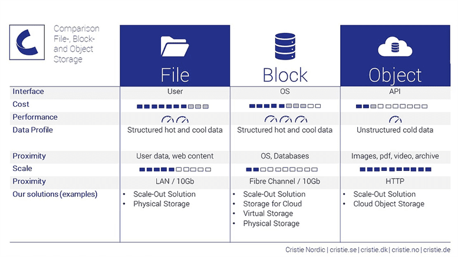
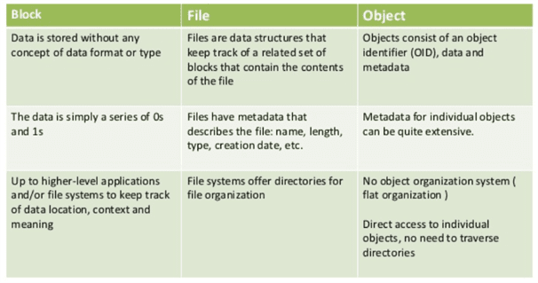

2. Storage
============

**Amazon Simple Storage Service (S3)**

Scalable Storage in the Cloud

**Amazon Elastic File System (EFS)**

Fully managed file system for EC2

**Amazon Elastic Block Store (EBS)**

EC2 block storage volumes

**Amazon S3 Glacier**

Low-cost Archive Storage in the Cloud

**AWS Snow Family**

Physical devices to migrate data into and out of AWS

Block Storage VS File Storage

