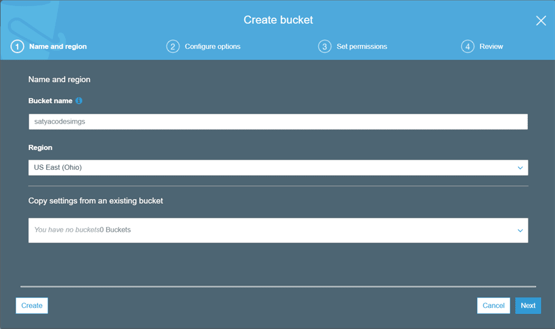
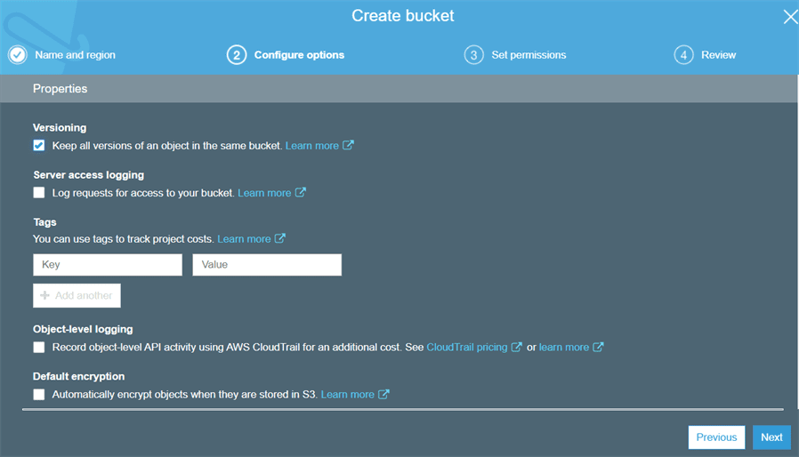
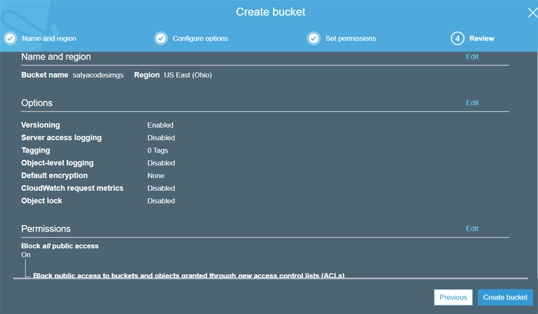
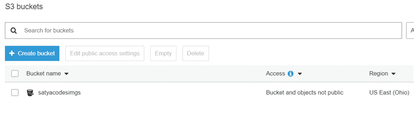
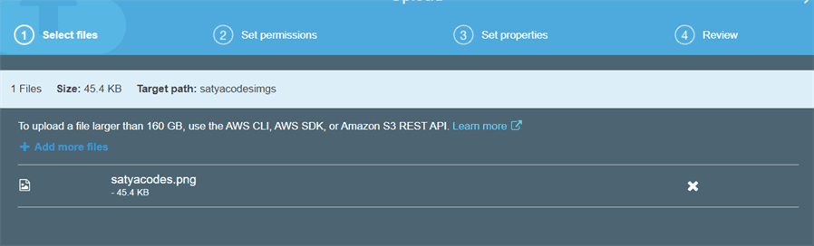
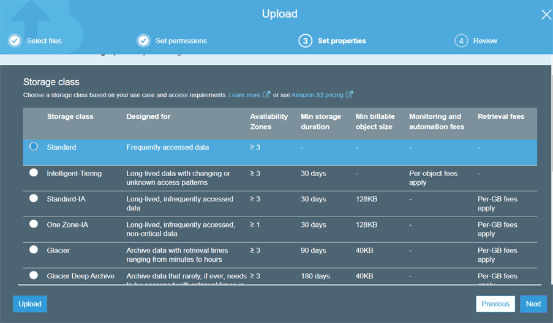
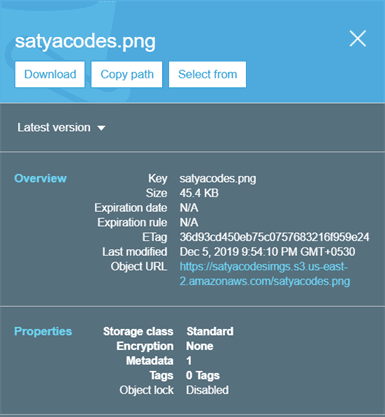

Lab 1 – Create a New Bucket
===========================

1.Services \> Storage \> S3 – Create a New Bucket

Finally – Create Bucket.

Bucket Created

#### Add image to Bucket

Select Bucket \> Upload \> Add Files

Select Storage class Type – Standard

