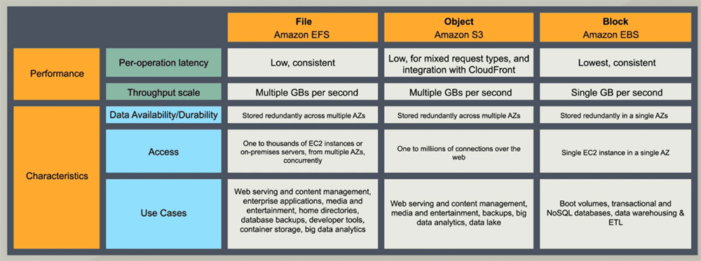
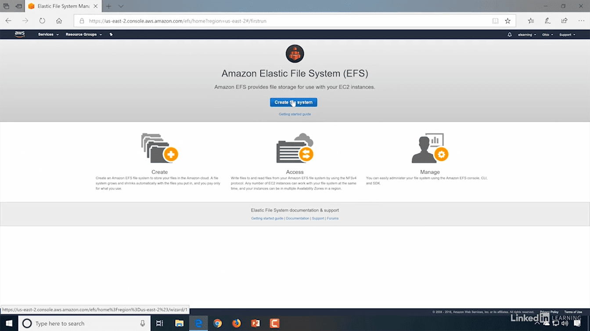
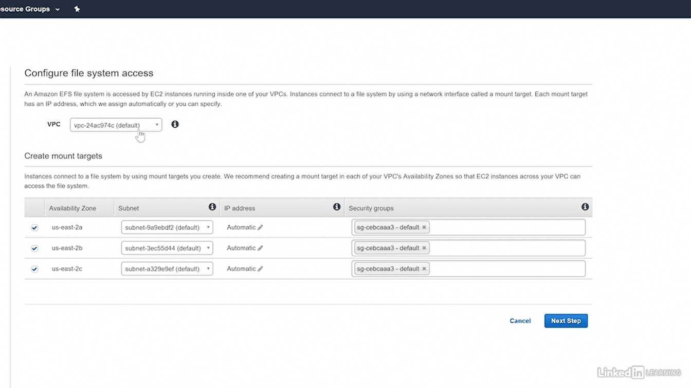
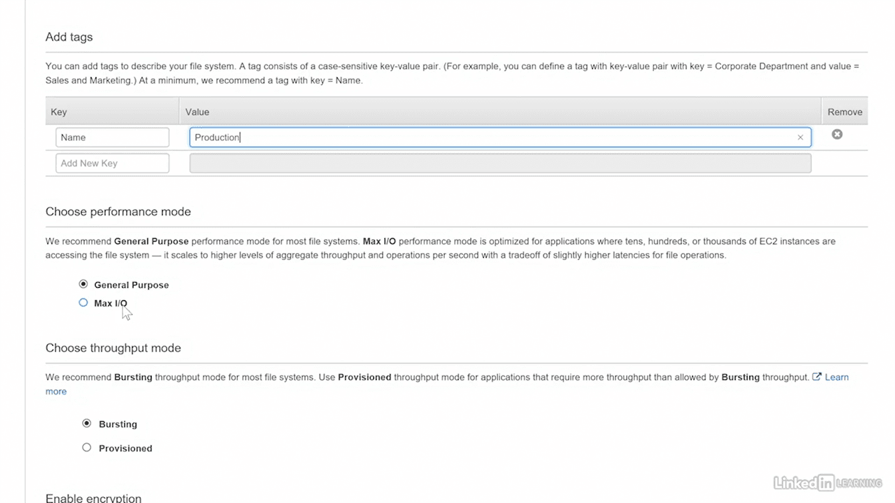
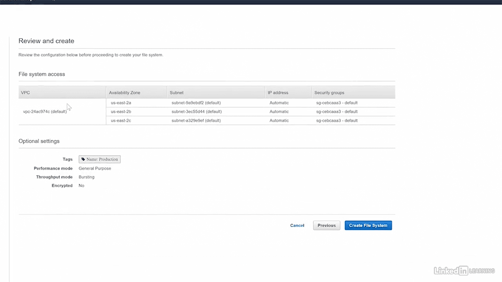
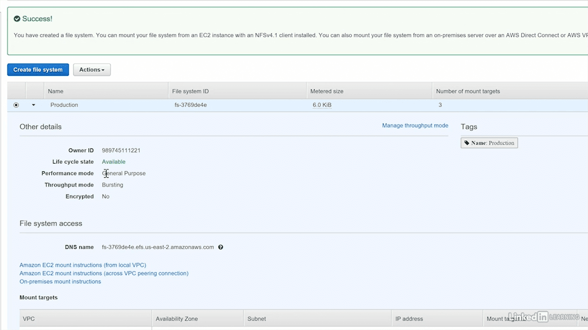
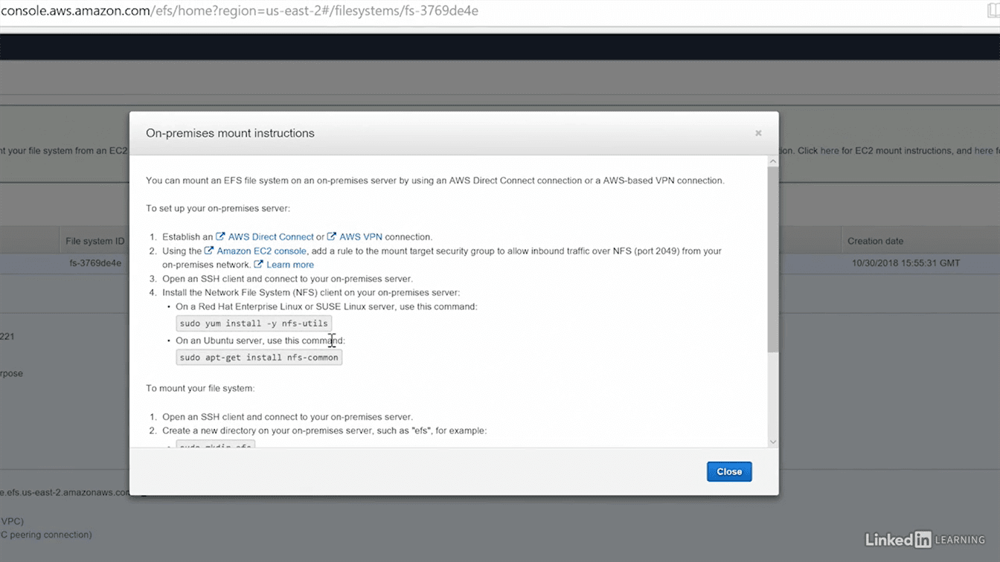

Elastic File System (EFS)
=========================

-   **Shareable** - multiple instances can access same time, but EBS only single
    instance can access at a time

-   **Hierarchical** - Folder hierarchy is there

-   EC2 instances can use EFS shares

-   EFS is **not supported on Windows instances**

### Lab

References
----------

-   <https://www.linkedin.com/learning/aws-certified-solutions-architect-associate-2-storage-design/storage-services?u=2057244>

-   <https://www.edureka.co/blog/s3-aws-amazon-simple-storage-service/>

-   <https://www.youtube.com/watch?v=9HsEMyKrlnw>

-   <https://www.qwiklabs.com/focuses/8582?catalog_rank=%7B%22rank%22%3A1%2C%22num_filters%22%3A1%2C%22has_search%22%3Atrue%7D&parent=catalog&search_id=3982783>

-   <https://www.qwiklabs.com/focuses/8595?catalog_rank=%7B%22rank%22%3A2%2C%22num_filters%22%3A1%2C%22has_search%22%3Atrue%7D&parent=catalog&search_id=3982783>
