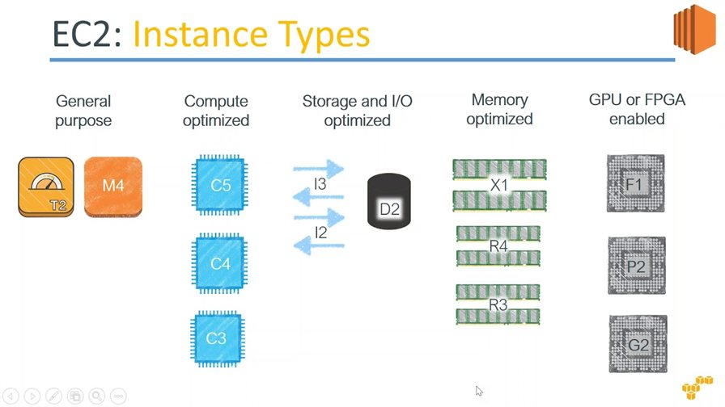
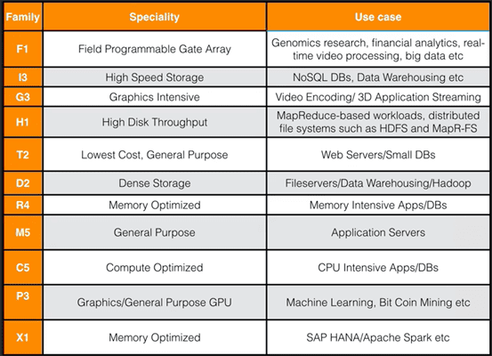
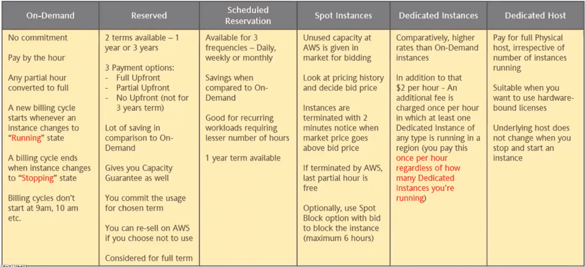

Amazon Elastic Cloud Compute (EC2)
==================================

Amazon Elastic Compute Cloud, EC2 is a web service from Amazon that
provides **re-sizable** compute services in the cloud.

You can use Amazon EC2 to launch as many virtual servers as you need, configure
security and networking, and manage storage. Amazon EC2 enables you to scale up
or down to handle changes.

-   Simple, EC2 – Virtual machine in the Cloud.

-   Elastic – Fairly Resizable & Reusable

-   Think of it like virtual machines in the cloud

-   Pay as you go

-   Control storage, networking and security

#### Supported Operating Systems

-   Windows 2003 R2 through 2016

-   Amazon Linux

-   AMI (Amazon Machine Image)

-   Debian

-   SUSE

-   CentOS

-   Red Hat Enterprise Linux

-   Ubuntu

### Types of Instances 

EC2 is one of the oldest Service provided by AWS, it is there from Starting.

### Type of Instance Pricing Models 

