Lab: Launching an EC2 Windows instance
======================================

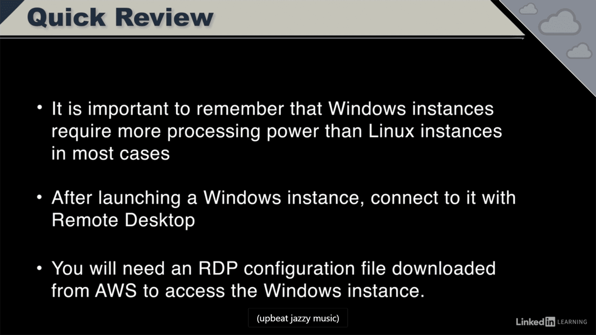

Lunch Instance : Free Tier

1.Select AMI - Windows Server 2012

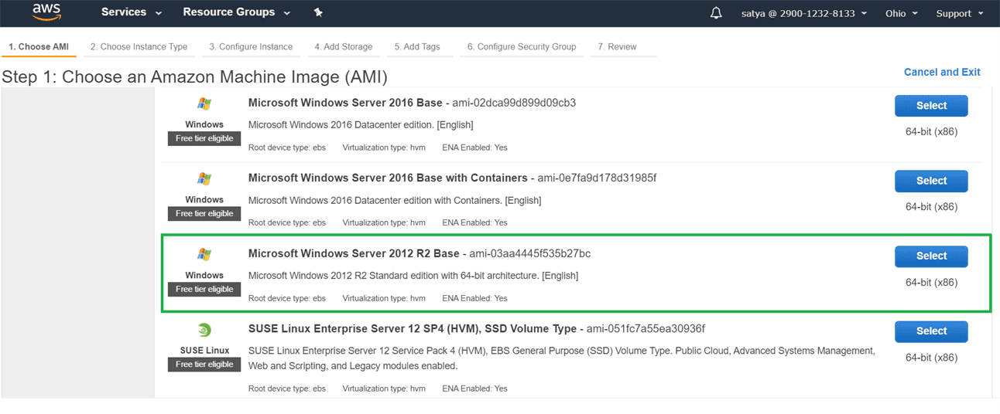

2.Instance Type : free Tier

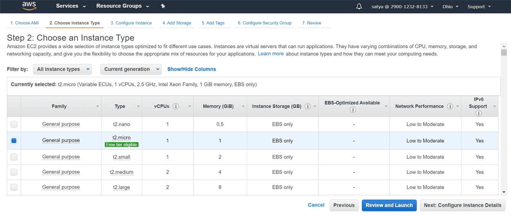

3.Network : Leave it Default

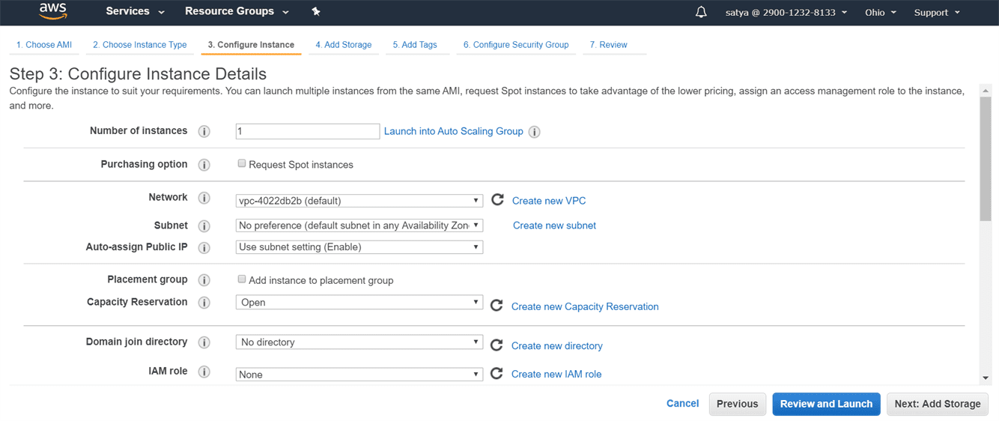

4.Storage :30GB - general purpose SSD(Linux we used magnetic Disc)

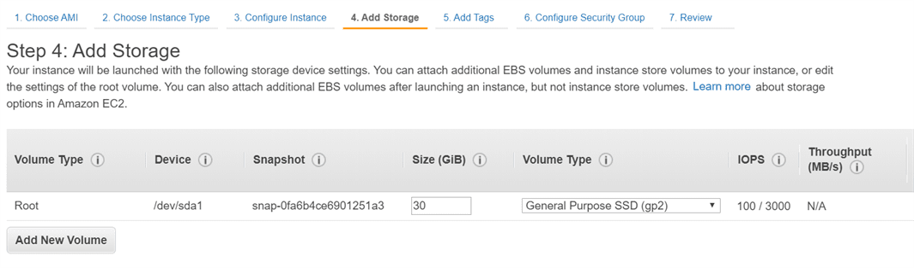

5.Add Tags if required

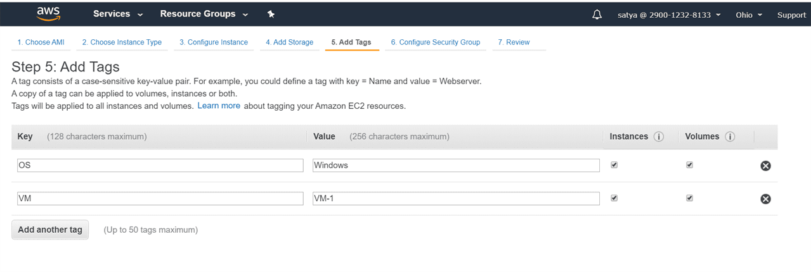

6.Security Group : RDP (Remote Desktop)

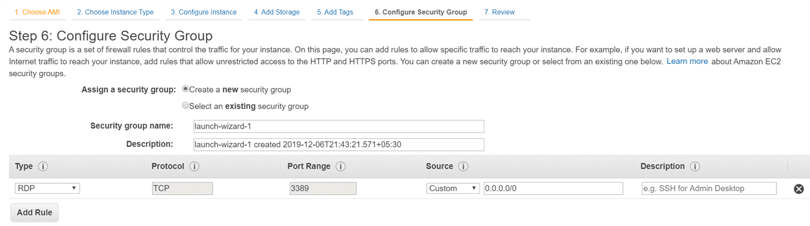

-   Inbound - Only 3389 is open for Incoming Request

-   OutBound Rules - All request are allowed for outside the world

7.Review & Launch

8.Choose new Key pair / Existing

we can use same Key for both Linux & Windows

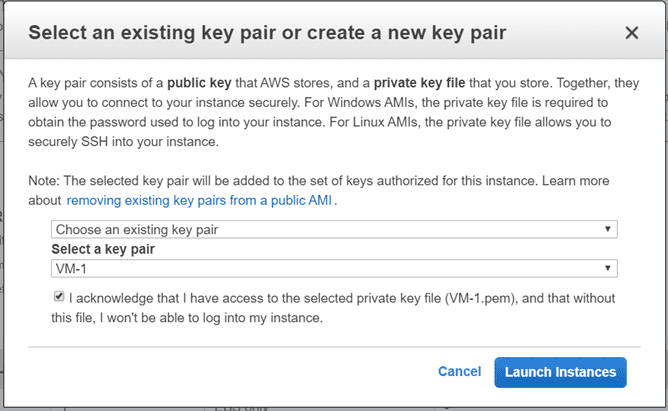

**You launched windows Server in 3 minutes**

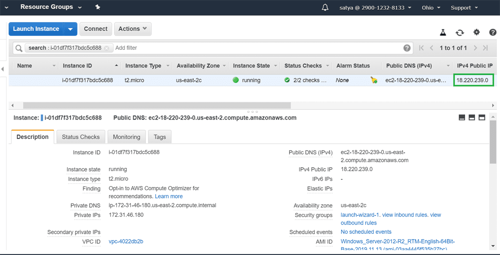

8.To connect RDP \> Click on Connect beside Instance

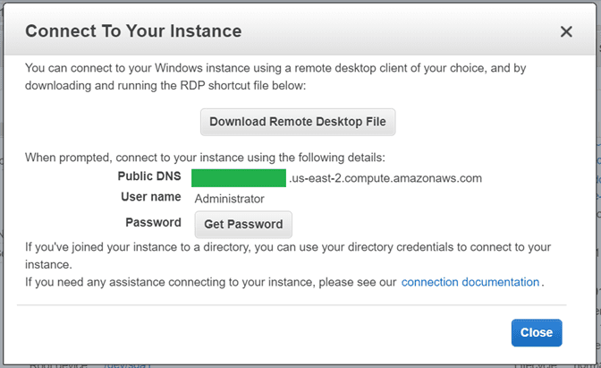

Click On Generate Password \> Upload Downloaded Key file\> Decrypt Password

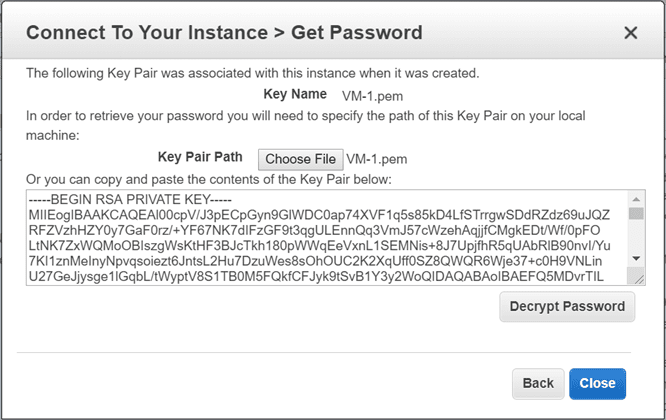

It will show the password : \*\*\*\*\*\*\*\*\*\*\*\*\*

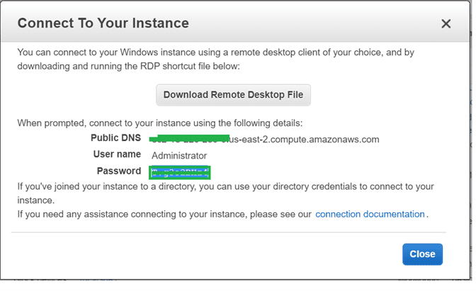

Download Remote Desktop file \> Open it to RDP connection.

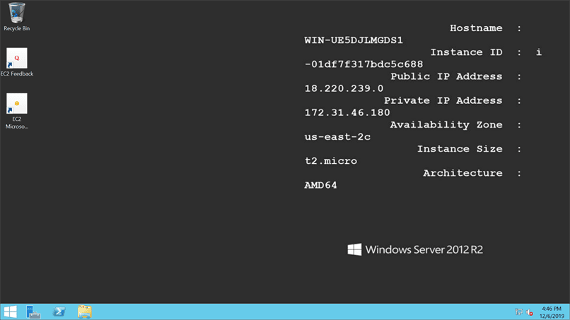
