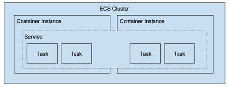

Elastic EC2 Container Service (ECS) – Docker Container 
=======================================================

Amazon Elastic Container Service (Amazon ECS) is a highly scalable,
high-performance [container](https://www.edureka.co/blog/what-is-docker-container) orchestration
service.

Docker 
=======

Docker is a client-server application that can be installed on Linux, Windows,
and MacOS and that allows you to run
Docker [containers](https://en.wikipedia.org/wiki/Operating-system-level_virtualization).
Containers are lightweight environments containing everything needed to run a
specific application or part of an application. Multiple different containers
can be run on one machine, so long as it has the Docker software installed.

By using specified Docker containers to run your production code, you can be
sure that your development environment is exactly the same as your production
environment.

First we need to cover ECS terminology:

-   **Task Definition** — This a blueprint that describes how a docker container
    should launch. It contains settings like exposed port, docker image, cpu
    shares, memory requirement, command to run and environmental variables.

-   **Task** —It can be thought of as an “instance” of a Task Definition.

-   **Service** — Defines long running tasks of the same Task Definition. This
    can be 1 running container or multiple running containers all using the same
    Task Definition.

-   **Cluster** — A logic group of EC2 instances. When an instance launches the
    ecs-agent software on the server registers the instance to an ECS Cluster.
    This is easily configurable by setting the ECS_CLUSTER variable in
    /etc/ecs/ecs.config
    described [here](http://docs.aws.amazon.com/AmazonECS/latest/developerguide/launch_container_instance.html).

-   **Container Instance** — This is just an EC2 instance that is part of an ECS
    Cluster and has docker and the ecs-agent running on it.

### Lab

Create ECS Cluster with 1 Container Instance

Create a Task Definition

Create an ELB and Target Group to later associate with the ECS Service

Create a Service that runs the Task Definition

Confirm Everything is Working

Scale Up the Service to 4 Tasks.

Clean It All Up
