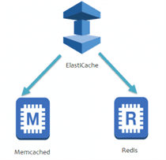
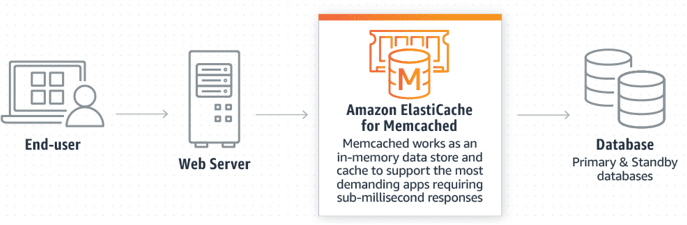
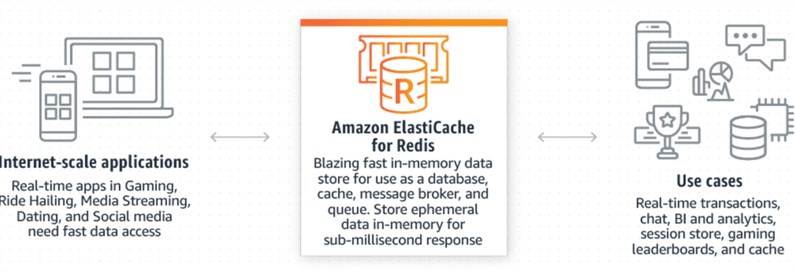
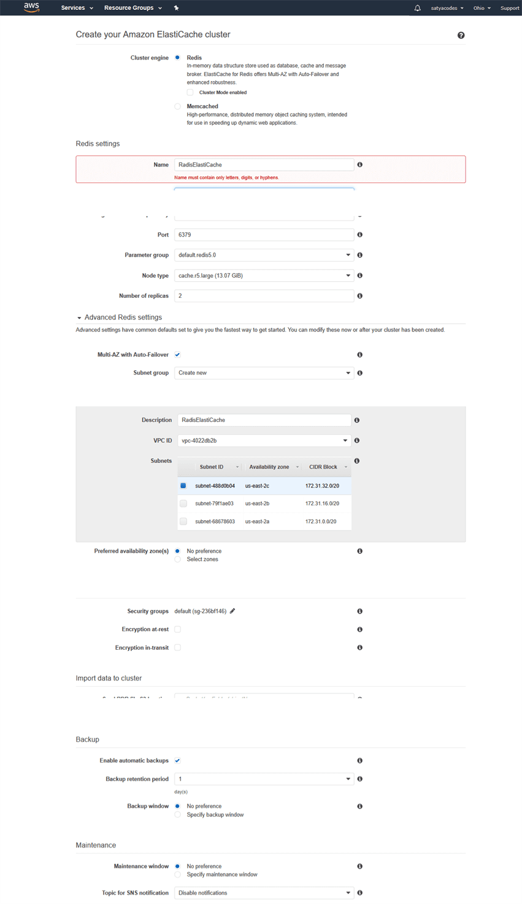
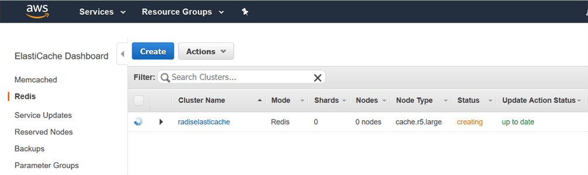

Elastic ache
============

ElastiCache improves the performance of web applications by allowing you to
retrieve information from fast, managed in-memory cache instead of relying
entirely on slower disk-based databases.

For example, if you are running an online business, customers continuously
asking for the information of a particular product. Instead of front-end going
and always asking information for a product, you can cache the data using
Elasticache.

There are two types of Elasticache:

-   **Memcached**

-   **Redis**

#### Memcached

-   Amazon Elasticache for Memcached is a Memcached-compatible in-memory
    key-value store service which will be used as a cache.

-   It is an easy-to-use, high performance, in-memory data store.

-   It can be used as a cache or session store.

-   It is mainly used in real-time applications such as Web, Mobile Apps,
    Gaming, Ad-Tech, and E-Commerce.

**Working of Memcached**

-   Databases are used to store the data on disk or SSDs while Memcached keeps
    its data in memory by eliminating the need to access the disk.

-   Memcached uses the in-memory key-value store service that avoids the seek
    time delays and can access the data in microseconds.

-   It is a distributed service means that it can be scaled out by adding new
    nodes.

-   It is a multithreaded service means that it can be scaled up its compute
    capacity. As a result of this, its speed, scalability, simple design,
    efficient memory management and API support for most popular languages make
    Memcached a popular choice for caching use cases.

#### Redis

-   Redis stands for **Remote Dictionary Server**.

-   It is a fast, open-source, and in-memory key-value data store.

-   Its response time is in a millisecond, and also serves the millions of
    requests per second for real-time applications such as Gaming, AdTech,
    Financial services, Health care, and IoT.

-   It is used for caching, session management, gaming, leaderboards, real-time
    analytics, geospatial, etc.

**Working of Redis**

-   Redis keeps its data in-memory instead of storing the data in disk or SSDs.
    Therefore, it eliminates the need for accessing the data from the disk.

-   It avoids seek time delays, and data can be accessed in microseconds.

-   It is an open-source in-memory key-value data store that supports data
    structures such as sorted sets and lists.

### Lab 

<https://keyholesoftware.com/2018/08/28/using-amazon-elasticache-for-redis-to-optimize-your-spring-boot-application/>
