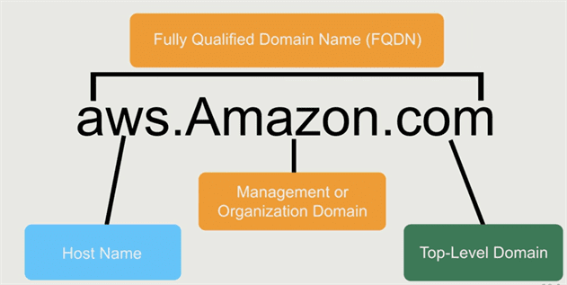
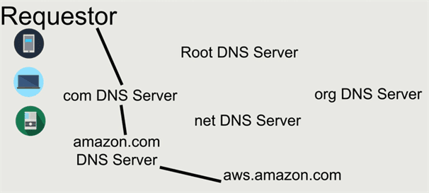
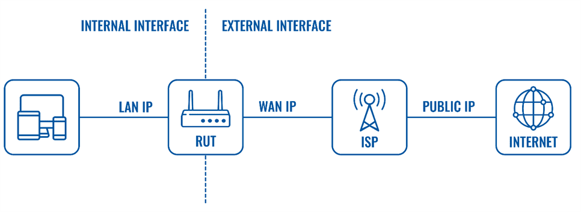
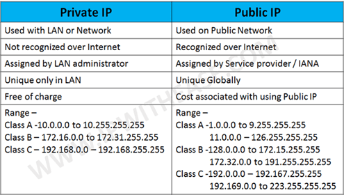
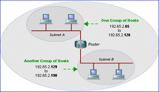
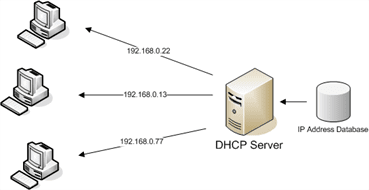
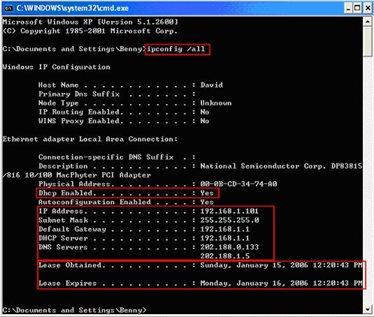

5. Networking & Content Delivery
================================

**Amazon VPC**

Isolated Cloud Resources

**Amazon Route 53**

Scalable Domain Name System

**Amazon CloudFront**

Global Content Delivery Network

**Amazon API Gateway**

Build, Deploy, and Manage APIs

**AWS Cloud Map**

Application resource registry for microservices

**AWS Direct Connect**

Dedicated Network Connection to AWS

**Elastic Load Balancing**

Distribute incoming traffic across multiple targets

Networking Terms
----------------

### DNS

-   DNS is all about being able to resolve hostnames like www.yourwebsite.com to
    an IP address.

-   we actually communicate with IP addresses not names. The names are there for
    make it easier to remember

-   RFCs 1034 and 1035 are DNS routing specifications

-   if we hit www.satyacodes.com, you're actually going to a specific host at
    the satyacodes.com domain.

-   So, you're actually going to the host that's named "www" and that host
    exists in the "satyacodes.com" domain

-   So, you've got to resolve that host name to an IP address

client wants IP for aws.amazon.com

1. Client queries a root server to find com DNS server

2. Client queries com DNS server to get amazon.com DNS server

3. Client queries amazon.com DNS server to get IP address for aws.amazon.com

Read more
<https://www.inetdaemon.com/tutorials/internet/dns/operation/resolution/forward/forward.shtml>

#### DNS Records

-   **A(IPv4) and AAAA(IPv6) -** Hostname to IPv4 or IPv6

-   **NS (Name Server Records) -** Domain to hostname

-   **MX - Mail record**

-   **CNAME - Alias for the real name (ex.ex.ex..)**

### Private and Public IP Addresses

A router will typically have two types of network interfaces:

-   **An Internal Interface**

-   **An external Interface**

Each of these interfaces will have an IP address.

There are two types of Internet Protocol (IP)
addresses: **Public** and **Private**.

#### Public IP address

A **Public IP address** (*External*) is assigned to every device that connects
to the Internet and each IP address is unique. Therefore, there cannot exist two
devices with the same public IP address. The public IP address is assigned to
the device by the Internet Service Provider as soon as the device is connected
to the Internet.

**Example**: Google, Facebook

A public IP address can be **static**, **dynamic** or **shared**.

-   **Public static** - some times called **Dedicated** - means the IP address
    never changes and is tied to a single user, device, server or website.

-   **Public dynamic** - means the IP address can change from time-to-time (for
    example, when you lose connection and re-connect or the ISP might change the
    address periodically)

-   **Public shared** - in some cases, an ISP can assign a public IP address to
    a group of users, and then employ NAT to isolate their traffic.

#### Private IP address(Local IP address)

**Private IP address** (*Internal*) is only used by devices communicating to
each other on the same network. Devices with private IP addresses cannot connect
to the Internet directly. Likewise, computers or other devices outside the local
network cannot connect directly to a device with a private IP.

An IP address is considered private if the IP number falls within one of the IP
address ranges reserved for private networks such as a Local Area Network (LAN).
The Internet Assigned Numbers Authority (IANA) has reserved the following three
blocks of the IP address space for private networks (local networks):

10.0.0.0 - 10.255.255.255 (Total Addresses: 16,777,216)

172.16.0.0 - 172.31.255.255 (Total Addresses: 1,048,576)

192.168.0.0 - 192.168.255.255 (Total Addresses: 65,536)

Example : portal.pxl.com, sparshv2/

### Subnet

Subnetting is extremely useful for dividing a network into smaller more
manageable individual LAN segments. 

As an example of subnetting, suppose I have a LAN with Class C network address
192.168.2.0. Perhaps I could divide the network into two subnets, where hosts on
the first subnet are allocated IP address say from 65 to 126 and hosts on the
second subnet are allocated IP address from 129 to 190.

Subnet Mask

**172.31.0.0/16** -\> 16 is bits it used = IPv4

-   172 - 8 bits

-   31 - 8 bits

-   0 - 8 bits

-   0 - 8 bits

1st 16 bits(1st two numbers) is known as "Network" – {172.31 - "Network"

2nd 16 bits is known as "Host address" on this network {0.0 } - "Host address on
this network"

### Private DNS names Public DNS names

-   **Public DNS** is what most people are familiar with. They are generally
    provided to your business by your ISP.  A public DNS maintains a record of
    publicly available domain names reachable from any device with internet
    access.

-   **Private DNS **resides behind a company firewall and maintains records of
    internal sites. Employees of the company use the private DNS to access
    internal sites and services without having to remember IP addresses.

### DHCP Server

**DHCP server** is used to centrally allocate TCP/IP configurations to computers
automatically without setting it manually. 

The IP address will be leased for a period of time, therefore unused IP address
for the duration of lease will be put back to unallocated pool. 

This server can be installed as standalone server or a built-in feature on most
network routers. If your network router does support this feature, you can
define a pool of IP addresses and other configurations (subnet mask, default
gateway, DNS server) to be allocated to computers.

When you switch on your computer, it sends a broadcast packet with DHCP request
to the network. This packet will be picked up by the server, which subsequently
allocates an IP address and other configurations to the computer.

Once the computer is allocated IP address, you can type **ipconfig /all** on
command prompt window to check the network information.

### Routing Tables

For a network [router](https://www.computerhope.com/jargon/r/router.htm) to know
where to send [packets](https://www.computerhope.com/jargon/p/packet.htm) of
data it receives, it uses a **routing table**. 

When the router receives a packet of data, it asks the routing table to know
where to send that data. 

A routing table does not contain a list of all possible destinations. Rather, it
contains a list of destinations that are next in line to the router.

When a packet is received, it directs that packet to the next link (hop) in the
network until it reaches its final destination.

The routing table contains a list of [IP
addresses](https://www.computerhope.com/jargon/i/ip.htm), [Gateway
addresses](https://www.computerhope.com/jargon/g/gateway.htm), and other
information. Below, is an example of a very basic routing table.

| **Network Destination** | **Netmask**     | **Gateway**   | **Interface** | **Metric** |
|-------------------------|-----------------|---------------|---------------|------------|
| 0.0.0.0                 | 0.0.0.0         | 192.168.0.1   | 192.168.0.100 | 10         |
| 127.0.0.0               | 255.0.0.0       | 127.0.0.1     | 127.0.0.1     | 1          |
| 192.168.0.0             | 255.255.255.0   | 192.168.0.100 | 192.168.0.100 | 10         |
| 192.168.0.100           | 255.255.255.255 | 127.0.0.1     | 127.0.0.1     | 10         |
| 192.168.0.1             | 255.255.255.255 | 192.168.0.100 | 192.168.0.100 | 10         |
