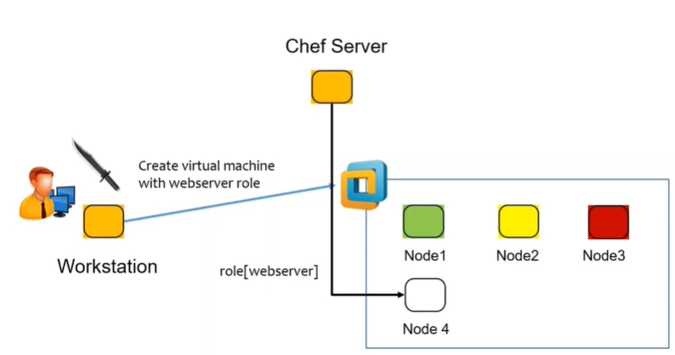
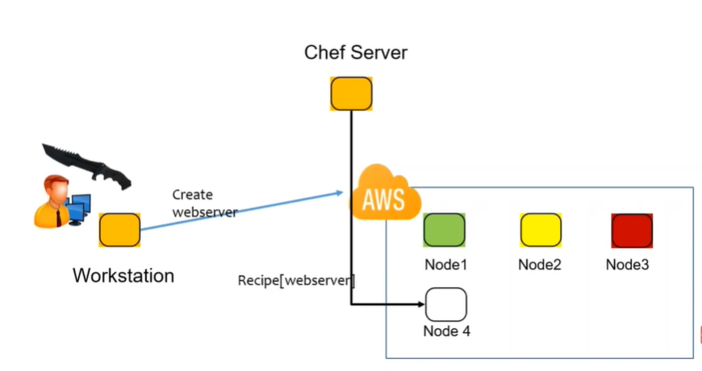

Chef – Knife 
=============

knife is a command-line tool that provides an interface between a local
chef-repo and the Chef Infra Server. knife helps users to manage:

-   Nodes

-   Cookbooks and recipes

-   Roles, Environments, and Data Bags

-   Resources within various cloud environments

-   The installation of Chef Infra Client onto nodes

-   Searching of indexed data on the Chef Infra Server

Knife Subcommands
-----------------

knife includes a collection of built in subcommands that work together to
provide all of the functionality required to take specific actions against any
object in an organization, including cookbooks, nodes, roles, data bags,
environments, and users.

All knife subcommands have the following syntax:

knife subcommand [ARGUMENT] (options)

#### Knife Bootstrap

You use the knife bootstrap subcommand to install the chef-client on Chef Nodes.
The bootstrap process also registers the Nodes with the Chef server to
facilitate communication between the two.

you would use a command like knife

knife **bootstrap 192.168.10.44**.

This instructs knife to install the chef-client on the system with the IP
address 192.168.10.44, register that system with the Chef server, and create a
node representing the system on the Chef server.

#### Knife Node

The knife node subcommand is used to query and set the various configuration
values for a node.

#### Knife Diff

Knife diff is used to compare the files in your current Workstation repo with
what is stored on the Chef server.

#### Knife Exec

Exec is a knife subcommand that lets you run Ruby scripts against the Chef
server in the context of a fully configured chef-client,

knife exec -E 'nodes.transform("chef_environment:_default") { \|n\|
n.chef_environment("development") }'

#### Knife SSH

The knife ssh subcommand lets you run ssh commands on all or a subset of the
nodes known to your Chef Server.

knife ssh "chef_environment:production" "uptime" -p 2222 -x earl -PMyPW99

#### Knife Search

knife search lets you do queries against all of the data stored in the Chef
server.

#### Knife Windows plugin

We use the knife Windows plugin when we are working with nodes running the
Windows operating system

Installing the Knife Windows plugin on Master

chef gem install knife-windows

Bootstrapping a Windows node

knife bootstrap windows winrm node03 -p 55985 -x Administrator -P MyPW99 -r
'recipe[winbase]'

#### Knife EC2 plugin

This plugin is used to integrate knife with Amazon cloud instances that allow
you to create and manage instances from the command line.

Installing the Knife EC2 plugin

chef gem install knife-ec2

The knife EC2 plugin requires some specific data related to your Amazon account.
to add the Amazon data to your knife.rb file, it should be added in this format:

knife[:aws_access_key_id] = "Your AWS Access Key ID"

knife[:aws_secret_access_key] = "Your AWS Secret Access Key"

If you already have some EC2 instances running.You can issue a command like
this:

knife ec2 server list -r us-west-2

**Creating an EC2 instance**

Using the Knife EC2 command to create a new EC2 instance is somewhat
complicated. A "simple" version of the command might look something like this:

knife ec2 server create --node-name ec2-node08 \\

\--groups=launch-wizard-1 \\

\--region=us-west-2 \\

\--availability-zone=us-west-2a \\

\--image=ami-5189a661 \\

\--server-connect-attribute=public_ip_address \\

\--flavor=t2.micro \\

\--ssh-user=ubuntu \\

\--ssh-key=my_chef_service \\

\--identity-file=/Users/earlwaud/.aws/my_chef_service.pem \\

\--run-list=recipe['base']

**Bootstrapping an existing EC2 instance**

To bootstrap an existing EC2 instance, you will issue a command much like the
one used to bootstrap any other server. It might look something like this:

knife bootstrap 54.213.235.40 \\

\--node-name my_old_ec2_node \\

\--ssh-user ubuntu \\

\--identity-file /Users/earlwaud/.aws/my_chef_service.pem \\

\--sudo

**Deleting EC2 instances**

delete --node-name \<node-name\> --purge

#### Knife cookbook commands

**List** - To see a list of all community cookbooks available from Supermarket.

knife cookbook site list

**Search** - To search particular cookbook

knife cookbook site search mysql

**Show** - To view more information about a particular cookbook

knife cookbook site show mysql

**Download** - To download a cookbook as a tar.gz archive and place it in the
current working directory

knife cookbook site download mysql

Uploading to the Supermarket

There are a few things you’ll need in place before you can upload your cookbook
to the Supermarket.

edit .chef/knife.rb.

node_name "satyacodes" \# Replace with the login name you use to login to the
Supermarket.

client_key "\#{ENV['HOME']}/.chef/client.pem" \# Define the path to wherever
your client.pem file lives. This is the key you generated when you signed up for
a Chef account.

cookbook_path [ '/Users/nshamrell/Projects/my_chef_repo/cookbooks' ] \#
Directory where the cookbook you're uploading resides.

**Share** - to upload the cookbook to the Supermarket

knife cookbook site share "my_apache2_cookbook" "Web Servers"

“Web Servers" - is category my cookbook

**Unshare** - to Remove your cookbook from the Supermarket.

knife cookbook site unshare my_apache2_cookbook

Knife plug-ins to Create New Nodes/ Servers
-------------------------------------------

Knife Plug-in : Create server with VMWare plugin

Knife Plug-in : Create server with AWS EC2 plugin

