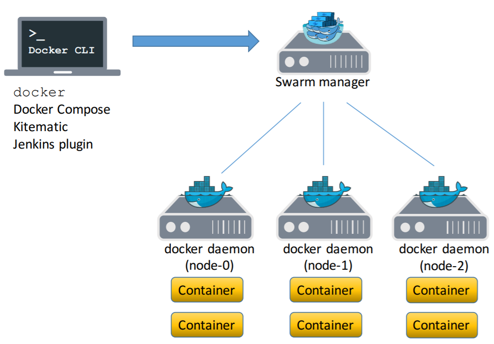

Docker - Swarm
==============

If we have multiple Docker Containers & which are connected together. We can't
manage one by one. To manage all this type of Multiple containers we will use
Docker Swarm.

In more Detail, Docker Swarm is an **Orchestration tool** for Docker Containers.

Let’s take an example – we have 100 containers. You need to do

-   Health check on every container

-   Ensure all containers are up on every system

-   Scaling the containers up or down depending on the load

-   Adding updates/changes to all the containers

Installation
------------

Check docker-machine installed or not

docker-machine -v

If not follow this

<https://docs.docker.com/machine/install-machine/#installing-machine-directly>

Download the Docker Machine binary and extract it to your PATH(in Linux)

base=https://github.com/docker/machine/releases/download/v0.16.0 &&

curl -L \$base/docker-machine-\$(uname -s)-\$(uname -m) \>/tmp/docker-machine &&

sudo mv /tmp/docker-machine /usr/local/bin/docker-machine &&

chmod +x /usr/local/bin/docker-machine

Check the installation by displaying the Machine version:

docker-machine version

docker-machine version 0.16.0, build 9371605

Example
-------

In this example, We need to Create one Docker Swarm & multiple Node Machines

**1.Create one machine as manager**

[windows]

docker-machine create --driver hyperv manager1

[linux]

docker-machine create --driver virtualbox manager1

If you got error like

"Error with pre-create check: "VBoxManage not found. Make sure VirtualBox is
installed and VBoxManage is in the path"

Run

brew cask install virtualbox;

<https://stackoverflow.com/questions/38696164/docker-machineerror-with-pre-create-check-exit-status-126>

**2.Check machine created successfully**

docker-machine ls

docker-machine ip manager1 (To get IP of manager)

**3.Create Worker Machines**

worker1 \> docker-machine create --driver virtualbox worker1

worker2\> docker-machine create --driver virtualbox worker2

Check \`docker-machine ls\` :: we should see 1 manager & 2 workers

**4.SSH (connect) to docker machines**

docker-machine ssh manager1

docker-machine ssh worker1

docker-machine ssh worker2

**5.Initialize Docker Swarm**

docker swarm init --advertise-addr MANAGER_IP

docker node ls

(this command will work only in swarm manager and not in worker)

**6. Join workers with the Docker swarm**

In manager node run command

docker swarm join-token worker

This will give command to join swarm as worker

Copy the generated command & run in worker nodes.Check nodes again :: it should
give nodes

docker node ls

**7. On manager , we can run standard docker commands**

-   docker info

-   docker swarm

8. Run containers on Docker Swarm

docker service create --replicas 3 -p 80:80 --name serviceName nginx

Check the status:

docker service ls

docker service ps serviceName

Check the service running on all nodes

Check on the browser by giving ip for all nodes

9. Scale service up and down

On manager node

docker service scale serviceName=2

10. Shutdown node

docker node update --availability drain worker1

11. Update service

docker service update --image imagename:version web

docker service update --image nginx:1.14.0 serviceName

12. Remove service

-   docker service rm serviceName

-   docker swarm leave : to leave the swarm

-   docker-machine stop machineName : to stop the machine

-   docker-machine rm machineName : to remove the machine

References
==========

PPT Book

<http://people.irisa.fr/Anthony.Baire/docker-tutorial.pdf>

#### Introductio

Ref : <https://www.edureka.co/blog/docker-tutorial>

#### What is Docker

Ref : <https://www.edureka.co/blog/what-is-docker-container>

<https://www.youtube.com/watch?v=h0NCZbHjIpY&list=PL9ooVrP1hQOHUKuqGuiWLQoJ-LD25KxI5>

[Docker Tutorial - Introduction To Docker &
Containerization](https://www.edureka.co/blog/docker-tutorial)

[What is Docker Container? - Containerize Your Application Using
Docker](https://www.edureka.co/blog/docker-container/)

[What Is Docker & Docker Container ? A Deep Dive Into Docker
!](https://www.edureka.co/blog/what-is-docker-container)

[Top 15 Docker Commands - Docker Commands
Tutorial](https://www.edureka.co/blog/docker-commands/)

[Install Docker - Docker Installation On Ubuntu And
CentOS](https://www.edureka.co/blog/install-docker/)

[Docker Networking - Explore How Containers Communicate With Each
Other](https://www.edureka.co/blog/docker-networking/)

[Docker Swarm For Achieving High
Availability](https://www.edureka.co/blog/docker-swarm-cluster-of-docker-engines-for-high-availability)

[Docker Compose For Containerizing A MEAN Stack
Application](https://www.edureka.co/blog/docker-compose-containerizing-mean-stack-application/)

[Kubernetes vs Docker: Comparing The Two Container Orchestration
Giants!](https://www.edureka.co/blog/kubernetes-vs-docker/)

###### Handson

<https://www.edureka.co/blog/install-docker/>

Install :
<https://www.youtube.com/watch?v=lcQfQRDAMpQ&list=PL9ooVrP1hQOHUKuqGuiWLQoJ-LD25KxI5&index=2>

Edureka :
<https://www.youtube.com/watch?v=h0NCZbHjIpY&list=PL9ooVrP1hQOHUKuqGuiWLQoJ-LD25KxI5>

Next :
<https://www.youtube.com/watch?v=wi-MGFhrad0&list=PLhW3qG5bs-L99pQsZ74f-LC-tOEsBp2rK>

 

###### Installing Docker on Ubuntu

<https://www.youtube.com/watch?v=lcQfQRDAMpQ&list=PL9ooVrP1hQOHUKuqGuiWLQoJ-LD25KxI5&index=2>
19: min

###### Labs Handson

[https://labs.play-with-docker.com/\#](https://labs.play-with-docker.com/)

<https://training.play-with-docker.com/>

<https://github.com/docker/labs>

<http://dockerlabs.collabnix.com/(Best)>

<https://www.katacoda.com/courses/docker(2nd> Best)
