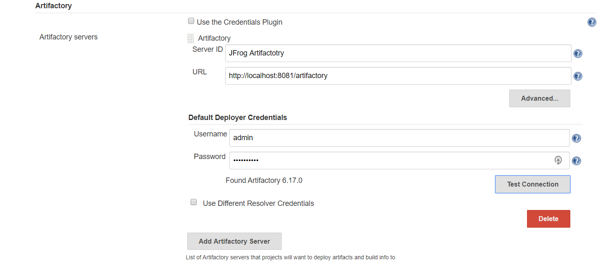
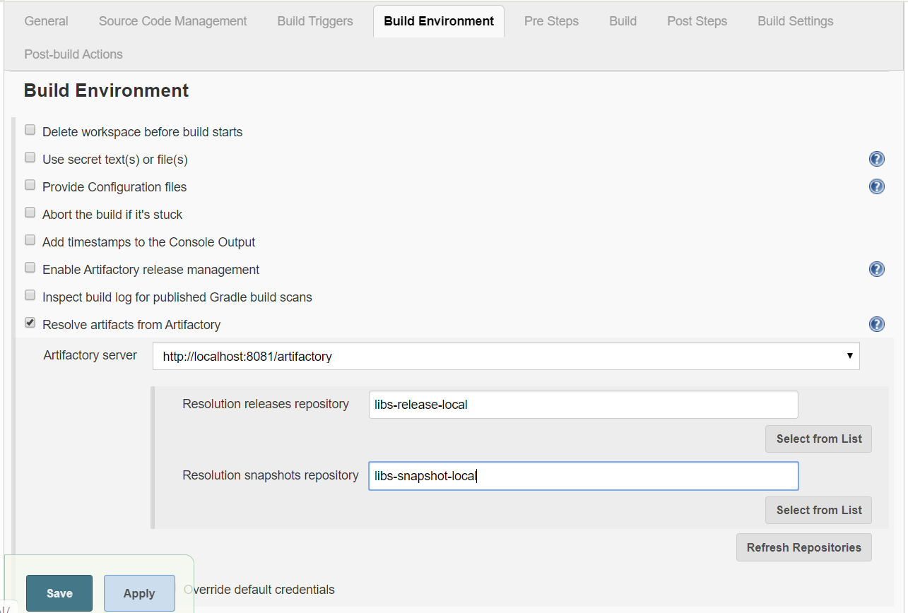
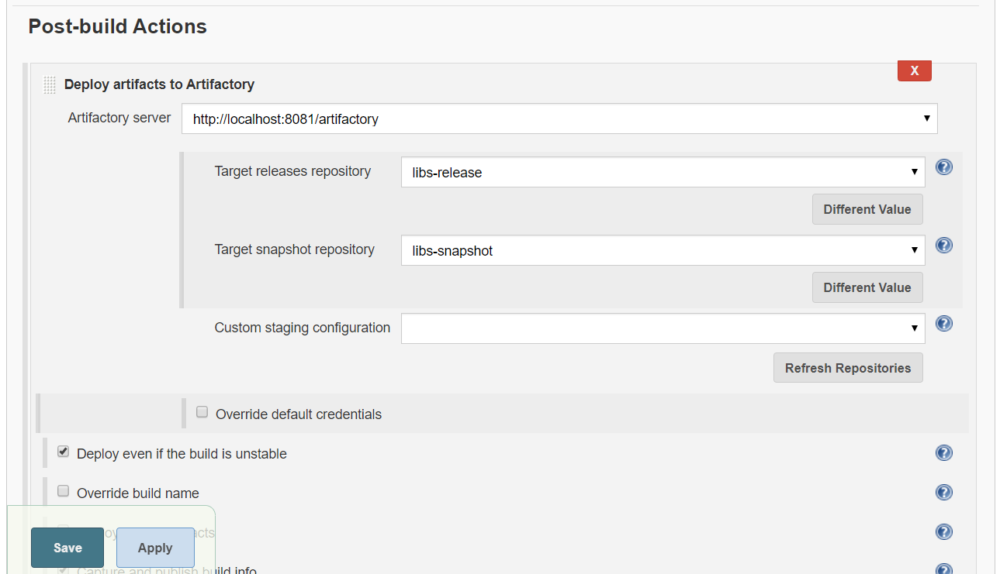

Jenkins – JFrog Integration
===========================

**Add Artifactory Plugin to Jenkins**

Go to Jenkins dashboard -\> Manage Jenkins -\> Manage Plugins -\> Available -\>
**Artifactory** -\> Install without restart.

**Configure Artifactory-related settings in Jenkins**

Go to Jenkins dashboard -\> Configure System -\>Artifactory section -\>Add
artifactory server -\> provide the details -\> Test the connection -\>apply &
save

**Configure Project** : to creates package file after compiling all of the
source files.

Go to Build Environment section -\> Resolve artifacts from artifactory -\> Click
on refresh Repositories -\>select the repository in release and snapshot field
from the lists.

**post-build section**

Go to Add post-build section -\>select **deploy artifacts to artifactory** -\>
click on refresh -\> choose the target releases and snapshot repository
(repositories created earlier) -\>save

**Click on Build now.**

Jar files are resolved from the local repository or Artifactory.

**check the package**

Once the package is created, it is stored in artifactory too. Go in the
artifactory and check the package.
