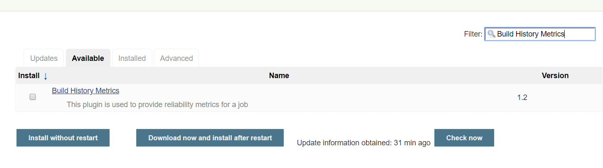
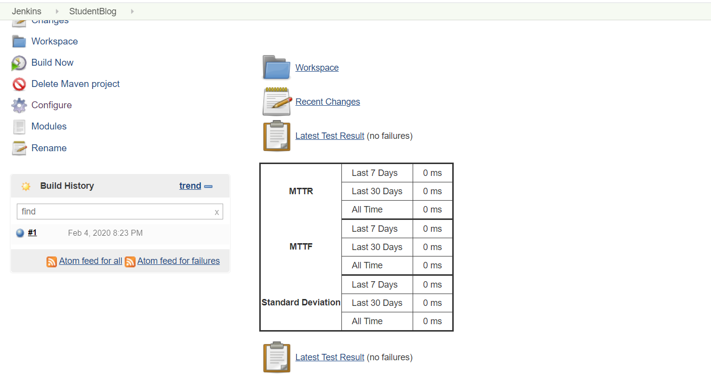
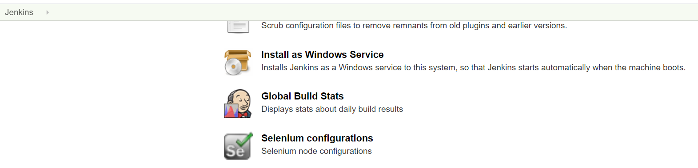
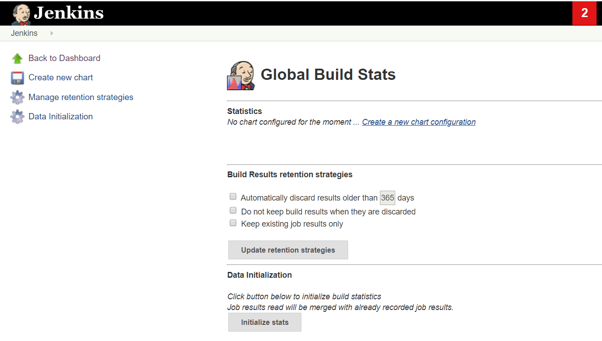
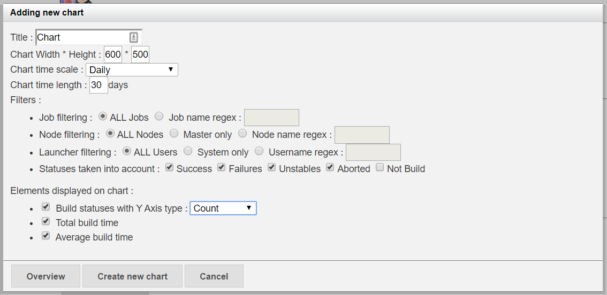
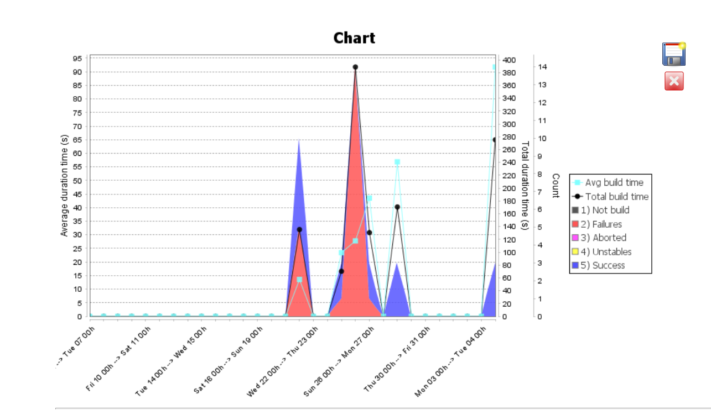
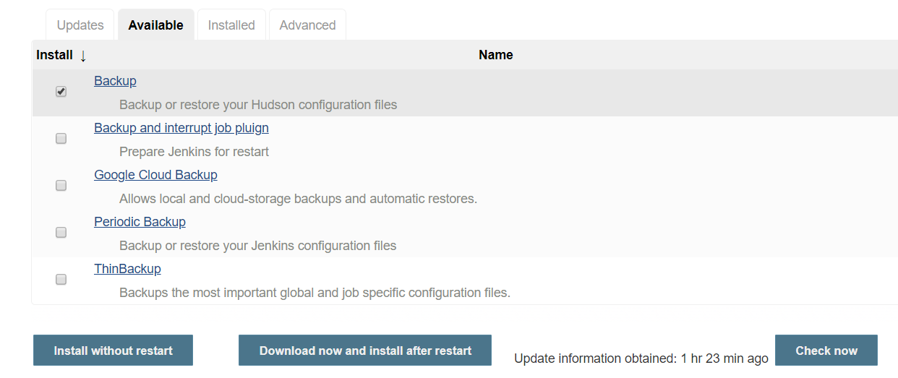
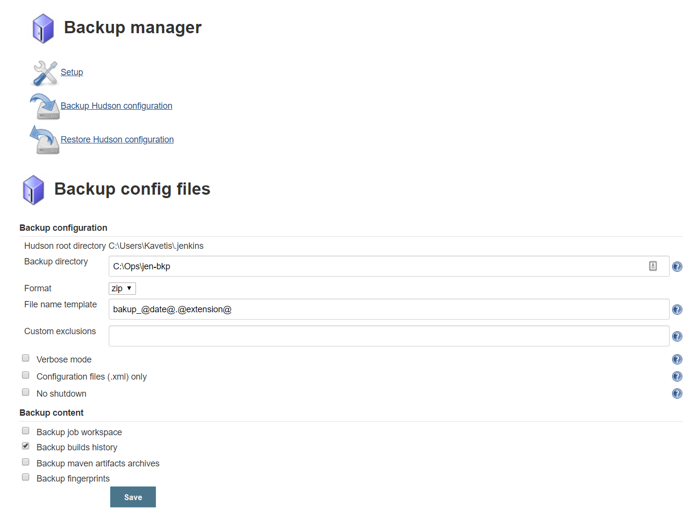
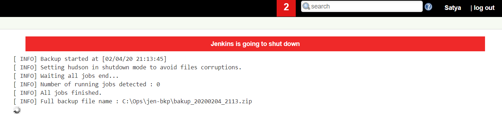

Jenkins – Build Metrics 
========================

Jenkins metrics are useful to see the build and to understand how frequently
they fail/pass over time.

### Build History Metrics Plugin

We have **"Build History Metrics Plugin",** provides the following metrics for
all of the build

-   MTTF (Metrics Time to Failure)

-   MTTR (Mean Time to Recovery)

-   Standard Deviation of Build Times

Install Plugin.

No additional configuration required. Just open any job

### Build-metrics 

We have another plugin - **Build-metrics** , display build stats in a graphical
format

Install Plugin : **Build-metrics** 

Manage Jenkins \> Global Build Stats \> **Initialize stats**

Once you click the **Initialize stats** button, Jenkins will gather all the
existing build records which are already been carried out, and **charts can be
created based on these results**.

Once you click this button, you will see a text "**data successful
initialized**"

**Create Chart**

Once the data has been initialized, it is the time to create a new chart. To
create the new chart, click on "**Create new chart configuration**" link.
Provide details, for example

-   Title - give any label, I have given "Result"

-   Chart Width - 600

-   Chart Height - 500

-   Chart time scale - Daily

-   Chart time length - 30 days

It will Display the Stats on Same page.

Jenkins – Back up Jenkins
-------------------------

Jenkins provides a **backup** plugin which can be used to get backup critical
configuration settings - includes job configs, plugins, build logs, plugin
configuration, etc.

Install Plugin : **backup**

Now, go to Manage Jenkins \> Backup manager \> **setup : provide details**

**To Backup : Click on ‘Backup Hudson Configuration’**

