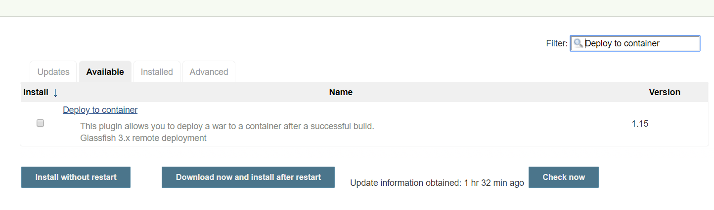
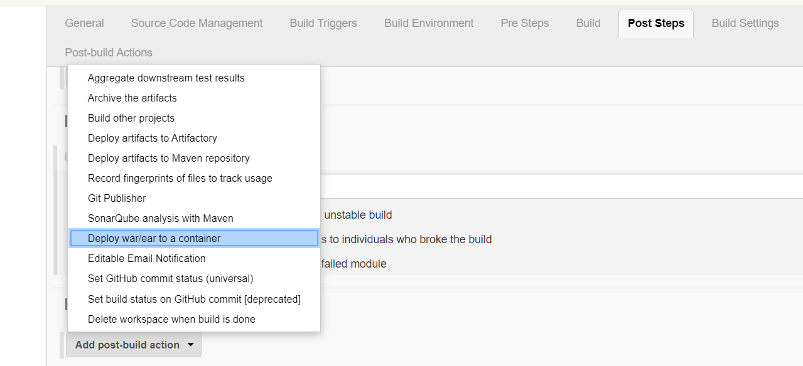
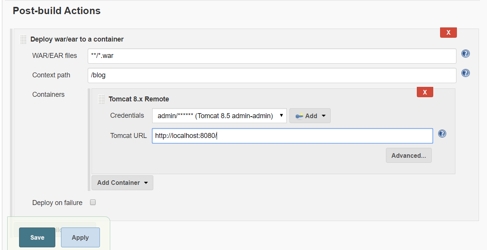
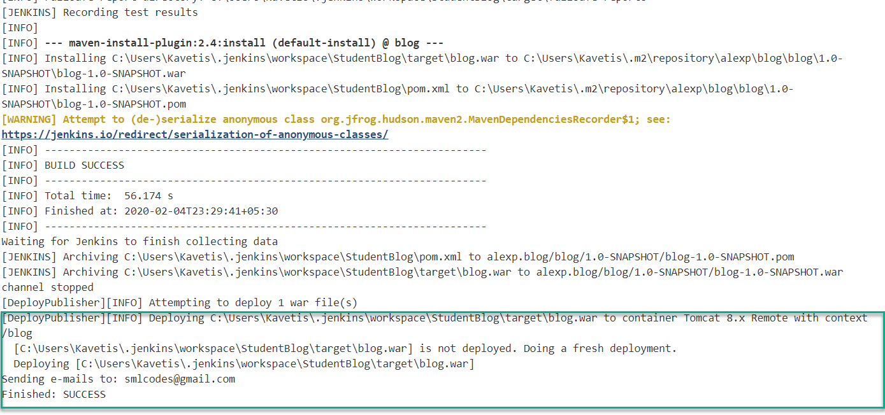
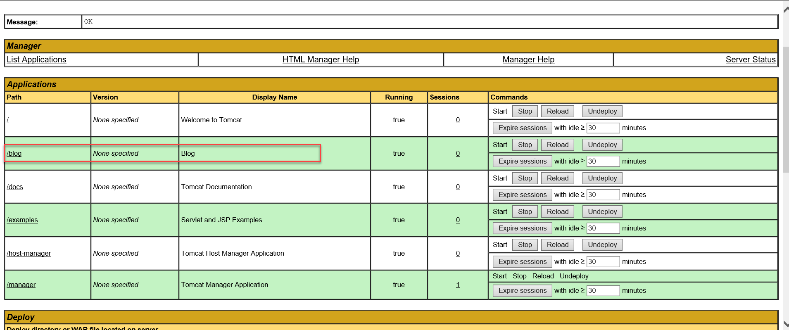
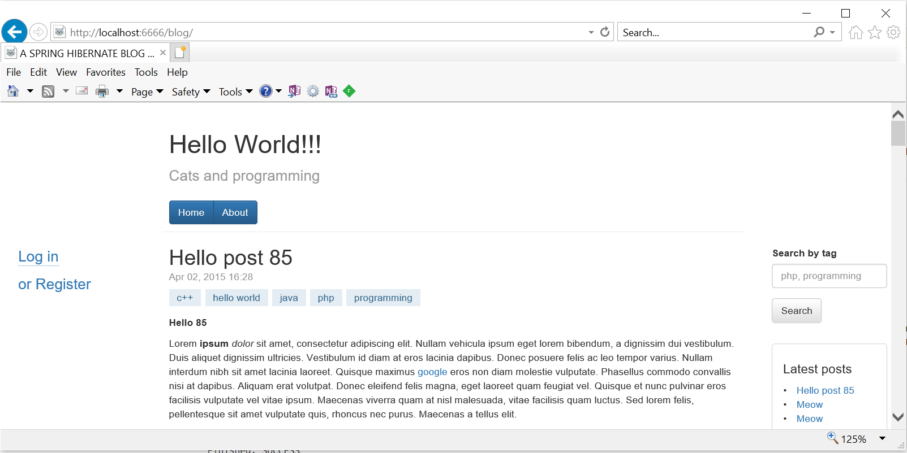

Jenkins - Automated Deployment
==============================

Transfer the build files after a successful build to the respective
application/web server. We will use **Deploy to container Plugin** to perform
this.

**\`Deploy to container\` Plugin**

This plugin takes a war/ear file and deploys that to a running remote
application server at the end of a build.

-   Tomcat

-   JBoss

-   Glassfish

**Add Plugin : \`Deploy to container\`**

**Configure Job**

Add **post-build** action \> **Deploy war/ear to a container** option.

Provide Server Details.

Note : In tomact : By default the Manager is only accessible from a browser
running on the same machine as Tomcat. If you wish to modify this restriction,
you'll need to edit the Manager's context.xml file

\#tomcat\>/webapps/manager/META-INF/context.xml -comment the Valve:

\<Context antiResourceLocking="false" privileged="true" \>

\<!--

\<Valve className="org.apache.catalina.valves.RemoteAddrValve"

allow="127\\.\\d+\\.\\d+\\.\\d+\|::1\|0:0:0:0:0:0:0:1" /\>

\--\>

\</Context\>

Add role & user

\- add roles "manager-script" to the user,

\- Users with the manager-gui role should not be granted either the
manager-script or manager-jmx roles.

Save & Trigger Build.

Open Tomcat GUI: <http://localhost:6666/manager/html> see ‘\\blog’ deployed.

Access Application by Clicking on it.

