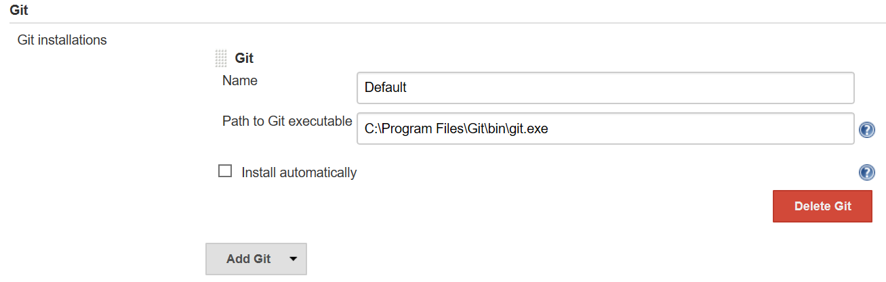
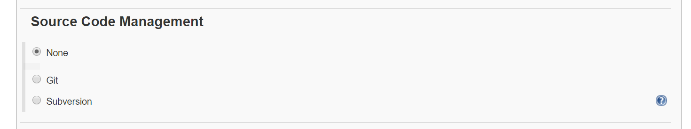
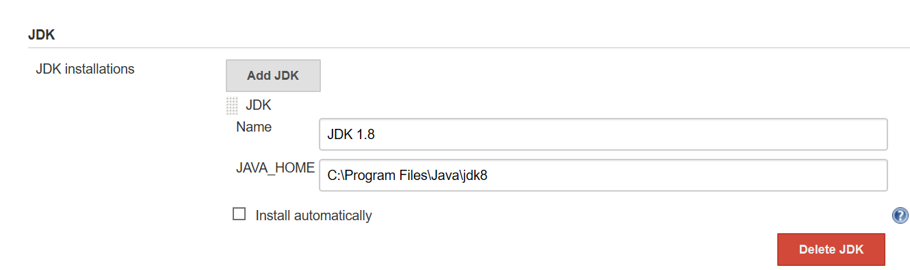
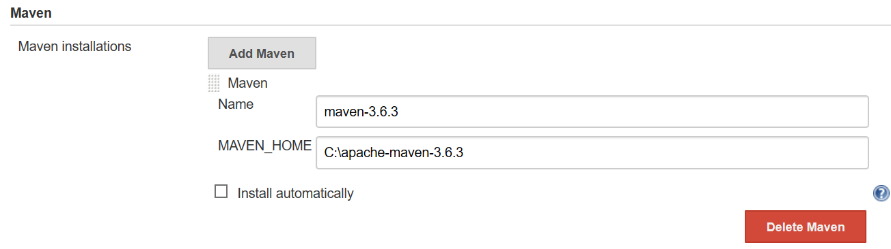
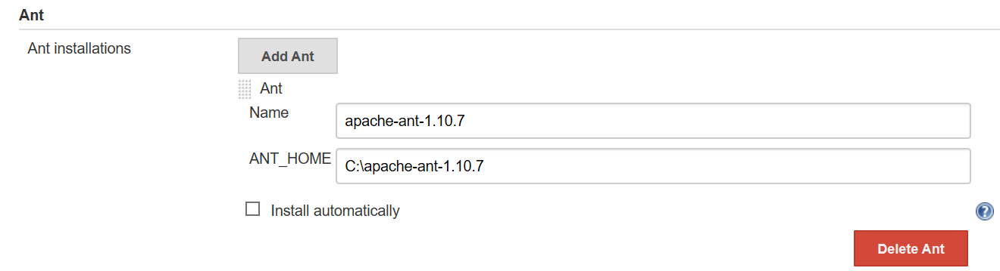

Jenkins – Common Configurations
===============================

### Install & Configure Git

Jenkins dashboard \> Manage Jenkins \> Global Tool Configuration \> Git :
Provide valid git.exe path

Jenkins Dashboard \> Manage Jenkins \> Manage Plugins \>Filter: **Git plugin**
\> Install without restart

After Jenkins is restarted, Git will be available as an option whilst
configuring jobs

### Install & Configure Java

Jenkins dashboard \> Manage Jenkins \> Global Tool Configuration \>Java section
:"Add JDK"

### Install & Configure Maven

Jenkins dashboard \> Manage Jenkins \> Global Tool Configuration \>Maven section
:"Add MAVEN"

### Install & Configure Ant

Jenkins dashboard \> Manage Jenkins \> Global Tool Configuration \>Ant section
:"Add ANT"

