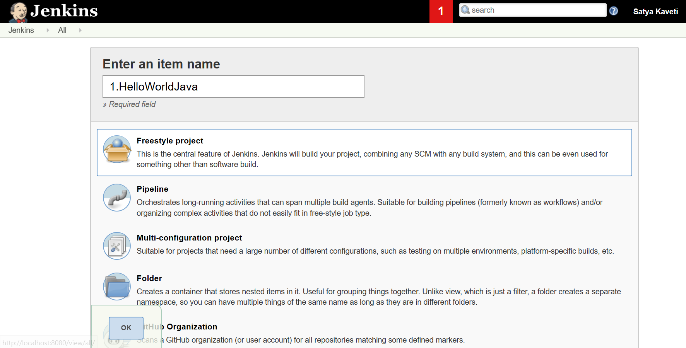
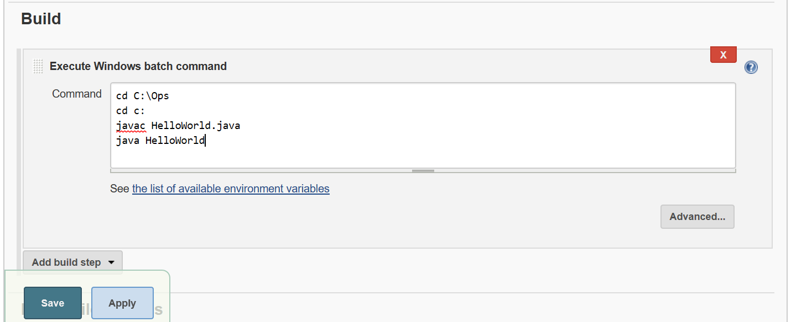
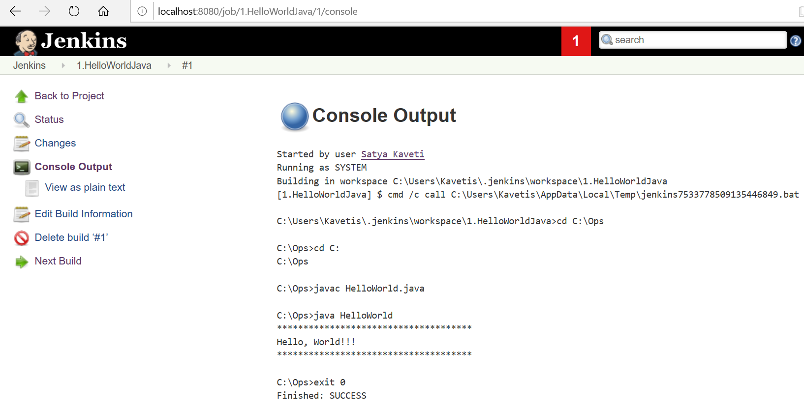

Jenkins – Java Hello world example
==================================

Jenkins Dashboard \> New Item \> Freestyle Project

Build Tab \> Just add below Windows batch commands to build & run local java
files

Click on Build Now & check Console output

