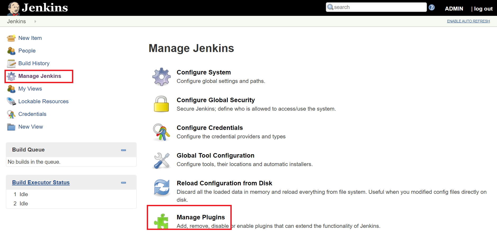
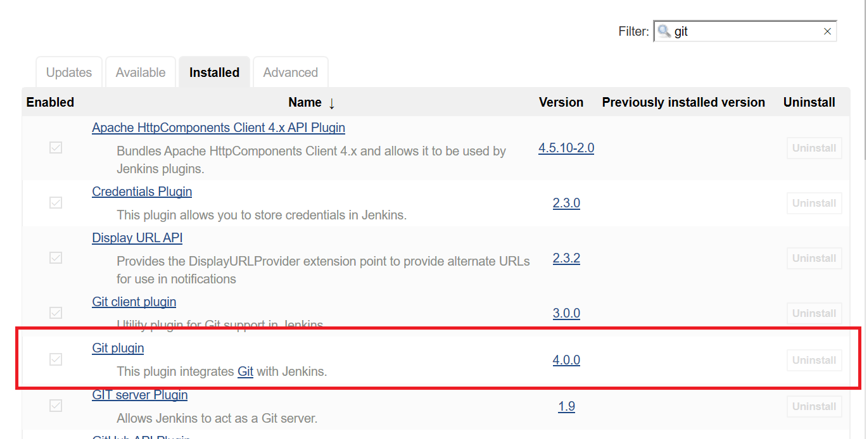
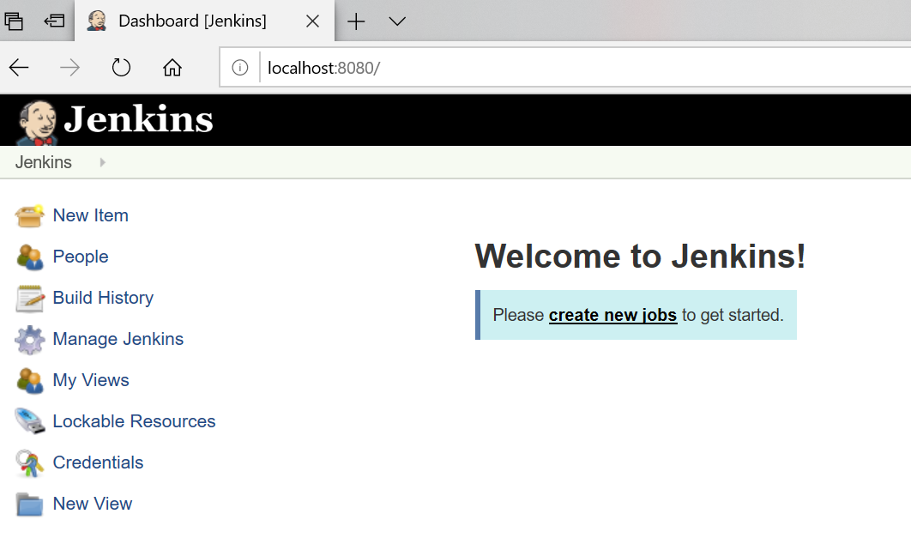
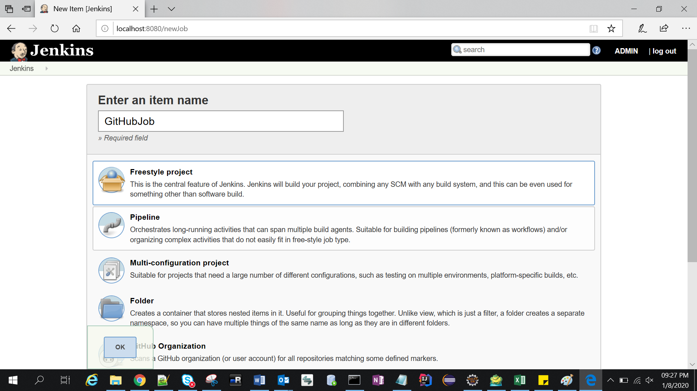
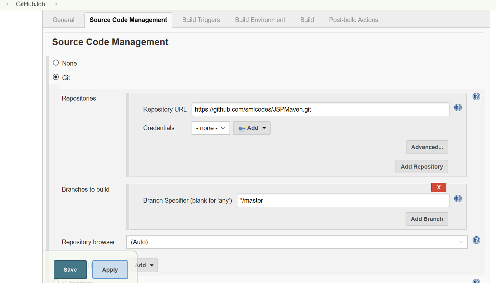
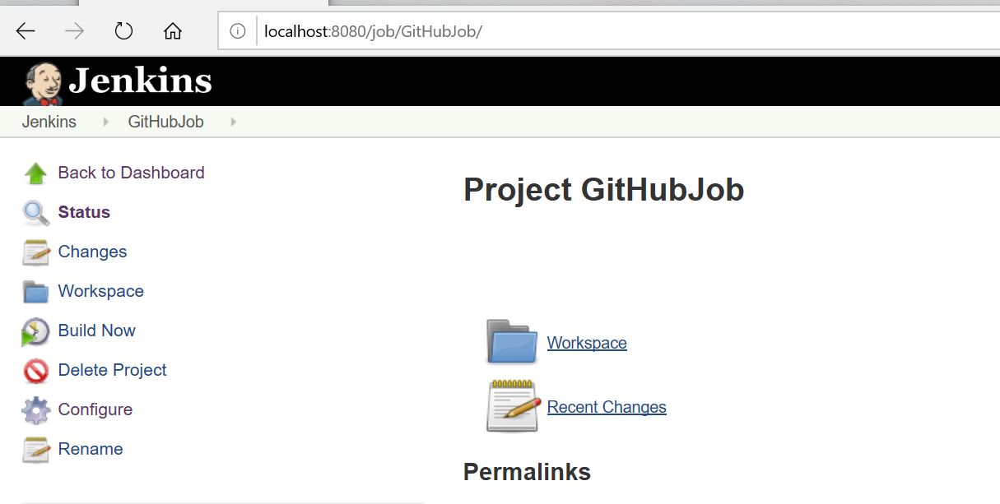
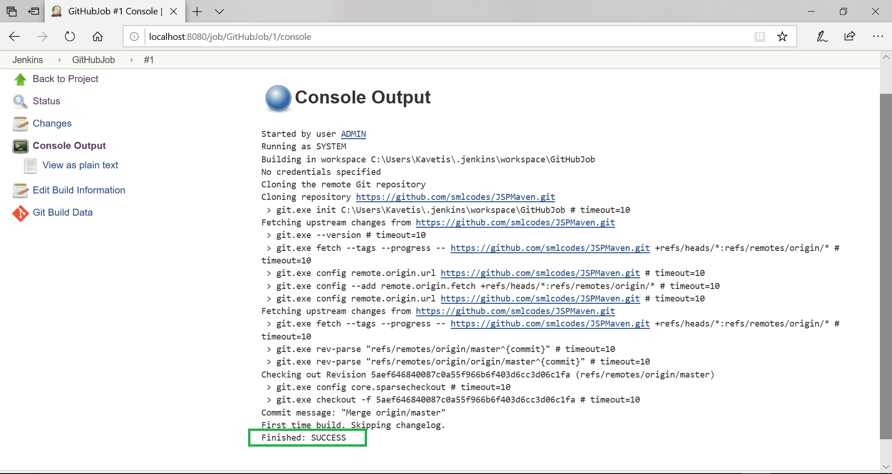

Jenkins – GitHub Integration 
=============================

Jenkins is a Continuous Integration Tool; it needs to check out source code from
a repository and build code.

### Install GitHub Plugin

Jenkins Dashboard\> Manage Jenkins\> Manage Plugins.

Next page – click on the "Available tab”. Search for "Git Plugin", Install it.
Installed plug-ins can be shown in "installed" tab.

­­

### Integrating Jenkins with GitHub

We must have Git installed in your system

Jenkins Dashboard \> Create new job

Now enter the item name and select the job type. For example, item name is
"GithubJob" and job type is "Freestyle project". Then OK

Go to “Source Code Management” Tab \> Select Git \> Provide Github Repo URL
\>Save / Apply

Example : <https://github.com/smlcodes/JSPMaven.git>

To Check Integration just Build it.

If build Success, it is integrated propetly.

