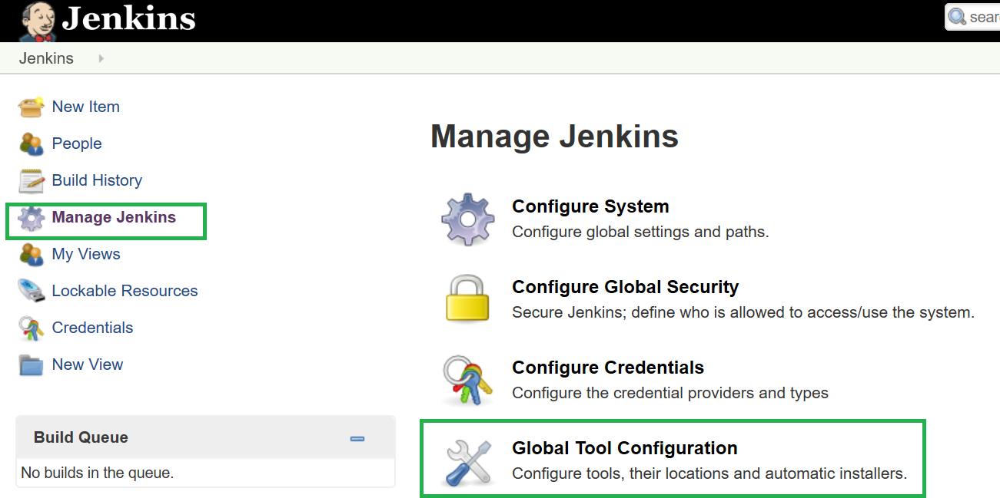
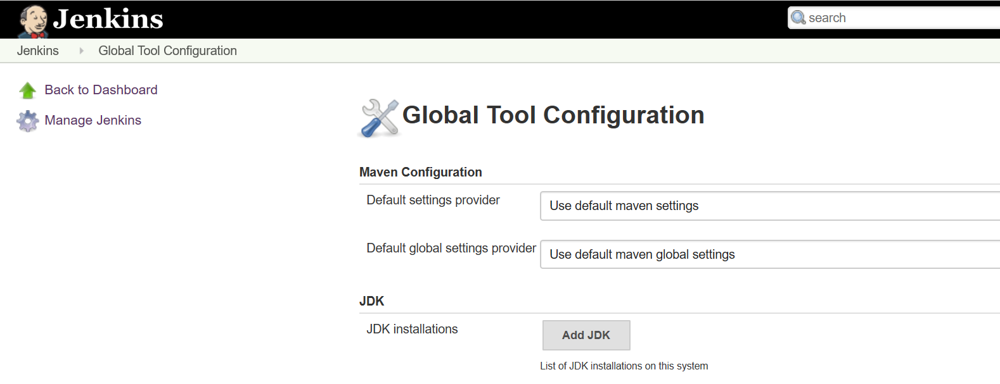
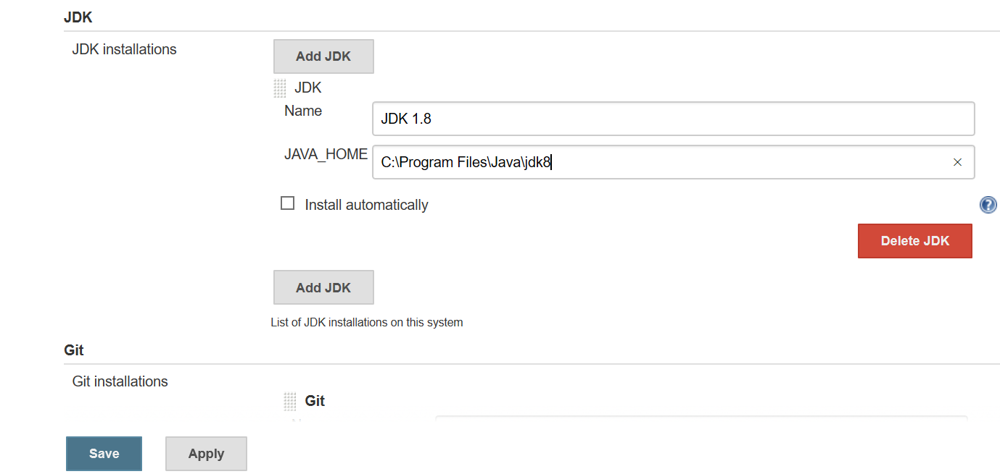
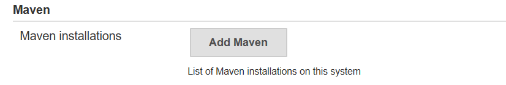
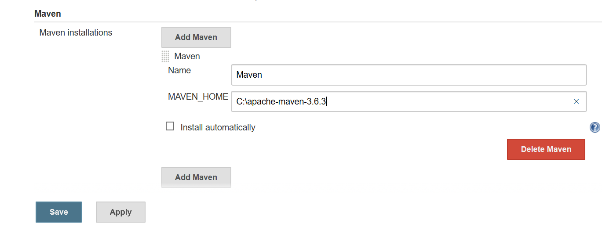
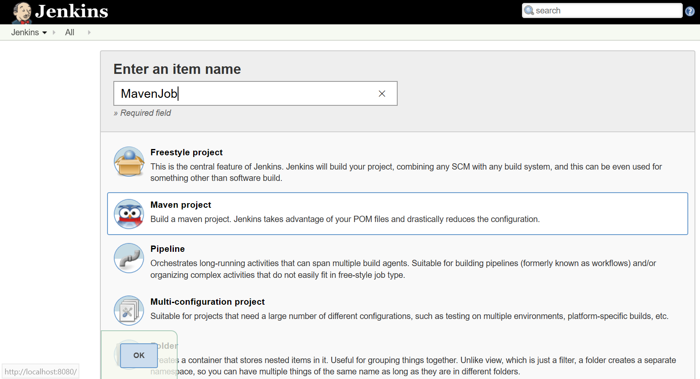
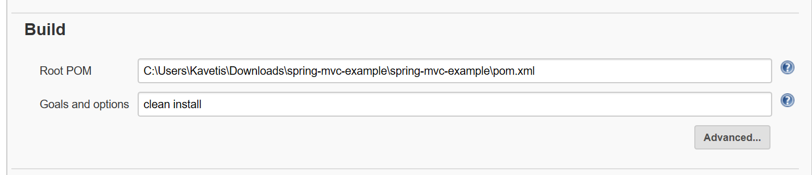
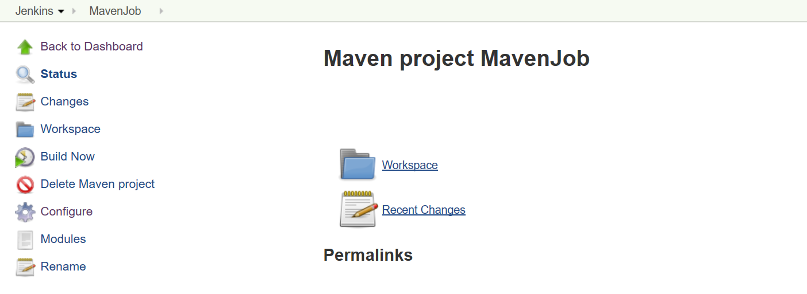
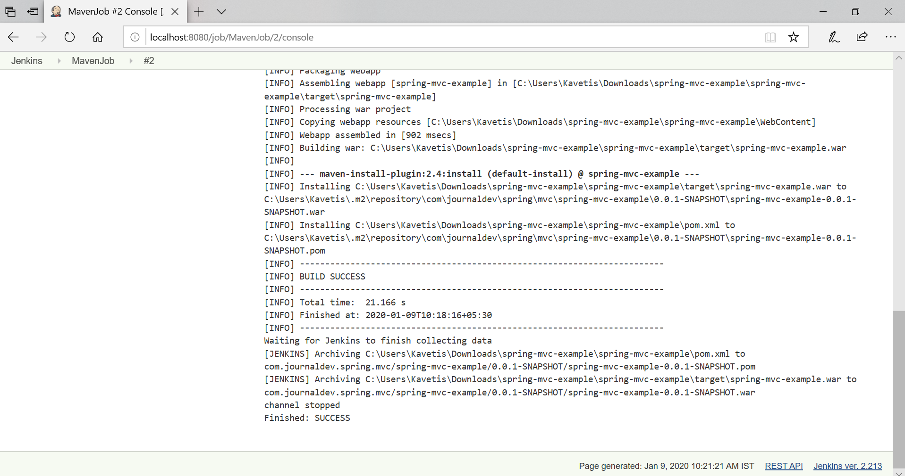

Jenkins – Maven Project Integration 
====================================

Make sure Maven is installed in your system

-   Downloading Maven - <https://maven.apache.org/download.cgi>

-   Add a MAVEN_HOME system variables and point it to the Maven folder.

-   Check Maven Installation by Running "**mvn –version**" on command line

### Configure Maven in Jenkins

Install below plug-ins in Jenkins

-   Maven Integration

-   Maven SNAPSHOT Check

Jenkins Dashboard \> Manage \> Global Tool Configuration

To configure Java, click on "Add JDK"

Provide Name, JAVA_HOME - Provide Java Home Path – save

To configure Maven, click on "Add Maven" , MAVEN_HOME- Provide Maven Home Path

### Jenkins –Creating Maven Job 

I have a sample maven project in my local system at
**C:\\Users\\Kavetis\\Downloads\\springmvcexample**”. To build this project with
Jenkins follow below steps.

Make sure **Maven Integration** plugin is installed. Click on the New Item link
to create a CI job. & Select the Maven project radio button

Go to the Build section of new job.

-   In the Root POM textbox, enter full path to pom.xml

-   In Goals and options section, enter **clean install** (*without mvn*)&
    Save/Apply

click on the **Build Now** link.

