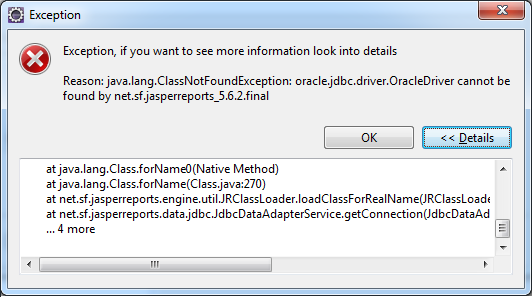
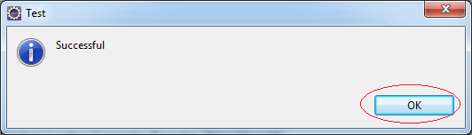
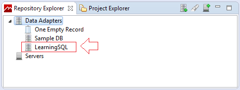
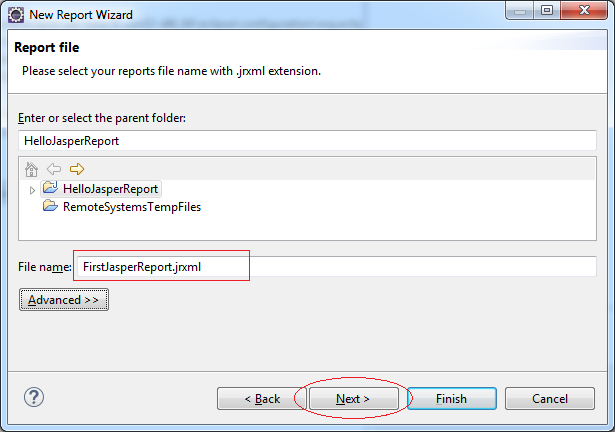
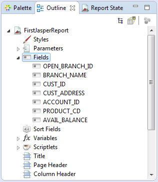
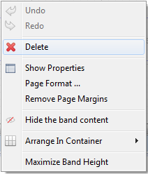
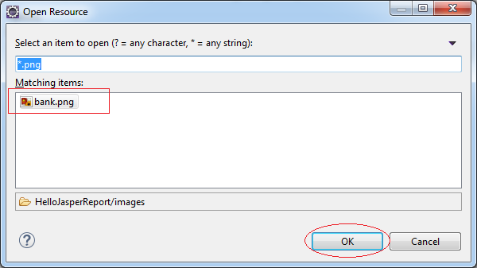
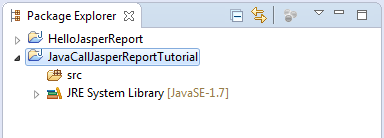
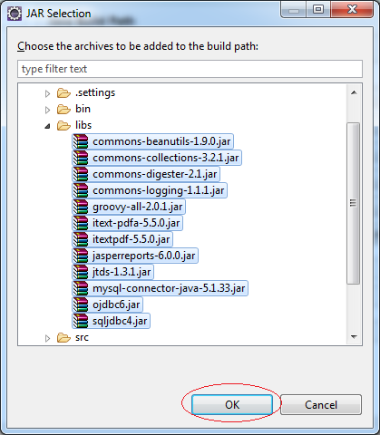

# Jasper Reports
JasperReports is an open-source reporting tool for Java that is used for reporting of applications. This reporting tool helps in writing rich content onto the screen, to the printer, or into a variety of files like HTML, PDF, XLS, RTF, CSV, XML, ODT and TXT. JasperReports can also be used for Java-enabled applications like Java EE or web applications to generate dynamic content.

- #### **Install JasperReports**
install Jasper Reports Community edition **from Here.**

<https://community.jaspersoft.com/community-download>

- #### **Lifecycle of JasperReports**

A **.jrxml** report template is consist of the following parts shown in the below figure.

## 1\. Create JasperReport Project in Eclipse
**Jaspersoft Studio Plugin:**

To program **Jasperreport** report you need to install **JasperSoft Studio** on Eclipse.

- #### **SQL Query**
Select Acc.Open\_Branch\_Id

`     `,Bra.Name           Branch\_Name

`     `,Acc.Cust\_Id

`     `,Cus.Address        Cust\_Address

`     `,Acc.Account\_Id

`     `,Acc.Product\_Cd

`     `,Acc.Avail\_Balance

From   Account  Acc

`     `,Customer Cus

`     `,Branch   Bra

Where  Acc.Cust\_Id = Cus.Cust\_Id

And    Acc.Open\_Branch\_Id = Bra.Branch\_Id

- #### **Create JasperReport Project**
Open Perspective: **Report Design**.

Next, create a project**:**

- **File/New/Other..**

Enter the name of the Project:

- **HelloJasperReport**

Project has been created:

- #### **Create Data Adaptor**
Here I connect with **Oracle** database. You can do the same with **MySQL** or **SQLServer**. There is some differences in the using library and ***URL Connection String***.

Error emerges when you do not declare the classpath of Database Library Driver.

Just Add the **jar** file location, the JDBC Driver library for this database

OK, ***Data Adaptor*** was created.

- #### **Design report**
Create a new report **File/New/Other...**

Enter the name of the report: **FirstJasperReport**

?

The report is generated.

**Outline View** is very important. We often have to use it while designing a report.

A blank report page is created. In which, parts of content of ***Page Header***, ***Column Header***, ***Column Footer***, ***Page Footer*** are repeatedly displayed on each page of the report. You can delete unnecessary parts of content by right-click on it and click **Delete**.

Here I deleted all of parts, except for **Column Header** & **Detail** in order to make it easy to design. We can recreate them if necessary.

- **Column Header**: contains titles of data columns. It is duplicated in all pages by default.
- **Detail**: contains records. It repeat numbers of records.

6\.2- Rough design report

Drag and drop **Rectangle** object from ***Pallete*** to **Column Header** of the report. Then, fully spread out the width of **Rectangle**.

Next, adjust the height of **Column Header** so that it is equal to the height of newly-made ***Rectangle***. The purpose is to erase unnecessary space in the report.

Results:

Change the background color of the rectangle:

Next, we create 2 groups in turn:

- **Group Branch**
- **Group Cust**

Their meaning is described in the following illustrative image:

On the **Outline**, right click to **FirstJasperReport**, select Create Group:

Next, we drag a **Rectangle** from **Pallete** to ***"Branch Group Header 1"*** area.

Change the background color for the rectangle you just created.

Next, we will drag drop respectively the **Field Open\_Branch\_Id** and **Branch\_Name** into **Rectangle** on the block **"Branch Group Header 1".**

Similarly, we drag and drop ***Branch\_Name*** next to ***Open\_Branch\_Id***.

**Next, Create Customer group:**

After **Customer Group** is created, drag and drop Rectangle object into ***"Customer Group Header 1"***. Adjust and change background of Rectangle as the following illustrative image:

Drag & drop Field: **Cust\_ID** into Rectangle just created.

Similarly, drag & drop **Cust\_Address** field.

Next, drag and drop fields ***Account\_Id***, ***Product\_Cd***, ***Avail\_Balance*** into ***"Detail 1"*** area in turn:

*Note: If you drag and drop FIELDS into **Detail** area, column titles will be automatically created in **Column Header** area.*

Adjust the height of **"Detail 1"** area to a minimum:

Next, drag and drop the remaining column titles:

Minimize the height of 2 areas:

- Customer Group Footer 1
- Branch Group Footer 1

Next drag & drop Field: **AVAIL\_BALANCE** into **"Customer Group Footer 1**" & **"Branch Group Footer 1"**.

Simultaneously, we change background of two objects we have just dragged and dropped.

6\.3- Run report (First time)

We test the report by clicking **Preview** TAB:

- #### **Beauty Report**
Selecting the fields and setting properties as shown below.

- #### **Run Report (Second time)**

- #### **Design Header section of the report**
Create **images** folder in project, copy file ***bank.png*** to this folder, as illustrated below:

- **bank.png**

Drag and drop **Image** object from the ***Palette*** to the page header.

Next drag & drop ***"Static Text"*** object to Page Header.

Similarly, drag & drop second ***"Static Text"*** object to Page Header.

6\.7- Run Report (Third time)

## 2. JasperReport using Java
Download JasperReport library for Java

<http://community.jaspersoft.com/download>

You need a **JasperReport** file. We will run that report on **Java**. You can download an example of a report file at: <https://community.jaspersoft.com/sites/default/files/files/StyledTextReport.zip>

Unzip the downloaded file, we will have ***jrxml*** file.

Create a Java project and declare library.Create Java Project:**JavaCallJasperReportTutorial**

Create a **libs** folder and copy the most vital libraries into this folder, including:

- commons-beanutils-\*.jar
- commons-collections-\*.jar
- commons-digester-\*.jar
- commons-logging-\*.jar
- groovy-all-\*.jar
- itextpdf-\*.jar
- itext-pdfa-\*.jar
- jasperreports-\*.jar

Next, copy JDBC Drivers into ***libs*** folder. Here I copy all of three **JDBC Driver** into Database types including **Oracle**, **MySQL**, **SQLServer**. 

To declare the library, right-click Project and select **Properties**

Select all the **jar** files in the **libs** folder:

- #### **Java - JasperReport without DB**
Here is a simple example, **Java** will call to report **JasperReport** and generate **PDF** file. This simple example does not have the participation of the **Database**.

**import** java.io.File;

**import** java.io.IOException;

**import** java.util.HashMap;

**import** java.util.Map;

**import** net.sf.jasperreports.engine.JRDataSource;

**import** net.sf.jasperreports.engine.JREmptyDataSource;

**import** net.sf.jasperreports.engine.JRException;

**import** net.sf.jasperreports.engine.JasperCompileManager;

**import** net.sf.jasperreports.engine.JasperExportManager;

**import** net.sf.jasperreports.engine.JasperFillManager;

**import** net.sf.jasperreports.engine.JasperPrint;

**import** net.sf.jasperreports.engine.JasperReport;

**public** **class** PdfFromXmlFile {

`	`**public** **static** **void** main(String[] args) **throws** JRException, IOException {

`		`// Compile jrxml file.

`		`JasperReport jasperReport = JasperCompileManager

.*compileReport*("C:/jasperreport/StyledTextReport/StyledTextReport.jrxml");

`		`// Parameters for report

`		`Map<String, Object> parameters = **new** HashMap<String, Object>();

`		`// DataSource

`		`// This is simple example, no database.

`		`// then using empty datasource.

`		`JRDataSource dataSource = **new** JREmptyDataSource();

`		`JasperPrint jasperPrint = JasperFillManager.*fillReport*(jasperReport, parameters, dataSource);

`		`// Make sure the output directory exists.

`		`File outDir = **new** File("C:/jasperoutput");

`		`outDir.mkdirs();

`		`// Export to PDF.

`		`JasperExportManager.*exportReportToPdfFile*(jasperPrint, "C:/jasperoutput/StyledTextReport.pdf");

`		`System.***out***.println("Done!");

`	`}

}

- #### **Java - JasperReport with MySQL DB**
**import** java.sql.Connection;

**import** java.sql.DriverManager;

**import** java.sql.SQLException;

**public** **class** ConnectionUtils {

`	`**public** **static** Connection getMySQLConnection() **throws** ClassNotFoundException, SQLException {

`		`String hostName = "localhost";

`		`String dbName = "learningsql";

`		`String userName = "root";

`		`String password = "12345";

`		`**return** *getMySQLConnection*(hostName, dbName, userName, password);

`	`}

`	`**public** **static** Connection getMySQLConnection(String hostName, String dbName, String userName, String password)

`			`**throws** SQLException, ClassNotFoundException {

`		`// Declare the class Driver for MySQL DB

`		`// This is necessary with Java 5 (or older)

`		`// Java6 (or newer) automatically find the appropriate driver.

`		`// If you use Java> 5, then this line is not needed.

`		`Class.*forName*("com.mysql.jdbc.Driver");

`		`// Cấu trúc URL Connection dành cho Oracle

`		`// Ví dụ: jdbc:mysql://localhost:3306/simplehr

`		`String connectionURL = "jdbc:mysql://" + hostName + ":3306/" + dbName;

`		`Connection conn = DriverManager.*getConnection*(connectionURL, userName, password);

`		`**return** conn;

`	`}

}

**import** java.io.File;

**import** java.sql.Connection;

**import** java.sql.SQLException;

**import** java.util.HashMap;

**import** java.util.Map;

**import** net.sf.jasperreports.engine.JRException;

**import** net.sf.jasperreports.engine.JasperCompileManager;

**import** net.sf.jasperreports.engine.JasperFillManager;

**import** net.sf.jasperreports.engine.JasperPrint;

**import** net.sf.jasperreports.engine.JasperReport;

**import** net.sf.jasperreports.engine.export.JRPdfExporter;

**import** net.sf.jasperreports.export.ExporterInput;

**import** net.sf.jasperreports.export.OutputStreamExporterOutput;

**import** net.sf.jasperreports.export.SimpleExporterInput;

**import** net.sf.jasperreports.export.SimpleOutputStreamExporterOutput;

**import** net.sf.jasperreports.export.SimplePdfExporterConfiguration;

**import** org.o7planning.tutorial.javajasperreport.conn.ConnectionUtils;

**public** **class** JavaCallJasperReport {

`	`**public** **static** **void** main(String[] args) **throws** JRException, ClassNotFoundException, SQLException {

`		`String reportSrcFile = "F:/ECLIPSE\_TUTORIAL/JASPERREPORT/HelloJasperReport/FirstJasperReport.jrxml";

`		`// First, compile jrxml file.

`		`JasperReport jasperReport = JasperCompileManager.*compileReport*(reportSrcFile);

`		`Connection conn = ConnectionUtils.getConnection();

`		`// Parameters for report

`		`Map<String, Object> parameters = **new** HashMap<String, Object>();

`		`JasperPrint print = JasperFillManager.*fillReport*(jasperReport, parameters, conn);

`		`// Make sure the output directory exists.

`		`File outDir = **new** File("C:/jasperoutput");

`		`outDir.mkdirs();

`		`// PDF Exportor.

`		`JRPdfExporter exporter = **new** JRPdfExporter();

`		`ExporterInput exporterInput = **new** SimpleExporterInput(print);

`		`// ExporterInput

`		`exporter.setExporterInput(exporterInput);

`		`// ExporterOutput

`		`OutputStreamExporterOutput exporterOutput = **new** SimpleOutputStreamExporterOutput(

`				`"C:/jasperoutput/FirstJasperReport.pdf");

`		`// Output

`		`exporter.setExporterOutput(exporterOutput);

`		`//

`		`SimplePdfExporterConfiguration configuration = **new** SimplePdfExporterConfiguration();

`		`exporter.setConfiguration(configuration);

`		`exporter.exportReport();

`		`System.***out***.print("Done!");

`	`}

}
**1 **|** PAGE

