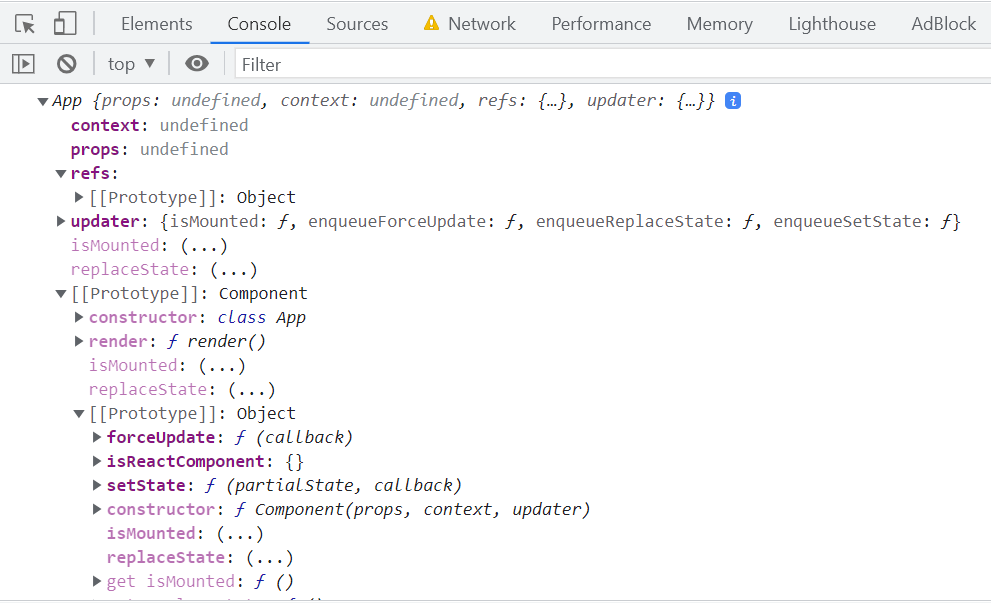
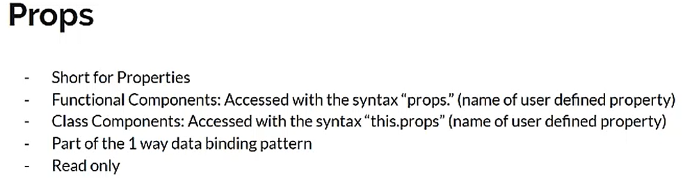
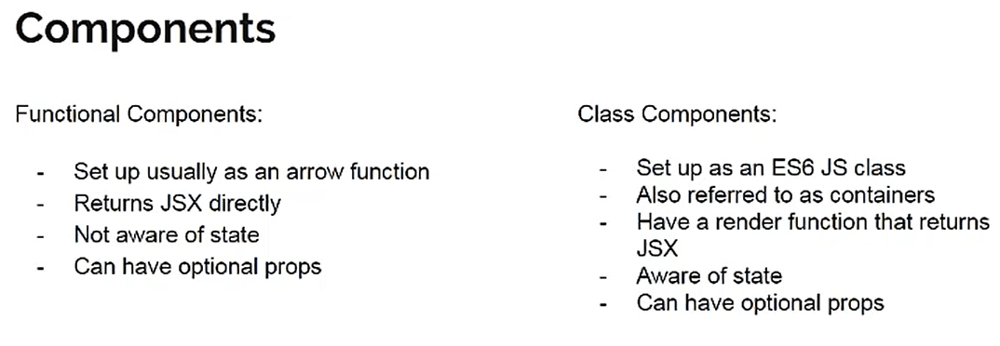

# React JS - Again 


> <a href="/tutorials/reactjs-tutorial" target="_blank">**OLD ReactJS Reference**</a>


**Front-end development** refers to what the end user (also commonly referred to
as the "**client**") can see. In the most basic forms, front-end development
consists of HTML, CSS, and JavaScript.

Eventually, developers decided that there must be a better way to manage all of
that code, so they created libraries that could make life easier. **React** was
one of those libraries.

React was created by Facebook and released to the public in May of 2013 and has
been consistently maintained since then.

-   React is used to build user interfaces (UI) on the front end.

-   React is the **view** layer of an MVC application (Model View Controller)


<br>

## React - Introduction

**React** is one of the most popular JavaScript libraries for **front-end web
applications**.  

Interactive websites need to update the DOM (Document Object Model) each time a
change happens. This process is generally resourceful and slow.

Compared to other libraries that manipulate the DOM, React uses a **Virtual
DOM**, allowing to update only the parts of the website that have changed. This
increases the speed of updates dramatically, as modern web applications may
contain thousands of elements.

#### Installation

To work with React, we don’t need to install anything. We just need to add
following **js** files.

-   [**React**](https://reactjs.org/docs/react-api.html) - the React top level
    API

-   [**React DOM**](https://reactjs.org/docs/react-dom.html) - adds DOM-specific
    methods

-   [**Babel**](https://babeljs.io/) - a JavaScript compiler that lets us use
    ES6+ in old browsers

First, we need to add the React library as two **script** tags to the **head**
of our HTML document:

```javascript
<script src="https://unpkg.com/react@16/umd/**react.development.js**"
crossorigin></script>   
<script src="https://unpkg.com/react-dom@16/umd/**react-dom.development.js**"
crossorigin />
```


To enable the use of **JSX, use babel**. **JSX** is a syntax extension to
JavaScript.
```javascript
<script
src="https://unpkg.com/babel-standalone@6/**babel.min.js**"></script>
```

<br>

#### Hello, World – Using index.tml

After adding the required script tags, we can start building our React app!  

We need to add a container to display something using React.

```javascript
<!DOCTYPE html>
<html>
    <head>
        <title>Test</title>
        <script src="https://unpkg.com/react@16/umd/react.development.js" crossorigin/>
        <script src="https://unpkg.com/react-dom@16/umd/react-dom.development.js" crossorigin></script>
        <script src="https://unpkg.com/babel-standalone@6/babel.min.js"></script>
    </head>
    <body>
        <div id="container"></div>
        <script type="text/babel">

        ReactDOM.render(
          <h1>Hello, React!</h1>,
          document.getElementById('container')
        )
        
        </script>
    </body>
</html>
```


The code finds the **container** <div> and adds the **h1** heading to it.


<br>

#### HelloWorld – Using Class

```javascript
<!DOCTYPE html>
<html>
  <head>   
    <script src="https://unpkg.com/react@16/umd/react.development.js"></script>
    <script src="https://unpkg.com/react-dom@16/umd/react-dom.development.js"></script>
    <script src="https://unpkg.com/babel-standalone@6.26.0/babel.js"></script>
  </head>
  <body>
    <div id="root"></div>

    <script type="text/babel">
      class App extends React.Component {
        render() {
          return <h1>Hello Satya!</h1>
        }
      }

      ReactDOM.render(<App />, document.getElementById('root'))
    </script>
  </body>
</html>
```


In above we are **return** **single line** content, if we have **multiple
lines** – we need to use one of below.

**1.using ( ) brackets**
```javascript
render() {
    return (
    <div className="App">
        <h1>Hello, React!</h1>
     </div>
    );
  }
```


**2.using [ ] – as Array of elements**
```javascript
render() {
  return [
    <ChildA key="key1" />,
    <ChildB key="key2" />,
    <ChildC key="key3" />,
  ];
}
```


<br>


## React - Create React App

In the previous lesson we learned how to add React to a simple HTML document
using the script tags.  
However, real web apps have a different scale, contain multiple files, use 3rd
party libraries, etc.

Facebook has created a handy tool called
[**create-react-app**](https://create-react-app.dev/) that makes it easy to
setup a React project with just a simple command. **Create React App** allows us
to focus on the code, rather than installing and configuring different tools.

To get started, make sure you have a recent version of
[**Node**](https://nodejs.org/en/) installed on your machine.  
Run the following commands in the Terminal to create and start a React app
called "**ReactApp**":
```javascript
npx create-react-app reactapp

cd reactapp

npm start
```


This will install all the required dependencies, configure and start the project
on **localhost:3000**.  
This is the default output of our project in the browser:


 

<br>

### Folder Structure


**/public** `(Generated code, from src)`folder contains files related to how the application will display on
the client, the most important of those being `index.html`, which is the HTML
template of our page.It is generated code, developers no need to touch this code.

**/src** folder contains all of the JavaScript, CSS, and image files that will
be compiled into a bundle file and injected into **index.html.**. Developers Write Source code here.

The two files below are the only critical files:

-   `index.js`: This file is the entry point into our application. In our
    code, a method called **ReactDOM.render()** is used to find an element with
    **id="root"** in the HTML and add content to it.

-   `app.js`: This file is the main **component** that will be rendered to the
    DOM, which currently includes the React logo image and the default text,
    that we see in the output.

**Webpack** creates a "bundle" file containing the content of multiple files
that need to be "bundled" together and it is all added together into a single
file.


<br>

### Customizing React App

Go ahead and delete all the files out of the /src directory, and we'll create
our own boilerplate file without any bloat. We'll just keep **index.css** and
`index.js`

Now in `index.js`, we're importing React, ReactDOM, and the CSS file.

```javascript
import React from 'react'
import ReactDOM from 'react-dom'
import './index.css'

class App extends React.Component {
    render() {
        return (
        <div className="App">
            <h1>Hello, Customized App</h1>
         </div>
        );
      }
}

ReactDOM.render(<App />, document.getElementById('root'));
```


In `index.html`, just place only <div> & **start** the Application
```javascript
<div id="root"></div>
```


If we use import React, {Component} from 'react', No need to write complete
extends class name
```javascript
import React, {Component} from 'react'

class App extends Component {
}
```


## React - JSX - JavaScript + XML
```javascript
ReactDOM.render(
  <h1>Hello, React!</h1>,
  document.getElementById('root')
);
```

We will start with the `<h1>Hello, React!</h1>` element.  

As you can see, the element is not in quotes to represent a string. It's like an
HTML element, however we use it right in the JavaScript code!  
This is called **JSX**, and it is a syntax extension to JavaScript. It allows us
to build UI elements right in the JavaScript code!

The code calls React's **render** method, and passes it two arguments, a **JSX
element** and **a container**. The **render** method displays the provided
element in the container, which, in our case, is the HTML element with
**id="root".**

### Expressions in JSX

We can use any JavaScript expression inside JSX using curly braces.  
** For example:**
```javascript
const name = "David"; 
const el = <p>Hello, {name}</p>; 

ReactDOM.render( 
el, 
document.getElementById('root') 
);
```


### Attributes in JSX

We can specify attributes using quotes, just like in HTML:
```javascript
<div id="name" ></div>
```


When using a JavaScript expression as the attributes value, the quotes should
not be used:
```javascript
<div **id={user.id}**></div>
```

Diffrence between JavaScript, JSX Attributes is - in JSX attributes are in camelCase(2nd Word is Start with CAPITAL Letter)
```javascript
className
buttonName
onClick
onHower
```


Finally, When the JSX expressions are compiled, they are converted into
JavaScript **objects**, representing React elements.

React then uses these elements to build the corresponding HTML DOM and display
it in the browser.


<br>

### Virtual DOM

We learned in the previous part that React updates only the elements that are
necessary.  
This allows React apps to be much faster than apps built with other front-end
technologies.  

**But how does React achieve that?**  
React uses a **Virtual DOM**, which is a lightweight representation of the DOM. 

When an element gets changed, it is first updated in the Virtual DOM. That
process is fast, as the virtual DOM is represented by simple objects.  

After that, React compares the Virtual DOM to its previous state and only
applies the DOM updates necessary to bring the DOM to the desired state.


<br>


## React - Inheritance

```javascript
import React, { Component } from "react";

class App extends Component {
  render() {
    return (
      <div className="App">
      Hello, World
      </div>
    );
  }
}
const ob = new App();
console.log(ob);

export default App;
```

App class extends component class. It inherts basic data componets, which are printed below 



## React – Data Handling 

To handle data in React, we do with properties, referred to as **props**, and
with **state**

### Props (Properties)

Props is short form of "**Properties**". Functional components can accept arguments, similar to JavaScript functions.
These arguments are called **props**, and represent an object.  

For example, we can use props in our Hello component:
```javascript
function Hello(props) {
  return <p>Hello, {props.name}!</p>;
}
```


Props can be accessed in class components using **this.props**.
```javascript
class Hello extends React.Component {
  render() {
    return <p>Hello, {this.props.name}!</p>;
  }
}
``` 
An important thing to consider is that props are **read-only**, meaning
components cannot modify their props.



### State

Many web apps need their components to change their data, for example, after
user interaction (clicking a button, submitting a form, etc.).However, **props**
cannot be changed.  

In order to allow components to manage and change their data, React provides a
feature called **state**.  
**State** is an object that is added as a property in class components.

**State** is just a simple object, that contains **key:value** pairs.Similar to
props, the values can be accessed using **this.state**.
```javascript
class Hello extends React.Component {
  state = {
    name: "James"
  }
  render() {
    return <h1>Hello {this.state.name}.</h1>;
  }
}
```


**Changing State**
```javascript
this.setState({   
name: "James",   
age: 25   
});
```


## React – Components 

So far, we've created one component - the **App** component. Most React apps
have many small components, and everything loads into the main **App**
component.

In React, there are two types of components that you can use:

-   **Functional Components**

-   **Class Components(Mostly used in Realtime)**.




### Functional Components 

A functional component is a simple JavaScript function:
```javascript
function Hello() {
    return <h1>Hello world.</h1>;
}
```


The code above defined a functional component called **Hello**, that returns a
simple React element.

Notice that the name of the functional component begins with a **capital
letter**. This is absolutely critical. If we start the name of a component with
a lowercase letter, the browser will treat our component like a regular HTML
element instead of a Component.

In order to display the component, we need to create the corresponding JSX
element, by calling the function.  

For example, for our user-defined component **Hello**:
```javascript
const el = <Hello/>;
```


Now, we can use our user-defined element and render it on the page:

```javascript
function Hello() {
  return <h1>Hello world.</h1>;
}

const el = <Hello />;
ReactDOM.render(
  el,
  document.getElementById('root')
);
```


Remember, all component names need to start with a capital letter.

### Class Components

**Class components** are typically used when there are more advanced user
interactions, like forms, and animations.  

All class components need to extend the **React.Component** class. Class
components need to have a **render()** method, which is in charge of telling
what the page should show.  

Remove the **App** class from `index.js`, place it in new file called
`app.js`
```javascript
//app.js
import React, {Component} from 'react'

class App extends Component {
    render() {
        return (
        <div className="App">
            <h1>Hello, Customized App</h1>
         </div>
        );
      }
}
export default App
```
 
Import in `index.js`
```javascript
import React from 'react'
import ReactDOM from 'react-dom'
import './index.css'
import App from './app'

 //Code Removed

ReactDOM.render(<App />, document.getElementById('root'));
```


We export the component as **App** and load it in **index.js.**

In `index.html`, just place only <div> & **start** the Application
```javascript
<div id="root"></div>
```


### Example Simple Component

**simple component**, which is a function. This component doesn't use the
**class** keyword. Let's take our **Table** and make two simple components for
it - a **TableHeader**, and a **TableBody**.

We're going to use ES6 arrow functions to create these simple components.

```javascript
--------------------------------------
First, the TableHeader 
--------------------------------------
const TableHeader = () => {
    return (
      <thead>
        <tr>
          <th>Name</th>
          <th>Job</th>
        </tr>
      </thead>
    )
  }

--------------------------------------
Then the TableBody .
--------------------------------------
  const TableBody = () => {
    return (
      <tbody>
        <tr>
          <td>Charlie</td>
          <td>Janitor</td>
        </tr>
        <tr>
          <td>Mac</td>
          <td>Bouncer</td>
        </tr>        
      </tbody>
    )
  }
```


Now our Table file will look like this. Note that the **TableHeader** and
**TableBody** components are all in the same file and being used by the Table
class component.
```javascript
const TableHeader = () => { ... }
const TableBody = () => { ... }

class Table extends Component {
  render() {
    return (
      <table>
        <TableHeader />
        <TableBody />
      </table>
    )
  }
}
```


### Example Class Component

We are created Table component to display table data in **table.js** – and
export as **Table** component

```javascript
import React, {Component} from 'react'

class Table extends Component {
  render() {
    return (
      <table>
        <thead>
          <tr>
            <th>Name</th>
            <th>Job</th>
          </tr>
        </thead>
        <tbody>
          <tr>
            <td>Charlie</td>
            <td>Janitor</td>
          </tr>
          <tr>
            <td>Mac</td>
            <td>Bouncer</td>
          </tr>
        </tbody>
      </table>
    )
  }
}
export default Table
```


Import Table in `app.js` – pass it to index.html
```javascript
import React, {Component} from 'react'
import Table from './table'

class App extends Component {
  render() {
    return (
      <div className="container">
        <Table />
      </div>
    )
  }
}
export default App
```


In `index.html`, just place only <div> & **start** the Application
```javascript
<div id="root"></div>
```


<br>

> <a href="/tutorials/reactjs-tutorial" target="_blank">**OLD ReactJS Reference**</a>


## Lifecycle Methods

Enough, from now onwards read
<a href="https://www.w3schools.com/react/react_props.asp" target="_blank">
https://www.w3schools.com/react/react_props.asp</a>

## Ref.

<https://www.sololearn.com/learning/1097/3370/7610/2>
<https://www.w3schools.com/react/react_sass.asp>

Best
<https://www.taniarascia.com/getting-started-with-react/>


# ReactJS
This README files contains basic information required to learn and create react app.
## Quick Links
-   [React Basics](#react-basics)
    -   [What is React](#what-is-react)
    -   [Create React App](#create-react-app)
    -   [Components](#components)
        -   [Functional Components](#functional-components)
        -   [Class Components](#class-components)
    -   [Lifecycle](#lifecycle)
    -   [Props](#props)
    -   [State](#state)
    -   [Destructure Props and State](#destructure-props-and-state)
    -   [Forms](#forms)
        -   [Basic Form](#basic-form)
        -   [Generic Form](#generic-form)
    -   [Form Validations](#form-validations)
    -   [Map-List Ilterations](#map-list-ilterations)
    -   [React Router](#react-router)
-   [Redux](#redux)
-   [Deployment](#deployment)

# React Basics
## What is React
-   React is a Javascript library created by Facebook and is used for building user interfaces (UIs) and front-end applications.
-   React is often called a framework because of its behaviour and capabilities.
-   React is the most popular framework in the industry (for now)

## Create React App
To create a new app, you may choose one of the following methods:

#### npx

```sh
npx create-react-app myapp
```
OR

#### npm

```sh
npm install create-react-app

create-react-app myapp
```
It will create a directory called `my-app` inside the current folder.<br>
Inside that directory, it will generate the initial project structure and install the transitive dependencies:

```
myapp
├── README.md
├── node_modules
├── package.json
├── .gitignore
├── public
│   ├── favicon.ico
│   ├── index.html
│   └── manifest.json
└── src
    ├── App.css
    ├── App.js
    ├── App.test.js
    ├── index.css
    ├── index.js
    ├── logo.svg
    └── serviceWorker.js
    └── setupTests.js
```
No configuration or complicated folder structures, only the files you need to build your app.<br>
Once the installation is done, you can open your project folder:

```sh
cd myapp
```

Inside the newly created project, you can run some built-in commands:

### `npm start`
Runs the app in development mode.<br>
Open [http://localhost:3000](http://localhost:3000) to view it in the browser.

The page will automatically reload if you make changes to the code.<br>
Please install these extensions in visual studio code, these will really healp us in the development.


## Components
A website consists of several comonents as shown below:


Each componenets plays its own role.
In ReactJS **App.js** acts as the root components, and all other components will pe placed in the root component.

There are two types of components in React
1. Functional Component
2. Class Component

#### Functional Components
These components are purely presentational and are simply represented by a function that optionally takes props and returns a React element to be rendered to the page.
-   **Functional** because they are basically functions
-   **Stateless** because they do not hold and/or manage state
-   **Presentational** because all they do is output UI elements

Example:
```javascript
import React from 'react'
function FunctionalComponentExample() {
    return (
        <div>
            <h1>Hello World!</h1>
        </div>
    )
}
export default FunctionalComponentExample
```
#### Class Components
These components are created using ES6’s class syntax. They have some additional features such as the ability to contain logic (for example methods that handle onClick events), local **state** and some other features.
-   **Class** because they are basically classes
-   **Smart** because they can contain logic
-   **Stateful** because they can hold and/or manage local state
Example:
```javascript
import React, { Component } from 'react'
class ClassComponentExample extends Component {
    render() {
        return (
            <div>
                <h1>Hello from Class Component</h1>
            </div>
        )
    }
}
export default ClassComponentExample

```
## Lifecycle
The three most useful lifecycle functions are **render** **componentDidMount** and **componentWillRecieveProps**

## Props
props provide a way of passing properties/data down from one component to another, typically from a parent to a child component (unidirectional dataflow).

It’s important to note that props are **read-only** and that a component must never modify the props passed to it.

Example:

**Parent Component**
```javascript
    <div className="App">
        <ClassComponentExample myname="Fawad" />
        <FunctionalComponentExample myname="Fawad Bin Tariq" />
    </div>
```

**props in Class Component**
```javascript
import React, { Component } from 'react'
class ClassComponentExample extends Component {
    render() {
        return (
            <div>
                <h1>Hello {this.props.myname} from Class Component</h1>
            </div>
        )
    }
}
export default ClassComponentExample
```

**props in Functional Component**
```javascript
import React from 'react'
function FunctionalComponentExample(props) {
    return (
        <div>
            <h1>Hello {props.myname} from Functional Component!</h1>
        </div>
    )
}
export default FunctionalComponentExample
```

## state
State is the place where the data comes from.

Example:
```javascript
class ClassComponentExample extends Component {
    constructor(props) {
        super(props)
    
        this.state = {
             message: 'Hello World'
        }
    }
    render() {
        return (
            <>
                <h1>{this.state.message}</h1>
            </>
        )
    }
}
export default ClassComponentExample
```
#### setState and Event handling
You can change value of state by using setState method.
Example:

```javascript
   constructor(props) {
        super(props)
    
        this.state = {
             counter: 0
        }
    }
    incrementOne = () =>{
        this.setState({
            counter:this.state.counter+1
        })
    }
    render() {
        return (
            <>
                <h1>{this.state.counter}</h1>
                <button type="button" onClick={this.incrementOne}>Increment</button>
            </>
        )
    }
```

If you call **setState** again and again in on request, it may not work, for that you need to pass previous state too.

Example:
```javascript
        this.setState(prevState=>({
            counter:prevState.counter+1
        }))
```

## Destructure Props and State
You can de structure **props** and **state** to get rid of **this.prop** or **this.state**

Example:
```javascript
  render() {
        const {myname} = this.props
        return (
            <>
                <p>{myname}</p>
            </>
        )
    }
```
## Forms
### Basic Form
```javascript
class FormExample extends Component {
    constructor(props) {
        super(props)
        this.state = {
             email:'',
             password:''
        }
        this.handleSubmit = this.handleSubmit.bind(this)
    }
    changeHandler = (event) =>{
        this.setState({
            [event.target.name]: event.target.value
        })
    }
    handleSubmit(event) {
        alert('Email was ' + this.state.email+' Password was '+this.state.password);
        event.preventDefault();
      }
    render() {
        return (
            <React.Fragment>
                <h1>Form Example</h1>
                <form  onSubmit={this.handleSubmit}>
                    <label>Email :</label>
                    <input type="text" name="email" value={this.state.email} onChange={this.changeHandler}/><br/>
                    <label>Password :</label>
                    <input type="password" name="password" value={this.state.password} onChange={this.changeHandler}/><br/>
                    <input type="submit" value="Submit" />
                </form>
            </React.Fragment>
        )
    }
}
export default FormExample
```

### Generic Form
Lets make a change handler that will work for everything, checkboxes, radio buttons, input types, text areas, select...
```javascript
import React, { Component } from 'react'

class FormExample extends Component {
    constructor(props) {
        super(props)
        this.state = {
            email:'',
            password:'',
            description:'',
            flavor:'',
            gender:'male',
            agreement:false
        }
        this.handleSubmit = this.handleSubmit.bind(this)
    }
    changeHandler = (event,fieldName,checkbox) =>{
        this.setState({
            [fieldName]: checkbox ? event.target.checked : event.target.value
        })
    }
    handleSubmit(event) {
        event.preventDefault();
      }
    render() {
        return (
```
```html
<React.Fragment>
                <h1>Form Example</h1>
                <form  onSubmit={this.handleSubmit}>
                <label>Email :</label>
                    <input type="text" value={this.state.email} onChange={event=>this.changeHandler(event,"email",false)}/><br/>
                    <label>Password :</label>
                    <input type="password" value={this.state.password} onChange={event=>this.changeHandler(event,"password",false)}/><br/>
                    <label>Description : </label>
                    <textarea value={this.state.description} onChange={event=>this.changeHandler(event,"description",false)}></textarea><br/>
                    <label>
                        Pick your favorite flavor:
                        <select value={this.state.flavor} onChange={event=>this.changeHandler(event,"flavor",false)}>
                            <option value="grapefruit">Grapefruit</option>
                            <option value="lime">Lime</option>
                            <option value="coconut">Coconut</option>
                            <option value="mango">Mango</option>
                        </select>
                    </label><br/>
                    <label>Gender : </label>
                    <label><input type="radio" value="male" checked={this.state.gender==='male'} onChange={event=>this.changeHandler(event,"gender",false)}></input>male</label>
                    <label><input type="radio" value="female" checked={this.state.gender==='female'} onChange={event=>this.changeHandler(event,"gender",false)}></input>female</label><br/>
                    <label><input type="checkbox" checked={this.state.agreement} onChange={event=>this.changeHandler(event,"agreement",true)}></input> I agree with terms and conditions</label><br/>
                    <input type="submit" value="Submit" />
                </form>
            </React.Fragment>
```
```javascript
        )
    }
}
export default FormExample
```
## Form Validations
```javascript
import React, { Component } from 'react'

const initialState = {
    email:'',
    password:'',
    description:'',
    flavor:'',
    gender:'male',
    agreement:false,
    errors:{
        email:'',
        password:'',
        description:'',
        agreement:''
    }
}
const danger ={color:'red'}
class FormExample extends Component {
    constructor(props) {
        super(props)
        this.state = initialState
        this.handleSubmit = this.handleSubmit.bind(this)
    }
    validateForm = (errors) =>{
        let valid = true;
        if(!this.state.agreement || this.state.email ==='' || this.state.password === '' || this.state.description === ''){
            valid = false;
        }
        Object.values(errors).forEach(
            // if we have an error string set valid to false
            (val) => val.length > 0 && (valid = false)
        );
        return valid;
    }
    changeHandler = (event,fieldName,checkbox) =>{
        let errors = this.state.errors
        const {value} = event.target
         // eslint-disable-next-line
        const validEmailRegex = RegExp(/^(([^<>()\[\]\.,;:\s@\"]+(\.[^<>()\[\]\.,;:\s@\"]+)*)|(\".+\"))@(([^<>()[\]\.,;:\s@\"]+\.)+[^<>()[\]\.,;:\s@\"]{2,})$/i);
        switch(fieldName){
            case 'email':
                errors.email = validEmailRegex.test(value)
                                ? ''
                                : 'Email is not valid';
                break;
            case 'password':
                errors.password = value.length < 8
                                    ? 'Password must be greater than 8'
                                    : '';
                break;
            case 'description':
                errors.description = value.length < 10
                                    ? 'Description must be greater than 10 characters long!'
                                    : '';
                break;
            case 'agreement':
                errors.agreement = event.target.checked
                                ? ''
                                : 'agreement must be checked';
                break;
            default:
                break;
        }
        this.setState({
            [fieldName]: checkbox ? event.target.checked : event.target.value,
            errors
        })
    }
    handleSubmit(event) {
        event.preventDefault();
        if(this.validateForm(this.state.errors)){
            console.info("Valid Form")
        }else{
            console.error('Invalid Form')
        }
      }
    render() {
        return (
            <React.Fragment>
                <h1>Form Example</h1>
                <form  onSubmit={this.handleSubmit}>
                <label>Email :</label>
                    <input type="text" value={this.state.email} onChange={event=>this.changeHandler(event,"email",false)}/><br/>
                    <span style={danger}>{this.state.errors.email}<br/></span>
                    <label>Password :</label>
                    <input type="password" value={this.state.password} onChange={event=>this.changeHandler(event,"password",false)}/><br/>
                    <span style={danger}>{this.state.errors.danger}<br/></span>
                    <label>Description : </label>
                    <textarea value={this.state.description} onChange={event=>this.changeHandler(event,"description",false)}></textarea><br/>
                    <span style={danger}>{this.state.errors.description}<br/></span>
                    <label>
                        Pick your favorite flavor:
                        <select value={this.state.flavor} onChange={event=>this.changeHandler(event,"flavor",false)}>
                            <option value="grapefruit">Grapefruit</option>
                            <option value="lime">Lime</option>
                            <option value="coconut">Coconut</option>
                            <option value="mango">Mango</option>
                        </select>
                    </label><br/>
                    <label>Gender : </label>
                    <label><input type="radio" value="male" checked={this.state.gender==='male'} onChange={event=>this.changeHandler(event,"gender",false)}></input>male</label>
                    <label><input type="radio" value="female" checked={this.state.gender==='female'} onChange={event=>this.changeHandler(event,"gender",false)}></input>female</label><br/>
                    <label><input type="checkbox" checked={this.state.agreement} onChange={event=>this.changeHandler(event,"agreement",true)}></input> I agree with terms and conditions</label><br/>
                    <span style={danger}>{this.state.errors.agreement}<br/></span>
                    <input type="submit" value="Submit" />
                </form>
            </React.Fragment>
        )
    }
}
export default FormExample
```

## Map-List Ilterations
In React, the **map** method used to traverse and display a list of similar objects of a component. A map is not the feature of React. Instead, it is the standard JavaScript function that could be called on any array. The map() method creates a new array by calling a provided function on every element in the calling array.

Example:
```javascript
    constructor(props) {
        super(props)
        this.state = {
             usersList:[
                 {
                     id:1,
                     name:"Fawad",
                     age:23
                 },
                 {
                    id:2,
                    name:"Asad",
                    age:25
                }
             ]
        }
    }
    render() {
        const users = this.state.usersList.map((user)=> <h1 key={user.id}>Name is {user.name} and age is {user.age}</h1>)
        return (
            <>
                {users}
            </>
        )
    }
```
## React Router

Since we’re building a web app, we’ll use react-router-dom. To use routing in react, you need to install react-router-dom first.

```bash npm install react-router-dom```

```javascript
import React, {Component} from 'react';
import {BrowserRouter, Route, Switch, Link} from 'react-router-dom';
import './App.css';
import Home from './components/Home';
import About from './components/About';
import Contact from './components/Contact';
import NotFound from './components/NotFound';
import Post from './components/Post';
class App extends Component{
  render(){
    return (
      <BrowserRouter>
      <Link to="/">Home</Link>
      <Link to="/about">About</Link>
      <Link to="/contact">Contact</Link>
        <Switch>
          <Route path="/" exact component={Home} />
          <Route path="/about" exact component={About} />
          <Route path="/contact" exact component={Contact} />
          <Route path="/post/:id" exact component={Post} />
          <Route path="/" component={NotFound} />
        </Switch>
      </BrowserRouter>
    );
  }
}
export default App;
```

##### Post.js
```javascript
function Post(props) {
    console.log(props)
    return (
        <h1> Post {props.match.params.id}</h1>
    )
}
export default Post
```
### Change Active class when path changes
```html
<li className={this.getNavLinkClass("/")}><NavLink to="/">Home</NavLink></li>
<li className={this.getNavLinkClass("/error")}><NavLink to="/error">404</NavLink></li>
```
```javascript
getNavLinkClass = (path) => {
    return this.props.location.pathname === path ? 'active' : '';
}
```
```javascript
<Route path="/" component={NavBar} />
```

### Programming Redirects
to redirect form program use **history.push()** function.
Example
```javascript
setTimeout(()=>{
    this.props.history.push('/error')
},5000);
```

## Using Bootstrap or MaterializeCSS
To install bootstrap, run command ```npm install bootstrap``` OR to install materializecss run command ```npm install materialize-css@next```
Then include them in your project.
```import 'materialize-css/dist/css/materialize.min.css';```

# Redux
Install **redux** and **react-redux** and **redux-thunk**


```npm install redux``` and ```npm install react-redux``` and ```npm install redux-thunk```

OR directly in one command

```npm install redux react-redux redux-thunk```

##### Create Store
Create a new file named **Store.js** in **src** folder.

and use the following code

```javascript
import { createStore, applyMiddleware, compose } from 'redux'
import thunk from 'redux-thunk'
import rootReducer from './reducers/rootReducer'

const initialState = {}
const middleWare = [thunk]
let store;

if (window.navigator.userAgent.includes("Chrome")) {
    store = createStore(rootReducer,
        initialState,
        compose(applyMiddleware(...middleWare),
            window.__REDUX_DEVTOOLS_EXTENSION__ &&
            window.__REDUX_DEVTOOLS_EXTENSION__()
        ))
} else {
    store = createStore(rootReducer,
        initialState,
        compose(applyMiddleware(...middleWare)))
}

export default store;
```
##### Root Reducer
Create a folder named **reducer** and create a new file **rootReducer.js** that will contain all the reducers.

```javascript
import {combineReducers} from 'redux'

export default combineReducers({

});
```

Now go to **App.js** and wrap all components with store **Provider**.
```javascript

import { Provider } from 'react-redux';
import store from './Store';

//AND

<Provider store={store}>
    //ALL COMPONENTS HERE
</Provider>
```
# Deployment
Before deployment, make sure to install **npm install react-app-polyfill** because react apps are not by default supported by IE.
and add
```
import 'react-app-polyfill/stable'
```
 in **App.js**
 
 Also, remove Redux extension code from ""store.js** and only use
```javascript
     store = createStore(rootReducer,
        initialState,
        compose(applyMiddleware(...middleWare)))
```

run command ```npm run build``` to get build copy of your project... deploy it on any web server
 