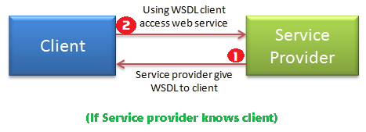
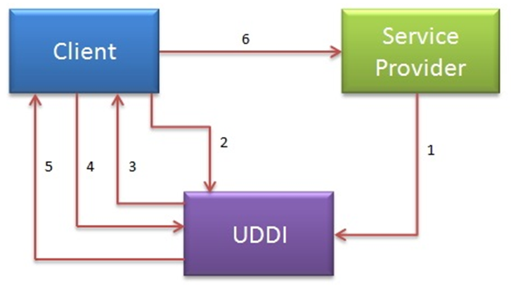

SOAP -Simple Object Access Protocol
=====================================

**Simple Object Access Protocol (SOAP)** is a standard protocol specification
for message exchange based on XML. Communication between the web service and
client happens using XML messages.

A simple web service architecture has two components.  
1.  **Client**
2.  **Service provider**

**To communicate clinet with service provider clinet must know about following
things**

-   Location of WebServices Server
-   Functions available, signature and return types of function.
-   Communication protocol
-   Input output formats

**Service provider will create a standard XML file which will have all above
information**. So if this XML file is given to client, then client will be able
to access web service. **This XML file is called “WSDL"**.

## **WSDL (Web Services Description Language):**

WSDL stands for **Web Service Description Language**. It is **an XML file that
describes the technical details** of how to implement a web service, more
specifically the **URI, port, method names, arguments, and data types**. Since
WSDL is XML, it is both human-readable and machine-consumable.

*Using this WSDL file we can understand things like,*

-   Port / Endpoint – URL of the web service

-   Input message format

-   Output message format

-   Security protocol that needs to be followed

-   Which protocol the webservice uses?

## How to access web service:

There are two ways to access web service

1.  **If Service provider knows client**

2.  **If Service provider register its WSDL to UDDI and client can access it
    from UDDI**

### 1.If Service provider knows client

**If Service provider knows client,** then it will provide its **wsdl** to
client and client will be able to access web service.

### 2.If Service provider register its WSDL to UDDI and client can access it from

<u>UDDI</u>:  
**Service provider register its WSDL to UDDI and client can access it from
UDDI**:

UDDI stands for **Universal Description, Discovery and Integration**.It is a
directory service. Web services can register with a UDDI and make themselves
available through it for discovery. So following steps are involved.

1.  *Service provider registers with UDDI.*

2.  *Client searches for service in UDDI.*

3.  *UDDI returns all service providers offering that service.*

4.  *Client chooses service provider*

5.  *UDDI returns WSDL of chosen service provider.*

6.  *Using WSDL of service provider, client accesses web service*

*UDDI:*

-   UDDI is an XML-based standard for describing, publishing, and finding web
    services.

-   UDDI is a specification for a distributed registry of web services

A business or a company can register three types of information into a UDDI
registry. This information is contained in three elements of UDDI.

These three elements are:

1.  **White Pages**: Basic information about the company and its business

2.  **Yellow Pages**: contain more details about the company

3.  **Green Pages**: contains technical information about a web service (url
    locations etc)
