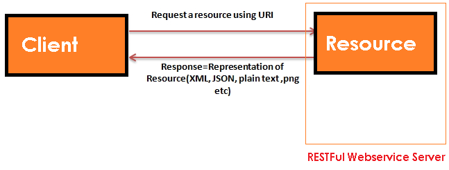

JAX-RS (RESTFul web services)
=================================

-   **JAX-RS** is a specification for RESTful Web Services with Java and it is
    given by Sun.

-   **Since JAX-RS** it is a specification, other frameworks can be written to
    implement these specifications.

-   Few implemetations are `Jersey` from Oracle, `Resteasy` from Jboss, `CXF` from Apache, etc.

We can get the resource from RESTful service in different formats like, **HTML,
XML, JSON, TEXT, PDF** and in the Image formats as well, but in real time we
mainly we will prefer JSON. REST guidelines always talks about stateless
communication between client and the Server. Stateless means, every single
request from client to server will be considered as a fresh request. Because of
this reason REST always prefers to choose HTTP as it a stateless protocol.

There are two main implementation of JAX-RS API.

1.  **Jersey**

2.  **RESTeasy**

