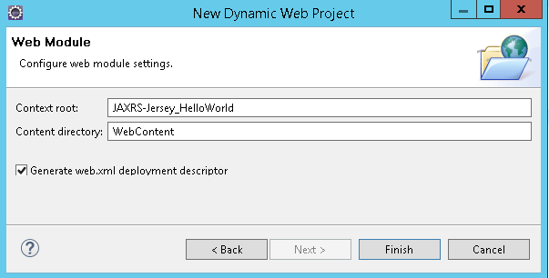
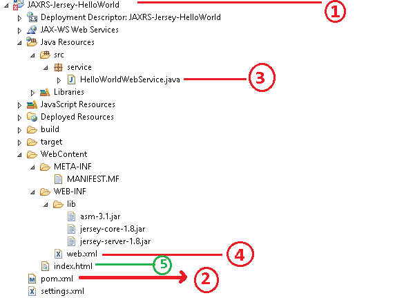
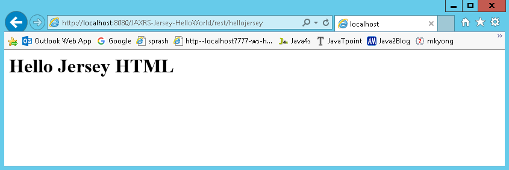
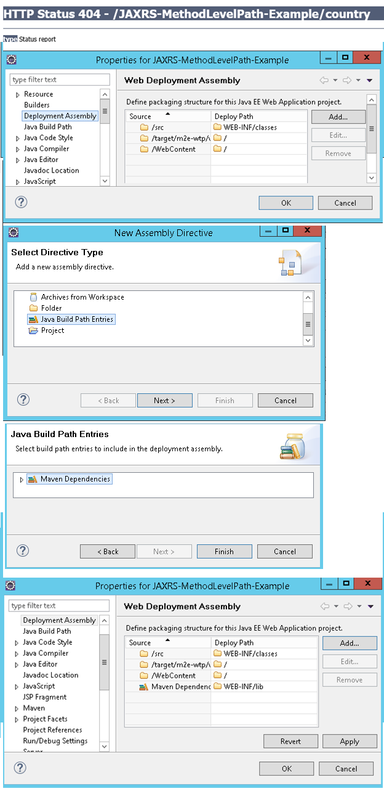

JAX-RS JERSEY
================

[Jersey](http://jersey.java.net/), reference implementation to develope RESTful
web service based on the [JAX-RS (JSR
311)](http://jsr311.java.net/nonav/releases/1.1/index.html) specification.

If we want to implement Webservices using Jersey we need to download Jersey jar
files from [Jersey](http://jersey.java.net/) **website**

**The major change between JERSEY & RESTEASY is just changing the configuration
in web.xml**

Download & install Maven, configure maven in Eclipse

### Steps to Create Jersey Web Service Application

1. Create Dynamic web project in eclipse, convert that into Maven Project

2. Add Jersey jar files manually / through Maven by writing repo details in
pom.xml

3. Create RESTFul webservice

4. Configure web.xml

5. Test Webservice directly by using URL / writing webservice client

<br>

### Example: JAXRS-Jersey-HelloWorld

**1. Create Dynamic web project in eclipse, convert that into Maven Project**

New → Dynamic web project → Provide project details finish



**Right-click on Project →Configure → Convert to Maven Project .**



Figure 1 Directory Structure after adding all files

**2. Add Jersey jar files manually / through Maven by writing repo details in
pom.xml**

Jersey is published in Java.net Maven repository. To develop Jersey REST
application, just declares “jersey-server" in Maven **pom.xml**.
```xml
<project …>
	<repositories>
		<repository>
			<id>maven2-repository.java.net</id>
			<name>Java.net Repository for Maven</name>
			<url>http://download.java.net/maven/2/</url>
			<layout>default</layout>
		</repository>
	</repositories>
	
<dependencies>
		<dependency>
			<groupId>com.sun.jersey</groupId>
			<artifactId>jersey-server</artifactId>
			<version>1.8</version>
		</dependency>		 
		<dependency>
			<groupId>com.sun.jersey</groupId>
			<artifactId>jersey-client</artifactId>
			<version>1.19.3</version>
		</dependency>
	</dependencies>
</project>
```


**3. Create RESTFul webservice at Server End**
```java
package service;

@Path("/hellojersey")  
public class HelloWorldWebService {  
  // This method is called if HTML and XML is not requested  
  @GET  
  @Produces(MediaType.TEXT_PLAIN)  
  public String sayPlainTextHello() {  
    return "Hello Jersey Plain";  
  }  

  // This method is called if HTML is requested  
  @GET  
  @Produces(MediaType.TEXT_HTML)  
  public String sayHtmlHello() {  
    return "<h1>" + "Hello Jersey HTML" + "</h1>";  
  }  
}
```

**4.Configure web.xml**

In web.xml,

-   register “com.sun.jersey.spi.container.servlet.ServletContainer“,

-   In “com.sun.jersey.config.property.packages“., provide package name, where
    WebService classes are implemented

```xml
<?xml version="1.0" encoding="UTF-8"?>
<web-app>
	<display-name>Restful Web Application</display-name>

	<servlet>
		<servlet-name>jersey-serlvet</servlet-name>
		<servlet-class>
                     com.sun.jersey.spi.container.servlet.ServletContainer
                </servlet-class>
		<init-param>
		     <param-name>com.sun.jersey.config.property.packages</param-name>
		     <param-value>service</param-value>
		</init-param>
		<load-on-startup>1</load-on-startup>
	</servlet>

	<servlet-mapping>
		<servlet-name>jersey-serlvet</servlet-name>
		<url-pattern>/rest/*</url-pattern>
	</servlet-mapping>

</web-app>
```

**5. Test Webservice directly by using URL / writing webservice client**

In this example, web request from “**projectURL/rest/hellojersy/**" will match
to **“HelloWorldWebService",** via **@Path("/hellojersey")** So we are created
a test index.html conatining following url for testing purpose

Index.html
```html
<h1>Test JERSEY WEBSERVICE </h1>
<h3><a href="rest/hellojersey">Default</a></h3>
```


Direct Testing URL :
<http://localhost:8080/JAXRS-Jersey-HelloWorld/rest/hellojersey>



We can write The HelloworldClientTest.java file is created inside the server
application. But you can run client code by other application also by having
service interface and jersey jar file.
```java
package client;

import java.net.URI;
import javax.ws.rs.client.Client;
import javax.ws.rs.client.ClientBuilder;
import javax.ws.rs.client.WebTarget;
import javax.ws.rs.core.MediaType;
import javax.ws.rs.core.UriBuilder;
import org.glassfish.jersey.client.ClientConfig;

public class HelloworldClientTest {
	public static void main(String[] args) {
		ClientConfig config = new ClientConfig();
		Client client = ClientBuilder.newClient(config);
		WebTarget target = client.target(getBaseURI());
		// Now printing the server code of different media type
		System.out.println(target.path("rest").path("hellojersey").request().accept(MediaType.TEXT_PLAIN).get(String.class));
 		System.out.println(target.path("rest").path("hellojersey").request().accept(MediaType.TEXT_HTML).get(String.class));
	}

	private static URI getBaseURI() {
		// here server is running on 4444 port number and project name is
		// restfuljersey
		return UriBuilder.fromUri("http://localhost:8080/JAXRS-Jersey-HelloWorld/rest/hellojersey").build();
	}
}
```

**If we got 404 error , follow below steps** *java.lang.ClassNotFoundException*:
com.sun.jersey.spi.container.servlet.ServletContainer

Right click on Project Properties Deployment Assembly : add : Java BuildPath
Entities Maven Dependencies Finish


