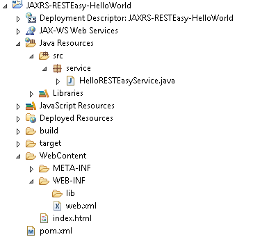
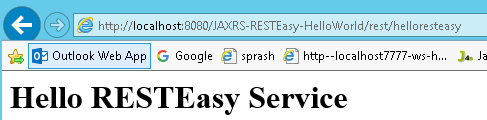

JAX-RS RESTEasy
==================

[RESTEasy](http://www.jboss.org/resteasy)**,** JBoss project, implementation of
the [JAX-RS](http://jsr311.java.net/) specification. In this article, we show
you how to use RESTEasy framework to create a simple REST style web application

Downlaod [RESTEasy](http://www.jboss.org/resteasy) jars from here or add
RESTEasy dependencies in POM.xml


### Steps to Create RESTEasy Web Service Application

1. Create Dynamic web project in eclipse, convert that into Maven Project

2. Add RESTEasy jar files manually / through Maven by writing repo details in
pom.xml

3. Create RESTFul webservice using RESTEasy

4. Configure web.xml, Register RESTEasy dependency class

5. Test Webservice directly by using URL / writing webservice client

## Example : JAXRS- RESTEasy

**1.Create Dynamic web project in eclipse, convert that into Maven Project**

**Create Dynamic Web Project : New → Dynamic web project → Provide project
details finish**

**Convert into Maven Project** : Right-click on Project →Configure → Convert to
Maven Project.



**2. Add RESTEasy jar files manually / through Maven by writing repo details in
pom.xml**

Declares JBoss public Maven repository and “**resteasy-jaxrs**" in your
Maven pom.xml file. That’s all you need to use **RESTEasy**.
```xml
<project xmlns="http://maven.apache.org/POM/4.0.0" xmlns:xsi="http://www.w3.org/2001/XMLSchema-instance" xsi:schemaLocation="http://maven.apache.org/POM/4.0.0 http://maven.apache.org/xsd/maven-4.0.0.xsd">
  <modelVersion>4.0.0</modelVersion>
  <groupId>JAXRS-RESTEasy-HelloWorld</groupId>
  <artifactId>JAXRS-RESTEasy-HelloWorld</artifactId>
  <version>0.0.1-SNAPSHOT</version>
  <packaging>war</packaging>
  <build>
    <sourceDirectory>src</sourceDirectory>
    <plugins>
      <plugin>
        <artifactId>maven-compiler-plugin</artifactId>
        <version>3.5.1</version>
        <configuration>
          <source>1.8</source>
          <target>1.8</target>
        </configuration>
      </plugin>
      <plugin>
        <artifactId>maven-war-plugin</artifactId>
        <version>3.0.0</version>
        <configuration>
          <warSourceDirectory>WebContent</warSourceDirectory>
        </configuration>
      </plugin>
    </plugins>
  </build>
  
  <repositories>
	   <repository>
   <id>JBoss repository</id>
   <url>https://repository.jboss.org/nexus/content/groups/public-jboss/</url>
	   </repository>
	</repositories>
	
	<dependencies>
 <dependency>
 	<groupId>org.jboss.resteasy</groupId>
 	<artifactId>resteasy-jaxrs</artifactId>
 	<version>2.2.1.GA</version>
 </dependency>
	</dependencies>
</project>
```


**3.Create RESTFul webservice using RESTEasy**
```java
package service;

import javax.ws.rs.GET;
import javax.ws.rs.Path;
import javax.ws.rs.Produces;
import javax.ws.rs.core.MediaType;

@Path("/helloresteasy")
public class HelloRESTEasyService {
	@GET
	@Produces(MediaType.TEXT_HTML)
	public String sayHtmlHello() {
 return "<h1>" + "Hello RESTEasy Service" + "</h1>";
	}
}
```

**4. Configure** web.xml, Register **RESTEasy dependency class**  
Now, configure listener and servlet to support RESTEasy. Read this [JBoss
documentation](http://docs.jboss.org/resteasy/docs/2.2.1.GA/userguide/html/Installation_Configuration.html) for
details
```xml
<web-app id="WebApp_ID" version="2.4"
	xmlns="http://java.sun.com/xml/ns/j2ee"
	xmlns:xsi="http://www.w3.org/2001/XMLSchema-instance"
	xsi:schemaLocation="http://java.sun.com/xml/ns/j2ee
	http://java.sun.com/xml/ns/j2ee/web-app_2_4.xsd">
	<display-name>Restful Web Application</display-name>

	<!-- Auto scan REST service -->
	<context-param>
 <param-name>resteasy.scan</param-name>
 <param-value>true</param-value>
	</context-param>

	<!-- this need same with resteasy servlet url-pattern -->
	<context-param>
 <param-name>resteasy.servlet.mapping.prefix</param-name>
 <param-value>/rest</param-value>
	</context-param>

	<listener>
 <listener-class>
 	org.jboss.resteasy.plugins.server.servlet.ResteasyBootstrap
 </listener-class>
	</listener>

	<servlet>
 <servlet-name>resteasy-servlet</servlet-name>
 <servlet-class>
 	org.jboss.resteasy.plugins.server.servlet.HttpServletDispatcher
 </servlet-class>
	</servlet>

	<servlet-mapping>
 <servlet-name>resteasy-servlet</servlet-name>
 <url-pattern>/rest/*</url-pattern>
	</servlet-mapping>

</web-app>
```

You need to set the `“resteasy.servlet.mapping.prefix"` if your servlet-mapping for the resteasy servlet has a url-pattern other than “/*“.

In above example, the resteasy servlet url-pattern is `“/rest/*“`, so you have to set the `“resteasy.servlet.mapping.prefix"` to `“/rest"` as well, otherwise, you will hit resource not found error message.

Remember to set `“resteasy.scan"` to true, so that RESTEasy will find and register your REST service automatically.


**5.Test Webservice directly by using URL / writing webservice client**

<http://localhost:8080/JAXRS-RESTEasy-HelloWorld/rest/helloresteasy>


